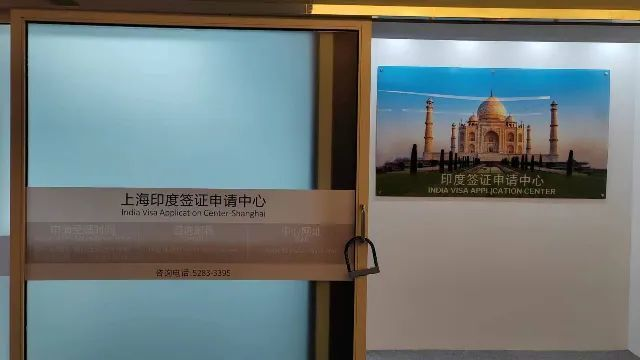

# 中国人去印度签证有多难？有人等了15个月还没获签

谈起申办赴印商务签证，许多跑过几十个国家的老外贸人向第一财经记者感叹：这是他们这辈子申办过最复杂的商务签，“终生难忘”。他们中很多人已经等待了半年以上，或被拒签。

无论是商务人士、投资律师还是签证中介，都向第一财经记者表示，据他们所知绝大多数申请被拒，顺利获签的几乎是个案，能够获得印度签证几乎成为了“不可能的任务”。

其实，今年6月，新华社也罕见发文“吐槽”印度对中国媒体记者不合理的签证制度，表示“屡屡遭受不公正、歧视性待遇”。

除高拒签率外，申请的过程也让申请人相当焦心。第一财经记者近日前往上海印度签证申请中心，现场询问后发现，签证申请的完整材料并不向外界公开，只有到前台提交时才会详细告知，并且时常变动，让申请人措手不及。

在成功提交后，很多人陷入了漫长的等待。据记者接触到最久的案例，申请人已经等待了15个月。而在疫情前，在中国申请赴印度商务签通常在5个工作日左右。据印度媒体报道，印度在2020年9月开始对中国公民实施更严格的签证措施。

进入后疫情时代，印度对世界上166个国家和地区开放了电子签，通常能在3天内下签，在二十国集团（G20）中，仅有中国和土耳其未能享受到这一待遇。

**“不用申请了，是不可能通过的”**

卢女士就职于一家外贸公司，去年将一批设备卖到了印度，约定好在今年2月派工程师到印度现场安装调试。

她在去年年底开始准备赴印签证，为此她联系了一家签证中介。没想到中介却不接上门来的生意，并向她坦言：“不用申请了，是不可能通过的。”不信邪的卢女士经过努力，最终找了一家中介协助她办理。

如今办理赴印度商务签证需要20多项材料，但这些材料在印度大使馆、领事馆和印度签证中心的网站上并没有公示，哪怕在印度签证中心内张贴的告示，也没有告知申办所需要的全部材料。

而且其中一些申办材料被不少申请人“吐槽”超过了合理的范畴，如赴印进行商务洽谈，不仅需要提供申请人的最高学历，还需要将学历进行公证，在申请时提交公证书原件。除此之外，还需要提供个人技术资格证书和企业营业执照的公证书，而在疫情前，赴印商务签证一般并不需要提供任何公证书。

商务签证所需要的20多项材料中没有几件是可以轻松获得的，但凭这点就“劝退”了很多申请人。为了能让工程师尽快上门，卢女士说，她“拼命地准备材料，每天加班，睡也没有睡好，以最快的速度，也花了两个礼拜凑齐了所需的材料”。

今年2月，她赶到上海提交了材料。在现场，她看到很多人的申请材料不合格，需要重新预约申请，甚至签证中心的工作人员也好心相劝，“如果不是非去不可的话，就不建议申请了”。

不过结果正如之前中介所预言的那样，在半个月之后，卢女士一行被告知全部拒签，印方也没有提供任何拒签的理由。卢女士说，像她这样的同行和朋友还有很多，他们很迷茫，很多人都放弃了。

卢女士在印度的客户是在当地颇具声望的企业，为此印度客户给当地的移民局和印度驻上海总领事馆发邮件和打电话，表达中国工程师赴印的必要性，否则将造成印度企业的损失。

卢女士在4月再次递交了签证申请，如今三个月又过去了，依然没有任何消息，护照也没有退还，在这段时间无法去其他国家。

卢女士说，最近赴印商务签的难度又在加码，如6个月的银行流水需要显示有10万元人民币的余额等。

**印度企业也蒙受损失**

工程师无法上门安装调试，卢女士表示只能通过视频，远程指导印度客户进行操作，但效果非常不好。最终，印度客户只能从欧洲国家请来工程师调试，前后花费了20多万元人民币。

卢女士告诉第一财经记者，这些费用都需要中国企业来承担，损失非常严重， **“表面上这是中方企业造成的，但因为印度不发放签证，我们也无能为力。”**
卢女士还透露，她为办理签证准备材料就花费了1万多元，还没有算上人力成本。

商务签证都如此之难，那赴印工作签的难度就不难想象了。这些申请工作签的中国人很多在印度有自己的投资，一位熟悉印度业务的投资律师告诉第一财经记者，他“没有听到有谁很顺利地回去了”。

这位律师告诉第一财经记者，中方的投资人和管理人回不去印度导致当地的企业群龙无首，能做的最多只是维系存在，根本无法拓展业务，由于是远程遥控，对于当地的突发情况，更是鞭长莫及，导致运营成本大幅上升。

其实， **赴印签证难，损失的不仅是中方企业，据印度媒体报道，印度政府对中国公民实施严格的签证审查程序，也让印度企业蒙受了损失。**

印度本土电子产品制造企业迪克森科技（Dixon Technologies）董事总经理拉尔（Atul
Lall）也强调为中国工程师发放签证的重要性。他表示，中国技术对印度工厂来说相当重要，如果缺乏这些技术，将阻碍“印度制造”的发展。

印度手机和电子协会主席莫辛德鲁（Pankaj Mohindroo）则说，延迟和限制发放商务签证和工作签证已经成为行业扩张和增长的主要障碍。

**人文交流受阻**

除了经贸往来外，人文交流也因签证难而受伤。古同学（化名）已经为他的学生签证等待了15个月。

古同学本科就读的是计算机科学与技术专业，由于印度在这一领域有所专长，所以他申请了一所印度大学的研究生，并被录取。

他在2022年上半年就递交了学生签证的申请，直到8个月后，才接到印度驻华大使馆的电话，要求补充材料，古同学补交了材料后，校方也联系了大使馆，但至今毫无音讯，也无法借出护照。

由于无法赴印，古同学只能通过网课的形式上学。他不无担心地向第一财经记者表示，由于疫情已经过去，像他这样纯网课上学的学历或许很难获得教育部的认证。

教育部留学服务中心在今年1月发布公告表示，对于2023年春季学期（南半球秋季学期）及以后仍采用远程方式学习（包括新入学和继续学习的情况）所获国（境）外文凭证书，中心将不再提供认证服务。

在6月12日的外交部例行记者会上，外交部发言人汪文斌表示，2020年以来，印方拒不审批中方记者常驻申请，并坚持只给中方驻印媒体三个月甚至一个月的有效签证，导致中方记者从14人锐减到目前的只有一个人，而且印方目前仍未同意为中方最后一名驻印记者延期签证。

中国驻印度使馆发言人王小剑5月30日在社交媒体推特上透露，今年前5个月，中国驻印使领馆已向印民众发放了超过6万张签证，赴华的目的包括商务、留学、旅游、工作、家庭团聚等。

