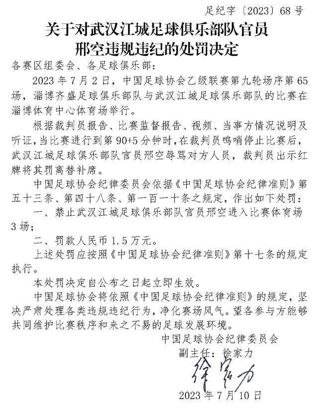
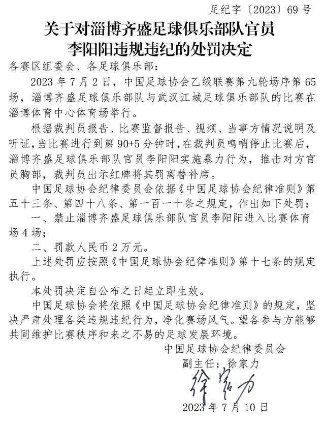

# 中国足协：中乙两俱乐部官员违规违纪被罚禁入赛场＋罚款

中国足球协会纪律委员会依据相关规定，处罚如下：禁止武汉江城足球俱乐部队官员邢空进入比赛体育场3场；罚款人民币1.5万元。禁止淄博齐盛足球俱乐部队官员李阳阳进入比赛体育场4场；罚款人民币2万元。

据中国足球协会网站消息，两俱乐部官员因违规违纪被处罚。中国足球协会将依照《中国足球协会纪律准则》的规定，坚决严肃处理各类违规违纪行为，净化赛场风气。

_武汉江城足球俱乐部队比赛资料图_

2023年7月2日，中国足球协会乙级联赛第九轮场序第65场，淄博齐盛足球俱乐部队与武汉江城足球俱乐部队的比赛在淄博体育中心体育场举行。当比赛进行到第90+5分钟时，在裁判员鸣哨停止比赛后，武汉江城足球俱乐部队官员邢空辱骂对方人员，裁判员出示红牌将其罚离替补席。中国足球协会纪律委员会依据相关规定，处罚如下：禁止武汉江城足球俱乐部队官员邢空进入比赛体育场3场；罚款人民币1.5万元。

2023年7月2日，中国足球协会乙级联赛第九轮场序第65场，淄博齐盛足球俱乐部队与武汉江城足球俱乐部队的比赛在淄博体育中心体育场举行。当比赛进行到第90+5分钟时,在裁判员鸣哨停止比赛后，淄博齐盛足球俱乐部队官员李阳阳实施暴力行为，推击对方官员胸部，裁判员出示红牌将其罚离替补席。

中国足球协会纪律委员会依据相关规定，处罚如下：禁止淄博齐盛足球俱乐部队官员李阳阳进入比赛体育场4场；罚款人民币2万元。

处罚全文如下：

关于对武汉江城足球俱乐部队官员邢空违规违纪的处罚决定

关于对淄博齐盛足球俱乐部队官员李阳阳违规违纪的处罚决定

来源：中国足协网站

