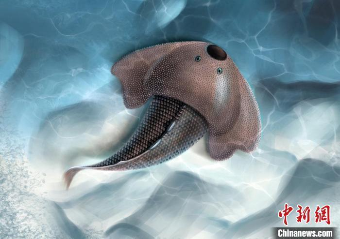
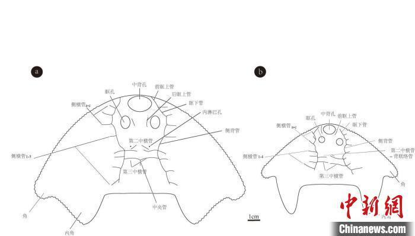
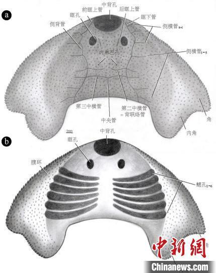

# 中科院团队发现约4.38亿年前古鱼新物种“眼镜蛇大庸鱼”

_“眼镜蛇大庸鱼”生态复原图（史爱娟
绘）。研究团队 供图_

中新网北京7月11日电 (记者
孙自法)中国科学院古脊椎动物与古人类研究所盖志琨研究员11日接受记者采访时透露，他指导该所2022年度大学生“科创计划”入选者、江西师范大学本科生张雨萌、李旭彤完成的古鱼新物种——约4.38亿年前“眼镜蛇大庸鱼”化石最新研究成果论文，近日在国际专业学术期刊《历史生物学》(Historical
Biology)在线发表。

该项研究在湖南张家界地区志留纪兰多维列世特里奇期早中期(距今约4.38亿-4.35亿年)秀山组地层中首次发现的大庸鱼类新物种“眼镜蛇大庸鱼”，系统分类上属于盔甲鱼亚纲大庸鱼科大庸鱼属，是目前发现的大庸鱼科的第三个新物种，其属名“大庸”取自旅游胜地张家界市的旧称‘大庸县’，种名“眼镜蛇”取自其头甲形状与眼镜蛇的头部非常相似。

_“眼镜蛇大庸鱼”(左)与“湖南大庸鱼”的对比(张雨萌
绘)。研究团队 供图_

盖志琨指出，这也是盔甲鱼类化石在志留纪秀山组地层中的首次发现，并揭示出大庸鱼科更多的原始特征，特别是研究团队在“眼镜蛇大庸鱼”的头甲背面发现一对保存完好的小孔，这对小孔正好位于内耳附近第二中横联络管的正前方，可能代表了大庸鱼内耳内淋巴管的外开孔。

该发现表明，奥陶纪(距今约4.85亿-4.44亿年)阿兰达鱼类中所谓的“松果孔”实际可能是成对的内淋巴孔，这意味着脊椎动物开放的内淋巴管系统早在奥陶纪就已经出现，并且代表了脊椎动物的原始状态。此外，在一些志留纪早期的盔甲鱼类包括长兴鱼、曙鱼、安吉鱼等，头甲背面也存在这样一对内淋巴管的外开孔，因此可能代表盔甲鱼类的原始特征。

_“眼镜蛇大庸鱼”化石复原图(桂芳
绘) 研究团队 供图_

志留纪秀山组地层是一套以黄绿色、灰绿色页岩及泥岩为主的沉积岩，在中国华南地区的湖南、重庆、贵州、四川等地分布非常广泛，以盛产无脊椎动物化石“秀山动物群”而闻名于世，其沉积环境指示水体进一步加深，长期以来一直被认为是无脊椎动物繁衍生息的天堂，可能并不适合盔甲鱼类的生存。“眼镜蛇大庸鱼”在秀山组地层的首次发现，则打破了这一传统认识。

研究团队介绍说，新种“眼镜蛇大庸鱼”在头甲大小、内角形态和纹饰等方面明显区别于之前发现的“湖南大庸鱼”：前者的头甲长宽均为后者的1.5倍；前者的内角呈三角形，而后者的内角呈长的叶状；前者头甲纹饰由细小而密集的瘤状突起组成，而后者则由雪花状突起组成。

华南地区的大庸鱼属与发现于新疆塔里木地区的小瘤鱼共同构成大庸鱼科。在系统位置上，大庸鱼科虽然和汉阳鱼科、修水鱼科同属于盔甲鱼亚纲的原始类群，但并不能与汉阳鱼科、修水鱼科共同组成一个单系类群，而是与除汉阳鱼科、修水鱼科之外的盔甲鱼类(真盔甲鱼目+多鳃鱼超目)构成姐妹群，这次研究的系统发育分析结果同样支持这一观点。因此，大庸鱼科一直被作为盔甲鱼类演化的“原型”，这一类群在志留纪兰多维列世早期就已经向真盔甲鱼目和多鳃鱼超目两个不同的方向演化。

_“眼镜蛇大庸鱼”化石照片及其头顶一对“小孔”特写(盖志琨
摄)。研究团队 供图_

据了解，盔甲鱼类是一种只在中国和越南北部志留纪-
泥盆纪地层中出现的土著性“甲胄鱼类”。其作为现生有颌脊椎动物亲缘关系最近的无颌类祖先之一，在解剖学上促进人们对有颌类及其关键特征起源的理解，如颌的发育起源、中耳的鱼鳃起源和人类四肢的鳍褶起源等，同时也促进对早期鱼类游泳速度演化的理解。目前的研究表明，早在4.38亿年前，盔甲鱼类就已出现多样性分化，辐射演化出大庸鱼科、汉阳鱼科和修水鱼科3个原始类群，以及最原始的真盔甲鱼曙鱼科和最原始的多鳃鱼古木鱼科。其中，大庸鱼科长期以来一直被认为是代表中国最古老的盔甲鱼类化石记录。(完)

