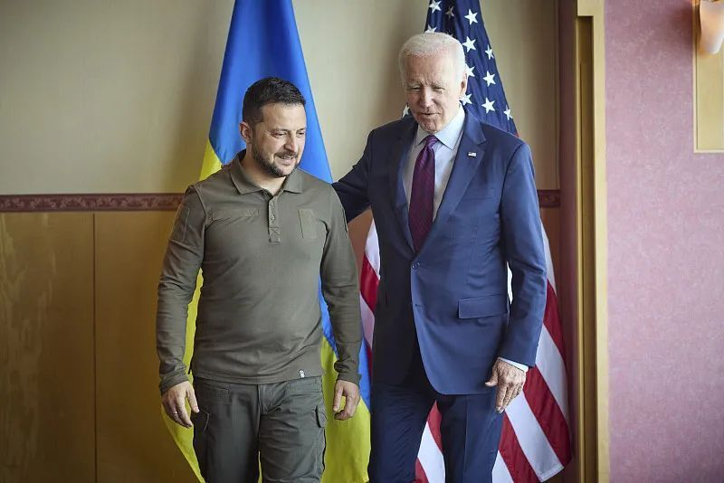
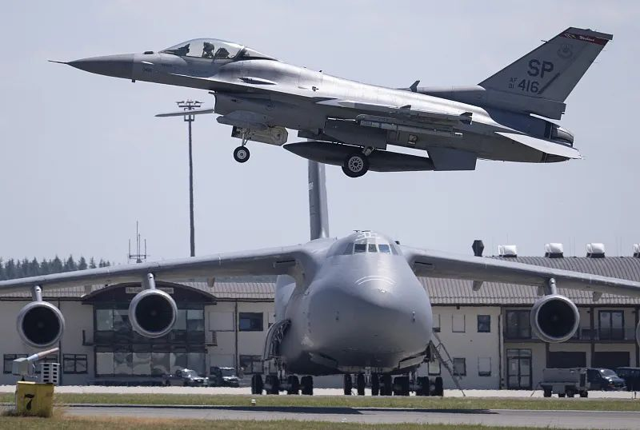

# 北约峰会在即：三大议题陷入尴尬境地，成员国面临难以弥合的分歧

7月11日至12日，北约峰会将在立陶宛首都维尔纽斯举行。在乌克兰发起反攻行动的背景下，本次北约峰会举办地距离俄罗斯边境仅151公里，这也是俄乌冲突爆发以来，北约峰会离俄罗斯最近的一次。

_7月9日，立陶宛维尔纽斯，北约和立陶宛的旗帜在峰会会场上空飘扬。图源：视觉中国_

长安街知事（微信ID：Capitalnews）注意到，此次北约峰会将聚焦三大议题，但尴尬氛围却在峰会召开前夕不断升级。

**首先，俄乌冲突仍是北约峰会头号议题。**
乌克兰总统泽连斯基近期接连访问北约多个成员国，希望峰会期间能就乌克兰“入约”发出明确信号。但美国总统拜登却冲他泼了一盆冷水，称乌克兰“没有准备好”加入北约。

**第二，瑞典“入约”进程如何推进。**
峰会前夕，土耳其总统埃尔多安终于松口，同意将瑞典加入北约的议定书提交给土耳其议会批准。但埃尔多安将瑞典“入约”与土耳其“入盟”相挂钩的表态却遭到欧盟方面明确拒绝。

**第三，东京联络办事处方案被推迟。**
日本、韩国、澳大利亚和新西兰四国领导人将再次受邀参加此次峰会。北约秘书长斯托尔滕贝格称，此举因为北约的安全“不是区域性的，而是全球性的”。但据日媒报道，由于“优先级较低”，北约在东京开设亚洲首个联络办事处的方案被推迟至秋季以后再定。

有分析指出，拜登试图在此次峰会上传达北约“比以往任何时候都更加团结”的信号，但北约成员国却面临越来越多难以弥合的分歧。

**乌克兰“入约”前景未卜**

7月初，泽连斯基直接喊话北约：“在维尔纽斯峰会上，我们需要一个明确、易懂的信号——乌克兰在战争结束后可以成为北约的一个平等成员。”

峰会前夕，泽连斯基更是先后访问保加利亚、捷克、斯洛伐克和土耳其等北约成员国，试图为乌克兰加入北约寻求支持。

然而，拜登的一番话却给泽连斯基泼了冷水。

_今年5月，日本广岛，泽连斯基与拜登出席G7峰会。图源：视觉中国_

据CNN9日报道，拜登近日接受采访时表示，乌克兰尚未做好加入北约的准备，只有在乌克兰危机结束之后，北约才能考虑接纳乌克兰。

拜登指出，北约成员国尚未就是否同意乌克兰加入北约达成一致，“我们决心保卫北约成员国的每一寸领土，这是我们所有人的承诺。如果战争还在继续，那我们都会被卷入战争。如果同意乌克兰加入，我们就要和俄罗斯开战了。”

他还表示，乌克兰若想加入北约还需要符合其他要求，比如“民主化”的程度。

CNN分析认为，即使拜登修改其关于乌克兰“入约”的立场，他也无法确保继任者会履行这一承诺。鉴于美国不确定的政治局势，泽连斯基迫切希望乌克兰“入约”路线能在北约峰会上得到落实。

瑞典面临的“入约”困境在峰会前夕迎来转机，但仍未获得明确时间表。

7月10日，北约、土耳其和瑞典三方领导人会晤后发表联合声明。北约秘书长斯托尔滕贝格表示，土耳其方面同意尽快将瑞典的入约议定书提交给本国议会，目前没有关于瑞典加入北约的具体时间，但会尽快进行。

当天早些时候，埃尔多安给出了瑞典“入约”的前提条件——如果欧盟为土耳其打开大门，那么土耳其也将为瑞典打开大门。土耳其1987年正式申请加入欧盟，1999年获得候选国资格，2005年启动入盟谈判，但谈判过程阻碍重重，至今尚未加入欧盟。

这一表态却遭到德国与欧盟的明确反对。德国总理朔尔茨10日指出，这两个问题是无关的，不该“融为一谈”。欧盟委员会发言人斯皮南特当天也回应称，欧盟扩员和北约扩员是两个独立的进程，二者不能相互关联。

**黑手伸向亚太暴露北约祸心**

2022年的北约马德里峰会上，日本、韩国、澳大利亚、新西兰四国领导人首次受邀参会，今年他们也再次受邀参加维尔纽斯峰会。

这也是北约近年来将黑手不断伸向亚太的最新例证。

2021年，“北约2030年议程”制定，重点转向大国竞争，提出要积极介入全球事务特别是所谓的“印太事务”，并将日韩澳新四国定义为“亚太长期伙伴”。

而日本也在近期不断加快与北约相互勾连的步伐。

今年1月，北约秘书长斯托尔滕贝格高调访问日本，与日本首相岸田文雄达成了所谓“加强彼此间关系”的共识。

今年6月，日本以非北约成员国的身份，参加了北约“空中卫士-2023”军演，这也是北约史上“最大规模空军演习”。

_6月14日，一架美军F-16战斗机在北约空军演习期间从德国斯潘达勒姆空军基地起飞。图源：视觉中国_

此前有报道称，在此次北约峰会上，岸田文雄将与斯托尔滕贝格举行双边会谈，讨论北约在东京开设联络办事处的计划。有消息人士称，双方将制定新的日本-
北约安全合作文件，即“个别化伙伴计划”，以在太空、网络安全等领域展开合作。

然而最新消息却指出，北约在东京开设亚洲首个办事处的方案被推迟至秋季以后。

《日本经济新闻》7月10日报道，北约计划在维尔纽斯峰会通过的相关文件中写入新设办事处的内容。但法国重视与中国的关系，反对北约在东京开设办事处。北约作出相关决定必须获得与会国全票通过。

报道指出，有关人士透露，与俄乌冲突、瑞典“入约”等亟待解决的议题相比，设立东京办事处的“优先级较低”，相关协调工作将推迟至秋季以后。

**诸多分歧凸显北约困境**

北约峰会聚焦的三大议题均陷入尴尬境地，归根结底还是在于北约内部存在难以调和的矛盾与分歧。

事实上，就连北约新任秘书长一职的人选，都无法在成员国内达成一致。

现年64岁的斯托尔滕贝格已担任北约秘书长近9年，虽然他已多次表明去意，但由于继任者频频难产，其任期已延长至2024年10月。英国国防大臣本·华莱士此前有意接任，但法国总统马克龙明确表示反对任何英国候选人成为下一任北约秘书长，甚至不惜为此动用否决权。

_斯托尔滕贝格资料图。图源：视觉中国_

而在北约军费“达标”问题上，31个成员国中，只有10个达到了北约军费支出占国内生产总值2%的目标。

特别是近年来，马克龙为首的欧洲国家领导人呼吁防务自主，避免过度依赖美国。

根据斯德哥尔摩国际和平研究所的数据，去年欧洲的防务开支增长了13%，达到3450亿美元，这是冷战结束以来增长最快的一年。然而，大部分支出都流向了美国的防务公司。

今年6月，马克龙对“购买美国武器”提出质疑，他在巴黎国际航空航天展览会上敦促欧洲防务装备制造商建立独立的军事系统，并将生产转移到欧洲大陆。他还呼吁提高欧洲标准，并指出“这才是真正的由欧洲保护欧洲”。

美国总统拜登曾称“北约从未如此团结”，预计接下来两天的北约峰会上，以美国为首的成员国们也将对外展示“空前团结”。但似乎这种“团结”的象征意义远大于实际意义，种种矛盾分歧也远非一场峰会就能轻易化解。

