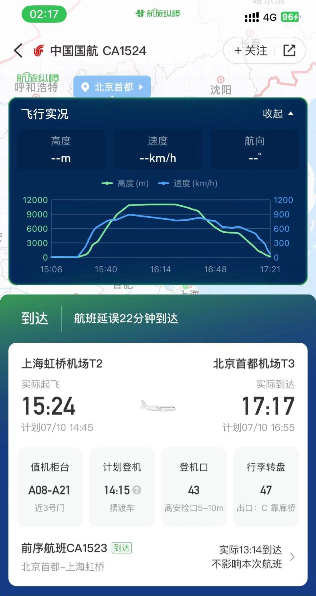

# 国航一航班空中颠簸有乘客空姐被甩到舱顶？业内：晴空颠簸无法预测

航班剧烈颠簸下，机组和乘客应如何做好安全预防措施？

7月10日，多位网友在社交媒体发布消息称，当日乘坐从上海飞往北京的国航CA1524航班时，飞机出现剧烈颠簸，#CA1524颠簸#话题也冲上热搜。中国地质大学（北京）副教授邢立达也于7月10日在微博分享了自己在国航CA1524航班上的经历，“下午这飞机坐得主打一个惊吓，空姐和乘客有被甩到顶面，空姐护着乘客，但还是都受了伤。”

_来源于@邢立达_

7月10日晚间，澎湃新闻记者致电国航客服热线人工客服，接线人员表示，“这边主要处理的是客票产品相关的问题。对于想要询问个别航班的相关问题，可能帮不到您。”截至7月11日澎湃新闻记者发稿，国航方面对此暂时没有回应。

据航旅纵横APP显示，7月10日，国航CA1524航班为15时24分从上海虹桥机场起飞，17时17分降落于北京首都机场。执飞该航班的飞机机型为空客A330。

_来源于“航旅纵横”_

**乘客：距离降落半小时左右有剧烈颠簸**

7月10日晚间，邢立达接受澎湃新闻记者采访时表示，7月10日他计划从上海回北京，而华东有雷雨，好多飞机都落不了上海，只有CA1524的前序航班CA1523顺利抵达，他便改签了此班。航程前半段还挺顺利和平稳，大概离降落三四十分钟时，有一次比较小的颠簸。

邢立达向澎湃新闻记者介绍，“第一次小颠簸前，有蛮多乘客站起来，来来回回上洗手间，也多亏这次比较轻的颠簸，机组人员提醒大家系好安全带，一些乘客也陆续回到座位上。随后没隔多久，可能十几秒后，就有一次非常强烈的、下坠的感觉，很强的失重感。现场大家都在尖叫，还看到当时枕头和矿泉水瓶掉了一地，也有手机掉在了地上。”

一位业内人士告诉澎湃新闻记者，从飞行实况来看，距离降落三四十分钟前，确实能看到一点飞机下落的现象，但整体并不明显。

“可能由于飞机突然下坠，以及两次颠簸时间较近，现场一位还没来得及回座位的乘客和保护乘客的空姐被‘抛’到了天花板。”邢立达进一步表示，“就在我座位附近，我看到一位年纪可能在40岁左右的女性，空姐当时护着乘客，胳膊也流血了，腰也扭了。而天花板顶面被撞得露出了管线，‘出口’标志还掉到了我的脚下。”

对于空姐第一时间对乘客的保护举动，邢立达在社交网站上分享时也提到，“这里夸夸国航的空姐，她们自然也是紧张，但第一时间保护了上抛的乘客，抱着一起上去了……而后又对受伤乘客展开救护，专业且冷静，夸夸。”

“我系了安全带，没有受伤，但这次颠簸经验也希望能提醒大家，尽可能全程系好安全带。”邢立达告诉澎湃新闻记者，该航班第二次剧烈颠簸结束后，飞机就恢复正常飞行了，后续也没有再遇到颠簸。而两次颠簸时，机组人员都有提示系安全带，但机组人员并未说明此次“大动静”究竟是什么原因。

**业内人士：飞机颠簸属常见现象，提醒乘客系好安全带**

飞机剧烈颠簸主要由于什么原因？常见吗？会导致严重后果吗？

资深机长陈建国告诉澎湃新闻记者，根据网友描述的情况，剧烈颠簸的原因一种可能是进入晴空颠簸，一种可能是进入浓积云或积雨云。晴空颠簸是因为外界大气气流比较紊乱，目前无法用飞机机载雷达探测。
而在浓积云或积雨云这些云系中会有强对流，飞机飞越或飞入其中时，会发生强烈颠簸。具体情况需要等航空公司确认。

民航专家李瀚明告诉澎湃新闻记者，一般而言，晴空颠簸主要依靠前机预警预防。目前有一些西方国家可以做到两架同一航路、同一高度层、先后航行的飞机，前机遭遇晴空颠簸时通过电子飞行包和卫星通讯网络告知后机和空管，但是国内没有这样的应用。此外，雷达应该是探测不到晴空颠簸的，晴空颠簸本质上是风，而雷达本质上是通过物体对电磁波的反射能力来发现物体，但是流动的空气和静止的空气，对电磁波的反射能力是一样的。

“此类飞机剧烈颠簸事件，全球范围内几乎每周都会有。”陈建国告诉澎湃新闻记者，颠簸严重时会引起飞机设备受损，但通常不会有大的安全问题。飞机通常可以承受超3个G的载荷，结构通常不会严重受损。

“没有网友所说的‘风切气流’这个说法。应该是有四种低空风切变，会对飞机操纵造成影响。其中，垂直风切变会使飞机下降率过高比较危险。”一位航司央企负责飞机安全运行相关工作的人士告诉澎湃新闻记者，目前夏季雷雨天气多，空中不稳定气流多，剧烈颠簸现场其实很正常，也比较常见。但此次航班颠簸的具体原因，可能还要结合飞机QAR数据解码、驾驶舱录音和机组反馈调查。

陈建国进一步指出，风切变是指风向或者风速在很短的距离内发生的水平或者垂直方向的变化。李瀚明则表示，风切变的意思是风向风速的剧烈变化，一般是瞬间几秒内的变化，通常情况下，机长很难迅速作出反应。

机组人员和乘客应如何应对飞机颠簸现象？

上述央企航司负责飞机安全运行相关工作的人士告诉澎湃新闻记者，“我们都会给机组做提示，注意颠簸，防范颠簸伤人，机组也有对应的操作流程。天气图上如果有大片的这种颠簸区，机组也会采取对应的操作措施，比如上高度或者绕飞等等。”

“对于乘客而言，系上安全带最为重要。”上述人员介绍，颠簸情况下，飞机也不容易出事，这种颠簸对飞机机身来说都是在可承受范围内，设计时候都是有考虑到的，请大众不要过度恐慌。

陈建国也表示，大家无需过度恐慌，切记乘坐飞机时无论安全带指示灯是否亮起，在飞机上保持安全带系好是最安全的预防措施。

