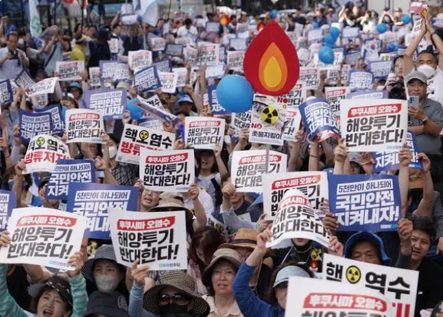

# 国际原子能机构的报告真的中立吗？日本被曝一年给该机构超5千万拨款

据央视新闻7月11日消息，中国代表团10日在联合国人权理事会第53届会议审核日本国别人权审议报告时发言，再次敦促日本停止核污染水排海计划。

4日，国际原子能机构（IAEA）公布针对日本福岛核污染水的综合评估报告，报告认为日本排海方案“总体符合国际安全标准”。7日，IAEA总干事格罗西为解释该报告访韩，受到反对排海方案的韩国政界人士及市民团体的强烈抗议。

_▲7月1日，民众手持“反对向海洋排放福岛核污染水”等字样的标语在韩国首尔参加集会。图据新华社_

9日，韩国最大在野党共同民主党代表与格罗西会谈时表示，评估报告没有验证日方的多核素处理系统的性能，也没有研究对海洋生态系统的长期影响，这样得出结论是有问题的。该党代表还指出，IAEA没有讨论处置核污染水的其他对策，从一开始就丧失中立性和客观性。

事实上，在日本国内，有关IAEA对日本核污染水排海方案的立场是否真的“中立”，其给出的评估报告是否真实有力，也一直争议不断。

**媒体调查质疑：**

**一年多给超5000万 IAEA真的“中立”吗**

6月21日，有韩国媒体报道称，日本政府为消除IAEA及第三国专家的意见分歧，向IAEA提供了100余万欧元的政治捐款，IAEA将公布的报告的结论则在一开始就确定是“安全”的。

7月4日，格罗西公布了认为日本核污染水排海方案“总体符合国际安全标准”的报告，并举行记者发布会。发布会上，一名韩国女记者追问格罗西IAEA是否收了日方的100万欧元。格罗西回应称，IAEA没有收过任何人的钱，这种说法是非常荒谬的。

_▲7月4日，在日本东京，IAEA总干事格罗西（左）向日本首相岸田文雄提交评估报告。新华社_

然而，有日本媒体近日也在报道中表示了对IAEA“中立”立场的疑问。因为，日本所承担的巨额经常预算分摊金、日本各政府省厅对IAEA的拨款，以及日本政府对IAEA进行的人员派遣，都有可能让IAEA在进行对日本核污染水排海方案的安全性评估时“给予关照”。

有报道称，除了IAEA机构要求成员国分摊的经常预算，日本还向IAEA拿出了巨额拨款。2021年，日本向IAEA拨款约11亿4000万日元（约5788万人民币），金额达到了所分摊经常预算的30%。

日本媒体在分析了今年日本政府对IAEA的拨款预算发现，这些拨款预算不仅来自外务省，包括原子能规制委员会事务局原子能规制厅、文部科学省、经济产业省、环境省在内的各政府省厅都有相关预算，这些部门的拨款预算合计约8亿4000万日元（约4265万人民币）。

因此，日媒分析认为，IAEA并不是一个适合判断日本核污染水排海方案安全性的机构。

**除了给钱还派遣多名职员**

**确保“存在感”**

同时，调查发现，日本政府还向IAEA派遣了多名职员，所产生的人事费也包括在拨款中。

日本总务省官方网站发表的报告中写道，日本政府的“贡献”确保了日本作为原子能发达国家的“存在感”，以及在发展中国家的影响力。文部科学省也有类似的表述。一文部科学省的官员称，政府通过向IAEA支付大额拨款，并派遣职员，确保了“存在感”。比起谋求日本自身利益，（日本政府的举动）更是为了做出“国际贡献”。

就一些媒体所报道的政治捐款事件，日本官房长官表示，这是“事实误认”。

但日本媒体在报道中指出，即使这些拨款是“为了做出国际贡献的必要举动”，向一直接受自己资金支持的组织请求安全性评估本身就有“受到关照”的可能性。日本政府有必要重新思考，是不是搞错了能为自己提供权威认证的对象。

7月7日，中国外交部发言人汪文斌也在例行记者会上再次就日本核污染水排海事表态，敦促日方不要试图把国际原子能机构报告当作排海“通行证”。

汪文斌回答记者有关提问时表示，中方注意到国际原子能机构总干事的表态以及有关专家的看法。“这些情况再次表明，机构仓促出台报告，没有充分反映所有参加评估工作各方专家的意见，相关结论存在局限性和片面性，没有解决国际社会对日本福岛核污染水排海计划的关切。机构总干事指出，机构不会为任何国家核污染水排海背书，中方敦促日方不要试图把机构报告当作排海的‘通行证’，停止强推排海计划，以负责任方式处置核污染水。”

红星新闻记者 徐缓 实习生 陈雅然

编辑 张寻 责编 邓旆光

