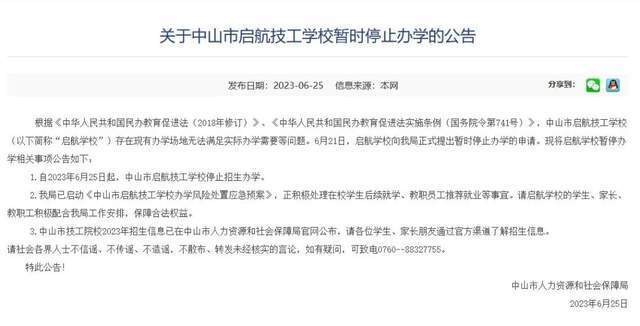
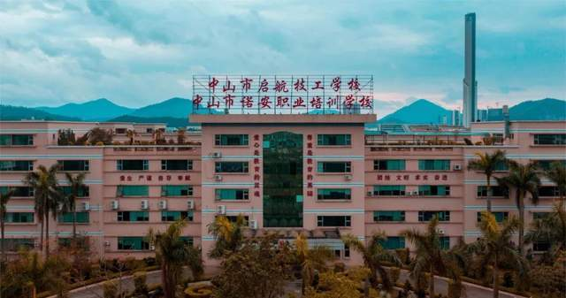

# 学生还没毕业，学校没了

近日，广东省中山市启航技工学校（以下简称启航学校）停止办学一事，在网络上引发关注。

网传视频显示，不少家长坐在教室里，面色沉重，有工作人员拿着话筒和家长进行沟通。在评论区里，有网友写道：“谁能想到，有一天读书读到学校倒闭？”

启航学校是广东省人力资源和社会保障厅于2011年批准成立的一所民办技工学校，主要从事全日制技工教育和各种短期培训。

据《关于中山市启航技工学校暂时停止办学的公告》，启航学校存在现有办学场地无法满足实际办学需要等问题，自6月25日起停止招生办学。

中山市人力资源和社会保障局（以下简称中山市人社局）一位工作人员告诉中国新闻周刊，他们在去年9月已经预警监测到启航学校相关的关联风险，并成立了专项工作组。

至于为何选择在6月发布相关通知，上述工作人员表示，主要是为了让学生先安心完成学业，确保有一个暑假的“窗口期”完成相关安置工作。

中国教育科学研究院研究员储朝晖对中国新闻周刊表示，启航学校停办实际上只是近期众多民办学校停办的个案之一。他认为，这种情况可能还会延续一段时间。

教育部相关数据显示，2022年，全国共有各级各类民办学校17.83万所，比上年减少7451所。

**“示范院校”突然停办**

公开资料显示，启航学校拥有行政办公楼、教学楼及宿舍楼，建筑面积近30000平方米。作为全国职业教育改革创新示范院校，该校于2018年10月被评为广东省重点技工学校。

_中山市启航技工学校_

启航学校开设有十多个专业，包括电梯工程技术、汽车维修、幼儿教育、计算机网络应用、烹饪、电子商务等。其中，电梯工程技术专业被评为中山市技工院校重点专业，学校围绕电梯工程技术专业，与超过60家企业开展校企合作。

一位知情人士告诉中国新闻周刊，近些年启航学校因经营不善、资金困难等原因饱受困扰，现办学场地为租赁性质，租金高昂且存在拖欠租金行为，坊间早有传闻学校可能会出事。

事实上，启航学校曾因合同纠纷被广东誉新膳食管理有限公司和中山伟霖纺织有限公司起诉。企查查显示，启航学校有4条裁判文书记录，案件总金额达1,116.68万元。风险信息显示，该学校存在3条被执行人信息，被执行总金额总计502.67万元。

启航学校的毕业生，对该校的评价也褒贬不一。

一位烹饪专业的毕业生告诉中国新闻周刊，烹饪是该校的优势专业之一。他认为，该专业师资力量相对较强，许多教师在行业内有一定影响力。毕业后，他们通常会进入国际酒店从事餐饮烹饪工作。

另一位2012届毕业的学生则对启航学校并不满意。据他所述，自己在入学后不久就被安排去深圳的一家电子厂工作，工资极低。他向中国新闻周刊形容，学校当时就像一家工厂，环境也不好。

还有一位汽修专业的毕业生对中国新闻周刊表示，他们那届有好几个同学因与老师发生冲突而退学。他还反映，学校内部各类收费名目繁杂。

近些年，启航学校的学费也一直在上涨。前述烹饪专业毕业生告诉中国新闻周刊，在他入学时，学费每年为4000元，而他的下一届，学费涨到了1万元左右。

据启航学校《2022年招生计划及收费标准》，该校大多数学科的学费为每学期5000～6500元，一年学费基本上过万。

启航学校停止办学，对于还在就读的学生，后续如何安排是当下社会最关心的问题。

中山市人社局前述工作人员告诉中国新闻周刊，目前达成比较一致的方案是由市内其他3所民办技工学校接收启航学校的在校在籍学生，以便他们能够继续完成学业和安排实习。

据他透露，截至目前，启航学校的1423名学生中，已有1341名学生和家长同意分流安置方案。其中768名进入实习学年的学生，将由新学校安排实习事宜。另外，82名学生及家长选择自主安排。

**并非个案**

据了解，近年来，各地出现了不少民办学校停止办学的现象，引发了广泛关注。

今年3月份，惠州市仲恺高新区阳光学校突然倒闭，数百名学生被迫分流的消息在网络刷屏，并引起了社会各界的关注。该倒闭的学校位于惠州市仲恺高新区惠环街道红旗村金岭路6号，是一所义务教育阶段民办学校，2020年9月1日才正式开学。

资金链断裂是该校倒闭的主因之一，其宣布停办时，尚有工程欠款未还清，其教职工工资已有两个月未正常发放。

一家民办教育集团负责人告诉中国新闻周刊，民办学校停办背后，通常经济压力是主要原因之一。办学成本的上升、学生招生困难、资金链断裂等问题，使得一些民办学校难以继续运营下去。

此前，四川希望汽车职业学院就因为其招生公告引发了争议。该公告提到，针对2023级的所有学生，均可获赠iPhone14全新手机一部，不要手机者可享受等额现金的专项助学金，作为补贴生活费之用。

该公告还注明，无需其他额外条件，新生报到注册后直接发放。公告最后还有学校简介、2023年招生专业及学费、各地区志愿指导老师联系方式等。

该校招生办一名工作人员表示，新生开学后就能收到手机，也不会因此而涨学费。

不少业内人士认为，该公告的目的就是增加“噱头”进行招生，“主要为了争夺生源”，“民办学校完全靠办学者的投入和学生缴纳的学杂费，如果生源不足，就难以为继”。

实际上，近年来全国民办学校总数以及在校生人数，都在减少。

7月5日，教育部官网发布了《2022年全国教育事业发展统计公报》，公报显示，全国共有中等职业学校7201所，同口径比上年减少93所。

在民办教育上，全国共有各级各类民办学校17.83万所，比上年减少7451所，占全国各级各类学校总数的比例34.37%；在校生5282.70万人，比上年减少346.06万人，占全国各级各类在校生总数的比例18.05%。

储朝晖提到，当下民办学校的办学者一般介于教育家和企业家两者之间。他认为，如果是教育家办学，即使面临各种困难，他们也会尽力坚持并寻找解决办法。然而，企业家逐利，如果面临资金上的压力，以及一些不可抗力因素，可能会停止办学。

对于民办学校停办所带来的影响，学生和家长首当其冲。学生可能需要面临转学问题，学业和生活都会受到一定的影响。其次，教职员失去了原有的工作岗位和收入来源，面临失业的风险。

此外，整个教育体系也将受到一定的冲击，教育资源的流失和重新分配将对地方教育产生一定的影响。

**如何保障自身权益？**

那么，如果民办学校停止办学，家长、学生和教职工如何保障自身权益？

广东日升律师事务所主任钟君安接受中国新闻周刊采访时介绍，我国《民办教育促进法》《民办教育促进法实施条例》对民办学校何种情形应当终止办学、如何终止办学以及相关法律责任均有明确规定。

他说，根据《民办教育促进法》第五十七条规定，民办学校终止时，应当妥善安置在校学生。实施义务教育的民办学校终止时，审批机关应当协助学校安排学生继续就学。

第五十九条第一款规定，民办学校财务清算时，按照顺序应当首先退还受教育者的学费、杂费和其他费用，其次是教职工的工资、社保费用，最后才能偿还其他债务。

他说，如民办学校终止办学，就学生、家长而言，首先有权要求安排继续就学，学校应当妥善安置在校学生；其次学校如有学费、杂费和其他费用未清退，可以要求学校在财务清算过程中优先偿还或者通过诉讼等法律途径解决。就学校教职工而言，如存在拖欠工资、劳动关系解除的补偿或赔偿等问题，可以通过劳动仲裁等法律途径解决。

此外，对于民办学校恶意终止办学的，根据我国《民办教育促进法》第六十二条规定，民办学校将受到警告处分；有违法所得的，退还所收费用后没收违法所得；情节严重的，责令停止招生、吊销办学许可证；构成犯罪的，依法追究刑事责任。

21世纪教育研究院副院长熊丙奇告诉中国新闻周刊，不管是义务教育阶段的学校，还是类似启航学校的中职学校停办，相对比较好解决，因为它不涉及学生的录取问题，只要分流到同等水平的学校，家长和社会大致能够接受。但对于高职甚至本科院校来说，可能面临更加复杂的问题，因为每所学校的录取分数不同。当学生被分流到其他学校，就会涉及转学的问题，这时他们的学分是否能够衔接就是一个问题。

因此，他认为应该未雨绸缪，及早建立起学校破产之后学生的分流机制。

作者：陈淑莲

