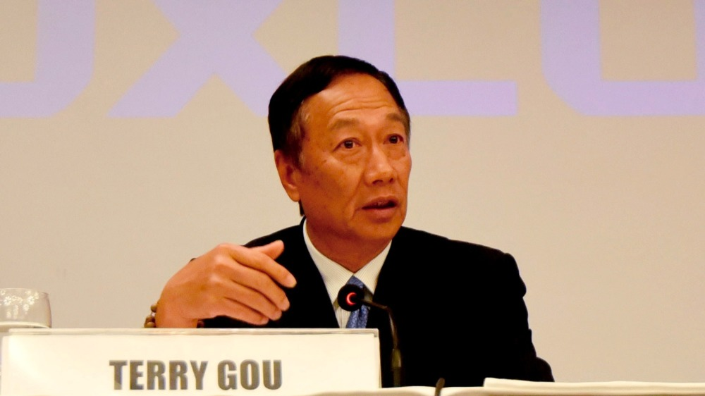
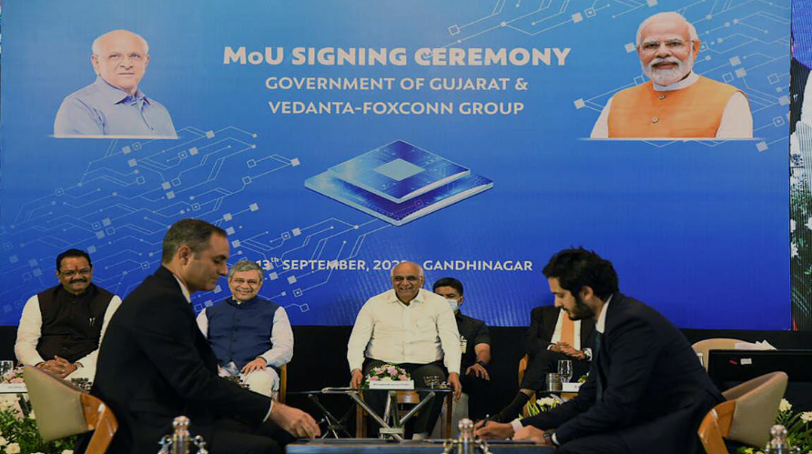

# 富士康败走印度：这是一场双向奔赴的“互坑”

出品 | 虎嗅科技组

作者 | 丸都山

编辑 | 廖影

头图 | 视觉中国

去年2月，富士康母公司鸿海集团与印度矿业巨头韦丹塔签署共同建造芯片厂的协议，那个被莫迪政府寄予厚望的“印度造芯”计划也被推向高潮，但这份雄伟蓝图眼下似乎已经草率收场。

7月10日晚间，鸿海集团发布公告称，为探索更多元的发展机会，根据双方协议，鸿海后续将不再参与双方的合资公司运作。

这份公告的措辞给双方留足了“体面”，但落在实际行动上，鸿海的这次退出没有一丝犹豫。按照公告，双方的合资公司未来将完全由韦丹塔集团持有，并且已通知后者移除合资公司中鸿海的名称，以避免双方利益相关者混淆。

实际上，双方合作的裂隙早已经出现端倪。6月23日，韦丹塔方面称，公司重新修改了关于晶圆厂的补贴申请，其中关于工艺节点的描述，从最初制订的28nm制程退至40nm。

而据路透社援引知情人士报道，印度政府对于两家公司的这一举措非常不满，并有意延迟批准激励措施，这或许是富士康出走印度的核心原因。

**一场双向奔赴的“互坑”**

如果梳理此次双方合作的历程，就会发现这是一个在立项时就“漏洞百出”的方案。

按照双方签署的合作备忘录，项目双方将共同投资195亿美元（其中韦丹塔出资60%）建设28nm制程的12英寸晶圆厂及配套的封测工厂，并预计在2025年正式投入使用。

_图片来源：electronicweekly_

此举意味着，印度将拥有首座由印资控股的12英寸晶圆厂，有望成为“印度制造”十年计划中最具代表性的方案。

同时对于富士康而言，这更是一桩稳赚不赔的买卖。一方面，印度本土的晶圆厂与封测厂能够帮助富士康的组装厂规避掉20%的电子元器件进口关税。另一方面，根据印度政府在2021年公布的半导体生产关联计划，外资在印度本土建设晶圆厂，最高可获得相当于50%的项目投资额补助，这能够大大降低富士康造芯计划的沉没成本。

但问题在于，合作的双方根本没有芯片代工的经验，在印度项目启动之前，富士康与芯片代工行业唯一的交集就是收购了夏普的8英寸晶圆厂，可以说连28nm制程的门槛都没有摸到。

一位业内人士向虎嗅表示，“虽然28nm属于成熟制程，但绝不是落后技术，无论是开发难度，还是工艺转换成本，都要比40nm/45nm制程高得多。”同时他还指出，对于两家从未涉足芯片代工的厂商而言，直接开发28nm工艺并不是个明智的选择。

值得一提的是，富士康的解决方案也充满着“临时抱佛脚”的色彩：找到欧洲半导体巨头意法半导体寻求生产技术许可。后者对于此项合作持有积极态度，但印度政府方面又提出，希望意法半导体“参与到更多的游戏中”，比如入股富士康与韦丹塔的合资公司。

就这样，关于28nm工艺技术许可的谈判在今年5月陷入僵局。

尽管韦丹塔在前不久表示，已经从某国际一流大厂那里获得了40nm工艺的生产许可，但这与最初计划的28nm工艺制程相差甚远，因此印度政府延缓了激励资金的审批。而富士康在印度政府的补贴迟迟不能到账下，也决定及时止损。

从结果上看，这次合作破裂意味着富士康的“转芯”已经面临阶段性失败，而印度方面受到的影响要更加深远，因为基本已经没有半导体厂商愿意再在印度投资。

**芯片制造，印度难以触及的梦？**

要知道在印度政府“放血式”的补贴下，被吸引的不止是富士康一家，半导体大厂Tower的合资企业ISMC财团同样表达过合作意向。

不过，在去年2月英特尔曾明确表示将要收购Tower，尽管目前最终协议尚未达成，但按照协议在谈判阶段Tower必须暂停一切对外投资。而在收购完成后，Tower几乎没有赴印投资的可能，因为英特尔对印度抛出的橄榄枝始终保持着避之不及的态度。

去年9月7日，印度电子和半导体协会曾在推特上表示，英特尔即将在印度建设一家晶圆制造厂，但就在这个消息发布的几个小时后，英特尔迅速发布声明，该公司目前没有在印度投资建厂的计划。

一位业内人士向虎嗅表示，印度最大的优势在劳动力成本，但这在芯片行业中并不算优势，“况且印度本土严重缺乏产业工程师，这些人才前期一定要高薪从国外引进，综合成本并不低。”

而真正让各大半导体厂商望而生畏的是，印度本土薄弱的产业集群，以及随时可能崩溃的基础设施，这一点富士康应该深有体会，此前这家公司位于钦奈的组装工厂就曾多次因区域性停电而中断生产，手机组装产线在电力影响下可能只是延期交付，但晶圆厂一旦停电，则可能导致这批产品全部报废，这是无论如何都无法接受的。

还有印度朝令夕改的政策对于外企的“震慑”。从这次合作来看，尽管富士康没能拿出28nm工艺的方案，但源头在于印度政府试图强行将意法半导体拉入伙，而站在后者的角度，根本没有道理去加入这个风险极高的项目中。

如果说外资对印度半导体没有信心，那么本土企业呢？

在去年9月，塔塔集团控股公司塔塔之子董事长纳塔拉詹·钱德拉塞卡兰在接受《日经亚洲》采访时表示，塔塔集团计划未来5年在半导体产业中投资900亿美元，实现芯片的本土化生产。

但与外企面临的问题基本相同，在晶圆制造这个Know-How属性极强、且依赖完整产业集群的行业中，印度本土企业想要凭一己之力实现从无到有恐怕并不容易。

