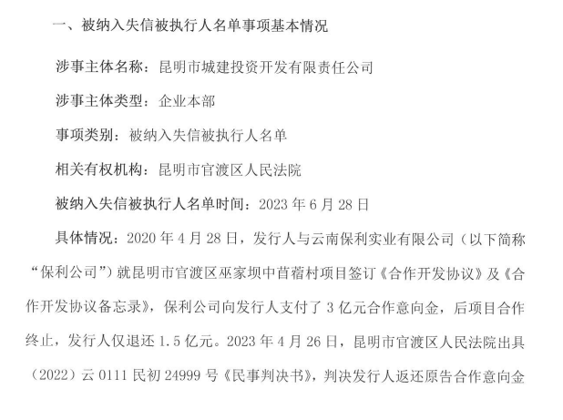

# 欠保利1.5亿元合作意向金，昆明城投被纳入失信被执行人名单

红星资本局7月11日消息，近日，北京金融资产交易所官网披露公告，昆明市城建投资开发有限责任公司（下称“昆明城投”）被纳入失信被执行人名单。

_图据北京金融资产交易所_

公告显示，2020年4月28日，昆明城投与云南保利实业有限公司（以下简称“保利公司”）就昆明市官渡区巫家坝中苜蓿村项目签订《合作开发协议》及《合作开发协议备忘录》，保利公司向昆明城投支付了3亿元合作意向金，后项目合作终止，昆明城投仅退还1.5亿元。

_图据北京金融资产交易所_

2023年4月26日，昆明市官渡区人民法院出具（2022）云0111民初24999号《民事判决书》，判决昆明城投返还原告合作意向金1.5亿元及截至2022年5月13日的资金占用费及违约金50042757.99元，并以1.5亿元为基数按15.4％的年利率支付自2022年5月14日起的资金占用费及违约金。

6月13日，因昆明城投未按照生效裁判文书履行义务，原告已向法院申请强制执行，执行标的为225005866元。6月28日，昆明城投被列入失信被执行人名单。

同时公告显示，昆明城投正积极与保利公司协商执行和解，尽快撤销该事项。

编辑 杨程

