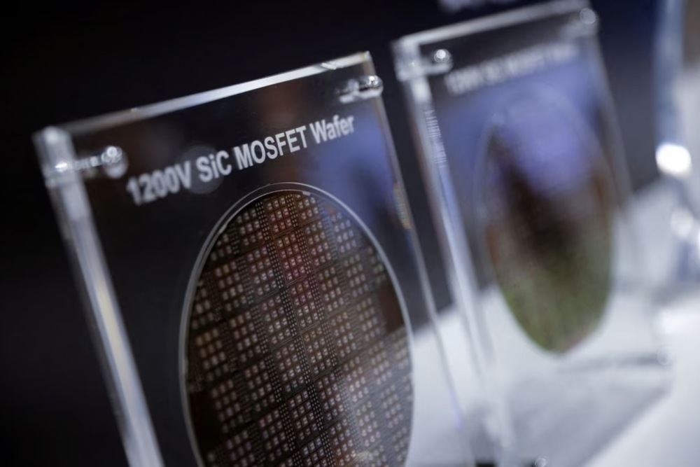

# 退出195亿美元半导体合资公司后，富士康可能还会在印度造芯

腾讯科技讯
7月11日，富士康周二表示，计划申请印度在其半导体制造政策下提供的激励措施，此前，富士康宣布与维丹塔（Vedanta）解除了价值195亿美元的芯片制造合资企业。

富士康周一退出了与印度综合企业维丹塔的半导体合资企业，这是对印度总理莫迪在印度的芯片制造计划是一个重大挫折。

富士康是全球最大的代工电子制造商，该公司在一份声明中表示，正在努力申请印度政府的“半导体和显示器制造生态系统改进计划”，这是一个重新制定的100亿美元计划，为半导体和显示器制造项目提供高达资本成本50%的财务激励。

该公司在一份声明中表示：“富士康正在努力提交申请。富士康认为将在印度成功建立一个强大的半导体制造生态系统。”

莫迪将芯片制造视为印度经济战略的重中之重，以追求电子制造的“新时代”。富士康的举动对于他吸引外国投资者首次在印度本土生产芯片的雄心壮志来说是一个打击。

维丹塔-富士康合资企业是去年在印度政府激励计划下的三个申请者之一。

富士康在解释与维丹塔的分手时表示，周二“双方都认识到项目进展不够快”，还有其他“我们无法顺利克服的困难差距”，但没有透露更多细节。

富士康在声明中表示：“这并不是一件负面的事情。”

据一位知情人士透露，富士康正在与几家本地和国际合作伙伴积极洽谈，利用成熟的芯片制造技术在印度建立半导体生产能力，包括电动汽车等产品。由于问题的敏感性，该知情人士要求匿名。

该人士表示：“公司将继续存在，只是会找到其他合作伙伴。”

印度政府表示，富士康的决定对印度的计划“没有影响”，并补充说两家公司都是该国的“重要投资者”。

审校：小北

