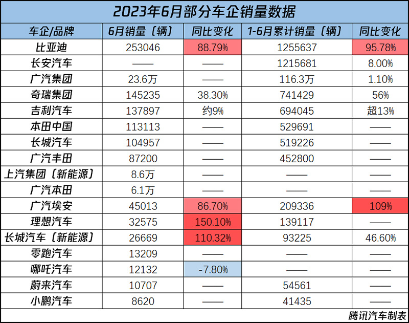
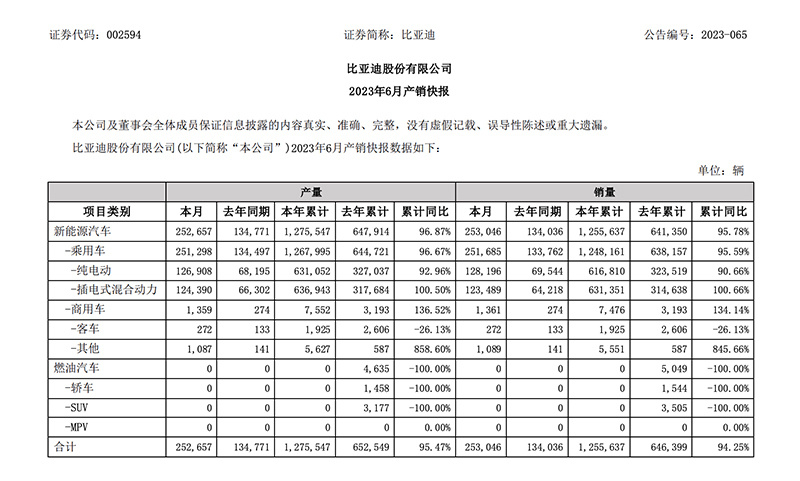
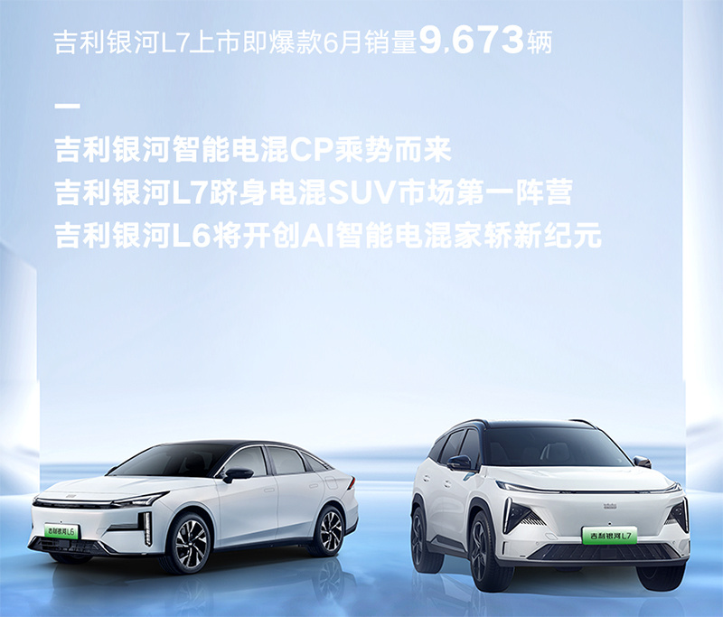
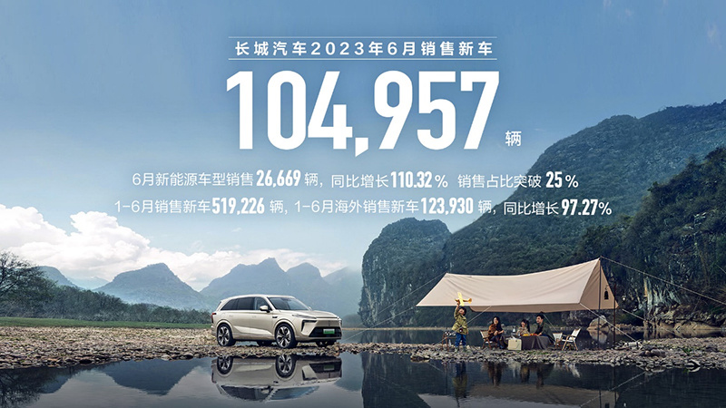
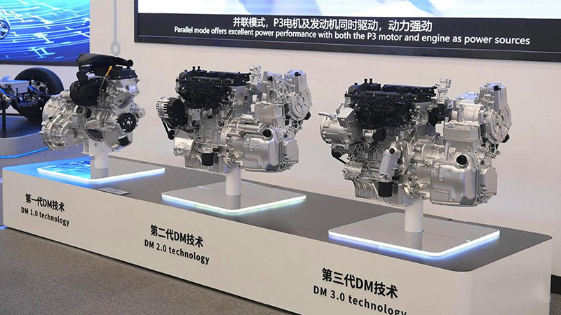

# 6月成绩单力证插混才是王道？购置税新政给出新能源车4年方向

腾讯新闻《车圈》作者 刘坎顺

进入7月后，各大车企陆续发布了6月销量和2023年上半年销量数据，成绩单一经公布便让我们看到了中国车企的力量，尤其是在新能源车市场中的增速令人敬畏，其中也反映出了消费者对于这一类车型的偏爱。

结合国内热销和主流的新能源车市场来看，插混（含增程）车型无疑是今年新能源车市场的一大亮点，几乎所有主流车企都推出了各种插混产品，这使得插混车型销量的增长速度远超纯电动车。同时，国产品牌在插混技术上的发展也越来越多样化，技术优势和规模优势也更明显。

未来几年内，插混或将是车企混战的主流地带，也是决定势力格局的关键。

**6月成绩单：插混有惊喜**

从6月成绩单综合来看，凭借着新能源车的核心优势，比亚迪以25万+辆的成绩领跑着中国车企；其次是广汽集团以广汽传祺、广汽埃安、广汽丰田和广汽本田等联合销量23.6万辆排在第二，但如果单独从新能源品牌来看，广汽埃安4.5万辆的表现也值得肯定；而造车新势力中则是理想汽车以32575辆的成绩保持着第一。至于合资车企，本田中国在集合了广汽本田和东风本田之后才有11万+辆的销量，这与吉利汽车接近14万的成绩相比，主要还是在新能源市场中的表现有所差异。

其实从6月，乃至2023上半年的整体销量来看，最直观的表现就是中国品牌已经在新能源车市场站稳了脚跟，尤其是以比亚迪为代表的插混、理想汽车为代表的增程混动的表现最为抢眼。

从数据上来看，比亚迪6月新能源汽车销量253046辆，同比增长88.79%。其中，EV纯电动车型销量12.82万辆，DM混合动力系列销量12.35万辆，两者基本持平。而1-6月，其新能源汽车累计销量1255637辆，同比增长95.78%。

尽管比亚迪DM插混和纯电动车在6月的销量持平，但从市场表现来看，还是反映出了DM插混持续给比亚迪带来的红利，毕竟DM混动系列基本都是卖给了个人消费者，而EV则有大部分的受众群体是租赁市场和出行市场。

而从DM插混车型来说，销量占比最高的无疑是宋家族的DM-i车型。

正因如此，这个市场还吸引了吉利和长城的加入，前者推出吉利银河L7，后者推出哈弗骁龙系列，也让15万元左右的插混SUV竞争变得更为激烈。

具体来看，吉利新能源在6月的销量达到了38572辆，同比增长了约30%；而1-6月新能源累计销量157889辆，同比增长了约44%。这其中增幅最大的依旧是纯电动车（几何、

领克

、

极氪

等），但在6月刚上市的吉利混动SUV车型银河L7，当月销量也达到了9673辆，这个成绩还是比较亮眼了。

再从长城汽车的哈弗枭龙系列车型销量来看，同样也是上市不久，在6月也达到了6098辆的成绩；就连

魏牌

（WEY）上市不久的蓝山DHT-PHEV也表现火爆，6月销售为5506辆，环比增长7.2%，上市至今累计销量达到11692辆。

长城新推的这两款车也均为插混SUV。

而长城汽车新能源车型在6月的销售为26669辆，同比增长110.32%，占比达25.41%。2023年上半年，新能源车型累计销售93225辆，同比增长46.60%。可以说这个成绩里面，很大一部分来自哈弗、魏牌插混车型的贡献。

**这么多插混系统，为何都卖不过比亚迪DM-i？**

因此可见，当前，插电式混动系统在提升主流品牌在新能源市场销量比重的作用还是很大的。但通过销量，我们又会发现一个比较有意思的事情，无论是吉利的雷神Hi·X、长城的DHT-
PHEV、

奇瑞

的鲲鹏e+，还是

长安

的智电iDD等这类更复杂且特点更鲜明的插混系统，就是卖不过比亚迪DM插混。

目前自主品牌的插混技术路线的确是五花八门，这也决定了车型不同的成本、价格和使用体验。其中，多挡DHT和iDD是在动力和油耗之间找到了平衡，是更完善的解决方案，但比亚迪DM-
i却能制霸销量，原因是什么呢？

比亚迪DM-i（DualMode-
inteligente）是一套“以电为主”的混动技术，并由专用的骁云1.5L发动机或1.5T发动机+电机+刀片电池所组成的插电式混动系统。其中这两款专用发动机主要作用是给电机发电，偶尔参与直驱。特点是燃油效率高，1.5L的热效率43%，1.5T也有40%，但本身的输出功率并不算大。出于成本和油耗考虑，比亚迪绝大多数车型都是搭载的1.5L。

最关键的是DM-i用的刀片电池跟EV上用刀片电池其实不是同一类型，前者刀片电池其实是一种功率型电池，能够支持比较高效的充放电。所以DM-
i在低速下可以实现串联模式增程式行驶，发动机在五六十的时速下几乎都无需介入。而目前其它品牌的多挡DHT技术还无法实现这一点。

由此，DM-i的优势迎合了消费者日常90%的用车场景（城市驾驶），这也进一步放大了DM-
i的省油优势，相反，发动机输出小等短板就被忽略了。另外，由于比亚迪DM拥有多年技术沉淀，以及庞大的车型保有量，这也让消费者会认为DM技术更成熟，也更容易接受。

试想，如果多挡DHT和iDD能进一步提升发动机给电池充电的效率，实现高效率的“变跑边充”，那么DM-
i的油耗优势可能就荡然无存了，可能还会倒逼着比亚迪来提升DM-i的发动机输出，并增加挡位，从而弥补高速动力不足的短板。

**增程式混动怎么突然又香了？**

在“蔚小理”这三驾马车中，理想汽车目前在售的全部车型均为增程混动车，

蔚来汽车

和

小鹏汽车

则仅有纯电动车，但从销量上来看，主打增程混动的理想汽车无疑是最大赢家，同时整体销量的增速也非常惊人。

理想汽车在6月共计交付了32575辆，月度交付量首次突破三万，同比增长150.1%。值得一提的是，理想汽车2023年上半年的交付量已经超过2022年全年的交付量。而蔚来汽车6月的交付量刚好破万，为10707辆；低迷的小鹏汽车终于有些起色了，6月销量为8620辆。

与理想汽车相比，

零跑汽车

的6月销量表现更是一鸣惊人，在6月全系的交付量都达到了13209辆，同比和环比均实现了增长。其中C系列共交付了11600+辆，占比超87%，尤其是主力车型C11交付了8900+辆——C11也是一款增程版车型。

有很多行业人士会疑惑，曾经被嘲笑的增程混动怎么又香了？这其中的原因其实与增程混动系统的原理和技术有一定的关联。

增程式混动系统的底层逻辑是“纯电优先”，将发动机变成“发电机”来给大电池充电，从而满足动力电池给电机提供动力来驱动车轮行驶。这使得车型在避开了机械部件的巨额研发投入后（这也是为什么很多技术专家都说增程混动是被淘汰的技术），把更多成本都转移到了释放空间、车内配置之上，再结合电机在低速行驶时的静谧性、经济性等优势，使得整车在城市行驶时很巧妙的避开了纯电对抗高速风阻的劣势，因此增程式车型的下限很高，但上限却很低，仅适用于舒适性的家庭用车。

这些能提升销量的“成功”便是以此为基础，首先依靠中国市场强大供应链的优势做到成本控制，其次由于不需要投入大量的研发成本，便可将成本用于车内电气化配置和车型驾乘空间方面的提升，高度契合了国内消费者“既要又要”的核心诉求。当然，仅从汽车本身来说，这种“爆单现象”也得益于国内消费者对于驾驶体验、乘坐体验需求偏弱的特色。

例如理想汽车从

理想ONE

到现售的L系车型，在混动技术上并没有任何优势，相反却利用大电池特点将对车内配置的支持特性放大到极致，同时创始人李想也正是抓住了国人偏爱多元化大空间乘坐体验（参考

汉兰达

）的刚需，将更多研发成本放在了如何做大车型之上，这使得理想车型在智能配置和空间方面，都敢于从“对标”同尺寸的德系豪华车，而类似这种“碰瓷的营销方式”（500万元内最好的SUV）也恰恰是国内消费者所偏爱和认同的。

**插混仍将是未来4年增长点**

国产新能源车从发展之初就一直受利好政策的扶持，其中，新能源汽车免征购置税政策更是功不可没，如今，中国新能源汽车产业在全球市场已取得先发优势、技术优势、规模优势。

今年6月底时，财政部等三部门联合发布《关于延续和优化新能源汽车车辆购置税减免政策的公告》，表明新能源汽车车辆购置税减免政策还将延长至2027年底。

简单来说，在2023年年底前，所有新能源车都不用缴纳购置税；2024年和2025年，只有车价低于33.9万元的新能源车才能免征购置税，超过这个价格的部分要按正常税率缴纳；而2026年和2027年，所有新能源车都可以享受购置税减半的优惠，但是最高减免额不能超过1.5万元。

不难看出，新政策最大的信息点还是明确了未来4年内对新能源车的支持，这其实也是给了那些还没有完全转型为纯电的传统燃油车企一次机会。再结合33.9万元这个“价格分水岭”，以及国内新能源车市场现状来看，这个机会主要还是给了国产品牌。毕竟33.9万元以下的国产品牌纯电动和插混车型是目前消费者最活跃和最关注的区域。

笔者认为，在未来的4年中，插混车依旧会成为国内新能源车的主流和增长点，一方面是插混既能纯电短途、又可加油跑中长途的特点，更适合国内消费者的用车需求和出行场景应用；另一方面，得益于技术优势和成本控制，能让车企有更多费用去提升国人更看重的省钱、大空间、舒适和科技配置等多方面需求。

相反，当纯电动车的驱动电池技术还未得到实质性的突破，类似800V超级快充还未普及之前，补能方式和时间等问题还不能得到完美解决时，插混车型无疑更适合当前国人的购车和用车需求。

因此，在未来的4年中，插混车型的销量还会持续上升。

值得一提的是，新政策中对于“换电模式”纯电动车的支持，其购置税的计算方式将以“车身价”为准。以最新的

蔚来ET5

旅行版为例，如果使用Baas电池租赁方案购买，那么其购置税就是按照22.8万元的价格来计算。

尽管目前玩转“换电”最成功的是蔚来汽车，但也还有一些具备换电条件的品牌，诸如

飞凡

、

智己

、枫叶等，也有可能会借助这个政策来提升产品销量和竞争力。如果在未来4年内，该政策能够实现换电标准的制定和推广，那么参与其中的车企也会在政策窗口期内大力推出换电车型。

