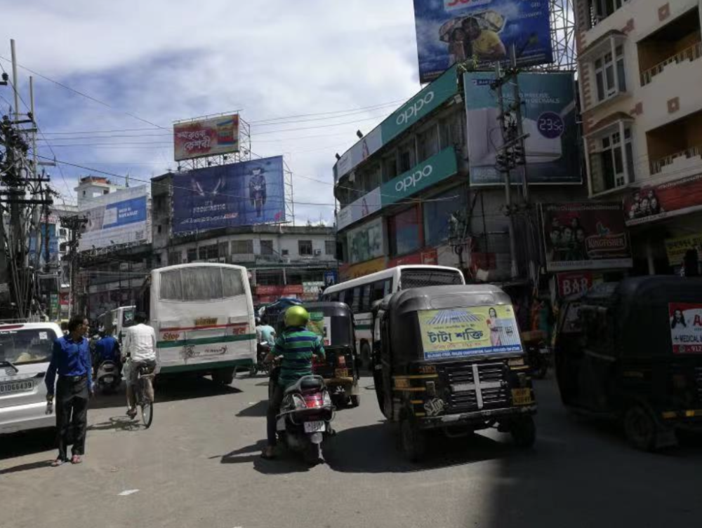
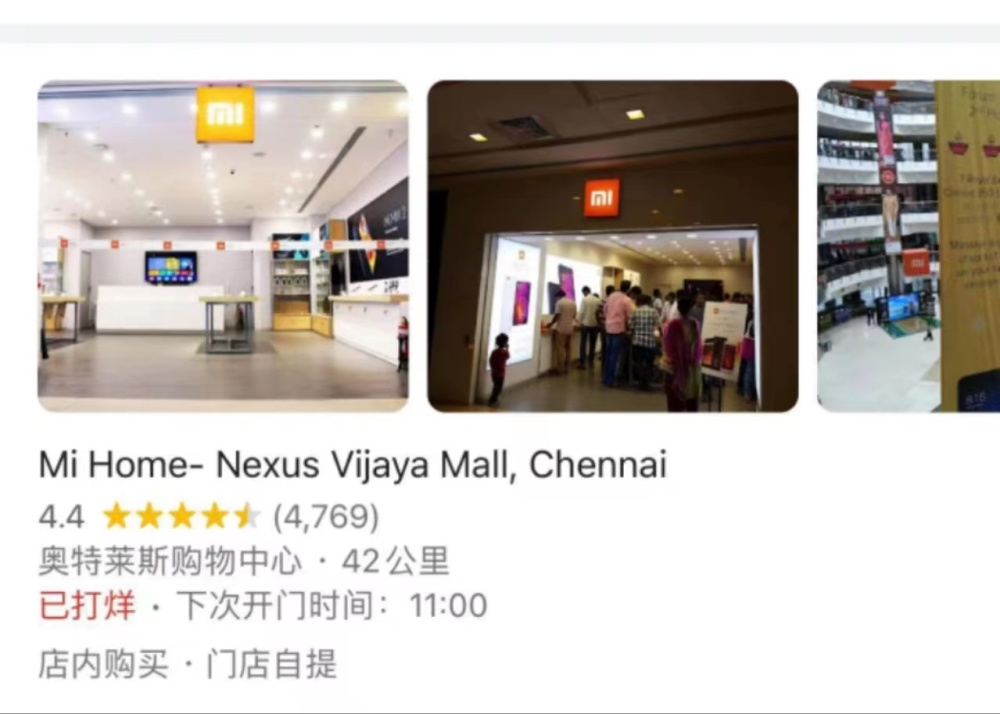
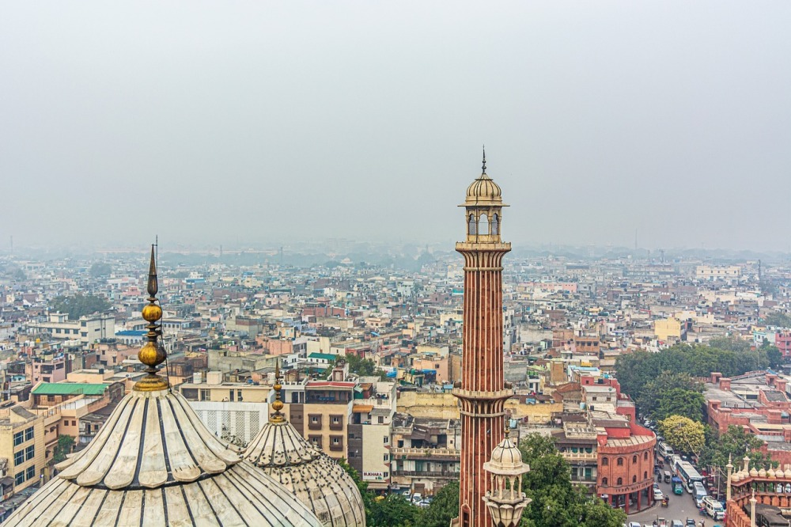

# 中国手机军团印度十年浮沉记：一颗“甜枣”，一记重拳

本文来源：时代财经 作者：王婷

_开在印度的国产品牌手机店。图源：受访者_

2014年，印度人萨希尔拥有了自己的第一台智能手机，价格约6000卢比（约合人民币524元），这款手机出自中国厂商小米。

他记得，当时一款三星智能手机 Galaxy S
3的价格是2.8万卢比（约合人民币2447元），“太贵了，大家都买不起”。而本土品牌基本是贴牌机，他也不想买。

次年，小米集团创始人雷军操着湖北口音，用英语问候印度米粉“Are you
OK”的视频传遍了中文互联网，此时的小米、OPPO、vivo刚刚打入印度市场；十年过去，这三家中国厂商一齐攻下印度六成以上的智能机市场份额，也让智能机在印度真正普及。

2013年，印度手机销量为2.57亿部，其中功能机占比78%；到2022年，手机市场整体出货量中，功能机占比缩减至28%，与智能机此消彼长（数据来源：IDC）。

如今，印度已经成为全球第二大智能手机市场、全球第二大手机制造国，三星、苹果也纷纷加强对印度市场的布局，面对激烈竞争、日趋紧张的环境，中国手机厂商迎来前所未有的挑战。

“最高峰时，我们公司在印度有20多个中国员工，现在不到五个。”作为中国手机品牌代理公司的一员，陈伟无奈地说。

当前，印度对中国公民实施严格的签证审批，陈伟很多同行无法赴印度工作，同时，中国手机制造商对印度市场的拓展也在放缓，投入的人力变少，满大街的中国智能机广告正在快速减少。

**拿着智能手机，回头率超60%**

印度智能手机的普及步伐慢于中国及全球市场。根据市场研究机构尼尔森2013年2月的调查报告，智能手机在中国、印度的普及率分别是66%、10%。而2012年，全球手机55.1%的出货量由智能手机贡献（数据来源：IDC）。

在过去近20年来经常往返中印两国的黄欧深有体悟。2005年，他第一次去印度，发现只有少数人手里拿着功能机，还没出现智能手机。到2008年，功能机已经在中产阶级和普通民众中普及了，诺基亚是绝对主流，而智能机只有少数富人用得起。

“2008年我去印度时，手上拿着智能机，不敢吹百分百回头率，60%以上绝对是有的。”智能手机没有按键、屏幕很大，非常显眼。黄欧只在酒店看到有人用智能机，在街上鲜少看到。

他还记得，彼时印度智能机市场，绝大部分属于三星，直到后来Micromax、Karbonn、Spice等印度本土品牌切入智能手机赛道。

_印度街头景色
图源：受访者_

由于价格低廉，印度本土品牌智能机销量迅速增长，形成了一定的智能机市场规模。2013年全年，印度智能手机销量为4400万部，同比增长近3倍。

同年，工程师石航去印度钢厂出差进行技术交流时发现，那里的工程师们都用上了智能手机，他们属于中产阶级。“当时厂里工人还买不起智能手机。”他告诉时代财经。

从市场份额看，2013年第三季度，在印度智能手机出货量中，三星占比26%，Micromax、Karbonn、Spice分别占比14%、9%、5%，苹果占2%（数据来源：IDC）。但它们都未能让智能机在普通民众中真正普及。

三星手机价格偏高，以2014年为例，其推出的Galaxy S4、Galaxy Note 4在中国的首发价均超过5000元，中低端机型Galaxy Grand
2在印度首发价为22999卢比，约合人民币2015元。

印度本土品牌竞争力有限，因为它们的智能机产品当时主要来自中国大陆代工企业，因此被后来进入印度市场的中国品牌迅速淘汰，中国品牌接过了印度智能手机普及的大旗。

**教会了“他们”怎么做手机生意**

2014年，OPPO、小米、vivo相继进入印度。仅仅两年过后，中国厂商在印度智能手机市场的份额便达到46%，印度本土品牌市场份额下滑至19%。

陈伟是这一进程的见证者，也是亲历者。他在2015年被派到印度，担任某国产手机品牌代理公司的管理人员，负责班加罗尔及周边城市区域的团队建设以及销售目标的达成。

最初，陈伟和中国籍、印度籍同事挤在一个手机专卖店楼上，办公空间100多平米，很多人没有工位。陈伟记得，那时候，公司每个月在班加罗尔所属卡纳塔克邦的手机销量才两三千台。

班加罗尔号称“亚洲硅谷”，在陈伟印象中，这里在印度的地位相当于深圳之于中国，但城市建设水平仅相当于25年前的中国四线城市。

他说，在印度，由于合同履约率很差，公司先和行业内的印度本土资金平台合作，按照现货现款模式交易，资金平台再出货给零售商，以降低资金风险。

对零售商，陈伟公司主要提供物料、指派销售人员入驻零售商店，也对接店内形象布置工作，没有资金往来，这与国内的情况大不相同。

_印度金奈的小米门店
图源：地图App截图_

短短两年时间，陈伟和同事将手机推广到卡纳塔克邦3000余家店内。这些店以夫妻店为主，同时也销售其他品牌手机，因此铺货成本不高。

该公司也很快在卡纳塔克邦建立经销体系，即将卡纳塔克邦分为多个大区，在各个大区的核心城市设立分公司，如果有的大区跨度较大，也会在核心城市之外建设小仓库或者办公室，同时也建设了总部大楼。

“在市场竞争中，时间成本是很高的，只能用资金投入去换。”陈伟说，在最高峰期，公司在卡纳塔克邦销售条线投入的人力就超过3000人，其中20多个来自中国，其余全是印度本地招聘而来。

经过三年市场拓展，到2017年，陈伟公司的手机月销量增长至超过10万台。智能手机也在印度市场迅猛普及，同年总出货量达到1.24亿台（数据来源：IDC）。

OPPO印度销售体系的管理人员叶晴对时代财经谈到，中国手机厂商、代理商教会了当地渠道商与零售商如何做手机生意，如今受到政策影响，未来中国代理商却存在被本地渠道商代替的风险。

**很多人的第一台智能机是中国造**

在印度，除了在渠道建设上投入人力，中国手机厂商在品牌建设、市场营销上也是大手笔。

黄欧2014年没去印度，当他2015年再度赴印时，发现中国手机品牌的广告已经铺天盖地，遍及小店门口和大街上，其中有不少当地明星代言的身影。

陈伟说，公司在空中、地面全方位广告轰炸，手机厂商会为代理公司提供补贴，也会找当地人调研，评估哪位明星更有影响力、更适合品牌调性，从而选择品牌代言人，甚至还赞助了印度人喜欢的板球联赛。

据印度《经济时报》2017年初报道，为争夺印度手机市场，中国厂商OPPO和vivo在年内投入高达220亿卢比（约合人民币23.6亿元）的营销费用，碾压韩国和日本竞争对手。

在市场营销过程中，中国手机品牌也培育了消费群体，完成了市场教育。陈伟说，“当时大部分人处在从功能机转向智能机的阶段，对参数没什么概念，品牌方宣传什么，我们就引导什么。”

靠着旷日持久的营销、全新的设计风格，中国手机品牌吸引了大量印度年轻人。陈伟说，公司所代理的手机品牌定位也是面向学生和白领阶层的。

2015年，黄欧发现，印度大学生也开始慢慢用上智能手机了，到了2017年，大学生几乎人手一部智能手机，有的家庭经济拮据，还会借钱给孩子买手机。

曾为OPPO、华为，以及通信企业做咨询的黄欧认为，2015年是一个里程碑，中国手机在印度市场高歌猛进，智能手机不再是印度富人和中产阶层的专属。

在2016年一份报告中，IDC市场分析师Jaipal
Singh指出，“与其他手机相比，（印度）人们之所以愿意选择中国智能手机有几个原因：高质量、网上零售折扣幅度大、低价高配，100至300美元价位的手机更是如此。”

萨希尔也认为，中国品牌在印度智能机普及进程中发挥了重要作用。他说，很多印度人的第一部智能手机是中国品牌的，他至少买过2台小米手机、一台Oneplus。

2019年底，石航再次前往印度钢厂进行技术交流，他发现，“我在钢厂做设备调试，车间工人都用上了智能手机，大部分都是中国品牌。”

Counterpoint Research 报告显示，到2021年，印度智能手机普及率达到61%。

**在印度建厂，在印度销售**

在印度，中国手机厂商做的不仅是渠道、销售，还有后端的生产制造。

OPPO、小米、vivo在印度均有设厂。OPPO于2016年建在印度诺伊达建立制造工厂。据OPPO印度官网2021年的一篇文章，这个工厂占地110英亩，约为44.5万平方米，旺季时每月手机产量超过600多万台，员工超1万名。

_诺伊达位于印度首都新德里附近 图为新德里 图源：pixabay_

文章还提到，这家工厂不仅组装手机，还可以在6.25秒内印刷完成一个电路板组件或PCBA（印制电路板），引领印度智能手机制造走向前沿。

相较而言，小米在印度的生产规模更大。2019年，小米印度负责人表示，集团在印度拥有了第7家工厂，可提供超2万个岗位，在印度销售的小米智能手机有99%以上在印度本地生产。

中国厂商在印度建厂，是基于市场、政策等多方面考量。在当地建厂，一方面有利于产品交付，另一方面可以减少关税，要知道从2017年到2018年，印度手机整机进口关税税率由10％提升至15％，再到20％。

2023年，印度政府官员公开发言显示，当前印度使用的手机99%由国内生产，十年前，99%为进口产品。

2019年，印度已成为仅次于中国的世界第二大手机制造国。同年，小米、vivo、OPPO、realme在印度合计出货9990万台智能手机，占印度智能机总出货量比例65.5%（数据来源：IDC）。2022年，印度生产了约2亿部智能手机，是2014年组装数量的10倍（数据来源：Counterpoint）。

近年来，印度扶持本土电子制造业，对中国厂商提出更严格的要求。且受地缘政治、新冠疫情多重因素影响，中国手机品牌在印度的处境迎来分水岭，生存环境恶化。

今年5月，印度总理莫迪批准了扶持印度本土电子制造业发展的生产相关激励计划（PLI）2.0总体方案，预算支出约1700亿卢比（约合145亿元人民币）。据此前媒体报道，印度政府提出要求，中国公司如要建零部件工厂，需要印度资本在合资公司中持股51%。

据印度《经济时报》6月报道，小米、OPPO、realme和vivo等中国公司都参加了一个会议，会议上，除了对高管国籍、资本构成提出要求，还指示中国公司指定印度合作制造商。

据多家媒体报道，2021年以来，大批在印中资企业遭到税务调查，包括小米、OPPO、vivo。2022年，印度财政部门以非法向国外汇款为由，扣押小米48亿元。

今年6月，印度执法局（ED）发布文件称，已向小米技术印度私人有限公司、小米印度分公司、部分高管及花旗等三家银行发出通知，此次通知意味着前述被扣押的48亿元或被正式没收。

**中国厂商仍未到告别时刻**

由于签证难办，陈伟公司两位负责印度业务的同事目前无法赶赴印度工作，只能远程连线，很多同行也面临相同的窘境。

在印度，不仅中国手机厂商、代理商的中国员工较往年明显减少，印度籍员工同样如此。陈伟说，公司在印度的销售体系只剩2000人左右，往年最高峰时超过3000人。

他认为，这一方面是因为全球手机行业不景气，中国手机厂商“卷不动了”，另一方面，也跟遭到调查、罚款有关。在公司调派下，他已于疫情期间回国。

在印度的中国留学生对时代财经表示，现在街上中国手机品牌的广告也明显比往年少了。

2019年曾有报道称，OPPO将扩大印度诺伊达工厂产能，计划在2020年产量翻倍。但从2021年该工厂产能看，扩产计划并未如计划开展。

不过，从目前情况看，中国手机厂商也远未到告别印度市场的时候。即便小米、realme、vivo出货量分别同比下滑26%、14%和2%，但在2022年印度智能手机市场总出货量中，中国品牌手机占比仍超过6成（数据来源：IDC）。

短期内，印度本土智能机品牌想要取代中国品牌也很难。在印度智能机市场，Micromax、Lava等本土品牌早已排在榜单前五外，而前五名占据了近九成份额。

另外，印度本土手机产业链成熟度有限。根据印度手机和电子协会（ICEA）的数据，目前构成印度手机的部件中，只有15%到20%在印度制造的。

叶晴认为，印度人口规模庞大，对中国很多企业还是有吸引力。“整体来说，印度市场确实不错，但经商环境还是不太好，更适合轻资产运营。”

(文中萨希尔、陈伟、黄欧、叶晴、石航均为化名)

