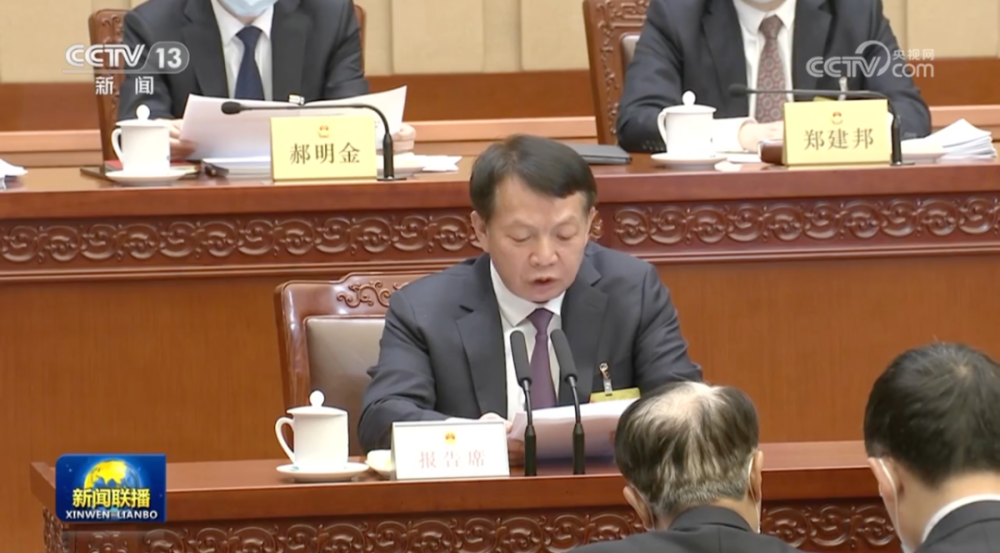

# 事关这一特殊力量！国安部部长陈一新，有个新部署

**撰文 | 余晖**

今天政知君要说的，与隐蔽战线有关。

据《法治日报》7月11日报道，近日，国家安全部党委以视频会议形式举办“新时代国安大讲堂”，专题学习新修订的反间谍法。

国家安全部党委书记、部长陈一新出席会议并讲话。

7月11日，《民主与法制》周刊刊发了陈一新的署名文章，聚焦的也是《反间谍法》。

**面临的复杂程度、艰巨程度明显加大**

今年5月30日，中共中央总书记、国家主席、中央军委主席、中央国家安全委员会主席习近平主持召开了二十届中央国家安全委员会第一次会议。

中共中央政治局常委、中央国家安全委员会副主席李强、赵乐际、蔡奇出席会议。

这次会议分析了当前的国家安全形势， **“当前我们所面临的国家安全问题的复杂程度、艰巨程度明显加大”。**

会议要求，要坚持底线思维和极限思维， **准备经受风高浪急甚至惊涛骇浪的重大考验。**

在这次会议召开之前，今年4月24日，十四届全国人大常委会第二次会议开幕，这次会议听取了关于反间谍法修订草案审议结果的报告。

新闻画面显示，作报告的是全国人大宪法和法律委员会副主任委员王洪祥。

王洪祥曾在最高检、福建工作，2019年任中央政法委副秘书长，今年3月任全国人大宪法和法律委员会副主任委员。

4月26日，十四届全国人大常委会第二次会议闭幕，会议表决通过了新修订的反间谍法。

新修订的《反间谍法》，自2023年7月1日起施行。

**国家安全机关是反间谍工作的主管机关**

《反间谍法》明确， **国家安全机关是反间谍工作的主管机关。** 公安、保密等有关部门和军队有关部门按照职责分工，密切配合，加强协调，依法做好有关工作。

国家安全部，是1983年组建的。

国家安全部新闻办在2021年曾对《法治日报》介绍，上世纪八十年代初，党中央深刻分析改革开放后我国面临的国家安全形势，决定将原中共中央调查部与公安部负责反间谍及相关工作的机构合并，组建统一的、强有力的国家安全部门。

1983年7月1日，国家安全部成立大会在北京隆重召开。此后，各省、自治区、直辖市和新疆生产建设兵团分批次组建了省级国家安全厅(局)。

**上述报道提到，国家安全机关是反间谍工作的主管机关，是重要的国家情报工作机构，同时承担维护政治安全、海外安全保卫等职能** ，严格依照国家安全法、
**反间谍法** 、国家情报法和人民警察法等法律法规行使权力、履行职责。

此次修订的《反间谍法》有何重要之处？

在国家安全部党委近日举行的“新时代国安大讲堂”上，国家安全部党委书记、部长陈一新提到，“
**修订反间谍法充分体现了以习近平同志为核心的党中央对国家安全工作的高度重视，具有历史性、标志性意义** ”。

陈一新说：

反间谍法是党的 **二十大后国家安全领域的第一部专门立法** ，是 **新一届全国人大常委会审议通过的第一部法律**
，是今年立法法修改后第一部全面接受合宪性审查的法律，是去年人大立法计划中第一部完成的立法，是 **我国修法史上第一部全量修改的法律**
，成果来之不易，意义重大深远。

**抓紧启动这项工作**

政知君注意到，新修订的《反间谍法》有不少亮点，包括明确“坚持党中央集中统一领导”反间谍工作；建立国家层面的反间谍工作协调机制；增加利用网络实施间谍行为的规定等。

在新修订的《反间谍法》施行之后，国家安全机关将有新动作。

在“新时代国安大讲堂”上，陈一新对国家安全机关学习宣传贯彻反间谍法提出要求。

他提到， **要配套立法，抓紧启动《反间谍法实施细则》修订工作，及时制定部门规章**
；要规范执法，一体加强执法队伍、执法规范、执法硬件建设；要加强审核，严把政治关、事实关、法律关、程序关，确保每起案件都经得起法律和历史的检验。

这是官方首次披露，将启动《反间谍法实施细则》修订工作。

现行的《反间谍法实施细则》是2017年公布实施的。

2017年，时任国务院总理李克强签署第692号国务院令，公布《中华人民共和国反间谍法实施细则》，细则中提到，国家安全机关负责本细则的实施。

2017年的细则施行后，1994年6月4日国务院发布的《中华人民共和国国家安全法实施细则》废止。

**“反间谍工作协调机制”**

除了出席“新时代国安大讲堂”之外，7月11日，《民主与法制》周刊刊发了陈一新的署名文章，《认真学习贯彻〈反间谍法〉，全面提升国家安全工作法治化水平》。

文章共分为四部分，包括全面把握修订《反间谍法》的重大意义、主要精神、实践要求，以及全面提升国家安全工作法治化水平。

几个细节值得关注。

第一，文章中提到了“反间谍工作协调机制”。

《反间谍法》明确，国家建立“反间谍工作协调机制”。

此前，全国人大常委会法工委刑法室主任王爱立曾撰文谈到， **建立国家层面的反间谍工作协调机制，“是加强党中央集中统一领导反间谍工作的制度设计”。**

陈一新在文章中也提到了上述协调机制。

陈一新写道，这次修法明确“国家建立反间谍工作协调机制”，
**统筹协调反间谍工作中的重大事项，研究、解决反间谍工作中的重大问题，“进一步完善中国特色反间谍工作顶层设计，更好运用制度优势打好新时代新征程反间谍斗争”。**

第二，上述文章对目前的间谍活动有个最新判断。

“近年来，各类间谍活动的主体更加复杂、领域更加广泛、目标更加多元、手法更加隐蔽、危害更加严重”。

第三，文章对接下来隐蔽战线的工作有了最新部署，他要求，“把维护政治安全放在第一位”。

陈一新在文章中写道，要牢牢把握维护政治安全这一首要任务。

“政治安全的核心是政权安全和制度安全，最根本的就是维护中国共产党的领导和执政地位、维护中国特色社会主义制度。”

**隐蔽战线作为巩固和捍卫党的执政地位的特殊力量，维护国家主权、安全、发展利益的特殊力量，坚持和发展中国特色社会主义的特殊力量，必须把维护政治安全放在第一位，严厉打击境外间谍情报机关和敌对势力危害政治安全的活动**
，努力铲除境内影响政治安全的土壤，坚定维护国家政权安全、制度安全、意识形态安全。

他还写道，必须从政治安全高度统筹各领域安全。

“提高政治判断力、政治领悟力、政治执行力， **严密防范其他领域安全风险与政治安全问题交织、向政治安全领域传导** ，全方位筑牢国家安全屏障。”

文章还提到了不少内容，包括：

探索新形势下专门工作与群众路线相结合的新内涵、新形式、新办法， **充分发挥人民群众积极性、主动性、创造性**
，筑牢国家安全人民防线，打好反间防谍人民战争。

要严把证据关，坚持以事实为依据、以法律为准绳，严格规范收集、固定、使用证据， **确保证据确实充分、案件办成铁案。**

要严把权责关，既要强化有权必有责的意识，严禁超越职权、滥用职权，又要树牢尊重和保障人权的理念，依法保障个人和组织的合法权益。

**及时发现间谍活动线索，严厉打击间谍违法犯罪行为** ，坚决维护国家主权、安全、发展利益。

把握大数据、区块链、人工智能等对国家安全工作带来的颠覆性特征，以科技创新应对新形势下反间谍斗争的“险”与“难”，提升运用科学技术开展反间防谍、防范化解风险的效能。

**资料｜新华社 法治日报 《民主与法制》周刊 中国人大网 人民日报等**

**【版权声明】本文著作权归政知新媒体独家所有，未经授权，不得转载。**

