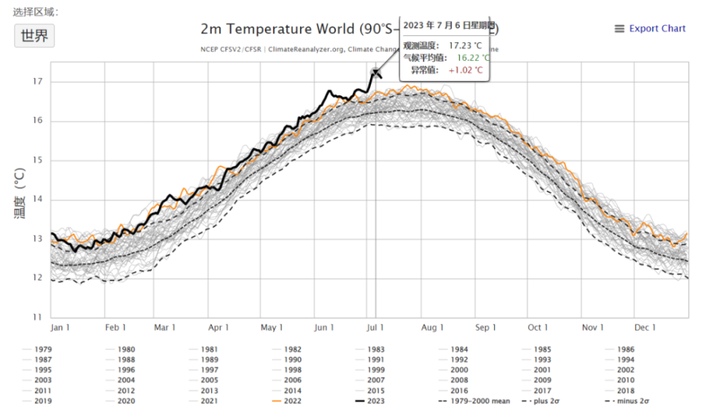

# 地球最热一天

_美国缅因大学气候研究所制作的网站Climate
Reanalyzer展示着7月6日地球平均气温地图。_

**作者｜李 强**

**编辑｜陈 卓**

又一次见证历史。7月6日的人类，熬过了地球上最热的一天。

这一天，这颗人类赖以生存的星球平均气温达到了17.23℃——这是全球各地，包括海洋与两极的温度均值。上一次，人们经历过的地球最高平均气温是17.18℃，出现在7月5日和7月4日。再上一次，是7月3日，17.01℃。实际上，自1979年有记录以来，仅有的平均气温超过17℃以上的日子，都出现在今年7月，除了上面的几天，还有7月7日的17.20℃、7月8日的17.17℃和7月9日的17.11℃。

这些经由模型被推算出的数据，展示在美国缅因大学气候研究所制作的Climate
Reanalyzer网站，并非来自官方，但仍被认为是气候变化“最新的里程碑”。新纪录也被哥白尼气候变化服务中心的数据佐证，他们的数据记录追溯到更早的1940年。而基于树木年轮和冰芯推测的以往温度数据，一些科学家认为，我们遇到的“最热一天”可能是12.5万年来地球上最热的一天。

_美国缅因大学气候研究所制作的网站Climate
Reanalyzer展示着1979年以来历年的地球平均气温数据，2023年7月6日的数据是历年来的峰值。_

“我们以前从未见过这样的事情。”哥白尼气候变化服务中心主任卡洛·布翁坦波在接受媒体采访时说，许多有关地球气候的图表都毫不夸张地表明，“我们正处于未知领域”。

那些此前从未出现过的数字背后，隐藏着广泛而巨大的危险。

7月6日这一天，孕育古文明的两河流域酷暑难耐，伊拉克首都巴格达早上9点钟的气温就到了38℃，到12点气温飙升至45℃。伊拉克国家气象局4日前就宣布，热浪会从7月6日这一天开始袭击伊拉克。

像往年夏天一样，伊拉克不出意外地停电了。

每逢这样的夏日，当地的电力供应就到了最紧张的时刻，政府迫不得已采取限电措施，可高温并不会消停。

大地被炙烤，热浪裹挟街道。相对富裕的人家可以花钱购买私人发电机，或驱车前往山区避暑；其他人家的空调、风扇都停止运转。当天，一名住在巴格达的妇女，只好在停电时拿起纸张，给赤身裸体的孩子扇风；一些男人选择一头扎进底格里斯河，躲避地面的高温热浪。

一名只身在外的出租车司机担心生病的母亲，停电期间，每隔1小时就往家里打一通电话，以确定母亲的身体状况。近年来，难缠的高温充满威胁，断电的生活令人窒息。当晚，伊拉克的许多人连睡个好觉都困难——这里夜间温度也在40℃左右。

_当地时间7月5日，伊拉克南部济卡尔省的奇巴伊什，一名男子在干涸的沼泽里展示一条鱼的骨架。视觉中国供图_

从全球平均气温地图上看，7月6日这一天，地球的三分之二都被炙烤成鲜艳的红色，很容易从中找到伊拉克的位置，那是北半球少有的呈现白色的区域，像是烤得焦红的土地上渗出了一撮盐巴。

那代表着地球上最炎热的地方，平均气温往往超过40℃。这一天，非洲撒哈拉沙漠也是如此。

阿尔及利亚的城市阿德拉尔当天的气温异常高，夜间气温也从未低于39.6℃。气候学家马克西米利亚诺·埃雷拉表示，这是非洲有史以来最热的夜间气温。拥有空调的人有机会安度夏日，但这里只有5.6%的人用得起空调。实际上，这个世界上仍有约7.5亿人连电都用不上。

在有“撒哈拉沙漠门户”之称的马里共和国城市通布图，一个50岁的男人从未见过这般热的夜晚，凉爽无处觅，他开始认真考虑是否要离开家乡。马里邻国一个卖菜的农民发现，自己本就微薄的收入更少了。他从早上6时开始工作，最迟忙到中午，之后不得不躲进用木杆和布片搭建起的庇护所，直到下午5时或更晚才慢慢有顾客光临。

北半球的夏季，并非只有两河流域和撒哈拉遭受着极端高温的威胁。

东欧、阿拉伯半岛、中亚、东南亚、东亚、北美洲都被长久地笼罩在热浪翻滚的苍穹之下。很多地方的新闻报道都在用“史无前例”“有史以来”“创纪录”这样的词汇，形容高温。但用的次数多了，曾经史无前例的事，也渐渐成为一种常态。

_当地时间7月10日，日本东京，一名安保人员走过水雾系统。视觉中国供图_

当天，中国的最高气温出现在华北平原上，一个叫平山的小城，43.7℃；石家庄则以41.9℃的气温打破1951年来同期最高记录。中国气象局当天12时启动重大气象灾害（高温）Ⅳ级应急响应状态。

这一天，北京南郊观象台观测到41℃的高温，这是此地今年第5次超过40℃的高温天。这样的日子自有记录以来只出现过11次，今年就占了一半，是过往72年里是绝无仅有的。

正午，一位头发花白的北京出租车司机开着空调行驶在三环路上，乘客却误以为空调没开，司机也热得冒汗。北京急救中心的数据显示，近期日均中暑量是去年同期的5倍左右。一位家中除了电灯泡没有任何电器的七旬老人，觉得这个夏天实在太热，终于决定买个电风扇，以防中暑。

中暑，不过是高温天气造成的最显而易见的伤害，热射病更可怕。就在7月2日，一名北京导游倒在颐和园，抢救无效离世，当天就被确认死于热射病。很多研究都在表明，高温天气下，日均气温每升高1℃，不少疾病都会恶化，甚至因此丧命。比如，有研究称，在北京的夏季，日平均气温每升高1℃，呼吸系统疾病死亡量增加25.7%。

自杀发生率、糖尿病死亡率、心脑血管疾病急诊人次、心理疾病日就诊人次、腹泻发病数、精神分裂症住院人数等，都与气温升高存在显著的正相关。在美国德克萨斯州，入夏以来已至少有13人死于高温，由于酷热，美国人每年夏天在医疗保健上的额外花费高达10亿美元。

就连监狱里的死亡情况，也会随着气温的升高而上升。在一项发表于医学杂志的论文中，作者写道：过去20年，在美国州立和私人监狱，气温每比历史平均水平高10°F（相当于约5.56℃——记者注），夏季死亡率就会上升5.2%。自2001年以来，约有635人因高温在监狱中死去。

在美国德克萨斯州的夏季，一位妇女会选择一天中最热的时候前去探监，只为前夫能够在有空调的探视区得到几个小时的休息。那所监狱的牢房和公共区域并无空调，会面时，她见到丈夫的囚服被汗水浸透了。没有空调，暂时监禁可能会被高温突然“改判”成死刑。

_当地时间7月10日，美国犹他州盐湖城，慢跑者在喷泉旁降温。视觉中国供图_

南半球也在创造一些与气温有关的纪录。7月6日，南半球平均气温为12.62℃，比1979年有记录以来的任何一年的7月6日都要温暖，比平均值异常高出1.05℃，而南极的平均气温比平均值异常高出3.70℃。

要知道，在南半球，现在是冬季，寒冷才是主角。但澳大利亚正经历着一个温暖的冬天，因6月入冬后降雪不足，新南威尔士州雪山的斯雷德博度假村在社交媒体上宣布，“本周末将禁止滑雪或单板滑雪”。

这是该雪场今冬首个周末的滑雪活动，订好酒店和雪场的门票滑雪客不得已放弃了行程。也许南半球异常温暖的初冬，早就预示了北半球又一个“有史以来最热的夏天”。

7月4日，WMO（世界气象组织）发布声明称，厄尔尼诺现象7年来首次在热带太平洋出现。WMO秘书长佩特里·塔拉斯表示，“厄尔尼诺现象的出现将大大增加打破温度记录的可能，并有可能在世界许多地区和海洋引发更极端的高温。”

不少科学家都认为，今年前所未有的极端高温是人类引起的全球变暖与厄尔尼诺现象等自然现象叠加造成的。

尽管全球变暖和厄尔尼诺现象并不直接导致灾害性事件，但它们被认为加剧了灾害性事件的严重程度，比如干旱、热浪、洪水、野火、饥荒、瘟疫等。

7月6日，有媒体报道了进一步恶化的加拿大野火。异常活跃的野火烧毁880万公顷的土地，打破了1989年创下的760万公顷森林被烧焦的纪录。包括猫头鹰、山猫、野兔在内的许多动物的栖息地被破坏，它们有可能流离失所或死亡，甚至灭绝。

野火产生着源源不断的烟雾，让多伦多的空气质量一度是世界上最差的。烟雾继续扩散，将美国东部也笼罩其中，又掠过大西洋，到达南欧和不列颠群岛，使至少1亿人生活在被污染的空气之中。

在酷热的墨西哥，一些地方的气温也创下历史新高，已经至少有112人在高温热浪中死亡，一些学校宣布提前结束在校课程，或恢复新冠大流行时的在线教学措施，以免学生成为极端高温的受害者；至少有1000头牛因干旱而死亡，牧场主担心若旱情持续，死亡数据还会上升。

而干旱，在美国已至少波及1.62亿人，有22.6%的土地困于高温干旱，建筑工人与农民往往是最严重的受害者。若算经济账，极端高温每年给美国造成的损失约1000亿美元，而自20世纪90年代以来，全球变暖引发的高温热浪让世界经济损失了数万亿美元。

对远离地表的高空的飞行者来说，也不会有什么好消息。地球变暖正在使一些地方的晴空湍流变得越来越严重。

在北大西洋上空（世界上最繁忙的航线之一），一个典型地点的严重湍流年度总持续时间从1979年的17.7小时增加到2020年的27.4小时，中度湍流从70.0小时跃升至96.1小时，轻度湍流从466.5小时增至546.8小时。研究人员预计，未来，这种情况还会因气候变化而加剧。

这将给飞行员带来新的挑战。在湍流中的飞行时间每增加一分钟，飞机的颠簸与磨损就会增加，乘客的安全风险也将增加。

对人类来说，陆地上的高温容易被感知，海洋世界的异常却往往被忽视。

海洋占据着地球面积的三分之二，原本它在拉低地球平均气温上扮演着重要的角色。如果抛开海洋的数据，7月6日陆地平均气温会远比17.23℃高得多。但这一次相反，海洋在拉升地球平均气温这件事上，也扮演着很重要的角色。

自4月以来，海洋的平均气温数值一直处于有记录以来最高值的异常状态，并首次突破了21℃。在北大西洋，不列颠群岛附近的海水温度比正常水平要高出4-5℃。科学家们对海水变暖的程度感到震惊，因为这是工业化以来的170年间最温暖的一次。通常，八九月份才是北大西洋海水最温暖的时候。

这样的水温对人类而言，甚至算得上凉爽，可能还想跳进去，洗掉浑身的汗渍。

但按照美国国家海洋和大气管理局（以下简称“NOAA”）对海洋热浪的定义与分级，“极端”海洋热浪已然形成，北大西洋局部地区甚至已达到最高级别——“超级极端”。

NOAA6月的报告显示，当时，地球上40%的海洋正经历着海洋热浪，广泛分布在赤道太平洋、东北太平洋、西北太平洋、热带北大西洋、东北大西洋、西南太平洋以及马达加斯加东南部的西印度洋。到9月，将扩大到50%的海洋。

这对海洋生物和人类来说，都不是一件好事。

前些年的海洋热浪，重创过海洋生态和渔业，曾使阿拉斯加湾的太平洋鳕鱼数量减少过70%，10万吨大西洋鲑鱼、银鲑鱼和鳟鱼死亡，西澳大利亚州的扇贝、蓝梭子蟹、鲍鱼和太平洋的牡蛎，都曾出现过大规模死亡和繁殖失败的现象。

通常在海底固定不动的底栖无脊椎动物，在海洋热浪期间更难免遭受致命一击。

珊瑚是对水温上升非常敏感的物种，水温只需要上升1-2℃，就开始白化。长时间保持异常温暖的状态，珊瑚就会因饥饿、疾病大规模死亡。在过去25年里，随着海洋温度的升高，全球珊瑚疾病的发病率增加了两倍，达到9.92%。按现在的变暖走势，到2100年珊瑚疾病患病率可能会增加到76.8%。

这对无数以珊瑚礁为栖息地的鱼类来说，是个残酷的消息；对以海洋捕捞为生的渔民来说，也是个残酷的消息。

在北冰洋，一些动物同样难逃此劫，比如北极熊。

在北冰洋的边缘海哈德逊湾，相比于去年，今年海冰范围锐减至30%以下的时间提前到6月17日，这是有记录45年来第三早的日子。这意味着，北极熊捕猎海豹的时间缩短了，它们需要用更少的脂肪，撑过更漫长的陆地夏季。自20世纪80年代以来，这里的无冰期延长了近1个月。

这不仅仅与北极熊有关。海冰恰似“地球的空调”，一直是地球降温的利器。但这台空调的马力正越来越小，北极与南极的海冰面积都在减少。有科学家推算，北冰洋的第一个无冰年可能会在本世纪30年代至50年代出现。

7月6日这天，全球海冰面积缩减至今年以来的最低水平——930.6万平方公里。此时，南极洲的海冰正处于生长阶段，但这里的海冰面积，自4月以来，一直维持在历史同期的最低水平，处于持续打破最低纪录的状态。

世界各地的冰川也在加速消失。欧洲冰川拥有量最多的国家瑞士，热浪导致冰川以史无前例的速度融化着。去年，新的融化纪录诞生了，冰量又减少了6%。在中国，冰川保护者在今年6月30日就已为达古冰川17号冰川盖上500㎡的“被子”，以尽力减缓它的消融。

迅速融化的北极冰川正在造成另一个让科学家们担忧的事。来自剑桥大学的研究人员在北极圈内的斯瓦尔巴群岛发现，盛夏里融化的冰川正在释放另一种温室气体甲烷，仅这个群岛每年会释放2000吨。

尽管这在全球温室气体的排放量中只是九牛一毛，但研究人员推测，整个北极的排放量可能相当大。这是一种恶性循环。全球变暖本身，正在造成更多温室气体的排放。

_当地时间7月6日，伊拉克巴格达，一名男子在露天淋浴中降温。视觉中国供图_

这种恶性循环远不止在自然界发生着，更多的恶性循环来自人类社会。

就像极端高温之下，人类不得不更多地使用空调，又难以避免排放更多的温室气体。使用空调所需的能源，大部分是依靠燃烧石油、煤炭、天然气获得。而能源供应部门一直是全球温室气体排放的最大贡献者。

我们正通过让地球变暖的方式，让自己在一个已经变暖的星球上降温。

实际上，地球不是一下子热起来的，是一点点热起来的。

多年以来在全球形成的共识是，自工业革命以来，由于人类活动，温室气体浓度一直在稳步上升，导致全球气温升高。2016年，195个国家签署的《巴黎协定》设定了共同目标：将本世纪全球平均气温较工业化前水平升高幅度限制在2℃之内，最好限制在1.5℃之内。

联合国的最新报告显示：全球平均气温已比工业化前水平高出1.15℃。

当创纪录的“全球平均气温”数据在7月出现时，联合国秘书长安东尼奥·古特雷斯说：“我们现在看到的情况就是气候变化失控的证明。如果我们坚持推迟采取必要的关键措施，我认为我们将陷入灾难性的境地。”

其实在5月，WMO就警告说，在厄尔尼诺现象和温室气体排放的推动下，全球气温可能“飙升至创纪录水平”。而厄尔尼诺现象一般在北半球的冬季逐渐加强，科学家们担心，届时，这将使全球升温超过1.5℃，而2024年很可能成为全球最热的一年。

有科学家推测，已经创下的纪录会在不久后就被刷新，但哪天将成为地球最热的一天，很难确定。

也许是明天，也许是后天，但最好永远保持在7月6日这一天。

**中国青年报·中国青年网出品**

