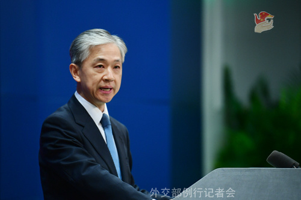

# 外交部：美方利用南海问题挑拨地区国家间关系，别有用心

7月12日，外交部发言人汪文斌主持例行记者会。

有记者提问，7月12日，美国国务院发言人表示，南海仲裁案所谓裁决否定中国在南海的扩张性主张，是终局的，对菲律宾和中国均有拘束力，要求中方停止海上“非法”活动。中方对此有何评论？

_汪文斌
资料图 图源：外交部网站_

汪文斌表示，南海仲裁案所谓裁决严重违反包括《联合国海洋法公约》在内的国际法，是非法的、无效的。中方不接受、不承认该裁决正是维护《联合国海洋法公约》的权威性和完整性。美国作为南海仲裁案的始作俑者和幕后操手，每年在非法裁决出台周年之际大肆渲染炒作，企图以此向中方施压，逼迫中国接受非法裁决，中方对此坚决反对。

汪文斌指出，美国罔顾南海问题的历史经纬和客观事实，违反联合国宪章，曲解包括《联合国海洋法公约》在内的国际海洋法，违背美方作出的在南海主权问题上不持立场的公开承诺，在南海挑事生非，利用南海问题挑拨地区国家间关系，是极其不负责任的，更是别有用心的。中方敦促美方尊重中方在南海的领土主权和海洋权益，停止一切不利于本地区和平稳定的言行和举动，不要做南海和平稳定的麻烦制造者。

汪文斌说，当前，在中国和东盟国家共同努力下，南海局势保持总体稳定，中国将与东盟国家一道，继续致力于维护南海和平稳定，推动本地区繁荣发展。

来源 北京日报客户端 记者 刘柳 编辑 周经纬 流程编辑 刘伟利

记者会更多要点

外交部：中国不接受、不承认南海仲裁案所谓裁决

中方是否已邀请普京出席“一带一路”国际合作高峰论坛？外交部回应

北约峰会公报称中国构成“系统性挑战”，外交部驳斥

