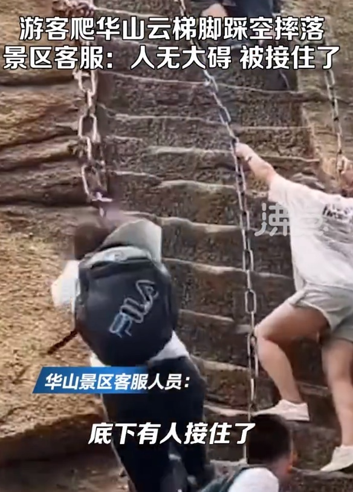

# 女游客爬陕西华山云梯不慎直直摔落，景区：人被接住了，或将关闭云梯

7月12日，据陕西都市快报报道，网传在陕西渭南华山景区，有游客在攀爬云梯时不慎滑落。

网传视频中，游客两只手抓着左边的铁锁，脚下踩空，直直摔落，随后能听到画外音说“人没事”“很健康”。

据拍摄者介绍，该摔落游客被后面的几位男士接住，除了吓得不轻，并无大碍。

根据北京日报都视频援引沸点视频报道，12日下午华山景区客服表示，确有此事，女子无大碍，摔下来后被接住，视频里看着很高，但实际上只有一两米。

另据半岛晨报报道，华山景区对此回应称，后续想要避免这种危险情况发生或将关闭云梯。

**【来源：九派新闻综合陕西都市快报、北京日报都视频、沸点视频、半岛晨报】**

