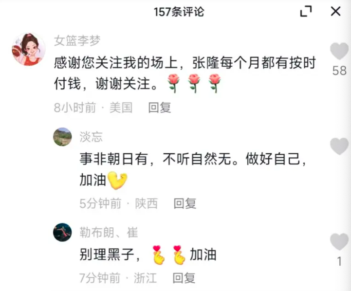
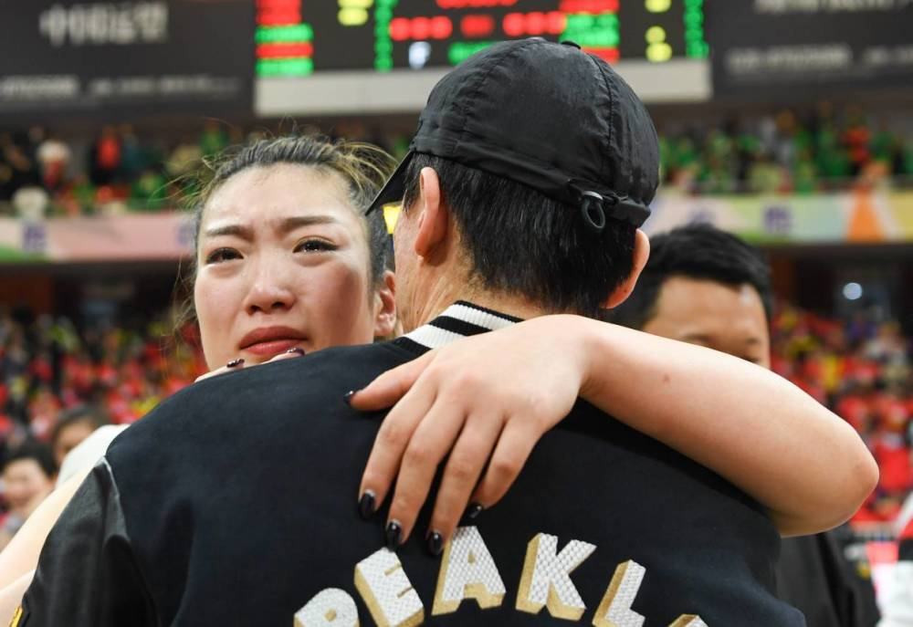
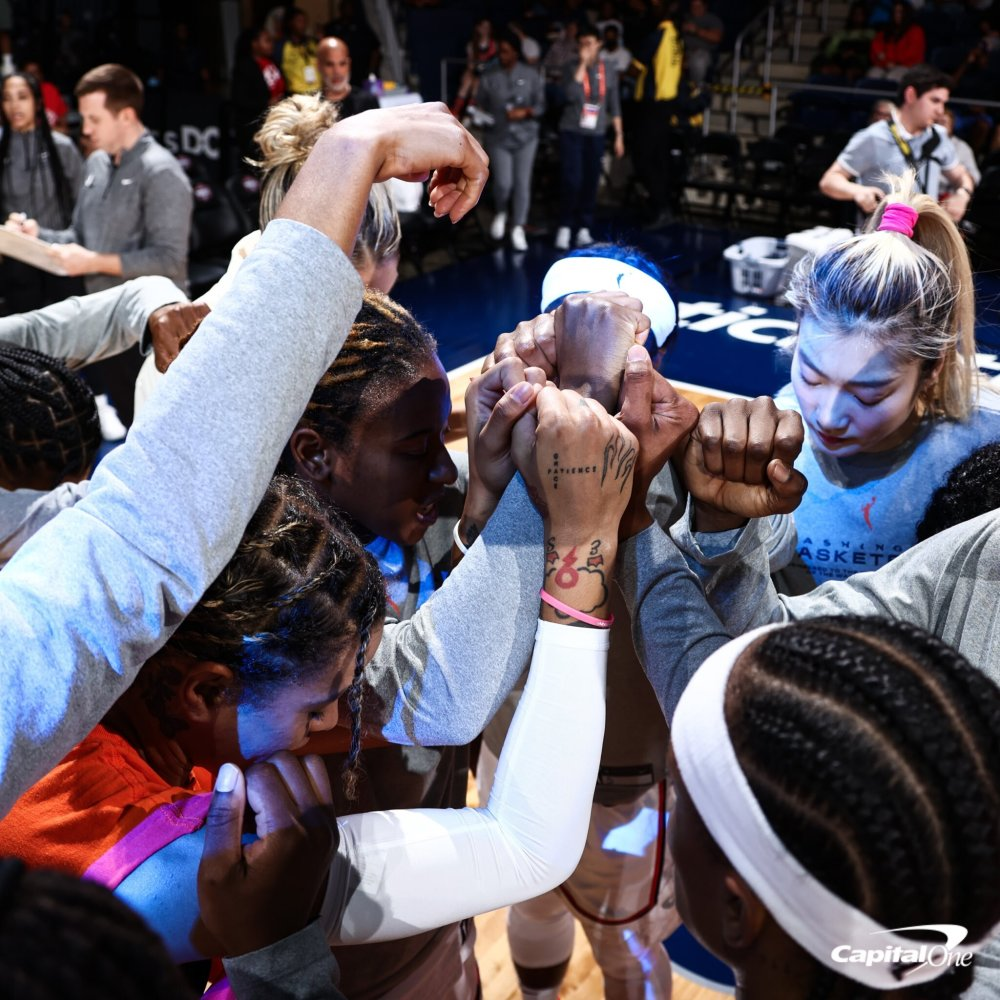
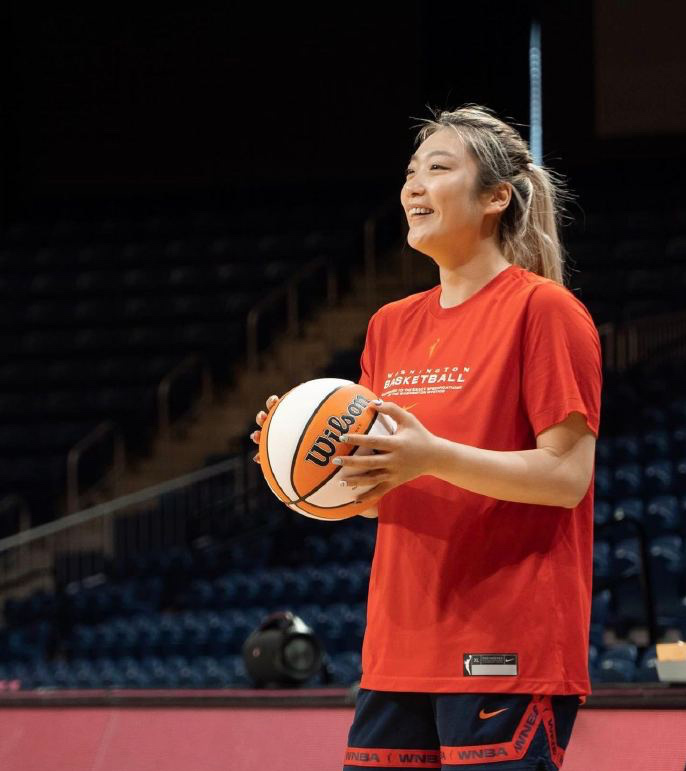

# 女篮李梦被曝插足前领队张隆婚姻后首度回应：他每月按时给前妻付钱

李梦在社媒首度回应张隆拖欠抚养费的问题，这是她卷入小三丑闻之后，第一次对此事正面公开回应，球迷改口一片支持。

“感谢您关注我的场上（表现），张隆每个月都有按时付钱，谢谢关注。”李梦写道。

在李梦本人现身评论区之后，球迷纷纷力挺她，“做好自己，加油。”“别理黑子，加油。”“支持你，梦姐。”……

众所周知，此前张隆前妻因为讨要抚养费，直接将李梦和张隆的感情公之于众，并且控诉她知三当三，破坏自己的家庭。

李梦此番回应，可以说第一次公开了她跟张隆的关系，不过，并没有回应小三的传闻。

值得一提的是，最近张隆前妻依然在网上公开表示继续讨要抚养费，按照李梦的说法，张隆都有按月支付，那么问题可能出在双方对费用的分歧上。张隆前妻曾表示，离婚的时候，两人曾协议抚养费张隆需付一半，并没有约定具体数额，看来，这是纠纷产生的根源。无论如何，还是希望此事能圆满解决。

