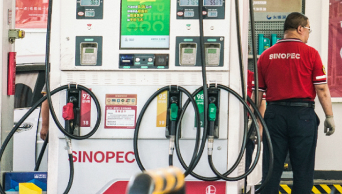
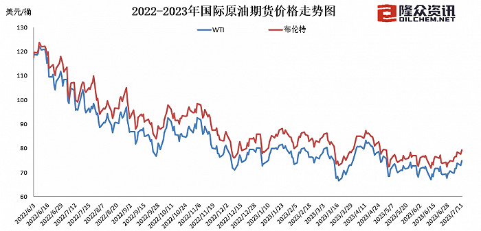

# 成品油价迎来二连涨，加满一箱油多花6.5元

这是成品油价年内第六涨。

_图片来源：界面图库_

界面新闻实习记者 薛昱婷

国内成品油价迎来年内第六涨。

7月12日，国家发改委发布消息称，自24时起，国内汽油价格和柴油价格分别上调155元/吨和150元/吨。折合升价，92号汽油上调0.12元，95号汽油和0号柴油均上调0.13元。

私家车和物流企业的用油成本因此增加。以油箱容量为50升的小型私家车计算，车主们加满一箱油将多花6.5元左右；对满载50吨的大型物流运输车辆而言，平均每行驶100公里，燃油费用增加5.2元左右。

据隆众资讯计算，调价后，全国大多数地区的车柴价格和92号汽油零售限价在7.3-7.5元/升左右。

本轮调价是今年第十四次成品油价格调整，也是年内第六次上调。此次调价过后，今年成品油调价呈现“六涨六跌两搁浅”的格局。

本轮计价周期内，国际原油呈现震荡上涨趋势。

隆众资讯成品油分析师李彦向界面新闻表示，周期内国际油价先抑后扬。虽然美联储7月加息的概率持续增强，市场对欧美经济的担忧情绪仍在；但沙特、俄罗斯进一步减产以及亚洲需求增长预期均释放积极信号。

“整体看，供应趋紧带来的利好超过担忧全球经济增长放缓的利空。”李彦称。

金联创成品油分析师徐朋也指出，几家欧佩克+产油国自愿减产，相当于全球供应量的1.5%，对原油价格形成有力支撑。同时，美国石油和天然气钻井数量连续九周减少，以及美国能源信息署（EIA）显示美国原油库存超预期大幅下降，也令原油期价得到有利提振。

卓创资讯成品油分析师郑明亚称，受沙特自愿延长减产且上调官价等因素影响，市场情绪偏谨慎乐观，支撑美原油站上74.8美元/桶上方。

截至北京时间7月12日凌晨收盘，WTI 8月原油期货报74.83美元/桶，涨2.52%；布伦特8月原油期货报71.84美元/桶，涨2.2%。

据金联创测算，截至7月12日第十个工作日，参考原油品种均价为74.28美元/桶，变化率为2.4%。

_图片来源：隆众资讯_

下一轮成品油调价上调概率较大。

隆众资讯成品油分析师李彦称，沙特坚定推进单独的额外减产，且美国夏季燃油消费高峰期仍在延续，亚洲经济和需求前景也被看好，预计下一轮成品油调价上调的概率较大。

郑明亚指出，后期看市场对美联储7月加息基本消化完毕，且沙特等产量和出口也在降低支撑油价，无核心矛盾下，预计美原油或依然维持70-75美元/桶震荡。

徐朋也表示，考虑到计价周期末期，原油价格涨幅较大，进入新一轮计价周期后，变化率将正向宽幅开端。短期内，国际油价或震荡上涨。

按照当前成品油调价周期测算，下一次调价窗口将在2023年7月26日24时开启。

