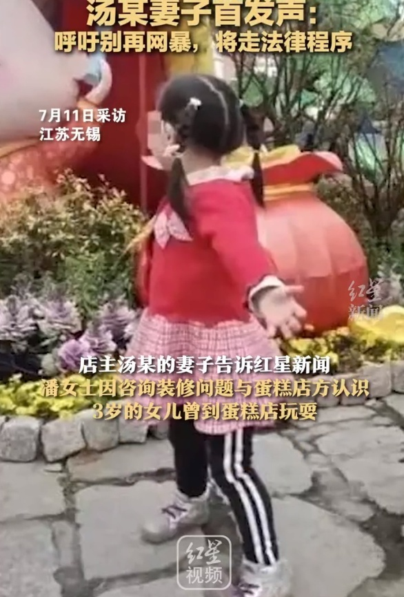
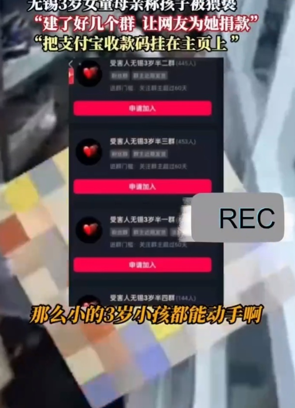
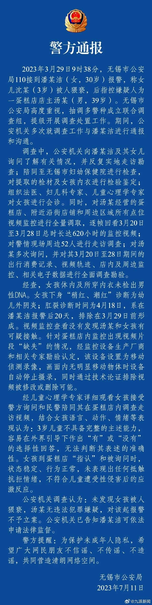

# 无锡3岁女童事件女孩母亲疑建8个群募捐，多名网友在其评论区讨要捐款

近日，无锡的潘女士举报自己3岁女儿被隔壁蛋糕店老板猥亵引发关注。7月11日，无锡警方发布通报，称未发现3岁女童被人猥亵情况，不予立案 。

7月12日，据红星视频报道，蛋糕店老板汤某的妻子称，潘女士因咨询装修问题与蛋糕店方认识。

猥亵幼童是大众无法容忍的犯罪，夫妻二人也无法容忍被人造谣猥亵幼童，名誉受损比店铺收入受影响还要重要。所以夫妻已向法院提起民事诉讼，要求潘女士公开道歉恢复名誉。

“能究刑事责任的话，我们绝对还要追究刑事责任”，店主妻子表示，网络暴力太可怕了，呼吁社会和职能部门要抵制整顿，犯罪成本太低键盘侠不会休止的。最后她还说，现在最大的心愿是尽快能回归平静，平静地过日子做生意，平静地等待法院通知开庭。

另据水母网报道，女孩母亲潘女士疑建群募捐，有网友称其建了八个群，网友为她捐款几十元到几千元不等，一位网友直接捐款6000元。官方通报出来后，潘女士直接解散了群，拉黑了捐款的网友。目前，潘女士未回应此事。

九派新闻查询潘女士社交账号，发现评论区不少网友留言索要捐款。

此外，在警方通报之后，不少网友涌入潘女士社交账号评论区进行指责。

而在警方通报之前，潘女士发布的视频中，带有一家冰淇淋店铺的定位，这家店铺提问区则被“三岁小孩能去吗”等充满恶意的提问刷屏。

此前报道，潘女士发视频称自己3岁女儿被隔壁蛋糕店老板猥亵事发于3月，孩子称下身很痛还伴有红肿。经检查，患有急性外阴炎和肛裂。之后，女孩指认是蛋糕店老板所为。

4月26日，警方出具的不予立案通知书显示，经审查认为没有犯罪事实。

5月8日，涉事蛋糕店老板曾实名否认。他称自家3岁的儿子跟小女孩在一块玩过，但女孩没见过自己，被指认的自家二楼小孩一般也上不去，已向警方提交资料并起诉对方。

7月11日晚间，无锡警方发布通报，未发现3岁女童被人猥亵情况，不予立案 。

**【来源：综合九派新闻、红星视频、水母网、当事人社交账号、网友评论、无锡市公安局】**

