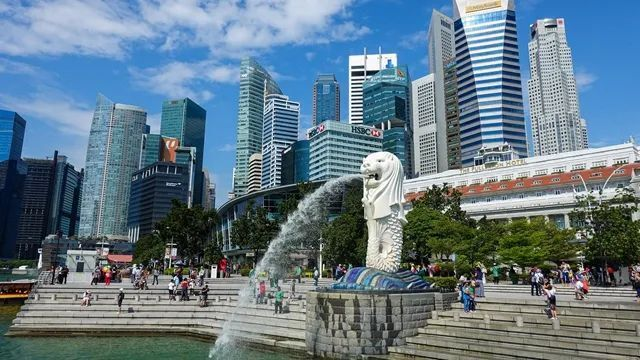

# 新加坡赴华签证太热门甚至要黄牛抢号，正与中国讨论相互免签

新加坡外交部长维文日前表示，新加坡与中国的免签安排还在讨论之中。

4月12日，中国驻新加坡大使孙海燕首先在社交媒体“脸书”上透露：“中方已向新方提出愿就互免签证等便利双方人员往来措施进行商谈，希望双方主管部门尽快谈出成果！”

在2020年3月28日前，中国对新加坡、文莱、日本三国持普通护照的公民实施15天的单方面免签，这一政策至今尚未恢复。因为中新两国交往密切，为了获得中国签证，不少新加坡民众在中国签证申请中心外排起长队，或者在网上“刷号”，才能抢得一个申请的受理号。

上海国际问题研究院亚太研究中心副研究员周士新向第一财经记者表示，互免签证涉及相互的安排，而非一方向另一方做出的让步。他进一步表示，中方提出互免签证，希望能够借此进一步推动双方的密切交流。

**中国提出互免签证**

中国此前对新加坡公民单方面免除签证已经近20年的历史。2003年6月，中国外交部宣布自2003年7月1日起，对持普通护照短期来华的新加坡公民、文莱公民实行免办签证待遇。

外交部当时表示，这一决定是为适应中国经济建设和对外开放不断发展的需要，进一步促进中国与新加坡、文莱人员往来而做出的。这一政策在疫情前，仅在2008年北京奥运会期间暂停过两个月。

今年以来，随着国际疫情形势的好转和中国防疫政策的调整，新加坡人在疫情期间积压已久的出行需求开始释放，特别是随着往返中国和新加坡的航班陆续恢复，有越来越多的新加坡人准备来华出差和旅游。

没有了免签，新加坡人办理中国签证的需求“井喷”式上升。起初，中国签证申请服务中心上午9时开门，但新加坡的申请者从8时就开始在门外排队，有时会达数百人。

为了解决民众在酷暑下排队的问题，5月中国签证申请服务中心取消了现场排队领号，而增加网上预约号的发放。但由于申请人的数量和需求太大，网上又出现了抢号黄牛，抢号成功收取50至80新加坡元（约合269元至430元人民币）。

所以何时能够恢复免签成为了新加坡民众的重大关切，而维文最近的表态，就是在答复新加坡国会议员蔡庆威的询问时做出的。蔡庆威向新加坡外交部询问，能否透露双边免签旅行的讨论进展，以及免签旅行何时能够恢复。

为省下办理签证的时间，有紧急商务出差需求的新加坡人，不惜在回程经转第三地，以通过“144小时过境免签政策”入境中国。这一政策允许包括新加坡在内的53国公民，持有144小时内已确定日期及座位的前往第三国（地区）联程机票，自中国部分口岸过境前往第三国（地区），可免签停留144小时（6天）。

签证难的问题也引起了新加坡政府的关注。新加坡副总理兼财政部长黄循财在5月17日访华期间表示，目前有一些关于推进中新两国相互签证安排的提议，新加坡乐意收到中国的任何建议方案，并会研究和进一步商讨。

7月3日，孙海燕在社交媒体脸书上透露，上半年中国驻新加坡大使馆迎来了赴华签证“爆发式”增长，共办理近9万份签证。

新加坡民众反映，如今签证的申办时间一般在四到五天左右。一家新加坡当地旅行社表示，前往中国的旅游团需求稳健增长，年底前已安排了超过150个相关旅游团，疫情前热门的目的地如北京、上海、福建等，依旧受到新加坡民众的欢迎。

周士新向第一财经记者表示，虽然免签暂未恢复造成了一些不便，但从总体上来看，并没有对两国商贸和人员交往造成实质性阻碍，未来期待两国会在互免签证问题上做出过渡性的安排。

值得注意的是，当前中国对日本和文莱的单方面免签政策均尚未恢复。据日前访华的日本国际贸易促进协会人士透露，在与中方的会谈中，中方也已向日本方面提出了互免签证。

据央视新闻报道，外交部领事司司长吴玺6月21日在出席北京举办的“临甲7号沙龙”专题吹风会时表示，目前，我们还在跟一些国家进行协商，希望有更多的互免签证或签证便利化安排，以便更好地促进中国与世界各国的人员往来。

**中新交往密切**

新加坡总理李显龙是中国的常客。今年3月27日至4月1日，他对中国进行了正式访问，是疫情后的首次。在访华的行程中，李显龙表示，他通常设法每年都访问中国一次，过去四年中国有了许多新发展，很高兴有机会再到中国与老朋友见面，结交新朋友，了解中国最新的发展。

李显龙此次访问期间，中新关系从“与时俱进的全方位合作伙伴关系”提升为“全方位高质量的前瞻性伙伴关系”，两国各领域务实合作、人文交流必将朝着更高质量不断发展，给两国人民带来更多获得感。

周士新向第一财经表示，对比此前的两国关系，此次对于两国关系的描述主要增加了“高质量”和“前瞻性”这两个词，新加坡方面希望进一步加深与中国的经贸关系，未来中新还可以增加在战略上的合作。

多年来，中新务实合作与时俱进，经贸联系不断深化。2013年起，中国已连续9年成为新加坡最大贸易伙伴，新加坡则连续9年成为中国最大新增投资来源国。

目前，中国公民赴新仍需要提前申请签证，而全世界有约80%的国家和地区的民众可以免签证进入新加坡，大多数可以享受免签30天的待遇，而美国和欧盟等国家或地区的公民免签入境的时间更达到了90天。

目前只有36个国家或地区的民众需要申请签证进入新加坡，这些国家又进一步细分成两个层次，层次一的国家国民可以申请电子签证，层次二的国家公民申请新加坡签证流程更为复杂，需要申请传统的贴纸签证。

中国属于层次一目录内的国家，据第一财经记者自己申请的经验来看，申请新加坡电子签证的手续并不复杂。根据新加坡驻华大使馆官网信息，通常受理时间为3~5个工作日，并且无需提供往来机票和酒店订单，避免了因签证延误或拒签造成损失。

根据新加坡旅游局7月公布的最新数据，今年上半年到访新加坡的中国旅客为42.4万人，在访客来源国中排名第五，前四位分别是印度尼西亚、马来西亚、印度和澳大利亚。

访问新加坡的中国旅客数量虽然同比大幅增长，但远没有恢复到疫情前的水平。

在疫情前，中国是新加坡的最大旅客来源地。2019年，到访新加坡的中国旅客超360万人次，超过其他任何国家。

新加坡旅游局今年1月预测，2023年到访新加坡的国际旅客可达1200万至1400万人次，估计带来约180亿至210亿新元的旅游收益。如果下半年访新旅客数量维持上半年趋势，全年入境旅客有望突破1200万人次，相当于疫情前约三分之二的水平。

