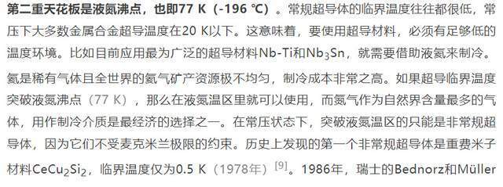
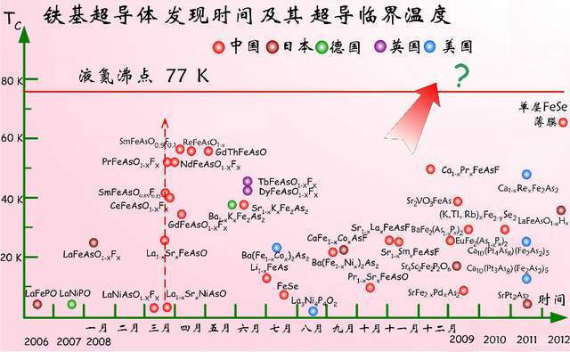
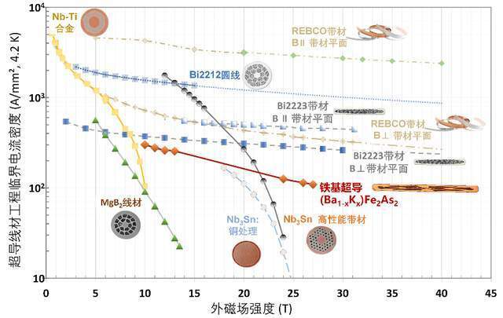
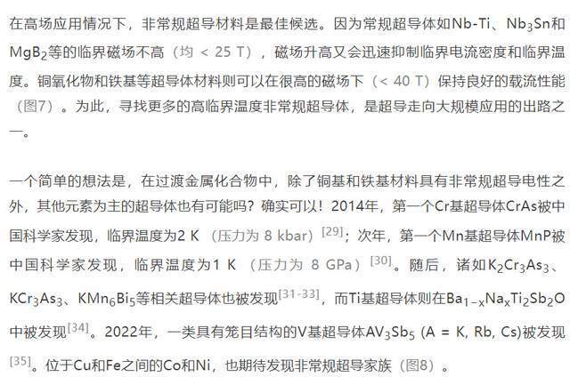
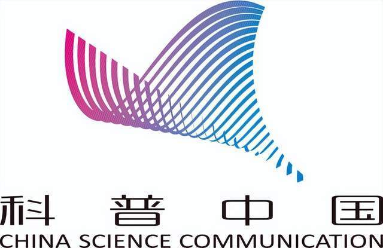

# Nature重磅发布来自中国科学家的成果， 镍氧化物成高温超导的新希望

尽管La3Ni2O7的临界温度只是刚刚突破液氮温区，且需要借助高压，但该发现无疑为高温超导带来了新的希望——镍基材料中很可能出现更多的超导体，甚至是高温超导体！

2023年7月12日，Nature重磅发布来自中国科学家的成果：发现镍氧化物中压力诱导的80
K左右超导电性（图1）[1]。时隔36年，科学家们终于在继铜氧化物之后，发现了第二类突破液氮温度（77
K）的非常规超导家族，为高温超导机理和应用研究点燃了新希望！

_图1：Nature论文：镍氧化物中发现高压下近80
K超导现象[1]_

**一、超导研究的三重“天花板”**

自1911年荷兰物理学家卡默林·昂尼斯发现超导现象以来，超导研究就成了物理领域长盛不衰的方向之一。百余年来，人们对超导现象的深入探索，不仅持续推动了材料科学的长足发展和技术科学的不断进步，而且也让我们对物质中的各种相互作用有了更加深刻认识，特别是关联量子效应的研究可能孕育出凝聚态物理研究的新范式[2]。

超导材料具有绝对的零电阻和完全的抗磁性两大神奇特性，其本质是材料内部巡游电子的宏观量子凝聚态。正因如此，超导几乎在所有涉及电和磁的领域都有用武之地。例如在强电强磁应用方面：有无损耗的超导电缆，高效率的超导限流器、电动机、储能系统等，高场超导磁体是可控核聚变、核磁共振功能成像、高能粒子加速器等的核心技术，亦可用于高速磁悬浮列车、磁感应加热熔炼、污水处理、选矿等。在弱电弱磁方面：超导单光子探测器和超导量子干涉仪是量子精密测量的保障；超导微波和太赫兹器件可以提供高性能和高保密通讯；超导高频谐振腔是粒子加速器的心脏；超导量子比特是高速量子计算机芯片的基本单元[3]。可以说，在下一代科技革命中，超导材料必定是当之无愧的明星之一（图2）。

_图2：超导材料的一些典型应用_

然而，纵然超导应用潜力巨大，在日常生活中我们并没有随处可见超导家用电器，在电网系统中超导的应用仅限于示范工程，基础科学和尖端科技中的超导应用对老百姓来说更是遥不可及。究其原因在于，目前发现的成千上万种超导材料，几乎都“不太好用”！限制超导应用的主要有三个临界参数：临界温度、临界磁场和临界电流密度。也即超导材料并不是很理想，它们必须在足够低的温度、不太高的磁场和不特别大的电流密度下才能实现超导电性，一旦突破某个临界参数，材料有可能瞬间从零电阻变成有电阻的状态，当然就不好用了。三个临界参数中后两者决定了它的应用场景范围，而临界温度则是应用的最大瓶颈，因为低温就意味着高昂的制冷成本。

超导体的临界温度到底有多低？第一个发现的超导体——金属汞的超导温度是4.2 K，相当于约 -269
℃，比冥王星的平均表面温度还低。金属单质中常压下最高超导温度是铌，也不过9 K（-264
℃）[4]。正是如此，科学家们在超导研究的117年里，一直在努力提高超导材料的临界温度，其中有“三重天花板”是重点突破的目标。

**第一重天花板是40 K（-233 ℃），又称麦克米兰极限**
。1957年三位美国科学家巴丁、库珀、施里弗提出金属和合金超导体的微观理论，后来以他们名字命名为BCS理论[5]。该理论认为，金属材料中的电子可以借助原子晶格振动产生的能量量子——“声子”来实现两两配对，配对后的电子进一步实现相位相干并凝聚成一个宏观整体，远远超越了原子晶格的尺度，从而实现无损耗的电流。基于BCS理论，Eliashberg提出了基于强电声子耦合的超导临界温度模型[6]，McMillan（即麦克米兰）进一步简化得到了超导临界温度与电声子耦合强度的关系[7]，Anderson等人进而推断，在原子晶格不失稳的状态下，超导临界温度存在一个40
K的上限[8]，后来被人们称之为“麦克米兰极限”。麦克米兰极限实际上仅仅适用于常压条件下基于电声子耦合机制的超导体（又称为“常规超导体”），如果施加高压，原子晶格的稳定性会大大提高，常规超导体的临界温度超越40
K是完全可能的；而如果不是电声子耦合机制形成的超导电性，那么自然完全不必受限于40
K，这些超导体被统称为“非常规超导体”。有意思的是，在超导被发现的随后70余年里，尽管有大量的常压超导体被发现，麦克米兰极限居然像一个难以打破的魔咒一样，这第一道“天花板”一直难以突破（图3）[3]。

_图3：常规超导材料临界温度和“麦克米兰极限” [3]_

在La-Ba-Cu-O体系发现35 K的超导电性[10]。随后的1987年初，来自中国的赵忠贤团队和美国朱经武团队在Y-Ba-Cu-O体系发现93
K的超导电性[11,12]，麦克米兰极限和液氮温度被同时突破！铜氧化物材料被认为是“高温超导体”，它们具有多个材料体系，如La系、Bi系、Y系、Hg系、Tl系等，都属于非常规超导体[13]。铜氧化物里常压下最高超导温度的是Hg-
Ba-Ca-Cu-O体系，为134 K，高压下可进一步提升到165 K[14]。2008年，第二个高温超导家族——铁基超导体被发现，主要包括Fe-
As基、Fe-Se基和Fe-S基等几类化合物[15]。同样是中国科学家发现铁基超导材料可以突破麦克米兰极限，Fe-As基块体最高超导温度可达55
K，FeSe单层薄膜超导温度可达65
K，均属于非常规超导体[16]。然而，尽管铁基超导家族的材料体系要远比铜氧化物多，但铁基超导体的临界温度至今未能突破液氮温度（图4）[3]。

_图4：铁基超导体发现时间及其临界温度[3]_

**第三重天花板是室温，在凝聚态物理学中室温一般定义为300 K（27 ℃）**
。毫无疑问，如果超导临界温度可以突破室温，那么在实际应用中就可以不存在制冷成本，超导材料的大规模应用也就扫清了最大的障碍。然而理想很丰满，现实却很骨感，目前发现的常压超导材料最高临界温度的记录依旧是Hg-
Ba-Ca-Cu-O体系，即134
K。不过，科学家们在多年的研究发现，高压是提升超导临界温度的“制胜法宝”之一，例如一些非金属单质在常压下不超导，高压下就能变成超导体[17]；而已有的金属单质超导温度可以在压力下进一步提升，其中最近发现的钪在高压下临界温度为36
K，是单质元素超导体最高的[18]。理论预言，氢单质在高压下如能实现金属化，那么它依赖于强大的声子振动和电声耦合，就有可能实现

等）中发现了超导电性，不过都依赖于百万级大气压（100
GPa以上）的高压条件[20]，如此苛刻的条件显然不会有太大的应用价值。2020年，美国的Dias团队宣称在C-S-H三元体系实现267 GPa下的288
K“室温超导”，后来经受不住同行的广泛质疑，论文在2022年底被撤稿[21]。2023年3月，Dias团队再次宣称在Lu-N-H三元体系实现1
GPa下的294 K “近常压室温超导”
[22]，然而却遭到科学家普遍质疑，观测到的所谓室温超导很可能是因为实验测量有问题以及数据分析有错误[23-26]。所以，即使用上高压这个利器，室温超导的天花板依旧存在，而常压室温超导，仍是超导领域至今未能拿下的“圣杯”（图5）。

_图5：金属氢化物“室温超导”探索历程[20]_

**二、高温超导研究的困境**

既然常压下能突破液氮温区的超导体只有铜氧化物，那么是否可以理解其微观机理后帮助我们寻找到更高温度的超导体？又是否可以因为制冷成本的降低而实现规模化产业应用？

事实却是比较悲观的。不只是铜氧化物，包括铁基超导体和重费米子超导体在内的非常规超导材料的微观机理，至今是凝聚态物理的“老大难”问题。难度体现在实验现象的复杂多变，甚至超出了现有理论框架，特别是需要考虑所谓的“强关联电子”效应，即电子-
电子之间的相互作用不能简单忽略或近似考虑，磁性和电性相互作用同等重要。举例来说，常规超导体的能隙函数一般是各向同性的s波，但是到了铜氧化物超导体就是各向异性的d波，两者截然不同。铁基超导的多材料体系，或许是揭开高温超导机理的重要桥梁，因为铁基超导的能隙函数是s±波为主，介于铜氧化物和常规超导体两者之间，在物理和化学性质上亦是如此（图6）[3]。高温超导微观机理的解决，最终必须依赖于多体量子理论的发展和完善，也即所谓建立凝聚态物理的“新范式”。

_图6：铁基超导是连接铜基高温超导和常规超导的桥梁[3]_

那么，究竟是什么限制了高温超导材料的规模化应用呢？并不是所有的铜氧化物超导体都能突破77 K，甚至有不少体系都低于40
K，只是因为它们同属铜氧化物家族，都统称为“高温超导体”而已。77
K以上的超导体系仅有Bi系、Y系、Tl系和Hg系，后两者因为Hg和Tl都是剧毒元素，对空气极度敏感，且结构成分多变，不能真正产业化应用。如此，就剩下了Bi系和Y系，但作为过渡金属氧化物，它们天然就比较易碎，直接制备金属合金那样的线材是不可能的。科学家们就发明了粉末套管法、脉冲沉积法、化学镀膜法等，借助金属套管和基片的柔韧性来克服这个问题。只是，一个方法的引入，必然带来更多的新问题，让大家一通焦头烂额。三十余年过去了，如今ReBaCuO体系的高温超导带材才勉强达到规模产业化的标准[27]。

正是因为铜氧化物超导材料的“中看不中用”，科学家们才不断努力去搜寻新的高温超导材料，铁基超导体因此被发现。铁基超导体中Fe-Se和Fe-
S家族的临界温度较低，且临界电流密度不高，不适合强电应用。Fe-As体系虽然可以达到30-55
K的临界温度，但也因为含As存在毒性，含Na、K、Ca、Sr、Ba等碱金属或碱土金属，对材料的制备过程提出了更加严苛的要求。铁基超导体线带材的研究目前还处于初级阶段，载流能力有待进一步提升，生产能力也仅限于百米级别（图7）[28]。

_图7：不同超导线带材的在高场下的载流性能[3]_

_图8：过渡金属化合物中的超导体系及典型结构[3]_

**三、镍氧化物超导带来新希望**

_图9：镍氧化物薄膜超导体及其电子配对示意图[38]_

寻找镍基超导体的思路，正是铜氧化物高温超导多年研究带来的启示。人们认为，如果在镍氧化物中实现+1价的Ni，就与+2价的铜电子排布类似，也有可能找到非常规超导电性，

样品的可重复性很差。加上临界温度并不高，镍基超导在起初引起了很多理论学家的关注，国际上却没有几个实验团队愿意及时跟进。后来，人们发现CaH2还原过程还有一个“看不见的手”，就是H元素很可能进入到了材料内部，并有效降低了Ni和Nd的轨道耦合，实现了d波超导，只有在特定的H含量情况下，超导才容易出现（图10）[39]。这虽然与金属氢化物高压超导并不相关，却也有殊途同归的味道。镍基超导体具有类似铜氧化物中的d波配对成分，较强的自旋涨落和色散，相似的费米面结构等，所以被认为是铜氧化物超导微观机理研究最佳参照体系。

_图10.镍氧化物超导薄膜的还原过程和H离子状态[37,39]_

压力的增加，逐渐转变为金属态并伴随着一个结构相变，形成了类似铜氧化物中八面体的结构，但细节又有所不同。研究团队观测到了78 – 80
K的电阻onset转变温度，和77
K的磁化率下降温度，以及对应的磁场抑制超导转变现象和正常态的线性电阻行为（图12）。理论分析说明，Ni离子的+2.5价发挥了独特的作用，它的两个不同d轨道分别影响c方向和ab面内的关联电子态，实现了非常规超导电性。从这个角度来看，镍基超导体与多轨道的铁基超导体，又有异曲同工之妙！

超导带来了新的希望——镍基材料中很可能出现更多的超导体，甚至是高温超导体！经过铜氧化物超导体领域37年的研究，和铁基超导体15年的研究，科学家们早已积累了丰富的经验和深刻的认识，在镍基超导的助力下，高温超导机理之谜的破解将加速进程。

_图13：超导材料探索的百余年历程[3]_

的确，在超导研究历史上，惊喜总是“意料之外”又“情理之中”。虽然有“三重天花板”显得困难重重，却没有任何一层天花板能够阻挡科学家们勇敢无畏的探索脚步（图13）。我们相信未来一定会有更多的新超导材料出现，它们或许有再度冲破临界温度天花板的实力，或许有更适合规模化应用的综合临界参数，或许有更多尚未发现的物理机制。

**参考文献**

[1] https://www.nature.com/articles/s41586-023-06408-7

[2] Zhou X et al., Nat. Rev. Phys. 2021, 3: 462.

[3] 罗会仟 著，《超导“小时代”——超导的前世、今生和未来》(清华大学出版社2022).

[4] van Delft D and Kes P. Physics Today 2010, 63(9): 38.

[5] Bardeen J, Cooper L N, Schrieffer J R. Phys. Rev. 1957, 106 (1): 162.ibid,
108 (5): 1175.

[6] Eliashberg G M. Sov. Phys. JETP,1960, 11(13):696.

[7] McMillan W L and Rowell J M. Phys. Rev. Lett.,1965, 14: 108.

[8] Anderson PW., National Academy of Sciences. Biographical Memoirs V.81.
Washington, DC: The National Academies Press, 2002.

[9] Steglich F et al. Phys. Rev. Lett., 1979,43:1892.

[10] Bednorz J G and Müller K A. Z. Phys. B, 1986, 64: 189.

[11] 赵忠贤等. 科学通报，1987，32: 412-414.

[12] Wu M K et al. Phys. Rev. Lett., 1987, 58:908.

[13] Cava R J. J. Am. Ceram. Soc., 2000, 83(1):5.

[14] Schrieffer J R, Brooks J S. Handbook of High-Temperature
Superconductivity, Springer, 2007.

[15] Chen X. et al., Nat. Sci. Rev. 2014, 1: 371.

[16] Liu X. et al., J. Phys.: Condens. Matter 2015, 27:183201.

[17] Lorenz B and Chu C W. High Pressure Effects on Superconductivity,
Frontiers in Superconducting Materials, A. V. Narlikar (Ed.), Springer Berlin
Heidelberg 2005, p459.

[18] Ying J. et al., Phys. Rev. Lett. 2023, 130: 256002.

[19] Drozdov A P et al. Nature, 2015, 525:73.

[20] Zhong X et al., The Innovation 2022, 3(2): 100226.

[21] E. Snider et al., Nature 2020, 586: 373.

[22] N. Dasenbrock-Gammon et al., Nature 2023, 615: 244.

[23] https://www.nature.com/articles/s41586-023-06162-w

[24] Xing X. et al. arXiv: 2303.17587.

[25] Peng D. et al., arXiv: 2307.00201.

[26] Xie F. et al., Chin. Phys. Lett.2023, 40: 057401.

[27] MacManus-Driscoll J. L. and Wimbush S. C. Nat. Rev. Mater.2021, 6: 587.

[28] Hosono H et al. Mater. Today, 2018, 21: 278.

[29] Wu. W et al., Nat. Commun.2014, 5: 5508.

[30] Cheng J. G. et al., Phys. Rev. Lett. 2015, 114: 117001.

[31] Bao J. K. et al., Phys. Rev. X 2015, 5: 011013.

[32] Mu Q. G. et al., Phys. Rev. B 2017, 96: 140504.

[33] Liu Z. Y. et al., Phys. Rev. Lett.2022, 128: 187001.

[34] Yajima T. et al., J. Phys. Soc. Jpn. 2012, 81: 103706.

[35] Ortiz, B. R. et al., Phys. Rev. Materials 2019, 3:094407.

[36] Goodenough J.B., Longo M., Crystal and solid state physics, Springer-
Verlag, 1970.

[37] Li D. et al., Nature 2019, 572: 624.

[38] Gu Q，Wen H H. ,The Innovation, 2022，3(1)：100202.

[39] Ding X. et al., Nature 2023, 615: 50.

[40] Liu Z. et al., Sci. China-Phys. Mech. Astron.2023, 66: 217411.

**撰文 | 罗会仟** （中国科学院物理研究所）

本文受科普中国·星空计划项目扶持

出品：中国科协科普部

监制：中国科学技术出版社有限公司、北京中科星河文化传媒有限公司

