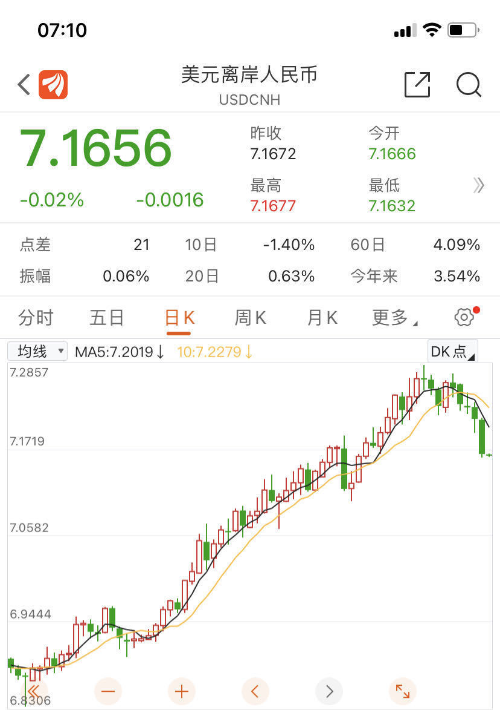
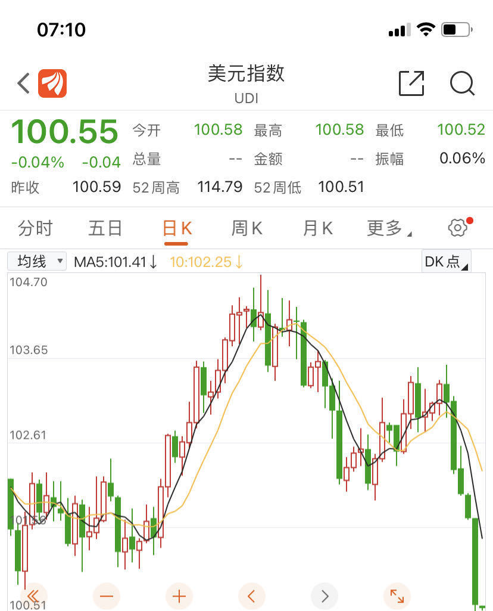

# 创近一个月最大涨幅，离岸人民币飙升逾460点，易纲最新发文

每经编辑：毕陆名

离岸人民币(CNH)兑美元北京时间04:59报7.1657元， **较周二纽约尾盘上涨462点，**
盘中整体交投于7.2155-7.1617元区间。截至发稿，离岸人民币暂报7.1656，升值12基点。

Wind数据显示，7月份以来美元指数持续下跌，12日更是大跌1.06%。与此同时，在岸、离岸人民币对美元汇率迎来反弹，在岸、离岸人民币双双收复7.2关口。
**自上周四起，人民币对美元连续走高，截至昨日收盘，离岸人民币对美元5个交易日累计涨幅达950个基点。**

美元指数12日下跌，截至纽约汇市尾盘，衡量美元对六种主要货币的美元指数下跌1.19%至100.5220。最新消息，美国6月CPI放缓至3%，由于通胀持续降温，美联储加息周期有望接近尾声。

据界面新闻7月12日报道，对于这波人民币汇率反弹，分析师认为，一方面是因为近期美元指数有所走弱，另一方面则是市场预计短期中国将有稳增长政策出台，支持下半年国内经济持续反弹，因此看好人民币汇率。

此外，还有分析师还猜测，这或许央行加强逆周期因子的使用有关。分析师还表示，此轮人民币汇率贬值已基本结束，但短期内出现强势反转的可能不大，预计三季度人民币对美元走势以震荡为主。

易纲最新发文

中国人民银行行长易纲近期在《经济研究》发表《货币政策的自主性、有效性与经济金融稳定》一文，对我国货币政策调控作出一个框架性的描述，并说明其中的基本逻辑和运行机制。

易纲在文中指出，利率政策和汇率政策首先要遵循市场经济规律，这是保持经济金融稳定运行并从宏观层面抑制系统性金融风险的关键。两类政策不是并列关系，利率是货币政策的核心和纲，汇率在利率政策影响下由市场形成。货币政策调控首先要将国内目标放在首位，并为实现国内目标选择利率等最优政策，其次需创造良好环境，使汇率由市场决定。

_图片来源：视觉中国_

**易纲还表示，遵循上述思路，在近年来全球主要发达经济体利率大幅变化的环境下，中国的货币政策没有简单跟随，而是坚持“以我为主”，自主性和有效性明显上升。在调控中充分考虑时滞等复杂因素，在做好逆周期调节的同时，注重跨周期调节和跨区域平衡，在收紧和放松两个方向都相对审慎、留有余地，货币政策始终运行在正常区间，实际利率与潜在经济增速大体匹配。近年来人民币汇率弹性显著增强，提高了利率调控的自主性，促进了宏观经济稳定，经济基本面稳定又对汇率稳定形成支撑，外汇市场运行更有韧性，利率和汇率之间形成良性互动。**

易纲表示，下一步要做好以下工作：

一是保持总量适度，坚持实施稳健的货币政策，保持货币条件与经济潜在增速和物价基本稳定的要求相匹配。搞好逆周期调节和跨周期调控，兼顾短期和长期、经济增长和物价稳定、内部均衡和外部均衡，把握好货币政策调控的力度和节奏，坚持不搞“大水漫灌”，不超发货币，为实体经济提供更有力、更高质量的支持。

“未来我国潜在经济增速有望保持在合理区间，有条件尽量保持正常的货币政策，保持正的利率，保持正常的、斜率向上的收益率曲线形态。发挥好结构性货币政策工具的作用，加大对国民经济重点领域和薄弱环节的金融支持。”易纲表示。

二是深化改革，持续推进利率、汇率市场化，以我为主兼顾内外平衡。继续健全市场化利率形成、调控和传导机制，完善中央银行政策利率和利率走廊机制，稳定市场预期，推动降低企业综合融资成本。

稳步深化汇率市场化改革，坚持完善以市场供求为基础，参考一篮子货币进行调节、有管理的浮动汇率制度，增强人民币汇率弹性，加强预期管理，坚持底线思维，做好跨境资金流动的监测分析和风险防范，保持人民币汇率在合理均衡水平上的基本稳定，更好地发挥汇率调节宏观经济和国际收支自动稳定器功能。

三是加强政策协同，持续完善宏观审慎政策框架，防范化解金融风险。

人民币汇率未来走势如何？

据中国证券报12日报道，展望7月人民币汇率走势，李刘阳表示，这一方面取决于稳汇率政策能否有效纠偏市场顺周期性，另一方面取决于稳经济政策的出台能否扭转当前市场预期。他认为，随着稳汇率政策逐步加码，顺周期和单边行为或将得到一定程度的遏制，有利于汇率边际企稳。经济预期一旦扭转，将带动汇率快速回升。

中信证券首席经济学家明明表示，汇率的核心在于基本面。若市场对经济的预期转暖，将带来直接投资账户和证券投资账户的修复。此外，如果随着美国经济逐步承压、美联储紧缩预期放缓，美元指数走弱，人民银行应对外汇大幅波动的政策工具储备丰富，人民币汇率有望逐步企稳甚至重回升值通道。

据界面新闻12日报道，英大证券公司首席宏观经济学家郑后成对表示，近期人民币汇率反弹的原因有二，一是6月美国非农就业数据低于预期，对美元指数形成利空，二是市场对7月底政治局会议加大“稳增长”力度的期待在上升。

_图片来源：视觉中国_

中国银行研究院研究员王有鑫认为，人民币汇率这波反弹和美元指数的关系更大。他表示，非农数据明显低于前值和预期值，说明美国经济复苏并没有想象中那么强劲，使得市场对美联储9月继续加息的预期有所降温。而且，目前市场普遍预计即将公布的6月美国通胀数据将在2021年4月之后首次回到4%以下，通胀压力将明显缓解，可能会使美联储预留更多时间观望加息对通胀的滞后效应，避免出现过度紧缩风险。

据证券日报13日报道，“整体上看，人民币贬值压力最大的阶段可能已经过去。”东方金诚高级分析师冯琳在接受记者采访时表示，预计三季度经济复苏动能有望转强，加之美元指数有可能整体上延续震荡偏弱态势，下半年人民币贬值压力趋于放缓，不排除阶段性升值的可能。从基本面走势对比的角度看，年底前人民币汇率有望回到7.0以下。

每日经济新闻综合经济研究、中国证券报、界面新闻、证券日报

每日经济新闻

