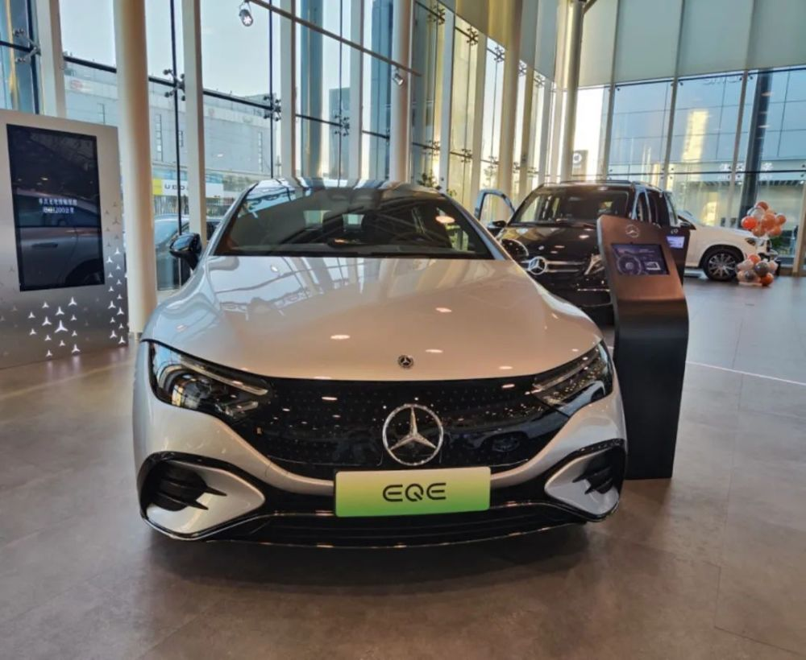

# 奔驰掌门的“烫手山芋”

当奥迪换帅时，奔驰为什么选择继续押宝现任掌门康林松？

**文｜《中国企业家》记者 任娅斐**

**编辑｜马吉英**

**头图来源｜视觉中国**

当奥迪换帅以期追赶对手时，看起来奔驰现任掌门康林松的表现还没有那么糟糕。

7月11日，梅赛德斯-奔驰发布上半年全球销量。数据显示，今年上半年梅赛德斯-
奔驰累计销售101.92万辆，同比增长5%。其中，在华交付37.72万辆，同比增长6%；纯电动乘用车车型全球销量为10.26万辆，同比增长121%，但占比仅为10.06%。

据公开报道，梅赛德斯-奔驰计划今夏将CEO康林松（Ola Källenius）的合同延长5年至2029年。康林松目前的合约到2024年5月到期。

对此，《中国企业家》向梅赛德斯-奔驰方面求证，截至发稿并未收到回复。

从公开资料看，康林松在任期间推动了奔驰迄今为止的电动化转型，并多次表态要让奔驰成为一家纯电动汽车公司。而在业界看来，
**评价其第二个任期的参考指标也是奔驰电动化转型的最终成绩单。**

2021年，奔驰提出“全面电动”战略，9年投入超400亿欧元，目标是到2025年纯电动和插电混动车型销量占比达到50%，每一款新发布的车型都将推出纯电动版本。之后的两年里，奔驰EQ系列新车陆续上市，为适应纯电动汽车的快速迭代，奔驰也逐渐放弃燃油车时代的传统战略，从“油改电”到“真纯电”。

**转型背后，奔驰也迎来巨大阵痛。** 外部，是高端新能源汽车市场日益激烈的竞争；内部，销量逐步显露颓势、电动化初战失利、产品饱受质量困扰……

根据汽车研究集团LMC Automotive和EV-
Volumes.com的全球数据，2022年，全球电动汽车销量为780万辆，同比增长68%，占全球汽车销量的10%。而奔驰纯电车型占2022年销量比例仅为7.3%。

距离2025年还有不到2年时间，奔驰80%的销量来源依然是燃油车型。今年一季度，奔驰新能源车型的销量占比仅为18.2%。而在中国市场，奔驰与老对手宝马的差距也在拉大。乘联会数据显示，今年1～5月，奔驰纯电动车型零售销量仅为6637辆。今年上半年，宝马在华纯电动车型销量约4.5万辆，同比增长近3倍。

**在康林松接下来5年的奔驰生涯里，他需要应对的是一场更加艰难的电动化之战。**

降价卖不动

“EQC最大的卖点可能就是它是一辆奔驰。”陈凡毫不客气地表达他对这款车的看法。

38岁的陈凡是一家互联网公司高管，经常开车上下班，原本家里有一台奔驰燃油车，但孩子升入小学后，需要经常接送，去年开始，陈凡有了新的购车计划，考虑到主要在市内出行，电动车成为首选。

但在比较了EQC和其他几款同价位区间的电动车后，陈凡觉得这款车没有给到他任何惊喜，“车机、性能、配置跟同级别的车型相比，差距太大了，还不如买辆燃油车。”

**车主觉得没有吸引力，一线销售人员也觉得奔驰的电动车难卖。**

_来源：视觉中国_

2019年奔驰推出首款纯电动车型EQC时，蒋豪（化名）异常兴奋。他当时看到各个车企都在做电动化转型，特斯拉、蔚来、理想、小鹏等新势力造车也有了进展，新能源形势一片大好，但是大家都认为造车新势力不懂造车，BBA这些豪华品牌一旦下场，就会吊打新势力。因此，作为奔驰销售顾问的蒋豪对奔驰抱有极大期待，但没想到最后反被市场教育了。

**“3年只卖出过一辆奔驰EQE。”**
蒋豪告诉《中国企业家》。据他了解，即便是现在有些门店降价超过10万元，一家店一年也卖不了几台奔驰纯电动车。有时为了挽留客户，他甚至会向他们推荐同价位区间的燃油车。

一个细节是，蒋豪所在的奔驰4S店内，EQ系列8款车只有新上市的车型才会在展厅最显眼处摆出，之前是EQE，现在增加了一款EQS，其余几款均无展出。

5月份上市的奔驰EQE SUV，被视为奔驰电动车版图中的一款重要车型。EQE
SUV定位纯电中大型豪华SUV，首次全系标配双电机以及智能适时四驱系统4MATIC，售价区间48.6万～63.06万元。

“店里已经没有EQA、EQB、EQC的展车和库存车了，也没人问，体验试驾EQE的人还稍微多一点点，我们也乐意讲讲这款车的性能和配置。”

**为了卖车，各大经销商正在想尽办法促销。**
据《中国企业家》了解，北京地区EQA、EQB的优惠力度在2万～12万元，EQC的优惠力度在2万～20万元，EQE的优惠力度在2万～10万元。

巨大的优惠力度下，奔驰EQ系列的销量依然没有较大起色。2022年，奔驰在华累计销售75.39万辆，同比增长2.61%。奔驰EQ系列目前在售车型共有8款，分别是EQA、EQB、EQC、EQE、EQE
SUV、EQE AMG、EQS、

EQS SUV

。乘联会数据显示，2022年奔驰EQ系列纯电动车型累计销售仅1.48万辆。

今年以来，销量持续低迷，乘联会数据显示，1～5月，EQA、EQB、EQE累计零售量分别为1415辆、2324辆、2742辆。今年3月份，奔驰EQC甚至只卖出了68辆。

“燃油车时代BBA定义的豪华，已经不适用于现在了。在科技感、智能化、续航方面，奔驰有很多功课需要做。”陈凡说道。

来自特斯拉的精准打击

2018年前后，为迎接电动化、数字化转型，奔驰需要进行大量的研发投入。 **但彼时奔驰母公司戴姆勒集团却迎来多事之秋。**

2019年，戴姆勒净利润大幅下滑64.5%，跌至27亿欧元，创下十年内最大跌幅。同时，受柴油排放门、高田气囊召回等事件影响，戴姆勒集团损失近50亿欧元。

自2019年下半年起，戴姆勒开始“瘦身”，康林松不得不采取一系列举措以削减成本、提升现金流。其中包括显著降低材料成本和行政成本，以及至2022年年底减少超过14亿欧元的人力成本，削减包括管理岗位在内的工作岗位。

**一边要增加新能源投入，另一边又要缩减成本，奔驰电动化转型的难度可想而知。**

奔驰EQC出自MEA电驱平台，当时的MEA平台严格意义上还不能被称为纯电专属平台，而是基于

奔驰GLC

平台改造而来的，简言之，这是一辆“油改电”的车。

“很多传统车企的纯电车型是在传统燃油车平台上改造而来，也就是我们俗称的油改电，这和纯电平台打造的产品是不一样的，油改电的竞争力会不足，所以，还是需要全新纯电平台。”中国汽车工业协会副秘书长陈士华接受财经汽车采访时表示。

BBA进行电动化转型的第一步，为何不约而同选择通过改造燃油车平台进行电动车生产？奥纬咨询董事合伙人张君毅表示，“电动车销量毕竟还小，如果只开发电动车平台，对于一些传统车企是得不偿失的。所以兼顾纯电和燃油既能够扩大平台利用率，也能够分摊成本。此外，不应该把这种做法简单视作‘油改电’的翻版，二者是完全不一样的，但是这种妥协的方式是不是最有效的方式，还需要市场来检验。”

乘联会数据显示，2021年，奔驰电动化的主力车型EQC在华销量仅为6098辆，2022年销量为3172辆。

**EQ系列没能打开电动车市场的同时，奔驰燃油车的市场表现也出现危险的信号。**

早在2009年5月，奔驰曾在特斯拉最困难的时刻，向其投资5000万美元，并由特斯拉为

奔驰smart

电动版提供电池组的技术支持。但10年后，特斯拉却让奔驰燃油车的销量数据变得有些难看。

乘联会数据显示，2020年

特斯拉Model 3

国产后，与其价位接近的

奔驰C级

当年销量便下滑了3.8%。2021年，Model 3销量增长以及国产

Model Y

开始交付后，奔驰在华三大主力车型C级、

E级

和GLC同时出现下滑，幅度分别为-14.8%、-9.3%和-17.7%。

**尤其是奔驰在豪华SUV市场的主力车型GLC受到了特斯拉Model Y的精准打击。**

2021年，在奔驰GLC销量最高的五座城市——北京、上海、深圳、成都和杭州的奔驰GLC销量出现集体下滑，幅度分别为-19.7%、-23.3%、-27.5%、-22.9%和-11.9%。同样的情况也出现在奔驰C级和E级上。

EQ系列出师不利，燃油车又受到特斯拉冲击，奔驰不得不及时调整战略。2021年7月，奔驰发布全新电动化战略，由此前的“电动为先”升级为“全面电动”。

数据显示，2022年，奔驰纯电动乘用车车型销量达到14.9万辆，同比增长67%，“全面电动”战略转型初见成效。

目标或被推迟

中国是奔驰最大的单一市场，能否在中国的新能源市场取得突破，关系到奔驰的转型成败。

今年3月，北京梅赛德斯-
奔驰销售服务有限公司（以下称“奔驰销售公司”）进行人事调整，段建军接棒杨铭担任奔驰销售公司总裁兼首席执行官，成为奔驰销售公司首位中国籍高管。

今年3、4月期间，康林松也在一个月内接连两次到访中国。3月25~27日，他参加了中国发展高层论坛2023年会；上海车展期间，他不仅自己在中国待了半个月，还带来了数十位奔驰高管前来学习。

_摄影：任娅斐_

**“电动化转型是当下汽车行业变革中最大的确定性，奔驰积极拥抱这一变革的决心、核心、信心不变。”**
上海车展期间，段建军表示，今年奔驰会带来6款全新新能源车型，年底在华新能源产品阵容将达到17款。

从段建军的表态中，不难感受到奔驰对电动车领域的重视程度。但是，从EQC被市场冷落的命运来看，在智能电动车这个赛道，奔驰的品牌影响力大打折扣。

多位业内人士对《中国企业家》表示，如果奔驰想将EQ系列打造成豪华纯电品牌， **不仅需要宏观战略，更要拿出突破性产品，唯有如此才能在纯电市场实现反击。**

东吴证券行业研究员孙兴也认为，传统豪华品牌的新能源车型定价虚高。一直以来，品牌、设计、服务、口碑都是豪华品牌的软价值，因此有一定的市场溢价权。但在新能源汽车赛道，豪华品牌的溢价权开始下降，在某种程度上大家都回到了同一起跑线。“在燃油车时代，豪华品牌就是企业最好的护城河，消费者也愿意为高溢价买单，但电动车时代，消费者正对品牌脱敏。”

**“奔驰较难实现2025年电动化目标的一个关键原因在于，奔驰在入门级豪华领域缺少有竞争力的产品。”**
孙兴表示，具体而言，目前奔驰没有一款定位C级别的电动车型，能够与Model
3或者大众的ID.5进行竞争。根据康林松的规划，定位C级的走量电动车型将在2024年底或2025年上市。

在今年5月5日的股东大会上，康林松宣布，公司的电动汽车发展计划将被一定程度地推迟：2025年实现50%的电动汽车销量占比的目标，将在2026年实现。而在未来，这个目标是否会继续延后，也未可知。

