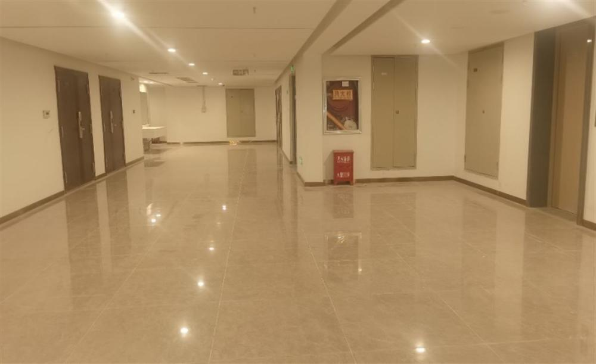

# 女子买69平公寓公摊竟达37平？住建局：公摊面积占比暂无明文规定

极目新闻记者 杜光然

据华商报报道，西安一新楼盘的公寓房69平方米的房子公摊面积37平方米，公摊率超50%，业主姬女士直呼“太离谱了”。该楼盘的销售人员称，门厅大走廊宽敞气派，公摊比例合规。7月13日，该楼盘所在辖区住建局表示，目前公摊面积的占比没有明文规定。

姬女士提供的购房合同显示，房子的预（实）测建筑面积共69.75平方米，其中套内建筑面积32.71平方米，分摊共有建筑面积37.04平方米。记者注意到，公摊率超过了50%。

12日，姬女士介绍，她购买了西安市东仪路的荣安芙蓉印月小区一套商业公寓，因疫情原因推迟到今年3月份交房。自己进了楼道发现楼道很宽，感觉都能开车，邻居的房子也存在公摊面积过大的问题，想不通为什么公摊面积这么高？姬女士解释称，自己去年才拿到合同，之前自己没有留意，也没想到花了50多万元，买了一半的公摊。

_图源：华商报_

对此，售楼部工作人员解释称，公摊大是因为公寓品质高有气派，门厅大走廊宽，大家住起来舒适度要高一些。本身商业楼的公摊就比较高，在姬女士购房时，已经仔细说明了公摊等相关问题，该公寓的公摊率确实达到了50%，但是单价低，舒适度高，而且国家在公寓楼公摊面积比例方面是没有具体规定的。

13日下午，极目新闻记者也咨询了该售楼部的一位工作人员，对方证实了上述说法，并称近期楼盘在清盘热销，价格比之前会低一些，还送车位。

一位业内人士接受采访时说，据了解西安商业公寓一般公摊率是40%—45%，因为公寓有比较豪华的大厅、长走廊、上下楼梯以及三四部电梯，因此公寓公摊率很高，一般都在40%以上，但超过50%的情况也比较少见。

西安雁塔区住建局的工作人员告诉极目新闻记者，此前确实有女子来咨询过该楼盘公摊面积的问题，相关负责同事已解释说明，目前公摊面积的占比没有明文规定。

