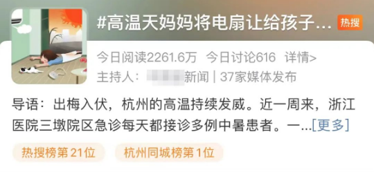

# 妈妈将电扇让给孩子被热死？医生：几年前的事，她条件差舍不得开空调

#高温天妈妈将电扇让给孩子被热死#这一话题冲上了杭州同城热搜榜的第一位。

这事是不是真的？记者采访了文内提到的浙江医院三墩院区急诊科。急诊科医生说，确有其事，不过是好几年前的事了。

当年接诊这位女患者的浙江医院急诊科马霜霜医师说：“这个妈妈30多岁，被送过来的时候已经没有生命体征了，心跳、呼吸都停了。”

马医师回忆起当时的场景，“送来的是她的老公，她是在家带孩子的全职妈妈，老公在外务工。家里条件不是很好，所以热天她也不舍得开空调，就开了电扇让孩子吹。孩子还很小，当时她在家可能已经中暑了，但是家里只有她和孩子两人，等她老公晚上回家才发现她已经倒地不起了。”

当时这位妈妈已经陷入深昏迷。问老公怎么会拖这么久才来?她老公解释说“平时她不怕热”。最终，医生们竭尽全力还是无力回天。

**热射病就是重度中暑**

**抢救不及时死亡率非常高**

什么是热射病？其实，中暑分为先兆中暑、轻度中暑、中度中暑与重度中暑4个阶段。浙江医院急诊科主任戴海文主任医师强调，热射病即重度中暑，如抢救不及时死亡率非常高，但热射病通常不是突然发生的。出现先兆中暑、轻度中暑一定要及时加以干预，否则症状将持续加重，如发展至热射病甚至可能导致死亡。

1.先兆中暑：主要表现为头晕、乏力、大汗、口渴、注意力不集中；

2.轻度中暑：先兆中暑后体温升高、出现发热，但没有意识转变；

3.中、重度中暑：轻度中暑如不加干预，体温将持续升高，可达40~42℃的高热，并伴有四肢抽搐、意识障碍；

4.最严重的中暑即热射病：通常合并多脏器功能衰竭，死亡率很高，住院病死率为14%~65%，ICU患者病死率>60%。

**夏天多出汗才能身体好？错！**

**这类人是热射病的高危人群**

戴主任介绍，7月以来，浙江医院三墩院区急诊接到了一例热射病患者，是一位70岁的阿姨，姓蒋。蒋阿姨本来在家中享受空调带来的清凉，不过中途感觉些许凉意，按下了空调遥控器的关闭按钮，没想到两小时后，人就感觉不对了。

浙江医院急诊科卢玉荣医师介绍，被送到急诊的时候，蒋阿姨整个人处于嗜睡状态，不仅体温飙到41.7℃，而且相关检查显示其肝、心功能均已经有一定程度的损伤，被诊断为热射病。经过相关治疗，蒋阿姨体温恢复正常，且人也清醒了过来，目前正在ICU进一步观察。

热射病分为劳力型和经典型。劳力型热射病主要是由于高强度体力活动，引起机体产热与散热失衡而发病。常见于夏季剧烈运动的健康青年人，比如消防员、外卖员、快递员、建筑工人等户外工作者。因此，对于这部分人群要尽量减少在太阳底下暴晒，尤其要避开中午12点到14点的时间段，要保持充足的睡眠、多喝水（盐水最佳）补充体液。

经典型热射病常见于年幼者、孕妇和年老体衰者，或者有慢性基础疾病或免疫功能受损者，通常是被动暴露于热环境引起机体产热与散热失衡而发病。虽然他们可能“足不出户”，但长期身处闷热、不通风环境中，也会“闷”出热射病。

尤其是很多老人，可能是舍不得开空调，也可能是不习惯吹空调，觉得空调对身体有害处——实际上，老年人是极端高温天气下非常容易受到伤害的脆弱人群。蒋阿姨就是其中的一例。

“夏天多出汗才能身体好”、“开空调多费电”、“心静下来自然就凉快了”……
浙江医院急诊科廖吕钊医师说，高温之下，这类观念真的要不得。大家一定要提醒家里的老人，高温天气一定要注意避暑，多喝水，打开空调。

**身边人遇到严重热射病，关键是降温和补水**

一旦发生先兆中暑、轻度中暑，要将患者转移到阴凉通风处，解开患者衣扣，并通过擦拭、冰敷等帮助患者降低体温。降低室内温度的同时，要给患者补充体液，推荐补充含有淡盐水等含有盐分的液体，补充中暑导致的体液和电解质丢失。

热射病可能危及生命，一旦有人遭遇热射病，在试图给患者降温的同时，周围其他人应帮忙拨打急救电话。

**面对高温预警，我们该如何有效防暑降温？**

1、 每天至少喝2000ml的水，定时饮水，要慢慢喝，不要渴了就猛喝。

2、多喝消暑降温的饮料（如淡盐水、绿豆汤等），多食用消暑蔬果（如：冬瓜、丝瓜、苦瓜、西瓜等）。

3、避免在午后阳光直射下长时间的活动。

4、过于炎热时应用冷水冲淋头部及颈部。

5、当室外温度高于35℃时要尽量避免外出。如有外出需求，外出时戴帽子和太阳镜，或者撑遮阳伞，不要打赤膊，尽量穿浅色、透气性好的衣裤，多补水，随身携带防暑药。

（为保护患者隐私，文中患者为化名）

