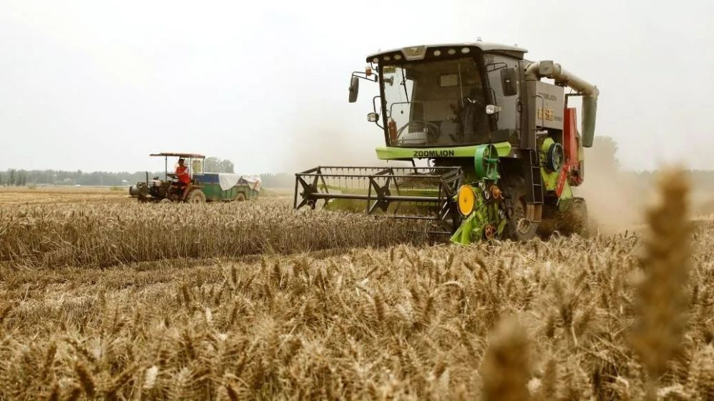

# 媒体：农业保险不能让农民受了灾却“没法赔，赔不了”

承保理赔不规范导致参保农户获得感不强一直是农险领域的一大痼疾。

_资料图:村民们在受灾农田里除草。图/新华社_

**文|董翀**

近年来，农业保险已成为广大农民应对农业风险挑战的坚实依靠。不过，据农民日报·中国农网近日报道，记者在河南多地调研时发现农业保险这个“靠山”却让不少农民大失所望，存在赔付标准不明，赔付金额普遍偏低，未受灾还能“返还保费”等问题。

而这些问题的背后正是当前我国农业保险在发展中有待继续完善、着力补齐的短板。

实践中，承保理赔不规范导致参保农户获得感不强一直是农险领域的一大痼疾。农业保险要想有效发挥化解农业经营风险作用，提升参保农户体验，就需要实现精准承保、精准理赔。但是由于种种原因，农险行业服务能力尚不能满足广大参保农户的需求。

农险行业服务能力有待提升

首先，农险承保机构服务能力受到人员数量、技术条件的限制。

一方面，很多保险公司仅在县政府所在地设置基层分支机构，人员配备不足，农业保险承保主要是由协保员或村委会统一代办，对农户的保险教育不足。

特别是农险承保电子化改革以来，以前的纸质保单变为电子保单、电子分户凭证，通过短信发送给投保农户，很多农户根本没有注意到收到了电子保单或电子分户凭证。

这导致大量参保农户对农业保险的认知有限，不清楚定损赔付条款，对赔付的预期与实际赔付标准差距较大。这也是此次报道中，不少农户对今年农业保险的理赔感到失望的原因。

另一方面，发生农业灾害时往往涉及多个农户的定损，即使有地方政府相关部门协助勘查，也很难实现快速精准定损。遥感技术应用于定损，虽然在技术上可行，但在实践中使用成本较高，使用场景有限。

其次，农险行业定损理赔端缺少服务能力强的中介机构。

农业保险行业天然存在着对中介（代理人、经纪人和公估人）的服务需求。比如在数字化大发展背景下，卫星遥感、大数据行业的科技公司等各类专业机构可以在查勘、定损、理赔等环节以各种形式为保险公司提供中介服务，这样既能降低农险机构的成本，又可以引入第三方损失评估机制，从而提升农业保险的服务效率和服务质量。

但近年来，农险市场上中介组织发展滞后。这其中，政策性农业保险出于减少农户负担的考虑，对保险中介的参与持谨慎态度；而商业性农险又发展缓慢，对农险中介组织服务的需求规模不足。

政策性农险的“谨慎”和商业性农险发育不足，使得农险中介组织缺少生存发展空间，无法有效发挥作用，从而导致难以形成良好运作的农业保险生态系统，不利于农险市场整体竞争绩效的提升。

再者，协议理赔和人为干预理赔导致赔付不合理，也影响参保农户体验。

近十年来，农险赔付率持续上升但波动趋缓，一些品种的单均赔付出现下降，这说明协议理赔和人为干预理赔日趋普遍。

在一些地区，地方政府要求农险承保机构于灾害发生后数日内赔付到位。但农险承保机构无法在如此短的时间内完成精准定损，这时可能出现两种情况。

一种是对容易实现精准定损的主体（比如规模经营主体）实行正常赔付，即仅对受灾地块赔付。

另一种是对不易精准定损的主体只能选择先预赔付，再收集理赔资料做最终赔案结案，或者干脆采取协议理赔。这时就很容易出现“该赔的没有赔到位，不该赔的却赔了”。

比如，小麦完全成本保险仅在损失达到20%以上时才启动赔付，但一些地区受灾后的产量损失，事实上并未触发赔付条件，也赔付了。

再比如，完全成本保险是产量损失保险，但有些受灾损失主要是小麦穗发芽，影响的主要是销售价格，这不属于完全成本保险责任，但也赔了。

鉴于政策性农业保险的政策目标，政府要求承保机构要做到应赔尽赔、快速理赔，而囿于技术约束，承保机构又难以解决精准理赔难度大、成本高等问题。

为了实现政策目标要求，同时兼顾平衡保费收入与实际风险的不匹配，承保机构在高风险区域出险时采取协议赔付、平均赔付，在低风险区域通过返还部分保费等方式调节赔付水平，吸引未受灾农户继续参保。

这种权宜之举进一步加剧了“该赔的没赔，不该赔的却赔了”的现象，使得参保农户理赔体验差，缺乏获得感，降低农户对农险的购买意愿。

最后，农业保险市场缺乏真正的绩效竞争。

当前我国农险领域政策性保险、商业保险、合作保险缺少分工协作。政策性保险对商业保险和合作保险的挤出效应较大，农业保险市场呈现刚性化和单一化。农险产品服务相对同质化，有效创新不足，不同类型农业经营主体对农险保障水平的差异化需求未得到有效满足。

比如一些种粮大户在购买政策性农业保险的基础上，可能仍存在对保障水平更高的商业性农业保险的需求，从而确保在遭受严重灾害时能获得较多赔付。但从现实情况来看，这种需求未得到充分满足。

同时，政策性农业保险市场普遍存在区域性市场分割，导致农险机构跨区域开展业务受限制较大。

很多机构仅在一两个乡镇范围承保，且承保期限较短，难以充分满足大数法则，无法通过跨地域持续经营提升核心发展能力和展开绩效竞争。这也导致承保机构缺乏开拓农险业务、为客户创造价值的积极性，从而阻碍了农险行业总体服务能力的提升。

_5月31日，联合收割机在河南省开封市尉氏县南曹乡前孙村的麦田里抢收小麦。图/新华社_

如何为农民撑好保险“这把伞”

综上而言，随着农业现代化的持续推进和建设农业强国目标的提出，建立生态健全、运行高效的农业保险市场的需求日益迫切，为农民撑好保险“这把伞”需有更多办法。

一方面，应借助新技术大发展的契机，激发农险领域技术创新和普及。

鼓励农业保险机构积极采纳大数据、物联网、3S+5G等技术手段开展创新，构建“线上+线下”一体化农村保险网络服务体系。从而提高费率厘定精度，降低在投保、续保验标、查勘定损、理赔等一系列环节的成本，优化农业保险承保、定损、理赔等环节操作规范性，提高服务质量和效率，改善参保农户体验。

同时，需进一步建立完善全国农业保险大数据平台。统筹管理涉及农业保险的所有相关信息，开展保险数据和农情灾情数据的对接与共享，基于海量数据开展农业生产风险评估和保险区划定期更新等基础性工作，为农业保险行业数字化能力提升提供保障。

另一方面，也要鼓励理赔端农业保险中介发展。引导专业机构在勘查、定损、公估等环节发挥作用，并参与农业保险产品服务创新，发挥市场机制在定价、供需匹配方面的决定性作用。

此外，还应着力加快构建有助于维护农业保险市场竞争秩序的制度体系。

在农业保险领域推动商业保险、合作保险和政策性保险的合理定位和分工协作，推动农业保险机构的多元化发展，促进农业保险市场的有序良性竞争。

政府可通过开放市场准入、加大再保险、税收优惠等支持农业保险的商业化运作，改变保险公司过度依赖政策性补贴的现状。

而对于合作保险，也需积极鼓励区域性行业性合作保险利用共济互助和大数定律分散风险，提高农业保险保障水平，提升经营效率。

撰稿 / 董翀（中国社会科学院农村发展研究所）

编辑 / 迟道华

校对 / 赵琳

