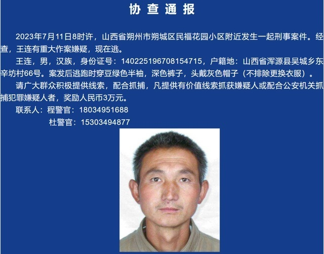

# 山西一环卫工疑因被罚款5元杀害队长？警方通报：犯罪嫌疑人已被抓获

7月11日，山西省朔州市朔城区民福花园附近发生一起刑事案件，警方悬赏3万抓捕犯罪嫌疑人王某。13日，警方通报称，已将犯罪嫌疑人王某抓获。

据新京报此前报道，王某疑似因被他人投诉地上有塑料袋，被环卫队长罚款5元，由此施暴。

**通报如下：**

2023年7月11日8时许，山西省朔州市朔城区民福花园小区附近发生一起刑事案件。案发后，朔州警方已于7月13日将犯罪嫌疑人王某抓获。

目前，案件正在进一步侦办中。

**相关报道**

7月12日，九派新闻记者致电民福花园小区附近一商户。该商户告诉记者，事情发生在11日上午大概8点20左右，“好像是一个环卫工（王某）和同事发生了口角冲突然后就动手了，现在我们社区群里都在发通缉令。”

另据媒体报道，关于网传的“环卫工遭投诉被队长罚款5元”的说法，朔州市环卫清洁中心所属的朔州市城市发展集团有限公司工作人员称，环卫工被人拍照投诉就会被罚款，“这个属于正常的罚款情况。”

该工作人员表示，王某到底是不是受到投诉和罚款才施暴，还在进一步了解中。

**【来源：综合平安朔城、九派新闻等】**

