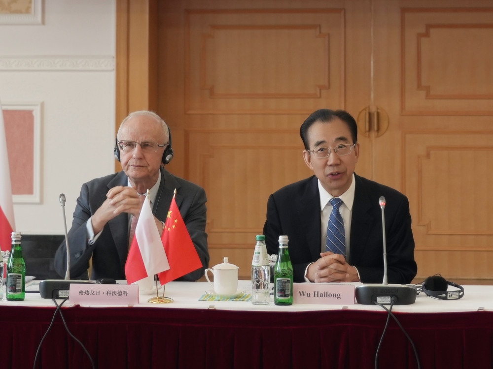
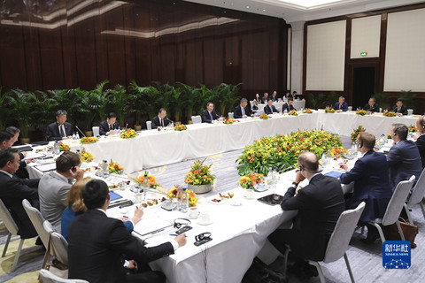
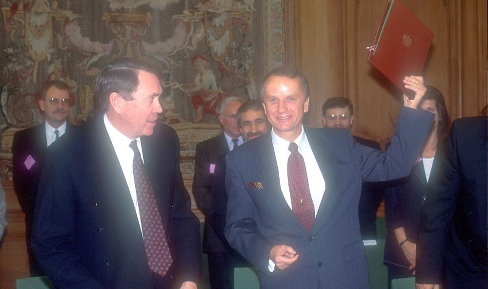
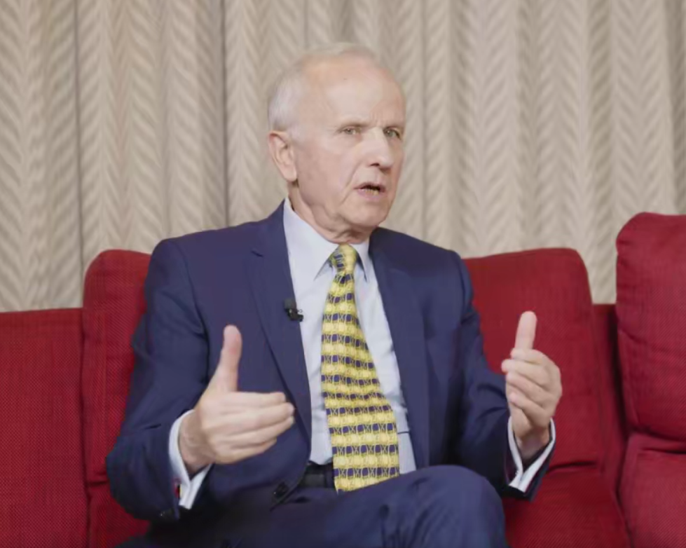

# 波兰前副总理称对“一带一路”在波兰的进展感到失望，问题出在哪里

作为中东欧地区的最大经济体，波兰早在2015年就同中国签署了共同推进“一带一路”建设政府间谅解备忘录。随着中欧贸易规模不断扩大，波兰作为欧盟的“东部门户”、中欧班列沿线重要国家的作用愈发凸显。

然而，由于新冠疫情和俄乌冲突，中波关系受到一定干扰。到2023年，两国之间逐步恢复人文往来。6月下旬，共有6个中方代表团同期访问波兰；同时，波方政要也积极参与中国举行的国际论坛与会议。

7月5日，波兰前副总理兼财政部长、科兹明斯基大学经济学教授格热戈日·科沃德科（Grzegorz
Kołodko）赴华参与“中国与世界：携手构建人类命运共同体”国际研讨会。在他访华期间，北京国际对话俱乐部发起人、观察者网特约主持人韩桦在北京专访科沃德科。

他表示，自己是个“乐观主义者”，对中波关系在“一带一路”框架下的发展前景持乐观态度；他指出了当前存在问题的解决方式，并就波兰与欧盟关系、中国模式的国际意义等议题分享了自己的看法。

以下为部分采访实录，因篇幅而有所删减。

_科沃德科5日在“中国与世界：携手构建人类命运共同体”国际研讨会致辞（图源：央视网）_

【采访/韩桦，编辑、翻译/观察者网 李泽西】

**观察者网：科沃德科教授，感谢您接受我们的独家专访。首先，今年是“一带一路”倡议的第10周年，您如何评价它取得的成果？**

**科沃德科：**
我认为，在过去的10年间，“一带一路”为加快发展中国家的经济增速做出了巨大贡献，特别是在一些非洲、南亚和中东国家，一定程度上也为我所在的地区（欧洲）做出了贡献。

当然，一切并非一帆风顺。我们确实遭遇了新冠疫情的冲击，这使得各方面合作变得更加困难，尤其是旅行往来。此外，乌克兰不幸的冲突也已持续了将近一年半。

欧盟委员会和中国政府之间有一些合作协调，但规模还不够。这几年来，我一直在强调，我们必须加强欧盟出资的基建项目与中方贷款出资的“一带一路”投资之间的协同合作。

尽管如此，总的来说，“一带一路”的成果是积极的。我们有了更好的基础设施，包括桥、港口、公路和铁路。作为一名经济学家，我还特别关注其中创造的就业机会。

对全球来说，我认为“一带一路”在帮助发展中的贫穷国家实现更强劲的经济增长。

**观察者网：大约两周前，您在华沙参加“‘一带一路’为中波关系注入新动力”智库媒体对话会期间，提到您对“一带一路”倡议在波兰的进展感到失望。你直言不讳地说，这主要是因为波方或欧洲方面的原因。在您看来，这些问题具体是什么？**

_科沃德科（左）与中国公共外交协会会长吴海龙（右）出席“‘一带一路’为中波关系注入新动力”智库媒体对话会_

**科沃德科：** 我认为波兰政府对扩大与中国的经济合作持积极态度，但其中也存在一些不利因素。

一个大问题是俄乌冲突，俄乌两国位于中国和波兰之间，战争给中波货物运输造成了一些物流问题；而波兰是整个欧盟的门户，因此对中欧整体贸易也有所影响。

我认为，还有些问题可能是间接的：目前我们谈论的是经济情况，但双边关系当然也包含政治因素。波兰是北约的重要成员，而北约以美国为首，英国也在其中有较大影响力。美英两国在地缘政治博弈中扮演了非常重要的角色，他们最近不太愿意深化与中国的经济合作。

在英美最近的做法中，可以看到很多排外、乃至反华主义的影子，我认为这主要是出于政治原因，但也有经济原因。他们都是非常发达的国家，却似乎惧怕中国的崛起，尤其是在关键技术方面的进展。

澳大利亚战略政策研究所（ASPI）3月发布了一份报告，关于当今44项最重要的技术，中国在其中37项技术上位列第一，美国落后；而美国只有7项技术位列第一，但中国在这些项目上也紧随其后。

_ASPI于3月发布的《关键技术追踪》报告显示，中国占据较大优势_

波兰这场博弈中则扮演了“次要角色”。但总体上，我认为波兰政府、尤其是波兰的企业和人民都非常支持深化与中国的合作。

问题是，我们是否在现有条件下竭尽所能深化合作？因为很多条件并不是我们所能决定的，我们双方都是全球化的一部分。

但是，正如我在自己写过的论文中指出，并在5日“中国与世界：携手构建人类命运共同体”国际研讨会的主旨演讲中提到，全球化是一个不可逆转的过程。在过去几十年，中国是全球化国际上的最大赢家，而波兰则是中东欧地区的最大赢家。

因此，中国现在的问题是如何利用全球化来促进自身经济利益最大化。而波兰的问题是如何利用不可逆转的全球化促进我们的国民经济，其中不可或缺的是与中国的关系。

我比较乐观，但我也意识到，如果政治上少一些感情用事，多一些经济上的理性考虑，我们将取得更大的成功。我看到两国关系的美好前景。

**观察者网：中国提到经济全球化时，实际上与您的一些看法产生了共鸣。在“‘一带一路’为中波关系注入新动力”智库媒体对话会之前，中国国务院总理李强还在访问德国。您在研讨会上提到，在波兰的中企数量远不及在德国的中企数量，波兰有80多家中企，而德国有2000多家中企。中国和波兰的商界人士具体可以怎样实现双赢？**

_6月19日，李强在柏林同德国工商界代表座谈交流（图源：新华社）_

**科沃德科：**
中国如此重视全球化的不可逆转性，推动其变得更加包容，用中国的说法，就是“互利共赢”的全球化，我认为这是一件好事。当然，有时我开玩笑说，应该是互利共赢，而不是中国“赢者通吃”。就目前而言，全球化还不够包容，有些国家被“落下”了。

我认为中方提出全球发展倡议、全球文明倡议作为“一带一路”的“下一步”是很好的，我们应加大这个方向的努力，因为全球化如果不够包容，可能弊大于利。接下来，我会关注这些倡议如何落到实处，在“一带一路”倡议的第二个十年，如何治理互利共赢的全球化。

波兰和德国相比，为什么会出现中企数量不平衡？第一，这是企业总数，但企业有大有小，光看企业数量不能说明一切。第二，德国经济是波兰经济的四倍。此外，在某些技术方面，德国企业更加先进，他们更容易打入中国市场，因为中国更喜欢与技术更先进的公司打交道。因此，中企参与波兰经济的程度肯定不及德国，这是很自然的。

问题是，中波关系本身的趋势如何，是否在朝着良好的方向发展？波兰对华出口增速高于自己的整体出口增速，虽然中国对波兰的直接投资规模仍不及预期，但其增长速度也高于平均。

此外，新冠疫情阻挠了双边关系发展，但疫情已几乎过去了，因此中波双边经贸的趋势是先抑后扬。

我是从创造就业的角度看待双边或国际合作，有时就业才是最关键的。比如中国等国力推的高科技技术、人工智能技术或数字化技术，可以提高波兰等国的竞争力和劳动生产率，但也会在短期内减少就业机会，从长远来看，这又有利于持续经济增长。

**观察者网：中国国际经济交流中心曾指出，中国在波兰曾有个别投资失败案例，如A2高速公路项目等，引起了一些不好的反响，影响到了波兰对中国企业、中国项目乃至“一带一路”的直观感受。您怎么看？我们如何才能提高公众对“一带一路”的整体认知？**

_波兰A2高速公路建设工地（图源：AGENCJA
GAZETA）_

**科沃德科：**
金无足赤，人无完人，失败时有发生，只有不做事的人才不会犯错。我们要做的是从失败的真正原因中吸取正确的教训。就舆论而言，我们必须更加关注正面的例子。

为什么会存在当前的现象？公众的态度、公众的看法在很大程度上取决于媒体叙事，但媒体界往往是“好事不出门，坏事传千里”。因此，A2项目出现在新闻上的原因是因为它失败了，是“传千里”的“坏事”。

我们听到很多关于“一带一路”个别项目失败的例子，但基本上听不到例如中国全面脱贫的新闻，因为这是“不出门”的好事。

还有个确实存在且不无道理的问题是，有些人原本对“一带一路”预期更高。这个问题的解决办法可能需要通过实践学习。对我们东欧人来说，与中国做生意并不像与西方做生意那样容易，因为社会制度不同。例如，我所在的科兹明斯基大学，我们教授一门特殊的“中国商务”课程：如何开展“中国特色”商贸。中波合作存在的不只是口头语言的差异，还有商业或法律语言不通的问题。

这不是失败的借口，但解释了为什么有时不能取得完美成功。我再强调一次，只有“不做才不错”。

**观察者网：您在波兰加入经合组织（OECD）和欧盟的过程中发挥了关键作用，代表波兰签署了加入经合组织的公约。您如何看待波兰此后与欧盟的关系？为什么波兰还没有用欧元？**

**科沃德科：** 确实，在我的领导下，波兰在27年前，即1996年7月11日加入了经合组织，我亲自代表波兰在经合组织巴黎总部签署了相关条约。

_科沃德科（右）1996年签署波兰加入了经合组织的条约_

在我最后一次担任波兰副总理兼财政部长期间，波兰加入了欧盟（2003年）。如果没有1996年加入经合组织的基础，我认为波兰在2003年就无法加入欧盟。

但由于种种原因，我们无法加入欧元区，即便不久后也没有加入。在我离开波兰政府后的几年内，波兰也依然无法满足加入欧元区的马斯特里赫特标准。你不能敲了门就直接“推门而入”，必须满足马斯特里赫特的五项标准；这些标准非常苛刻，涉及财政、货币和法律监管。

后来，波兰的政治天平从自由派转向过去8年间的右翼政府，后者非常反对加入欧元区，声称这会削弱波兰的竞争力，认为波兰会放弃一个非常重要的货币政策工具。

这是事实。用了欧元，就没有了自己的货币，无法操纵汇率或利率，因为这将由法兰克福的欧洲央行决定。但波兰使用欧元也有会一些收获，我认为总体上利大于弊，因此支持波兰加入欧元区。

然而现在大多数波兰人认为加入欧元区将不利于经济发展。这源于当下政府执政期间的主流媒体渲染，他们称欧元是德国主导欧盟的工具——这是在夸大其词，还称欧元将使波兰经济变得不那么灵活，在危机下将更难调整政策，而危机确实时有发生，因此最好保留本国货币。

波兰20年前关于加入欧盟的全民公决写道：您是否赞成按照雅典条约的条款加入欧盟？我当时在雅典参与签署了条约，条约规定一旦满足马斯特里赫特标准，波兰有权利也有义务加入欧元。

_2003年雅典，波兰代表团正式加入欧盟后的新闻发布会，左一为科沃德科（图源：波兰总统办公室）_

77%的人在全民公决中投了赞成票，实际上也表示支持欧元。但现在，70%的人反对加入欧元，因为舆论更加强调欧元的负面影响。既然社会上大多数人都反对欧元，我们确实暂时不宜使用欧元。

首先，我们必须让人们相信，从长远来看，欧元对他们有利。我们需要的不仅仅是论据，还要有合适的渠道，将这些论点传递给人民的眼睛、耳朵和头脑，这就是媒体的作用。

如果政府大多数人反对，使用欧元就不会发生。我认为他们立场错误，但决定权在他们而不是我。我能做的是试图诱导舆论，用经济学的逻辑来论证，如果波兰兹罗提与欧元之间汇率合适，加入欧元是有益的。

合适的汇率，应能保证波兰经济的竞争力。波兰经济的发展在很大程度上取决于出口带动的增长，因此出口增速必须快于总产出的增长。我们应该加入欧元区，但不能使用汇率过高的货币。

因为我们目前的货币汇率过高，此刻加入将削弱我们企业的竞争力，这是斯洛伐克和立陶宛等国此前犯下的错误。对波兰企业来说，我们的出口或将转盈为亏，而进口将非常便宜。这对波兰经济是不利的。

如果我们加入时汇率过低，这对我们出口导向的企业来说是件好事，但进口将更昂贵，将加剧通胀。企业缺乏竞争力是不好的，但大量的通胀也是不好的。

_波兰兹罗提/资料图_

如何管理这些复杂性、矛盾、相互作用，需要深刻了解经济运转逻辑。此外，还需要大量的政治权力，以确保政治逻辑遵从经济逻辑。经济逻辑基于理性，政治逻辑则往往不同，大多数时候基于情绪。现在，波兰的情绪反对加入欧元。让我们等待经济逻辑再次“无可反驳”的时机吧。

**观察者网：您深刻阐述了问题，不仅从政治角度，还从经济学家的角度，以及从中波贸易的角度来看，都是非常有深度的。**

**科沃德科：**
我是一直是一名大学教授，29年前首次加入波兰政府时，我认为只要掌握事实和正确知识就足够了，但我很快就明白了：在政治，在民主制度下，这还不够，你需要掌握多数席位。

有时，无论我说什么，即使是简单的2×2等于4，也会有人说不对，应该是3，你说的完全错误，答案是5。

这种情况下，我能做的就是不断尝试，必须说服其他政客、经济学家和利益集团。有时他们知道，从国家的角度来看这项政策是好的，但对我的企业或我所在的地区不利。现在的问题是，应优先考虑哪方利益？如何协调地方与国家利益？

此外，我们还是欧盟成员国，这是好事，但也意味着我们还必须在欧盟的框架内协调自己的政策。许多情况不由我们决定，各国之间有时会存在种种经济利益冲突。

无论是什么经济和政治体制——哪怕差距有如中国体制与波兰体制——都存在存在妥协概念，不能强推自己的想法，即使你是正确的，因为其他人有权不理解、害怕、要求你再解释。

**观察者网：中国体制在某种程度上也有类似的复杂性，也需要考虑您描述的如何协调地方、省级与国家级的权责利益等。因此，这也许也是中国的模式，中国的现代化道路可以分享予全世界的一点。**

**科沃德科：**
毋庸置疑，各国可以借鉴中国的经验。在过去的40年间，中国取得了无与伦比的成功，这是文明的一个飞跃。问题是，其他国家能从中学到什么？我们觉得，东欧、欧盟或美国很难借鉴很多经验。

_科沃德科接受观察者网采访_

其他发展中国家确实可以学到很多东西，但也是有风险的，因为中国的成功是两种力量的独特结合：市场这只“看不见的手”的力量与政府这只“看得见的手”的力量。

其他国家可能说，我们也要这样做，我们要把政府的官僚、政党和领导的力量与市场的力量结合起来。但是，这取决于执行的质量，需有非常强大的政府。

比如，沙特阿拉伯政府不比中国政府弱，或许沙特在其国内权力更大，但却相对不太成功。为什么？各国不仅需要以适当的方式结合市场和政府的力量，还必须结合任人唯贤与技术官僚制度，这样才有可能成功。

这其中还需要的，是文化。当然，我不觉得中国人一定比其他国家的人更热爱工作，在欧洲也经常有人称波兰人比其他人更有创业精神，也许我们是有一点，但这种解释太简略了。商业文化，才对整个体系的运作有影响。

我把中国模式称为“中国主义”，以强调其特异性。如果一个小国表示要走中国道路，我会建议他们在符合当地文化的情况下，尽可能多借鉴中国模式，但也要考虑当地国情。对同样的问题，在穆斯林国家与新教、天主教或世俗国家的回答是不同的。经济上，对于通胀源自进口和通胀源自国内的国家，抗击通胀的方式也是不同的。

我提倡的新实用主义——你们可称之为具有“中国特色”的新实用主义——极力反对新自由主义推行单一模式的做法。你有你的尺码，你的服装必须量身定制，而不是根据其他人的尺寸，因为他们可能有不同的尺寸。每个尺寸都有自己独特的美观，但也有各自的不同。经济和政治都是非常复杂的话题。

**观察者网：耶伦女士今天上午刚刚结束了她对中国的访问。您如何看待中美双方处理经贸合作关系，尤其在两国关系紧张的情况下？**

**科沃德科：**
我认为耶伦访华，并与中国经济界的政治领导人会见是个很好的迹象。我希望他们以一种非常务实的方式讨论双边关系的问题和其全球后果。很多事情都取决于中美关系，包括在我的国家（波兰）。

_8日，国务院副总理、中美经贸中方牵头人何立峰会见耶伦_

其次，我确实很欣赏她的做派。她在访问前说了一句话，这句话在美国、英国、欧盟等地的所有人都“不乐意”听到，尤其是（对华）鹰派人士。她说，因为自己是一个经济学家——一个合理、受过良好教育的聪明人——总是谈论与中国脱钩是无稽之谈。

双边相互依存关系太深、太大，中美不能脱钩，强行脱钩等于“自杀”美国自己的经济，因为我们在持续的全球化过程经济中深度融合，产生太多的相互依赖，以至于现在我们不能撤出这一进程了。

她说，现在不应进行任何脱钩，但应讨论几个具体问题，例如：知识产权、信息和专利转移、对一些行业的保护、决定哪些是战略产业而哪些不是、停止禁运——中国刚刚宣布，他们将禁运锗和另一种对高科技技术至关重要的稀土金属的出口，这是中国对美国行动的反应——征收贸易关税，等等。

因此，她访华并讨论这些问题是很重要的。从今天的角度来看，这次访问可能还没有取得足够的进展，但绝对不是失败。我认为耶伦访华比布林肯访华更有成效，也许因为布林肯的思维方式是彻头彻尾的“政客头脑”，但耶伦却试图从经济学家角度思考。

现在的问题是，回到美国，她将如何在白宫工作人员会议上向美国总统拜登汇报，并怎样与美联储主席鲍威尔沟通，等等。就美中经济和金融关系而言，她的影响力有多大？我担心她可能“势单力薄”，尤其是面对那些对经济学理解不深的美国鹰派人士，或者即使他们理解经济学，也不足够地重视经济，在某种程度上容易忽视经济对全球的意义。他们过于关注政治，对自己负责的经济不够关注。

_布林肯和耶伦（图源：AP）_

我一直在努力寻找经济和政治之间，经济政策和非经济政策之间的相互作用。此刻大家对我们生活中的经济层面都显然没有予以足够的重视，无论是从个人还是全球层面。

中美关系中政治因素太多了，错误的政治考量也经常被卷入这些争端中。它使一切变得更加“有趣”，但同时更具挑战性。我认为自己是个乐观主义者，因为我知道我们面临的每一个问题都有解决办法，但这并不意味着它们正在被解决，也不保证它们将来会被解决。比如，我们知道如何应对气候变化，但我们做得还不够。

现在是推行基于事实与知识、对未来负责的政治的时候了。这就是为什么我对政治经济学感兴趣。每当我来到中国，或在波兰遇到中国客人时，我都很乐意讨论这个问题，即使我们有意见分歧，因为分歧可以提高我们的思想。我们必须考虑未来该怎么做，或许一切都可能变得更好，但这将取决于我们今天做出的选择，不是注定的。

英文原文（部分）：

**Guancha: Professor Kołodko, thanks for this exclusive interview. The very
first question is, as the BRI approaches its 10th anniversary, how would you
rate its success?**

**Kołodko:** I think that it has contributed significantly over the last 10
years to acceleration of economic growth in developing countries, especially
some countries in Africa, South Asia and Middle East, to a lesser degree in my
part of the world.

There were some problems in the meantime. We did have Covid, which made the
cooperation much more difficult, starting from travel. Now we have almost a
year and a half this unfortunate conflict in Ukraine.

But there was also a little bit but not enough coordination between European
Commission and the Chinese governments.

I've been saying for several years that we have to give more attention to
cooperation between infrastructure projects co-financed by the European Union
and Belt and Road investment co-financed by lending from China.

But having said so, in general, the evaluation is positive. We have a little
bit better points of infrastructure, a bridge here, harbor over there, road or
piece of railroad in another country. And I'm an economist, of course, it has
created job opportunities.

But going back to the global evaluation, it is positive, I see it as an
instrument of getting more robust economic growth in catching up countries,
poorer countries.

**Guancha: About two weeks ago in Warsaw, while attending the seminar between
the Chinese and Polish intellectuals and media representatives, you mentioned
your disappointment towards BRI’s progress in Poland in particular. And you
said bluntly that it is mostly because of the Polish government or probably
the European side. So what are these issues in particular in your opinion and
how to tackle these issues or challenges, in your opinion?**

**Kołodko:** Well, the Polish government is rather sympathetic towards
expansion, continuation of the economic cooperation with China. Yet there are
some problems.

One big problem is this conflict in Ukraine. If you are taking a look on the
map, Russia and Ukraine is just between China and Poland. And that is causing
some logistical problems with transport of goods from China to Poland and
remaining part of the European Union, one must see Poland as the gates to
European Union.

I think that also maybe some problems are indirect: we are talking economics,
but there is also politics. And Poland is a very important member of NATO,
which by all means is led by the United States with the very big strong and
influential position of United Kingdom. And these two very important countries
in the geopolitical game, US and UK, are somehow reluctant recently to widen
and deepen economic cooperation with China.

You may see a lot of, I may say xenophobia, if not anti-China-ism, in the
American and British approach, mostly I think for non-economic political
reasons, but also for economic ones. These countries, which are very much
advanced, they seem to be somehow afraid, scared of China's rise, especially
in critical technologies.

There is the recently published report by Australian Strategic Policy
Institute about 44 most important technologies in the contemporary world. And
out of this 44, in as many as 37 cases, China is number one, US is number
second or alternatively, only in seven cases, US is number one and China is
number two.

So now we are somehow a minor player in this game.

I think that Poland, our government, but first of all our business and our
people, we are very much in favor of deepening and extending our cooperation
with China.

The question is, are we doing everything that is possible under the given
circumstances? Because not everything depends on us, I mean as you in Beijing,
in China, and us in Warsaw, in Poland, we are part of globalization.

But as I'm pointing in my papers and I pointing to this aspect also during my
keynote speech at the conference hosted here in China recently by China
Academy of Social Sciences, that globalization is an irreversible process.

I don't see any other country which has gained so much from globalization over
the last generation as China. And I think that I can’t see any other country
in East Central Europe, which gained from globalization as much as we have
done in Poland.

So now the question is on the Chinese side, how to take advantage of ongoing
globalization on behalf of China's people, China's economy. And our question
is how to take advantage of irreversible globalization, of which an
indispensable part is our relation with China on behalf of our national
economy.

So I'm rather positive, but still I'm aware that much more would be
accomplished if there will be less of sometimes emotionally driven politics
and much more of rationality driven economic concern. I see a good future for
these relations.

**Guancha: Chinese President Xi Jinping actually resonated some of your
observations by mentioning or proposing the economic globalization. Before our
seminar in Warsaw two weeks ago, Chinese premier Li Qiang was actually
visiting Germany. You observed in the seminar by mentioning that the number of
Chinese companies in Poland is actually dwarfed by the number of Chinese
companies in Germany, about 80+ companies versus more than 2000 companies.
What specifically can Chinese and Polish business people do to make it a two-
way street?**

**Kołodko:** It's good that China's president is giving so much attention to
irreversibility of globalization, presuming that it will be more inclusive.
You call it in China, win-win globalization. Sometimes I'm joking that, let's
have it win-win, not 2:0 for China. Definitely, for the time being,
globalization has not been inclusive enough. There are some countries which
are being left behind, which are being excluded, not included in the bold
global process.

And now, when China's leader is coming with Global Development Initiative,
Global Civilization Initiative as a certain follow up to global Belt and Road
Initiative, good, let's try to go further towards this direction, because
globalization, if it is not inclusive enough, can cause more problems than
solve problems. Now, after the words, I'm looking for the deeds, how this win-
win globalization will be managed and governed during the second decade of
Belt and Road initiative.

Comparing Poland and Germany, why there is such an imbalance? This is the
number of the companies, but there are some huge companies and there are some
small companies.

Second point is, German economy is 4 times bigger than the Polish economy.

In certain technologies, German companies are more advanced. For that reason,
they have easier access to Chinese market, because China is interested more in
dealing with more technologically advanced companies.

So, it's natural that our engagement is relatively not as big as in the case
of Germany. The question is, what is the dynamic? Exports to China is growing
faster than average Polish exports overseas. Direct investment is still not as
big as I hope they will be in the future, but they are growing above the
average.

Recently, again, there was the turbulence because of Covid, but Covid is
almost gone. So I think that the curve will look like this, and now it will
look like that (first down then up). I’m taking a look for bilateral
cooperation, international or global cooperation from the viewpoint of job
creation.

Sometimes that is the question mark, because if China trade high tech
technologies, artificial intelligence technology or digitalization, when it is
brought to Poland or to other countries, this can push our competitiveness and
our labor productivity, but is decreasing the jobs. But in the longer run, it
works on behalf of sustaining economic growth.

**Guancha: The China Center for International Economic Exchange had pointed
out that the failure of a few high profile projects, such as the A2 Highway in
Poland. This kind of projects contributed to some negative perception of the
BRI in Poland. What's your take on that? How can we better inform the public
of the overall positive story of the BRI.**

**Kołodko:** Nothing is perfect, failure from time to time happens. As the
proverb goes, only the one who is doing nothing is not committing mistakes.

What we have to do is we have to draw the proper lessons from the true causes
of this failure. We have to focus attention, as far as the public debate is
concerned, on positive examples.

There is always the question. Why? Public attitude, public perception is very
much the result of public media narrative, as the other saying goes. Good news
is not the news. Only bad news is in news. And for that reason, that was the
news because it was a failure.

So you may hear much more about this one example of failure within the Belt
and Road Initiative project, but you cannot hear that much, for instance, that
recently China has erased entirely extreme poverty, because this is the good
news.

There is also certain disappointment and not without justification: much more
was expected.

Sometimes, the problem is process of learning by doing. It is not that easy
for us in East Europe to do business with China, as it is with the West,
because of difference of the social systems.

For instance, at my Kozminski University, we teach a special course program
“China's business”: how to make business with Chinese characteristics. It is
not only the question of language, this is the problem of lack of
compatibility of business language, or law language.

And that is not an excuse. That is an explanation why sometimes there is not a
firework success as it was expected. Once more, the only one who is never
failing is the one who is doing nothing.

**Guancha: You had played a key role in Poland’s accession to OECD and the EU,
actually having signed the convention joining OECD. What do you think of
Poland’s relationship with the EU since then? Why has Poland not adopted the
Euro as your currency yet?**

**Kołodko:** Indeed. Under my stewardship, Poland joined OECD exactly 27 years
ago, on 11th of July, 1996, with this hand, I signed the accession treaty in
OECD headquarters in Paris.

And when I was for the fourth and last time the deputy prime minister and
minister of finance of the Polish government, we brought Poland to the
European Union. I would say it would not have happened around 20 years ago, if
not for joining OECD in 1996.

But for several reasons, at the same time, we could not, and soon after we did
not join Eurozone, because the government after I left was not able to make
the Maastricht criteria of currency conversions. You cannot just sign, knock
knock, I want to join you. You have to meet five criteria from Maastricht,
which are very tough, vis-a-vis fiscal, monetary and law regulation.

And then the political pendulum has shifted from liberal government to right
wing government, which we have had for 8 years. And this government is very
much against joining Euro, because this government says that it will weaken
Polish competitiveness, it will deprive us of a very important instrument,
which is monetary policy.

That is true. If you have Euro, you don't have your own currency, so you
cannot manipulate exchange rate or interest rate, it is decided by the Central
European bank based in Frankfurt. But we'll get something in exchange of that.
My position is still positive. I'm in favor of joining Euro.

But now, people in Poland are convinced that would be not good for economy,
because they've been told for many years during this government by mainstream
media that Euro is an instrument of German dominance of the European Union,
which is a great exaggeration, that Euro will make our economy less flexible,
and it will be more difficult to adjust in the case of crisis, and crisis
happened from time to time, better keep national currency.

During the referendum 20 years ago about accession to the European Union,
there was also the point: Are you in favor of joining the European Union on
the terms in Athens treaty? I was in Athens when we signed the treaty saying
that Poland has a right and obligation to join the Euro pending that we meet
the criteria from Maastricht.

77% of people in the referendum voted in favor. So actually they said that we
are in favor of Euro. But now 70% is against joining the Euro because of
public discussion on how bad Euro would be for economy. I'm saying that when
majority of the society is against that kind of reform, don't do it.

First, we have to convince the people it will be on their behalf in the long
run. But to do so, you need not only arguments. You have to have the channel
to deliver these arguments to the people, eyes, ears, and minds. And that is
going through the media.

It will never happen if the government majority are against, and I think they
are wrong, but they decide, not me.

I may attempt to make an influence impact on the public opinion. I'm arguing
using economic logic, why it will be good under one condition: if we will
convert currency at the proper exchange rate.

What is proper exchange rate? The one which will guarantee competitiveness of
Poland’s economy. Because Poland’s economic future very much depends on export
led growth, exports must be growing faster than overall output. We should join
Euro, but not with too strong currency.

Because our currency is too strong at the moment, that was the mistake
committed, for instance, by Slovakia and Lithuania, then it will erode
competitiveness of our entrepreneurship. Our exports will cease to be
profitable for Polish business and import will be very cheap. That is not
going to work for the Polish economy.

If we would join with too weak currency, that would be good for our export
oriented sector, but import would be relatively more expensive, and that would
fuel inflation. A lack of competitiveness is bad, but a lot of inflation is
also bad.

How to manage all this complexity, all these contradictions, all these
feedbacks, you have to know a lot about how the economy works. You need also a
lot of political power to enforce the economic logic on political logic.
Economic logic is based on rationality. Political logic has different
rationale, and most of the time is based on emotions. Now, emotions are
against joining Euro. And let's wait for a time when again, the power of
economic logic will be preferred.

**Guancha: I think this is a very strong argument, not only from the political
perspective, but from an economist’s perspective, as well as from the Sino-
Polish trade perspective, which is very strong.**

**Kołodko:** I'm a long time university professor, when I joined for the first
time the Polish government 29 years ago, I thought that it is enough to be
correct, it is enough to be right, it is enough to be knowledgeable. And then
I understood pretty fast: in politics, in a democratic system, it's not
enough, you need a majority.

Sometimes whatever I said, even if it was almost as simple that 2×2 makes
four, somebody says no, three, not at all, five.

What you do is you keep trying, as long as you can, you have to convince the
other policy makers, the other economists, and the others interests. Sometimes
they know that it is good from national viewpoint, but not for my business,
not for my region. Now the question is, what is coming first, what is coming
second? How to coordinate regional needs and ambitions and obstacles with the
national one?

And now, we are the member of the European Union. Good for us, but now we have
to coordinate the policies of our country within the framework of the European
Union. Not everything is up to us, and there are sometimes conflict of
economic interest.

Whatever the economic and political system, can be as different as the Chinese
system and our Polish system, there is compromise, you cannot enforce what you
wish, even if you are right against everybody else, because everybody else has
the right to not understand, to be afraid, to ask again for explanation.

**Guancha: China's economic landscape to some extent has similar complexity,
like you describing how to manage the local, the provincial level status
versus the national level status and so on, so forth. So maybe there is this
China model, China's path to modernization that can be shared worldwide.**

**Kołodko:** Countries may learn from China’s experience. There is no doubt
about that. There is incomparable success in china over the last 40 years.
It's a civilization leap forward. The question is, what can other countries
learn from this experience? We cannot learn a lot in Eastern Europe or in the
European Union or in the United States.

But other developing countries can learn a lot, but it's a risky business,
because China's success is caused by unique combination of two powers: the
power of the invisible hand of market, and the power of the visible hand of
government.

Somebody says we will do the same, we'll combine our power of the government's
bureaucracy, party, leadership with power of market. This depends on the
quality of implementation. You have very powerful government.

I wouldn't say that Saudi Arabia government is weaker than Chinese government.
Maybe it's even more strong, and somehow they are not successful. Why? It's
not only the question of power of market and power of government to be
combined in the proper way. It is also that it must be accompanied by
meritocracy, by technocracy, then it may work.

What is the remaining ingredient of this recipe? It's culture. I wouldn't say
that Chinese people love to work harder than other nations.

In my part of the world, we hear often that Polish people are more
entrepreneurial than the others. Maybe we are a little bit, but don't make it
easier by that kind of explanation that. But there is business culture, which
has an influence on the working of the whole system.

I'm referring to this Chinese system as Chinese-ism in English language to
stress that it's something very unique, something very specified. If I hear in
a small country that we will go the Chinese way, I say, try to get as much
from Chinese model as is compatible with your local culture, but also put it
in the context. The same question, you answer somehow differently in the
Muslim country than you do in the Protestant country or Catholic country or a
secular country.

You answer how to fight inflation differently in a country where it is
basically imported inflation and when it is basically domestic cost inflation.

So my new pragmatism, you may call it in China “with Chinese characteristics”,
is very much against this neoliberal approach of one size fits all. You have
your size, and your costume must fit in your size, not the size of each and
every other person, because they may have different size. Each size is
beautiful, but there are different sizes. So this is much more complex as far
as economics and politics are concerned.

**Guancha: Madam Janet Yellen just wrapped up her visit to China this morning.
How do you see China and America handle this economic cooperation, given the
tensions of the two countries?**

**Kołodko:** I think it was a very good development that Mrs. Yellen decided
to come to China and she met Chinese economic political leaders. And I hope
she discussed with them in a very pragmatic way, the problems of bilateral
relations with global consequences. So much depends, also in my country, upon
Sino American relations.

Secondly, I do appreciate her behavior. She said before her visit and it was
not liked by everybody in Washington, in London, in Brussels, especially by
the Hawks circle. She said, because she is an economist, reasonable, well
educated, smart, that it's nonsense to always talk about decoupling with
China.

The interdependence is too deep, too large, we cannot decouple, or we may but
that would be suicide for our own economy, because there is too much
interdependence as the result of ongoing globalization that we cannot withdraw
from this process.

She says that there is no time for any decoupling, but there is a time to
discuss several issues: intellectual property, trading of information, patent,
protection of maybe some industries, deciding what is strategic and what is
not strategic, getting rid of embargo, China has just declared that they will
actually embargo export of Germanium and another rare earth metal which is
critical for high tech technology, which is China's action reaction for
American action, imposing trade tariffs, etc.

So it's important that she has come, that they discuss these issues. There is
not enough progress which we may see from today's perspective, but definitely
it is not a failure. And I think that Ms. Yellen’s visit to Beijing has been
much more productive than Mr Blinken’s visit to Beijing, maybe because his way
of thinking is strictly political. And she attempted to think as an economist.

Now the question is, back to Washington DC, what she will report at the
meeting of the staff of the White House, when she will be briefing President
Biden, when she will call Mr Powell, the chairman of American System of
Federal Reserves, etc. So the question is, how influential is she as far as
US-China economic and financial relations are concerned? I'm afraid that she
may be not strong enough, that American Hawks who have poor understanding of
economics, or if they have, they do not appreciate it as much as it's supposed
to be, they are somehow prone to neglect the meaning of economy for the global
situation. They pay too much attention to politics and not enough to economics
that they are at the lead.

I'm always trying to find the feedback between economics and politics, between
economic policy and non-economic policy. And now there is definitely not
enough attention given to the economic aspect of our life, individually and
globally.

And there is too much politics, wrong politics being engaged in all these
disputes. It makes everything more interesting but still more challenging. But
I'm an optimist because I do know that each and every one of the problems that
we are talking about are solvable, but it does not imply that they are being
solved, and it does not guarantee that they will be solved. We do know how to
fight with warming of the climate, but we are not doing enough.

It's time for knowledge based, accountable in the long run politics. This is
where my interest in political economy are coming from. And whenever I come
into China or I can meet Chinese guest in Poland, I'm happy to discuss this
issue, even when we disagree, because disagreement is, if you will, for
refreshing the thought. So we have to think how to act and then it may be
better, but not necessarily will. It depends on us.

**本文系观察者网独家稿件，文章内容纯属作者个人观点，不代表平台观点，未经授权，不得转载，否则将追究法律责任。关注观察者网微信guanchacn，每日阅读趣味文章。**

