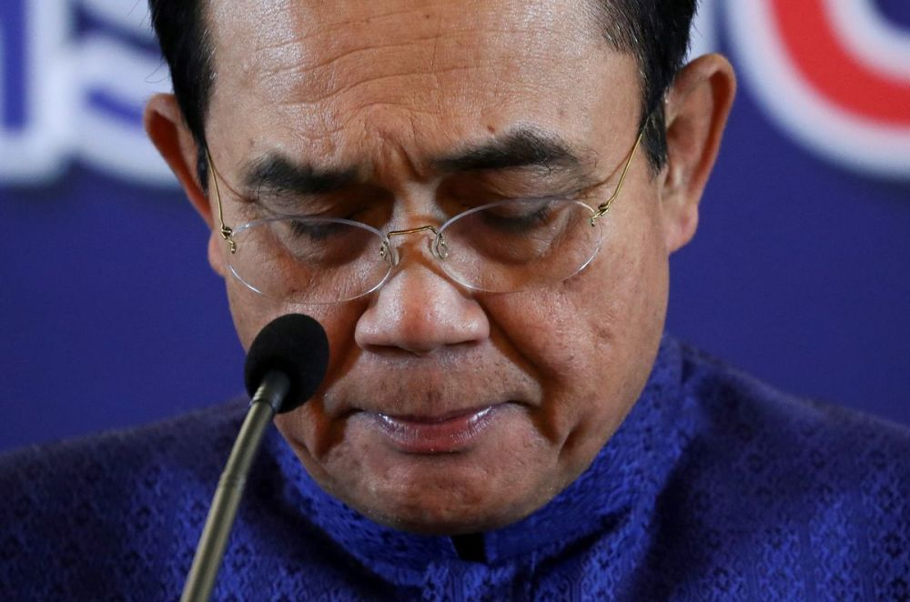

# 泰国国会今天投票选举总理，民调：超一半民众称投票不太可能顺利

【环球时报驻泰国特派记者 杨一 环球时报记者
陈子帅】在泰国总理巴育7月11日宣布退出政坛和其所在的泰国人团结建国党，在泰国引发轰动。13日，泰国国会将正式投票选举第30任总理。按照泰国官方早前提供的时间表，两院将于7月底前选出总理，新内阁成员将于8月初任命。巴育将继续担任看守总理一职直到新政府上台。至于谁将成为泰国新总理，目前局势仍不明朗。

_巴育
资料图_

巴育生于1954年，曾任泰国陆军参谋长、陆军司令等职。2014年5月22日，泰国军方以“国家维稳团”名义接管政权，巴育任“国家维稳团”主席。同年8月，国家立法议会选举巴育担任总理。2019年6月5日泰国新一届国会上下两院投票选举新总理，巴育高票当选连任。巴育9年来常遭在野党的反对或被提出不信任动议，但其领导下的政府在交通、通信、互联网、公共事业等许多领域取得发展，也受到不少民众认可。

泰国副总理兼卫生部长、泰自豪党党首阿努廷在接受媒体采访时表示，听闻巴育宣布退出政坛的消息后，自己感到十分震惊，因为与巴育共事4年来感受到“他是一位尽心尽责的领导人，一直以国家、王室机构和人民的利益为重”。曼谷一名退休市民遗憾地表示：“如果没有巴育，这个国家可能会陷入内战。”

7月13日，泰国国会正式投票选举泰国第30任总理。泰国国会由下议院500名议员和上议院250名议员组成，获得全部议员半数以上（即至少376票）支持的候选人当选总理。5月举行的泰国大选结果显示，远进党共拿下151席，成为下议院第一大党，而巴育所在的泰国人团结建国党只赢得36个席位。巴育宣布退出政坛后，该党暂未推举其他替代总理候选人。

由于被爆私自持有媒体股份、意欲修改刑法第112条“冒犯君主法”等行为，一些分析人士认为，远进党候选人披塔可能无法顺利当选总理。一项泰国民调显示，有56.12%的民众表示总理投票过程不太可能顺利。Thai
PBS World新闻网12日援引上议院议员的话称，他们不支持任何可能削弱君主立宪制、破坏国家稳定的行为，预计披塔只能从上议院获得10至20张选票。

12日，泰国选举委员会向宪法法院提交申请，要求在查清披塔被诉持股媒体公司一事是否违宪之前，暂停其下议院议员职务，直至法院作出裁决。法庭以当天议程已满为由，暂不审议该申请。此消息一出便引起各界关注，一些组织纷纷表示要举行集会，以表达对选举委员会决议的不满。泰国头条新闻报道称，为保障13日的国会投票顺利进行，警方将出动8个警队、约1360人维护会场周边秩序。12日至15日期间，泰国国会周边半径50米范围内不允许举行公众集会。曼谷市政府还为民众专门辟出7处可供集会的地点，包括国会不远处的曼谷市政厅大楼。泰媒预测，13日当天不会出现大的混乱场面。如果无候选人能在第一轮投票后成功当选总理，19日还将进行第二轮投票。

中国社科院亚太与全球战略研究院研究员、东南亚研究中心主任许利平告诉《环球时报》记者，巴育执政9年保持了泰国政治、社会的相对稳定，但也被指在经济方面表现比较平淡。泰国舆论认为，在巴育宣布退出政坛后，泰国军方的替代者可能是现任副总理巴威·翁素万。泰国上议院议员由军方委派，目前只有少数议员支持披塔，这意味着他在13日当选新一任总理的机会很小。许利平表示，如果披塔没有争取到足够的票数支持，那么很可能为泰党会联合国民力量党等保守派力量推选巴威上台。

“经过9年稳定发展，泰国民众难以接受社会再发生动荡，他们当前的主要诉求是改善经济状况，解决疫情3年累积的失业等问题。”
许利平表示，泰国未来的局势基本可控，对新政府来说，首要任务是推出刺激泰国经济增长、吸纳年轻人就业的经济措施。

