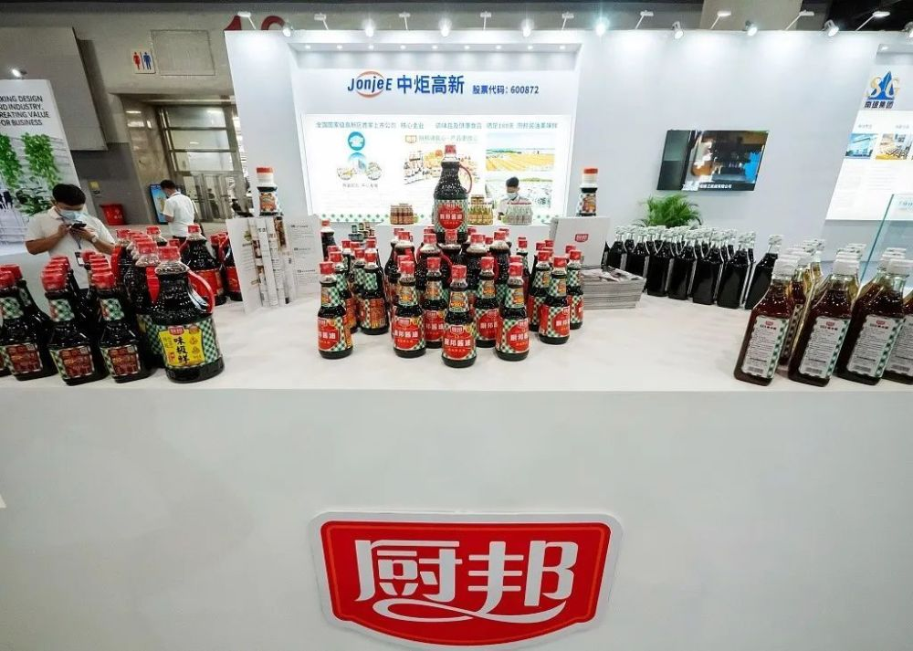

# 派系斗争再升级！宝能5000字长文实名举报国资股东

_来源：视觉中国_

作者 | 陈弗也 特约作者 胡世鑫

出品 | 棱镜·腾讯小满工作室

很多人不知道中炬高新（6008672），但知道厨邦酱油，后者便是中炬高新的酱油品牌。

在酱油市场，中炬高新仅次于海天味业（603288），位列行业第二。不过，与海天味业2500亿元的市值相比，中炬高新的市值仅275亿元。

7月12日，一封举报信将这家“酱油第二股”推向风口浪尖，举报者是大名鼎鼎的宝能，它旗下的中山润田投资有限公司曾是中炬高新的大股东，被举报者则是中山火炬集团及其一致行动人，火炬集团是中炬高新现在的大股东，也是中山市的地方国企。

举报信称，火炬集团涉嫌虚假诉讼、操纵证券等犯罪行为，并造成中炬高新及其股东、广大投资者约500亿元的巨额经济损失。

当天晚上，上交所发布监管函，要求上市公司大股东遵守法律法规的相关规定，不得影响公司治理和正常运作。通过媒体向市场发布有关于上市公司的信息时，应当审慎客观，避免对市场和投资者产生误导。

中山火炬集团也在当晚予以回应，称举报内容肆意抹黑，捏造、歪曲事实，恶意损害他人声誉，扰乱公司正常经营秩序。

2015年，在“宝万之争”中爆得大名的宝能系，开始增持中炬高新，并在几个月内，取代火炬集团，成为中炬高新的大股东，火炬集团的持股比例退居第二位。

但8年来，新老大股东一直没有一条心，双方明争暗斗持续不断。2020年9月，火炬集团的关联公司中山火炬工业联合有限公司（以下简称“工业联合”）将中炬高新告上法庭，涉诉案件是20多年前的三起土地转让纠纷。

这3起土地纠纷也是举报信的核心内容，几个月前，一审宣判，中炬高新败诉，需累计支付25.64亿元、16.73万平方米的土地。宝能称，这会让中炬高新遭受超过50亿元的巨额损失，而中炬高新的账面净资产仅36亿元。

更深远的影响是，宝能很有可能被踢出中炬高新董事会。没有了几年前“财大气粗”，宝能试图通过举报来进行反击。

**阻击剥离房地产，20年前旧账被重提**

根据公开资料，1999年-2001年，中炬高新与工业联合签订了三份《土地使用权转让合同书》，前者将三块土地的使用权转让给后者。

一直以来，双方相安无事，工业联合并未就此事发起诉讼，工业联合也是中炬高新原大股东火炬集团的关联公司。2020年9月，时隔20年后，工业联合突然翻起了这笔“旧账”，法院经过两年多的审理后，也判中炬高新败诉。

在举报信中，宝能认为这3起土地转让为虚假交易，他们的证据是，当时证监会曾对此做出过处罚。

根据举报信，在2001年，国家审计署在审计中发现，中炬高新存在“利用土地转让、关联方交易、关联方资产转让编造虚构销售收入，隐瞒重大关联关系”等违法事实。2003年12月31日，证监会对此作出处罚，认定中炬高新存在虚构销售收入等违法事实。

_截图来自中国证监会官网_

举报信称，受三起诉讼影响，2022年，中炬高新计提预计负债约11.78亿元，公司自上市28 年来首次出现亏损，中炬高新公司及其股东利益均遭受重大损失。

在此期间，中炬高新的股价持续下跌。宝能认为，火炬集团及其一致行动人通过蓄谋已久的低价吸纳、恶意收购来操纵证券交易，截至2023年6月1日，其合计持股19.65%，相比较其在2020年持股10.72%，增加8.93%，其行为涉嫌操纵证券市场。

此外，宝能认为不合理的是，他们的两位董事和一位监事，都与原告工业联合有着千丝万缕的关系。

2001年7月-2004年6月，董事万鹤群曾在工业联合任职，
2000年-2007年，董事余建华在工业联合的主管部门火炬高技术产业开发区管委会工作，目前还为中山火炬公资集团董事长，公资集团则是工业联合的母公司，现任监事郑毅钊也是公资集团董事。

一位对宝能了解的人士向作者分析，上述诉讼的发生，可能与中炬高新一次对房地产业务的剥离有关。

2021年8月30日，中炬高新发布公告，将房地产子公司中汇合创的股权进行挂牌，交易底价不低于111.69亿元。根据公告，这份决议遭到了一位董事的反对，该董事便是由火炬集团委派的余建华。

上述人士称，虽然剥离公告的发布时间晚于工业联合的起诉时间，但早在2019年，中炬高新提出了“聚焦健康食品主业”的战略，可能开始谋划对房地产业务的剥离。

工业联合起诉之后，中炬高新所持中汇合创33.44%的股权也被冻结，直到现在，中汇合创的交易也未能顺利进行。

**结盟、起诉，重组董事会**

火炬集团之所以要阻击中炬高新对中汇合创的剥离，可能与争夺中炬高新控制权有关。

在挂牌公告发布前的一个月，中炬高新曾发布公告，计划向中山润田发行股票，募资不超过77.92亿元，如果交易成功，中山润田的持股比例预计由25.00%增加至42.31%，这将触发要约收购。

最终，此次募资未能成功，并且，伴随着宝能系流动性危机的发生，中山润田的持股比例开始不断被蚕食。

从2022年3月开始，由于缺乏足够的资金支持，中山润田所质押的股票多次被动减持。火炬集团则抓住机会予以反击，并结交了新的“盟友”鼎晖投资，开始不断对中炬高新进行增资，在今年1月，重新成为了中炬高新的大股东。

而在这期间，中炬高新的管理层也进行着剧烈的变动。

2022年8月，中炬高新发布公告，宝能系的董事黄炜因个人原因正在配合调查；半年后，中炬高新再发公告，副总经理张卫华、朱洪滨因涉嫌严重违法被立案调查，张、朱二人则是火炬集团的人；两个月后，此二人因涉嫌违法犯罪及损害上市公司利益被起诉。

在重新成为中炬高新大股东后，火炬集团也开始谋划重组董事会。

公告显示，6月20日，董事会收到火炬集团、鼎晖隽禺及鼎晖桉邺共同发起的《关于提请召开 2023
年第一次临时股东大会的函》，但董事会在10日内未作出反馈。7月2日，他们又向监事会提请召开临时股东大会，监事会决定将于7月24日召开临时股东大会。

重组董事会便是此次临时股东大会的核心，根据公告，股东大会将提议罢免4位董事，并重新选择4位董事。

目前，中炬高新董事会共有6名成员组成，其中4名来自宝能系，2名来自火炬集团。

作者了解到，提议罢免的4名董事包括现任董事长何华，4人均有在“宝能系”任职履历。而被推荐的4位新董事，则主要为火炬集团及其一致行动人的关联方。

中炬高新在公告中也写道，因中山润田及其关联方自身债务问题，不是公司第一大股东，其推荐的四位董事不再适合担任非独立董事。

7月7日，为了反击，中山润田召开了紧急临时董事会，讨论并审议了包括火炬集团在内的五名股东涉嫌虚假诉讼、操纵证券交易，造成公司及股东、投资者巨额经济损失的情况。

这次董事会做出了四项决议，如聘请中介机构审查上述诉讼案件败诉的原因，对工业联合、公资集团、火炬集团等提起诉讼，向相关部门实名举报等。不过，由于已经失去了对公司的绝对控制权，决议无法通过公告的形式正式披露，只能在举报信中予以披露。

如今，随着举报信的发布，这场持续了8年之久的股权争夺战又重新掀起了腥风血雨。

