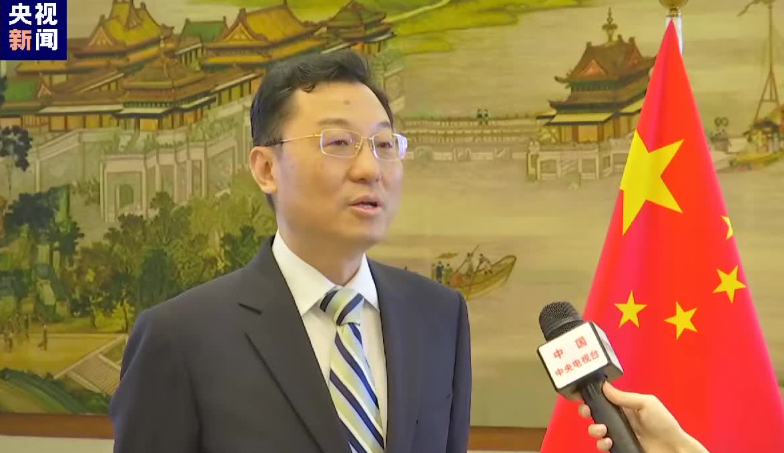
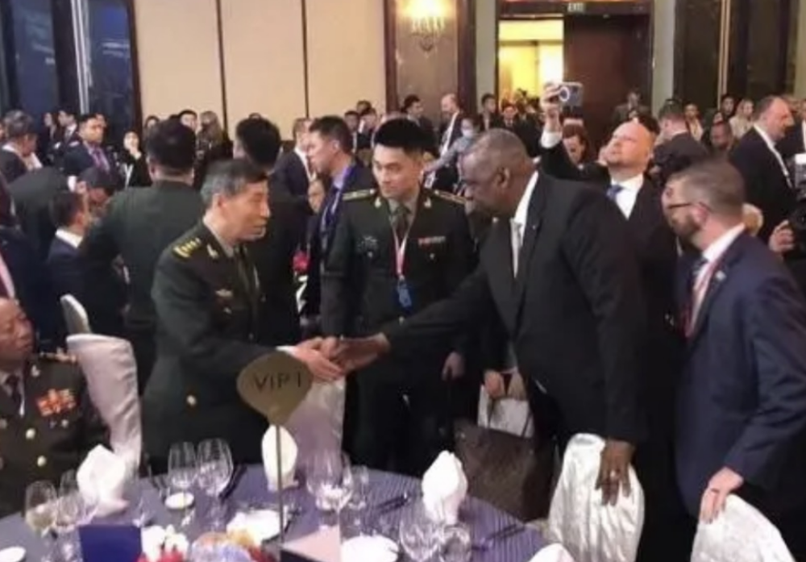
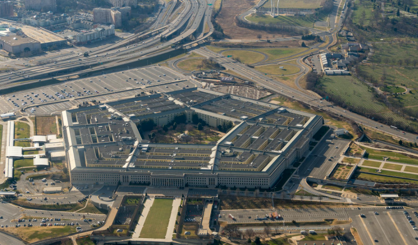
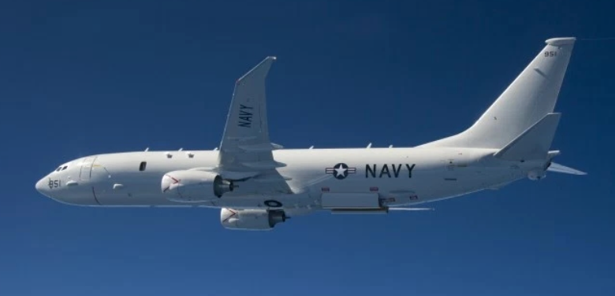

# 罕见！中方应约会见美军方高层，透露哪些信号

**撰文 | 李岩 董鑫**

外交部今天（13日）披露，7月12日，中国驻美国大使谢锋应约会见美国助理国防部长拉特纳。

美国务卿布林肯、财长耶伦在近期相继访华，美气候特使克里也即将访华。中美之间外交、财经、气候等领域交流日渐活络的背景下，中方大使应约会见美军方高官意味着什么？

致力“军方对军方”沟通渠道畅通

外交部网站披露，会见中谢锋表示，一个健康稳定的中美关系符合两国共同利益，习近平主席提出的相互尊重、和平共处、合作共赢三原则是新时期中美正确相处的治本之道。

谢锋就两国两军关系阐明立场， **要求美方采取行动排除障碍、管控分歧，按照中美三个联合公报的原则谨慎处理台湾等重要敏感问题**
，与中方相向而行，推动两国两军关系逐步重回正轨。

双方还就共同关心的问题交换了看法。

环球网引述外媒报道称，谢锋与拉特纳的会见在五角大楼举行，持续大约90分钟，讨论了两国国防关系和“一系列国际和地区安全问题”。拉特纳强调
**美国防部致力于保持美中之间“军方对军方”沟通的畅通渠道。**

“应约会见”

上述报道提到谢锋系“应约会见”，这也表明，此次是美方主动联系中方进行交流。

事实上，这也并非美方第一次“主动”。

2022年8月，在时任美国国会众议长佩洛西不顾中方强烈反对和严正交涉，执意窜访中国台湾地区之后，中国外交部宣布了八项反制措施。

这些反制措施中，有三条涉及中美两军，包括取消安排中美两军战区领导通话，取消中美国防部工作会晤，取消中美海上军事安全磋商机制会议。

今年6月，第二十届香格里拉对话会在新加坡举行，中国国务委员兼国防部长李尚福应邀出席。五角大楼表示，美国提出了两国防长在新加坡香格里拉对话会期间会面的请求，但被中方拒绝。

_第20届香格里拉对话会期间，美防长奥斯汀主动与中国防长李尚福握手_

中国外交部发言人毛宁当时回应称，美方应当切实尊重中国的主权安全和利益关切，立即纠正错误做法，展现诚意，为中美两军对话沟通创造必要的氛围和条件。

美方缘何如此迫切？

环球网报道指出，外媒评价认为这是一次 **“罕见”** 的会见，“中国大使并不经常会见美国高级国防官员。”

环球网引述专家观点认为，由于五角大楼反复制造中美两军高层交流的障碍，导致两军交流渠道的缺乏，现在不得不寻求通过外交渠道来帮助美军恢复与中国军方高层的沟通交流。
**“可见美国国防部对于和中方在军事层面建立沟通渠道的迫切需求。”**

军事评论员宋忠平告诉政知君，美军方迫切要求和解放军进行沟通交流，按照美军方自己的口径来说，是为了避免造成误判。

他分析称，美方表态可以从两个层面来理解——

其一，美方所谓“避免误判”论调的背后，其实是想探底中国解放军的真实实力和战略意图。基于此，美军可以划定自己的行为规则，避免越线。

其二，由于美国对华种种遏制、挑衅行为，中美两军关系目前处在低谷。现在美方意图恢复两军沟通交流，仅为了管控风险、避免误判，还谈不上增进军事互信甚至合作。

“主动权在中国”

美国务卿布林肯、财长耶伦近期相继访华，美气候特使克里也即将访华。

中美之间外交、财经、气候等领域交流日渐活络的背景下，环球网报道援引分析观点称，美国防部此举系寻求“借”当前中美多领域恢复互动的“东风”，来推进两军恢复沟通。

可美方嘴上虽然多次表达恢复交流的“主动”，但实际行动仍一再挑衅中国。谢锋与拉特纳会晤次日，7月13日，美国1架P-8A反潜巡逻机过航台湾海峡并公开炒作。

宋忠平认为，美方看似矛盾的言行其实合乎其对华策略。美国针对中国的军事遏制、打压策略短期内是不会发生变化的，在这个政策方向下，其沟通需求主要为了管控风险，而非真心实意缓和两军关系。显然，我们不能寄希望于通过恢复军事交流沟通能让美军“知错就改”。

不过他也坦言，不管美方采取哪种对华态度，客观上加强沟通确实能够降低“擦枪走火”风险，这不但对稳定中美关系至关重要，对世界的和平发展同样至关重要。
**“但两军沟通渠道恢复不恢复、何时恢复、恢复到什么层级，中方需要‘听其言、观其行’，主动权在中国。”**

**资料｜外交部网站 环球网 新华社等**

**【版权声明】本文著作权归政知新媒体独家所有，未经授权，不得转载。**

