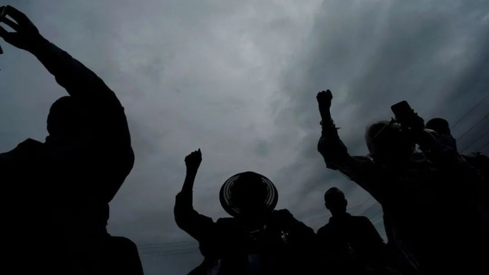
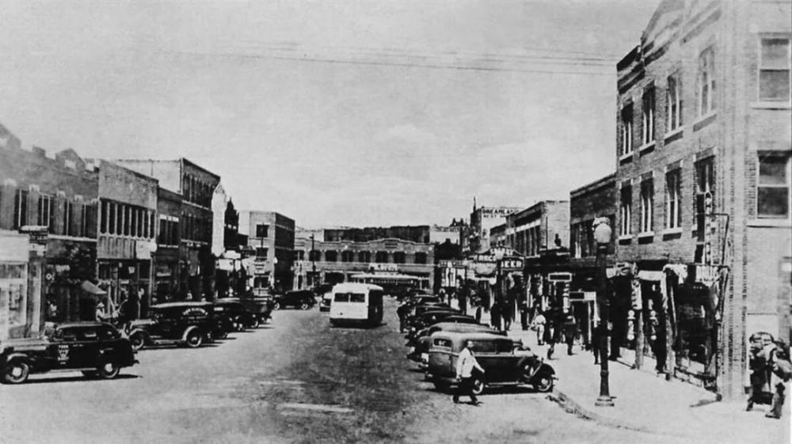
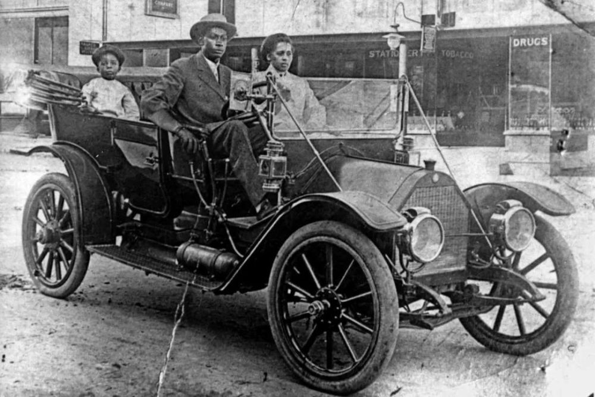
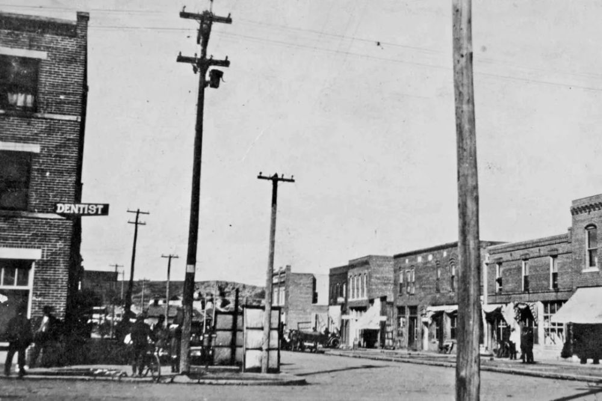
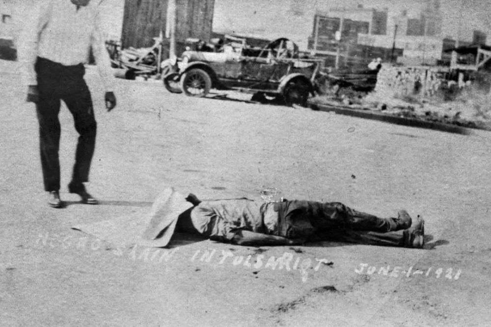
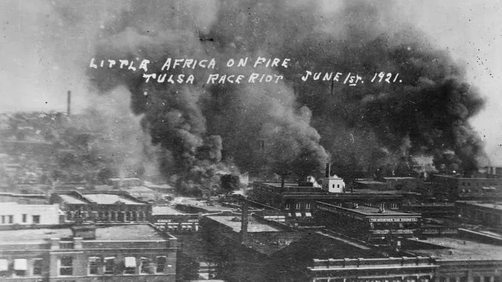
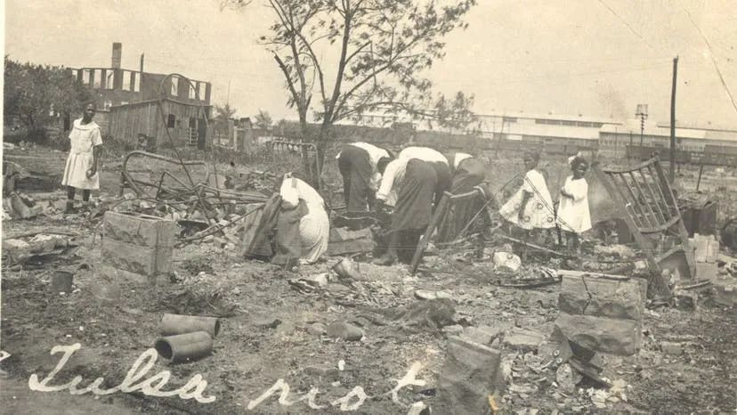
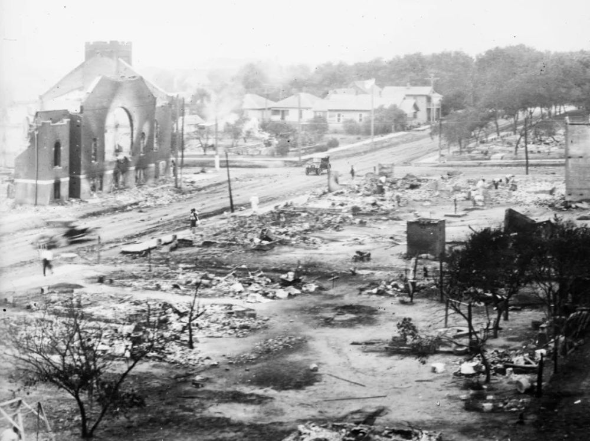
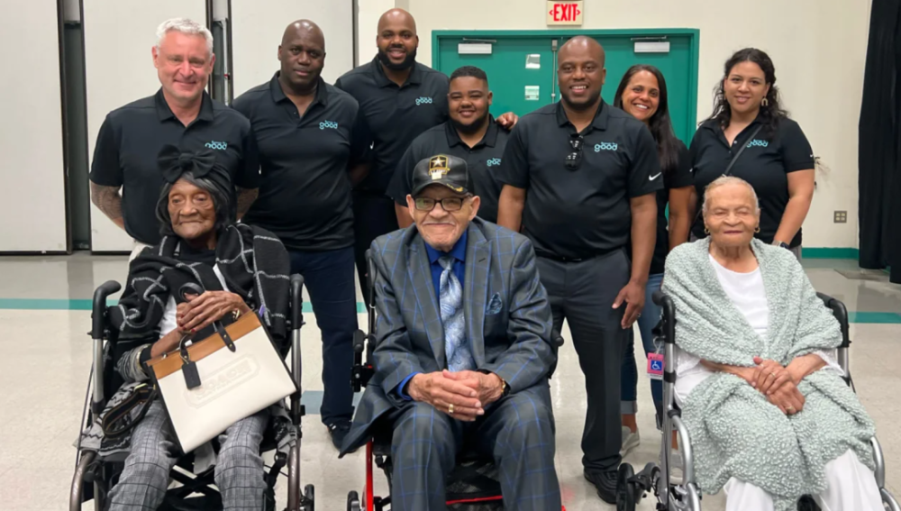

# 美国掩盖了100年的惨案，幸存者只剩3人

**塔尔萨大屠杀发生后的几十年里，**

**美国社会集体沉默。**

作者：于冰

“种族歧视”犹如美国社会的一块遮羞布，自美国建国以来，针对此事引发的社会事件屡见不鲜。

近日，3名年过百岁的塔尔萨种族大屠杀幸存者再次受到令人失望且不公正的遭遇。美国俄克拉何马州法官驳回了他们的索赔诉讼请求。

_2021年，人们参加塔尔萨种族大屠杀纪念活动。_

老人们于2020年依据俄克拉何马州侵害公共利益相关法律起诉，诉求包括就屠杀所致财产损失做详尽审计；在塔尔萨市北部新建一家医院；创立“塔尔萨种族屠杀受害者赔偿基金”。

老人们的律师表示，将就此案上诉，不讨回公道决不罢休。支持该诉讼的组织“格林伍德正义”在一份声明中说，法官无视3名幸存者遭受的痛苦，“这里没有正义，也没有诉诸正义的途径。”

塔尔萨种族大屠杀事件是美国有史以来血腥的种族暴力事件之一，但在美国历史书中却很少被提及。当时，一群支持种族歧视的白人冲进了塔尔萨市的一个黑人聚集区，烧毁上千栋住宅，这里一夜之间被夷为平地，造成数百人死亡、数千人受伤。塔尔萨大屠杀也被称为“美国历史上最严重的种族屠杀事件”。

另一个华尔街

“人人生而平等”，是美国建国者们提出的口号，但在1787年制定《宪法》时，保留了蓄奴制度，把黑人的平等权利有意地忽略掉了。

这种制度安排，和宣言当中人人生而平等的理念既矛盾又对立，给日后的种族矛盾埋下了祸根。

南北战争时期，美国时任总统林肯签署《解放黑人奴隶宣言》，从法律上废除了奴隶制度，黑人在名义上获得了自由，但又陷入“隔离但平等”的境地。

在种族隔离政策下，“白人是白人，黑人是黑人”，黑人就餐的地方白人不去，黑人居住的地方白人也不去，黑人工作的地方白人也不去，就连银行柜台、公共卫生间等公共场所也将白人和黑人隔离开来。

而且相比之下，黑人的权益永远比白人的更低一下，比如黑人只能从在剧场的后门进入，同样是饮水器，黑人的永远不好用。

在这样的大环境下，美国塔尔萨市却出现一个以黑人企业组成的富人区。

塔尔萨市位于俄克拉荷马州，该地原属印第安人，于1907年建州。后来，当地多个油田被陆续开发，到1919年，俄克拉荷马州产的石油已占全美产量五分之一。

石油让许多人钱包鼓了起来，塔尔萨也一跃成为俄克拉荷马州第二大城市，甚至拥有了比俄克拉荷马城更高的摩天大楼。

_当时的塔尔萨市区一派繁华景象。_

一些有远见的黑人看到了商机，他们不远千里来到这里，在城市开发热潮中通过开采石油和相关产业迅速积累起了财富。

许多黑人企业家在塔尔萨的格林伍德区发了财，他们不仅盖楼、做生意，还回馈社区，建造医院、学校、教堂、职业介绍所等等设施。很快，格林伍德变成了一个繁华的黑人商业区，被人们称为“黑人华尔街”。

在这里，黑人们穿着体面、文明礼貌、积极向上，甚至一些富有的黑人还拥有私人飞机，他们经常穿着正装优雅地吃牛排、喝红酒，家中甚至摆放连白人家庭都少见的钢琴，有些人的家里雇佣从欧洲移民来的白人做司机、佣人、园丁。

_约翰·威廉姆斯（中）在当地开了一家糖果店，他平时开车出门。_

住在塔尔萨的历史学家汉尼拔·约翰逊写了许多有关格林伍德的书籍，包括《黑人华尔街》。他说：“人们认为格林伍德是美国南方腹地逃避经济、社会和政治压迫的避风港。正是因为歧视黑人现象的存在，以及黑人在白人主导的经济中缺失发言权，才使得这里的经济如此繁荣，这是必然的结果。”

杀红了眼的白人暴徒

在格林伍德，黑人们不会因为肤色受到任何歧视，他们可以自由出入格林伍德的公共场所。但在塔尔萨市其他街区生活的白人居民看来，格林伍德的繁华碍了他们的眼。

_塔尔萨城市旧照。_

那里的黑人“不配”拥有财富和享受生活的权力，一些白人持有的报纸更将格林伍德的酒吧描述为“罪恶，不道德以及种族混合的源头”。

渐渐地，白人们对黑人的嘲讽逐渐变成了嫉妒。再加上美国种族质疑思潮在此时愈演愈烈，臭名昭著的白人至上主义组织3K党成员无处不在。

在塔尔萨周边地区，就活跃着几千名3K党分子。白人们似乎在寻找一个“找茬”的机会，而这时，一起偶然事件成为白人们动手的借口。

1921年5月30日，一个叫做罗兰的非裔擦鞋童进入一所大厦，使用有色人种专用卫生间后，准备乘电梯下楼，却不小心在进入电梯时绊了一下，并在摔倒时砸到了白人女孩电梯操作员的脚，女孩发出尖叫。

电梯到达一楼后，女孩向其他人大喊，自己被黑人袭击，不明所以的人们认为罗兰侵犯了白人女孩，将其抓捕。

第二天，罗兰一事被媒体疯狂报道。尽管白人女孩在冷静下来后更改了自己的指控，她认为罗兰可能只是因为摔倒而误碰了自己，但当地一些媒体却故意在文章中隐藏这一细节。

“塔尔萨论坛报”以醒目的大标题发表了文章《黑鬼因在电梯袭击女孩被捕》，并在文章中添油加醋地加了很多虚构的细节，意在激发白人读者的仇恨。

文章引起了当地白人的愤怒，报纸被抢购一空，很快便有一群白人暴徒聚集在罗兰被关押的监狱附近。由于监狱里流传着可能会对罗兰实施私刑的谣言，一群武装人员准备去监狱保护罗兰。

据目击者称，在嘈乱之中，一名黑人和一名白人扭打起来，不知道是谁开了一枪，随后，骚乱彻底爆发。

_一名非裔男性死于暴乱。_

6月1日凌晨两点多，近百辆载满了白人暴徒的汽车驶向格林伍德区，车上的人举枪对黑人住宅进行疯狂扫射，而那些暂住在白人区雇主家的黑人佣人，也纷纷被赶出了屋子。

根据《华盛顿邮报》的一份证词，暴徒们
“攻击他们所看到的每个黑人”。不久后，暴徒开始四处纵火。2个小时后，大火烧毁了数十栋黑人住宅和店铺，许多来不及逃跑的黑人被活活烧死。

然而，暴徒仍不肯离开，他们将黑人的尸体拖在汽车后面，开过塔尔萨市中心。

等到天亮后，白人又开着六架飞机向格林伍德投放燃油瓶等易燃易爆物品，继续以猛烈的火力攻击余下的区域。

据后来官方统计，格林伍德超过35个黑人街区被摧毁，更造成50多名白人和200多名黑人丧生，财产损失接近200万美元（相当于现在的5000万美元）。

_浓烟滚滚的塔尔萨。_

一百年过去了，弗莱彻依然无法忘记成排的房屋被燃烧，火光把天照得发亮，地上是横七竖八的尸体。

她说，“我永远不会忘记，我们逃离时白人暴徒的暴行。我现在仿佛还能闻到烟味、看到火光，我仿佛仍能看到非洲裔的商店被烧毁，我仿佛仍能听到飞机在头顶飞过，我仿佛还能听到尖叫声……”

暴乱发生后不久，幸存的数十名黑人向法院发起了诉讼。然而，一个全部由白人组成的大陪审团提交了99份起诉书，更荒谬的是，陪审团将责任推到黑人头上，其中有57份的被告都是黑人。

最终，这场形式主义的闹剧，以一个黑人因携带武器的罪名被关押30天收场，参与的白人暴徒却不用接受任何处罚。

大部分黑人选择离开这个伤心地，弗莱彻称，在一家人离开塔尔萨后，她也随之失去了接受教育的机会，“我生命中的大部分时间都在为白人家庭做佣人。直到今天，我几乎无法支付日常生活的所需费用。”

留下来的少部分黑人试图重建家园，却因塔尔萨政府在种族主义者的怂恿下，通过法案禁止黑人在格林伍德的重建工作，数千名失去财产的黑人只能被迫在帐篷中度过1921和1922年的冬天。

_人们试图在废墟中寻找家当。_

不让历史成为过去

遗憾的是，塔尔萨大屠杀发生后的几十年里，美国社会集体沉默。

直到上世纪60年代末，一位出生在塔尔萨的非裔美国政治家和新闻工作者唐·罗斯在其创办的报纸上发表了大屠杀的相关文章，此事才被人们关注。后来，罗斯进入俄克拉荷马州议会，成立了一个委员会来调查当年的事件。

最初委员会找到了一些格林伍德社区废墟的当年照片，讽刺的是，那些照片不是为了记录事件的恐怖，而是为了炫耀白人至上主义。

_大火过后的一片狼藉。_

2001年，该委员会发布了一份关于格林伍德区许多街区在当年遭受破坏的详细描述，并要求对幸存者及其家属进行赔偿，但被俄克拉荷马州议会和联邦法院以犯罪失效已过为由拒绝。

2011年，委员会在塔尔萨大屠杀90周年之际发布了一份报告。

《纽约时报》发现塔尔萨市乃至美国国内对大屠杀事件的意识正在提高：约有三分之二的塔尔萨市民表示，他们或多或少知道“塔尔萨种族骚乱”，之后不久，塔尔萨又开放了一个“和解公园”，里面设有纪念碑以纪念大屠杀的受害者。

但是，政府仍拒绝就此事进行调查、赔偿，更不肯将此事纳入历史记载中。同时，大屠杀的幸存者们逐渐年老去世，他们留下的只有那些证词。

_3名幸存者（前排坐轮椅者）都已是百岁老人。_

在2019年，美剧《守望者》的播出，该剧主角是大屠杀受害者的后裔，《守望者》将塔尔萨大屠杀事件进行了“重现”，也再次引发了美国社会对这一历史事件的关注。

此后不久，塔尔萨市市长宣布对大屠杀事件重启调查，其中包括在该城市街区的发掘工作，以查找和识别受害者，2020年2月，俄克拉荷马州教育部门表示将把塔尔萨大屠杀纳入“历史”课程。

正如弗莱彻所说，“我每天都在回忆这段大屠杀的历史，我们的国家可能会忘记这段历史，但我不能。”

总监制： 吕 鸿

监 制： 张建魁

主 编： 许陈静

编 审： 凌 云

