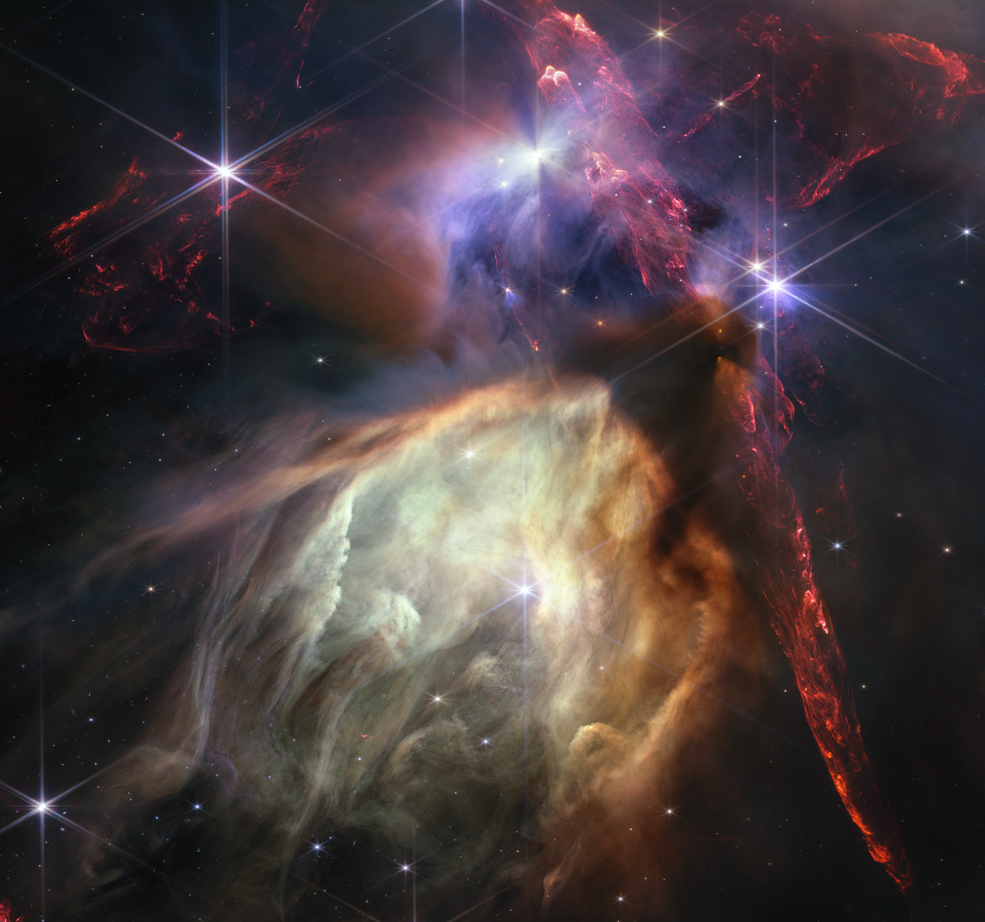

# 美国航天局发布恒星诞生“特写”图像

据央视新闻，美国国家航空航天局（下称美国航天局）当地时间12日发布一张由詹姆斯·韦伯空间望远镜拍摄的恒星诞生“特写”图像，纪念韦伯空间望远镜一年前首次发布科学成果。

_△詹姆斯·韦伯空间望远镜拍摄的恒星诞生“特写”图像（图源：美国国家航空航天局官网）_

路透社报道，这张图像的相关数据于今年三四月份取得，图像拍摄的是恒星“摇篮”——蛇夫座ρ星云复合体。这个星云复合体位于银河系蛇夫座方向，距地球约390光年，约有100万年历史，这对宇宙而言相当年轻。美国航天局发布的消息说，这个星云复合体相对较小，显得安静。

韦伯空间望远镜拍到的区域约有50颗年轻恒星，这些恒星的质量与太阳类似或比太阳小。其中一些恒星拥有标志性的原行星盘阴影，意味着其周边最终可能形成行星系统。图像中最暗的区域密度相对最大，那里有厚厚的尘埃，仍在形成原恒星，也就是恒星形成过程中的早期阶段。

图像上较引人注意的是其右部出现的巨大红色氢分子双级喷流。美国航天局解释说，当一颗恒星首次冲破宇宙尘埃的重重包裹，就会向太空发出一对方向相反的喷射流，宛如新生儿第一次张开双臂。

法新社援引美国太空望远镜科学研究所的天文学家克里斯蒂娜·陈的话报道：“在图像下方，你可以看到一颗年轻的恒星，能量极大……”

美国喷气推进实验室天文学家克劳斯·蓬托皮丹说，从这张图像可以看到新的“太阳”如何形成，“与我们认为的45亿多年前太阳系的样子非常相似”。

研究人员表示，蛇夫座ρ星云复合体的内核完全被大量尘埃掩盖，主要观测可见光和紫外波段的哈勃空间望远镜“基本看不见”它。韦伯空间望远镜主要在红外波段观测，因此其所获信息能够“透过尘埃显示其中的年轻恒星，展示恒星的最初阶段”。

韦伯空间望远镜由美国航天局与欧洲航天局、加拿大航天局联合研发，被认为是哈勃空间望远镜的“继任者”。它于2021年12月从法属圭亚那库鲁航天中心发射升空，去年7月其拍摄的首批深空天体图像发布。该望远镜的任务包括观测依据现有理论宇宙中的第一批星系如何诞生，协助研究星系演化各阶段，观察恒星及行星系统的形成等。

