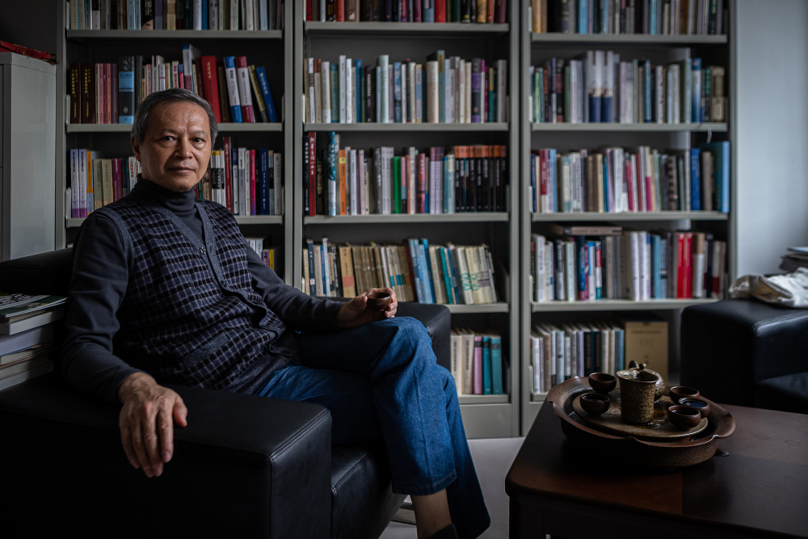
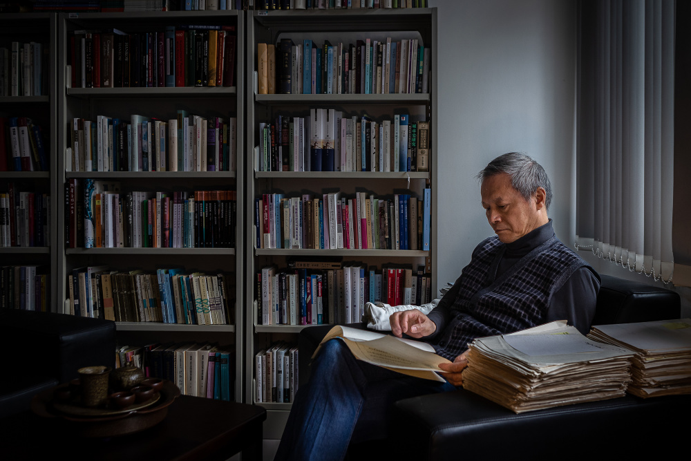
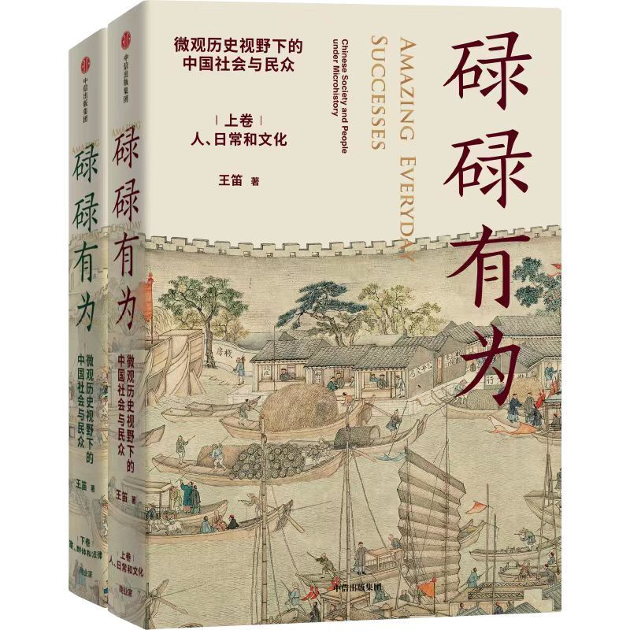
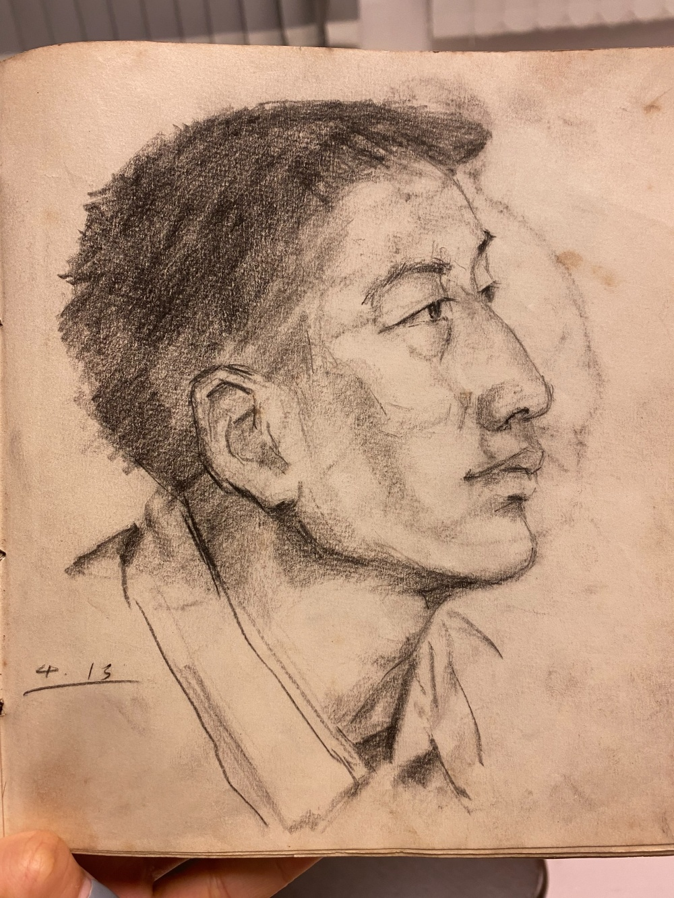
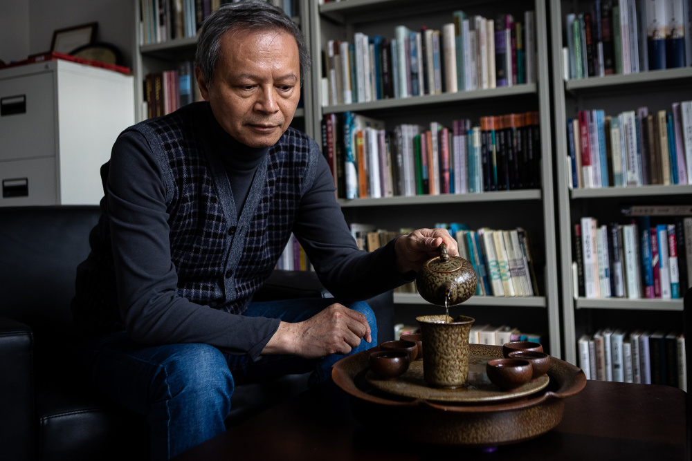
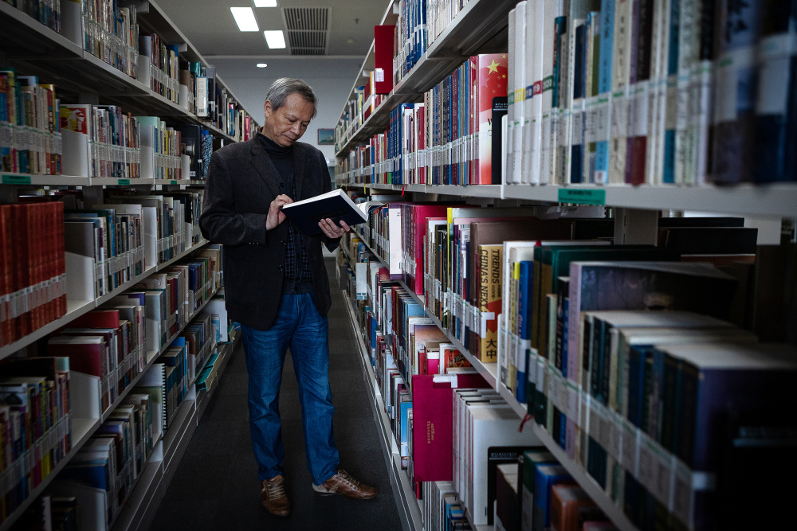
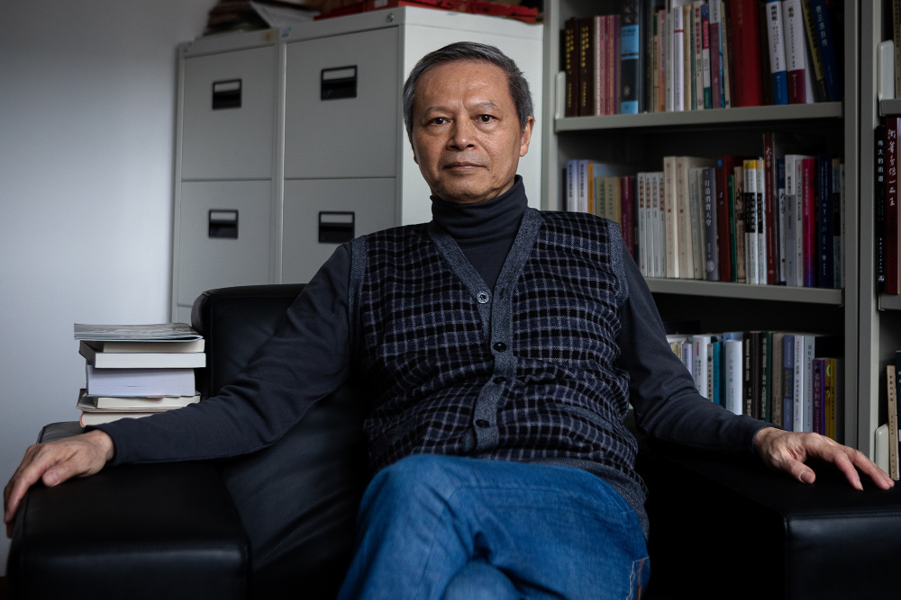
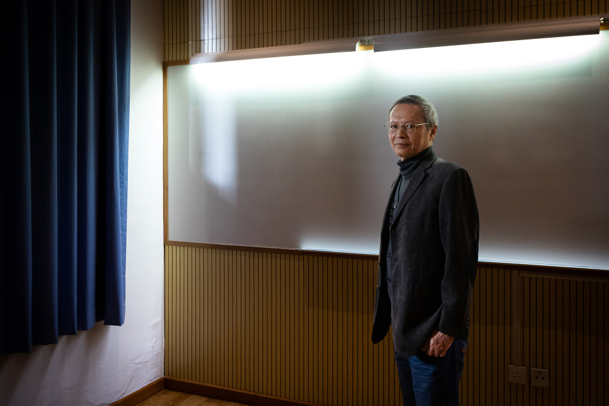
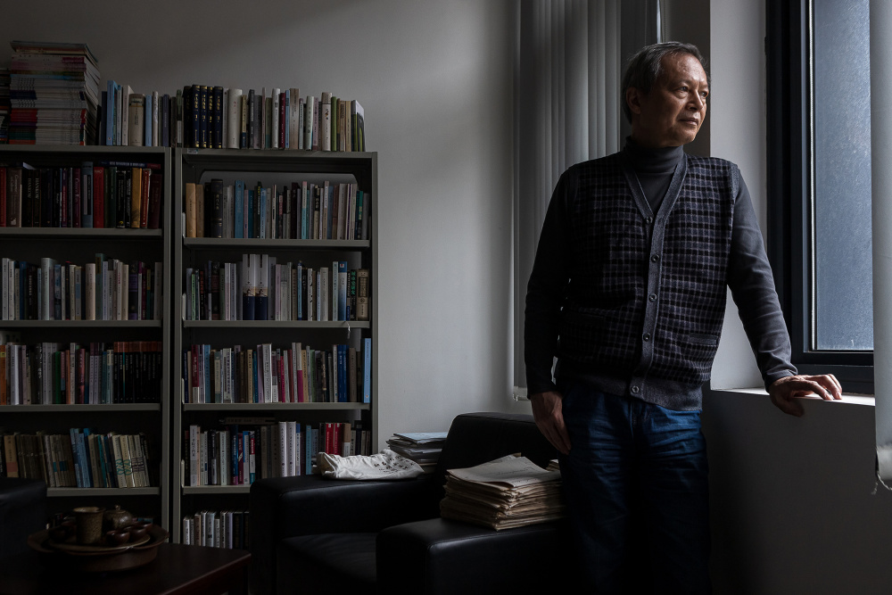
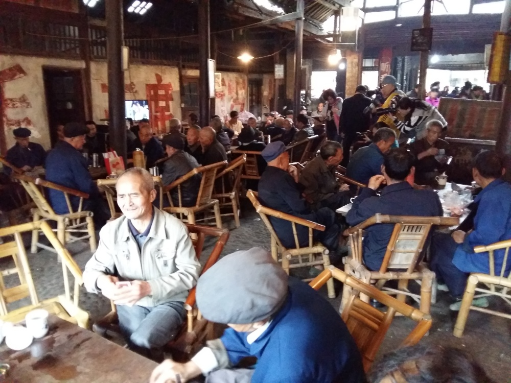

# 35岁出国读博，42岁当博士，他从四川街头茶馆里看透中国历史

“绝对的忠诚”

67岁的王笛自认是那种才智普通的历史学家。他记忆力不好，对一个研究历史的人来说，这算是致命的缺点了，他读过很多书，但内容都忘得差不多了。背单词也是，在美国得克萨斯A&M大学教了17年历史，英语还是说得缓慢，隐约带着点儿老家四川的口音，有时免不了被朋友笑话：“王笛一口川式英语。”

视力也不好，他在2014年视网膜脱落之后做了手术，但右眼随后发生了黄斑病变，这是一种不可逆的、让人眼中事物扭曲变形的疾病，书上的字在他眼里是弯弯曲曲的，字体稍小一点就无法辨认了。我们在他现在执教的澳门大学见面时，因为双眼视物不平衡，他踩空了台阶，差点摔倒。他有点不好意思，自嘲现在是一只“独眼龙”了。

无论先天或后天，王笛看上去都未能拥有成为一位博闻强识的历史学家的优势，但他还是击败了这些缺陷，成为了一位拥有国际声誉的学者。他是中国微观史学的代表人物，所谓微观史，简单来说就是书写普通人的历史，凸显普通人在历史当中的地位和价值。这并不是多么新奇的论点，对普通人的珍视早已成为文学、社会学的常识，但放在已经习惯宏大叙事和精英叙事的中国历史学界，为普通人写史依然是一件知易行难的事情。

王笛有时候会羡慕自己国外的同行，西方微观史发轫于上世纪70年代的欧洲，经过几十年的积累，研究成果已经蔚为大观。他在东京大学的图书馆里，看到关于东京城市史的作品摆满了许多个书架，大到城市发展
，小到社区街道、上水下水、吃喝拉撒等等。而在中国，微观史研究才刚刚起步，过往的史书和资料大都集中于记载帝王将相和社会精英的活动和思想，普通人很难留下自己的记述和存在的痕迹。这意味着做中国微观史的学者要耗费更多的时间和精力才能找到一点史料、拥有一点像样的研究。

过往的三十年里，王笛选择了这种更为艰难的工作，从上世纪九十年代至今，他出版的几乎所有作品（从《街头文化》《茶馆》《袍哥》到去年最新出版的《碌碌有为》）都在努力还原和书写普通人的日常生活，寻找那些微不足道的小人物在中国历史上留下的浅弱痕迹。

他写乞丐：

在有电风扇之前，夏天的饭馆十分闷热。20世纪20年代在（成都）东大街周围的饭馆里，人们经常可以看到一个乞丐和他的几个孩子，每人拿一把大蒲扇。父亲先给一个衣着体面的顾客打扇，然后又去给另一个顾客扇，他的孩子则接着为前一位顾客扇风。那些顾客吃完饭，会给他们留些饭菜，有时还会给几个钱。据说，这个乞丐最先发明这种“卖风”的方法谋生，因此被人谐谑地称为“风师”。——《消失的古城》

写小贩：

小贩的叫卖声成为成都城市之音的重要组成部分……即使是类似的商品, 小贩们仍可以用不同的鼓声来加以区别。卖菜油的小贩敲一面半月形的木制锣,
卖芝麻油的小贩打一个瓷碟大小的薄黄铜盘, 而卖其他食油的小贩摇晃拨浪鼓。卖豆腐的小贩敲个尺多长的空竹筒, 卖甜食、玩具和其他玩意儿的小贩, 最受孩子们欢迎,
他们敲击一面直径大约20厘米的黄铜锣宣布他们的到来。那些经营刺绣和价格稍贵的陶瓷的小贩, 使用的是直径比黄铜锣稍小一点的鼓,
其敲鼓的方式独特而有味道：使劲地敲打一下之后, 敲击的速度越来越快, 直到鼓声在风中持续不断地回响。这样即使在几百码以外的买主也能听到。——《碌碌有为》

在他那本最著名的的《茶馆》里，他写晚清的茶客：

有茶客把家务事也带到茶馆来做，这样喝茶、社交、家务三不误。他们坐在茶馆里，小菜贩沿着清冷的街市叫卖，他们总是买一点豆芽，堆在茶桌上，一根一根地撅着根。菜摘好之后，他不用同家里联系，家人自动会直接到茶馆里找他准备好的菜。家人与茶客如此默契，说明已经形成了一种习惯，他也不用动步，“只需千篇一律地关照道，多加一点醋，炒生一点，嗯！”

王笛几乎把整个职业生涯都放在了家乡这些在街头晃荡着谋生的社会下层人身上，除了上面提到的职业以外，还有算命先生、杂耍艺人、掏耳朵的、拾荒的、小偷……王笛的朋友、南京大学历史学院教授孙江告诉我，王笛性格沉静专注，很多历史学家喜欢打一枪换一个地方（比如他自己），但王笛对自己的研究对象保持了一种“绝对的忠诚”。

孙江觉得，传统的历史研究呈现的是一种单数的面相，是大写的“History”，而以王笛为代表的微观研究则呈现复数的面相，是小写的“histories”，“历史本来就应该是复数的，每个人都应该有自己的历史。严格地说是不存在单数的、统一的集体记忆，所有的记忆都应该是individual
memory，是个体记忆。”

我读王笛的书，印象最深的是他细致的脚注。《茶馆》里有一段写到居民们为了省柴火，习惯去附近茶馆买热水，单是这一句，他查阅了《成都文史资料选辑》《成都市商会档案》《滇黔川旅行记》和《成都大词典》，确认为了提供热水，燃料确是茶馆最大的开销，还看了《芙蓉话旧录》《成都的茶馆》《李劼人选集》《锦城七日记》和《川康游踪》，里面多次记录了居民们在茶馆里买开水的日常。

这些普普通通、看上去并不激烈的日常细节是王笛从浩繁的史料里一点一点打捞出来的，他的办公室里有九个黑色书架，分门别类摆满了各种书和史料，更珍贵的会锁在书架下面的柜子里，晚清成都的各种档案和地方报纸的复印件，被分门别类放在不同的文件夹里，每个文件夹都有细致的目录编号，“不然会乱。”他对那些资料的位置了然于胸，能很快翻出四十年前的一些档案给我看。

他很爱惜这些资料。在美国教书时，他每年都要回几趟成都，泡在成都档案馆里查资料和案卷，然后拿去复印。那是一个极其枯燥的过程，有时候坐一整天也一无所获，但只要有一两条有用的，他会高兴好半天。飞回美国时，他会把那些复印的资料随身携带，再重都绝不托运，“你是从无数的案卷中间选出来的，你第二次再去找不一定能找得到，所以我特别小心，我其他东西都可以丢，就这个不能丢。”

2015年离开美国回澳门执教时，他的个人物品没多少，但带回了整整25个纸箱的资料，“我搞到了，我就知道它的珍贵（笑）。”

日常的胜利

曾有一位成就斐然的华裔历史学家告诫后辈学者：“千万不要做第二等的题目。”那位老先生选择的都是有关国计民生的大题目，认为“唯有重要题材才能成就杰出的历史学家”。王笛心想，在老先生的标准下，自己这些题目应该都属于末流了。

“一个小人物，到底能够告诉我们什么？对我们理解中国历史有多大帮助？”这是王笛和微观史在中国时常需要面对的疑问。他的博士生焦洋在写博士论文时选择了自己很感兴趣的清末民初民间信仰，王笛很支持她，他认为民间信仰虽然在很多时候被认为是一种封建迷信，但它是过去的人日常生活里很重要的一部分，反映了人们如何看待世界和自己。但在博士论文答辩时，有一位老师很直接地问焦洋：“你觉得你做这个有意义吗？”

在2020年初的一次直播中，关于历史学到底应该研究帝王将相还是普通人，王笛和多年好友、中国人民大学清史研究所教授杨念群发生了一场争论。杨念群认为：“历史学家研究历史的时候，往往会发现历史不是由群众决定的，而是由帝王将相所决定的。当下历史研究者都走向民间、走向田野，与此同时，帝王将相在中国历史上的作用，历史学家还是没有搞清楚。”

三年之后的现在，杨念群更加坚定了自己的观点，他在电话那头告诉我，“帝王，不管你是批判他还是拥戴他，他在中国整个历史上的作用和地位就是核心性的。中国和西方不同，我们的历史就是建立在皇权对民众的压制、控制和规训基础之上啊，帝王的一个决定可能会造成老百姓灾难性的后果，我们要解释历史，你说是老百姓的这种作用大呢，还是他的作用大？”他知道自己的这种观点常常会被理解为为帝王辩护，“但我仍然觉得更重要的应该是理解上层的这种意志，对你的规训，对你的安排，到底它背后的逻辑是什么。”

听完杨念群的话，王笛表示了反对，他不赞成“回到”帝王，他觉得在中国的历史研究里，其实就没走出去过。

王笛在《历史的微声》中写：“我们应该有多种角度观察历史，要走出帝王史观。如果用民众史观看待帝王的开疆辟土，就会发现那些帝王基业带给那个时代普通老百姓的从来都是血淋淋的历史。”

他查阅过资料，世界历史上10个死亡千万人以上的战争，中国独占了五个。“帝王的确是在对历史发生影响，但我不能说他是在推动历史，当一个帝王发动一次战争，把社会打得稀巴烂的时候，是谁在把它重建，不是帝王，而是每一个普通的人，他们逐步地通过几年、几十年，甚至半个世纪，这样把它（建起来）。农民在地里劳动，工人在工厂做工，做生意的人在市场上买卖东西，他们每时每刻都在进行生活和劳作，这样经过几十年、几百年、上千年，文化和文明就是这样创造出来的。”

王笛觉得这种对帝王将相和社会精英的关注，不仅仅是历史学界的学术问题，它最终影响的是普通人的自我认知，“人们觉得历史的创造者就是英雄、帝王和知识精英，这种史学观灌输给普通人的就是：来到这个世界上，我们就是要出人头地，要做人上人，不然就是虚度一生。内卷、鸡娃、家长对子女的期望过高等问题，都和这个有关。你怎么能碌碌无为地过一生？”

他新书最终选了“碌碌有为”这四个字，是编辑起的，英文名是Amazing everyday successes,
日常的胜利，王笛很喜欢这个题目，他觉得碌碌也是一种有为，“绝大多数人来到这个世界上，学习、上班、结婚生子、抚养子女和老人，每天的日常其实就是对社会的贡献。中华文明就是一代又一代的普通人创造的。所谓的载入史册的惊天动地的事情，往往是大灾难，大动荡，改朝换代。一年又一年的日常生活，似乎是无趣的，但其实是我们的福分。”

王笛说，他之所以反复强调要从帝王史观、英雄史观转移到民众史观和日常史观，还有一个重要的考量，就是对国家权力太大的一种反思，一个健康的社会应该是公民有充分责任感、能够表达个人诉求的社会，而不是一切由国家来包办。否则，这个国家只会变得死气沉沉，缺乏活力，无法经受住意外事件的打击。

他相信普通人的日常是更柔软也更有韧性的事物，在做茶馆研究时，他发现20世纪初期的成都大约每天有12万茶客，在抗战时期，茶馆被认为是鼓励懒惰、滋生罪恶、甚至误国误民的地方，有人说：“假使坐茶馆的人把时间用在革命事业上，中国革命早就成功了。”一些人试图为茶馆辩护，王笛查到1942年《华西晚报》的一篇文章：“我辈吃闲茶，虽无大道成就，然亦不伤忠厚。未必不能从吃茶中悟得一番小道理。不赌博、不酗酒、不看戏、不嫖娼，吃一碗茶也是穷人最后一条路。”最后落款是，“老乡写于茶楼上。”

王笛觉得，那是一个普通人为茶馆所做的极为有力的辩护，但是在当时国家话语强大的霸权下，即使是茶馆的捍卫者，内心也缺乏信心，认为也许社会在进步之后，茶馆终将消亡。但此后一百年，茶馆经历了大跃进、“文革”、改革开放、市场经济、国际化……时代日新月异，人们来来去去，许多东西都烟消云散了，但传统坐茶馆的生活方式竟然熬过漫长时间保留了下来，王笛查过资料，到2000年，成都有3000多家茶馆，而整个民国时期，成都茶馆也不过是600家左右。

他常引用自己在《茶馆》里最后写的一段话，“在过去的50年里，他们所光顾的茶馆，他们视为理所当然的坐茶馆生活习惯，竟一直是国家权力与地方社会、文化的同一性和独特性较量的‘战场’。他们每天到茶馆吃茶，竟然就是拿起‘弱者的武器’所进行的‘弱者的反抗’。这也即是说，弱小而手无寸铁的茶馆经理人、堂倌和茶客们，在这50年的反复鏖战中，任凭茶碗中波澜翻滚，茶桌上风云变幻，他们犹如冲锋陷阵的勇士，为茶馆和日常文化的最终胜利，立下了汗马功劳。”

史家不在意小人物和日常，钟情于大人物和大事件，究其根源，王笛觉得也许出自于历史学家的某种野心，“像司马迁一样，究天人之际，通古今之变”，他们希望通过总结历史的经验教训，找到某种历史发展的规律。这个问题王笛思考了很久，他的结论是：历史也许是没有规律的，未来的进程也是不可预测的。

他曾经做过一些关于太平天国首领石达开的研究。1862年5月14日早上，石达开带领部下到达大渡河，对面没有清军，“如果他当时渡河，是完全有时间的。”王笛说，但他的小妾那天生了儿子，为了庆祝，石达开决定当天不渡河，结果当天晚上下了暴雨，第二天河水暴涨，石达开只能等着雨停渡河。后面有追兵，前面清军已经到了对岸，石达开最终困在一个叫紫打地的地方，全军覆没。

“历史之所以没有规律和不可预测，是因为任何历史都可能受到各种因素的影响，无论是大的还是小的影响，甚至一个非常偶然的小事情，就可能改变历史。”王笛说。

在《历史的微声》的最后，他写道：“当我们相信历史决定论，便会相信未来是按照某种规律向前发展的，实际上也就是停止了独立的思考，停止了对未来的探索，把命运交给了那些被认为可以实现那些规律的人手中……每一个人在历史中都会扮演一个角色，对历史多多少少发生影响……对于历史研究者来讲，最好放弃发现历史规律和写出整体历史的雄心壮志，历史是个体的，是复杂的，是丰富多彩，又是变幻莫测的。我们要认真地对待历史，但是不要人为地幻想创造历史。”

“这就是我要安身立命的东西”

在去年澳门大学的一节课上，王笛给学生们展示了他为《那间街角的茶铺》画的几幅插图，那是他自己对照着一些成都老照片画的，有小巷、茶水灶，堂倌、还有茶客们在茶馆里坐着聊天的场景，线条生动，栩栩如生。王笛自己也很得意，“我觉得画得很好，就忍不住想给学生们看看（笑）。”

_©《那间街角的茶铺》_

在成为一名历史学家之前，王笛的人生理想是当个画家。我们在他澳门的办公室喝茶聊天，找资料的时候，他从文件柜里翻出了自己四十年前的素描本，里面是他画的“文革”时期自己在砖瓦厂烧砖时的工友，他后来想，自己对底层民众的关注，也许就起源于那段经历。

他出生于一个成都知识分子家庭，父亲是一本音乐杂志的编辑，母亲从事美术工作，他从小在四川省文联大院里长大，邻居是作家流沙河先生，小时候他和哥哥喜欢去老先生家里听故事。

刚高中毕业时，他想当个画家，尽管母亲认为他并没有太多天赋。后来考艺校，从小一起玩的周春芽考上了，后者一度有过“在世最贵艺术家”的称号，但王笛由于政审原因没有被录取，画家的愿望很快破灭了。后来他想上大学，为了获得工农兵身份的推荐资格，他主动选择去眉山下乡，干农活，他卖力地表现，甚至克服了害羞的个性，主动参加宣传队给农民讲相声，但即使如此，“（推荐）一点希望都没有。”

1975年，王笛开始在砖瓦厂烧砖，那几年是他最迷茫和无望的阶段。他干的是极其沉重的体力劳动，那时候他很瘦，拖着一板车的砖坯，在大型的环形轮窑里进进出出，窑里的火一直烧着，烧完了，取出来，再装进去，如此循环往复。在高温的窑里待一会儿，出来时全身的汗和灰都会混在一起，整个人都是黑的，只有眼睛在转。这种强度，他和其他工人们常常累到抽筋。

他和二三十个工人一起住在一个大工棚里，工友们在一天的体力劳动之后，总是睡得很早，八九点就已经很安静了。但王笛总是在灯下熬到十二点，要么画画，要么读书，第二天五六点就要起来做工，他时常感觉到睡眠不足导致的头脑昏沉，“你很想睡觉，但是又不甘心睡那么早，总是说想要做点事，如果不做点事，不看点书，就觉得好像真的一点前途都没有了。”直到现在他都觉得很奇怪，那是个提倡“读书无用论”的时代，“没有人要求读书，也不主张读书，反而是一些年轻人读书最自觉的时代。”

工友们人都很好，也许出于一种对读书人的尊重，王笛记得，几个月下来，没有工友说他亮灯到太晚，影响别人睡觉。工棚里没书桌，几个工友用废弃的木条拼到一起，给他做了一张简陋的桌子。王笛直到现在依然对那份善意感念于心。

我们一起翻着那本保存了四十多年的速写本，纸页有些发黄发脆了，但仍能看出那些铅笔素描有着很细致的笔触，他告诉我是哪位工友，还有工友的妻子、女儿和工友养的小狗。王笛后来离开了那座工棚，考上大学、赴美读书，一步步成为中国社会的知识精英，但他后来想，也许正是那些善良淳朴的工友，在他还没有意识到的时候，就悄然赋予了他某种平民的而非精英的视角。

_王笛的画
©张月_

不过，从更严谨的历史学研究方法上来说，王笛依然经历了漫长的摸索。他从四川大学毕业之后留校任教，之后花费数年时间写出了自己的第一本专著《跨出封闭的世界——长江上游区域社会研究（1644-1911）》。那本书写得很艰苦，朋友马敏（后为华中师范大学历史学教授、校长）去成都看王笛，他住在一个10来平米的宿舍里，满屋子都是资料，由于住的是顶楼，夏天尤其热，他就打着赤膊，搭着毛巾，一边擦汗一边在纸上写。

现在回看，王笛也许有些“悔其少作”。这本出版于30年前的书迄今仍是研究长江中上游社会史的重要书目，他现在还会遇到拿着这本书找他签名的学生。但他觉得《跨出》归根到底还是从现代化精英的角度来看待社会变化，那时候的精英普遍关注一些很大的问题：国家政权、经济问题、社会弊病、专制以及西学东渐等。在讨论民风民俗时，他使用了“懒惰作风”“惰性”以及“社会不良风气”等词汇，谈到民间信仰时，也将其归于一种“迷信”。“我当时的主要观点是，把传统的丧失和现代因素的出现都认为是社会进步的必然结果，并给予积极的评价。”他想，当时的自己还是无意识地服膺于某种精英的“文化霸权”。

如今，王笛早已完成了对自己的“反动”，破除了关于“现代化”的迷思，“虽然‘现代化’给城市带来了较宽阔平整的街道、新的设施、相对‘文明’的城市面貌以及跟随时代的娱乐形式，但这一切是以民众逐渐失去代代相传的相对稳定的传统和生活方式为代价的。而且，城市公共空间和公共生活的重建，经常并非是以民众利益为考虑的，也并不容许他们对此享有平等的权利。所以，对大多数下层民众来讲，我们或可以这样认为：他们失去了一个旧世界，但并没有得到一个新世界。”

王笛在学术上真正将目光转向日常和普通人，是在美国读书时。1991年，他赴美做访问学者，后来在霍普金斯大学读博。他的博士导师是罗威廉（William
T.Rowe），一位当代颇负盛名的汉学家，他对中国城市汉口的研究被美国学术界认为是里程碑式的著作，他的研究更强调从社会入手，而不是局限于管理、政府、权力。有同行记得他去调研湖北麻城时，对当地的山水典故甚至比当地人还要熟悉。

罗威廉推荐王笛读了很多国外微观史著作，包括《奶酪与蛆虫》《蒙塔尤》《屠猫记》《马丁·盖尔归来》等等。看那些作品时，王笛发现，同行们通过很小的人和事，就能深刻透视和解读当时的社会、思想和政治。让他印象深刻的是，《屠猫记》里，作者达恩顿对一个法国印刷学徒所写下的杀猫取乐活动进行了文本分析，为什么会发生虐猫呢？因为在学徒房里，师傅的妻子最喜欢的猫过着某种“资产阶级的生活”，吃得比学徒们还好，还叫春，于是引发了学徒们虐猫的活动。那些普通的恶作剧最终指向的是法国社会当时日益尖锐的阶级冲突。读那些作品时，王笛很多次感叹，“其实历史研究的价值不是由研究课题本身的重要性来决定的，不是说我选了个大题目，我选一个一流题目，那天生我这个东西就重要了。历史研究的价值在于研究的眼光和历史解释，他们能从平淡无奇的、好像是无意义的事情里，去发现认识和理解历史的深刻内涵。学问做到这个样子，那才是做得好。”

后来，他决定从微观入手，研究和自己离得更近的成都茶馆。

那时他时常从美国飞回成都做调查，他是内向腼腆的人，但很快发现在茶馆里进行田野调查非常容易，只要同桌喝茶，大家无话不谈。他记得有个茶馆有位算命先生，过来要给他算命，但没有一件事情是算准了的。于是王笛建议，咱们还是聊天吧。算命先生意外地发现王笛有点文化，马上回家去拿了一本用文言文写的算命书，他看不懂，让王笛教他，于是，王笛就在茶馆里教一位算命先生如何算命，分手时，算命先生依依惜别，盼他改天再来。

每次和茶馆里的人聊完，王笛会手写一份考察笔记。我在他那里看到一份2000年6月7日在成都集乐茶馆的日记，他会把哪怕最微小的日常都记录下来，他写：

20岁左右的矮个农民模样的人也在茶馆里进进出出，同那堂倌很熟，问得知是门口摆自行车摊的，一会儿还从茶馆门口拖出一把大的遮阳伞来，惹得刚睡醒觉的女堂倌嚷着，“没客坐在那里时你不拿，有客时你却来拿。”

《茶馆》里还有一章写到四川曾经很庞大的秘密组织袍哥会在茶馆里“吃讲茶”，这是过去人们解决纠纷的一个最常见的形式，就是说双方有了矛盾，请一个中间人——经常由袍哥来充任——到茶馆里去评判是非。王笛和袍哥没有直接交往，但母亲小时候的一位亲戚是袍哥，为人很好，每次来，都给她带糖果。母亲告诉王笛，成都刚解放时，这位亲戚也被招去开会，回来说：“改朝换代了，穷人的好日子到了，袍哥死到临头了。”当天晚上他就自杀了。

王笛希望把这些小人物的命运记录下来，“在分析社会演变时，我更加注重下层民众的反应，以及他们与精英和国家权力的关系，并考察民众如何为现代化付出代价，同时揭示他们怎样接受、怎样拒绝他们所面临的变迁。”

他告诉我， “虽然早年我研究的是大题目，但是格局却很小，而今天我集中在比较小的题目，但自我感觉格局却大多了。”

也许是因为和自己的生命体验更接近，在写《茶馆》时王笛找到了一种过往做学术从未有过的愉悦和轻盈，早上起来写作时，都会带着一种兴奋感。他花了将近十年的时间完成了这本书，前后一共修改了12个版本。在这个过程中，他一点一点确认了这就是自己要安身立命的东西。每次回国都很不方便，他要从得克萨斯A&M大学的小机场坐螺旋桨小飞机，飞到达拉斯或者休斯顿再转机回中国，这种飞机让人感到很不安全，王笛每次上飞机都会在心中祈祷：“千万不要掉下来，我的茶馆还没有完成，把它完成了我才能安心去死。”

吾道不孤

王笛执教的得克萨斯A&M大学位于得州大学城，从1998年到2015年，他在这里教了17年东亚史。

A&M大学历史系有50多名教员，他一直都是系里唯一一位华裔教授。学校有着独特的农业州的文化，毕业生自称是Aggie（农夫），校园称为Aggieland（农国)，校歌是Spirit
of
Aggieland（农国之魂）。学生见面打招呼说Howdy(一种下里巴人式的hello)，“给人的感觉就是土得掉渣，但他们很为自己的传统骄傲。”王笛说。

这是一座安静的小城，王笛从家里开车到学校只需要10分钟。他在这里过着一种十分朴素的生活，少有玩乐，“我对高大上的东西似乎不感兴趣，”学校一进门就有一个巨大的高尔夫球场，但他工作了十多年，从来没有没有去过，有朋友笑话他是洋土豆。

2002年春节，朋友马敏去得克萨斯探望王笛，他们一起吃了一顿丰盛的火锅，马敏告诉我，他和王笛交往多年，无论在四川、美国还是澳门，王笛招待朋友吃饭通常都是吃火锅，“他自己生活很简单，要么披萨，要么汉堡，要么就是自己随便弄个方便面，他拿不出什么很像样的。”马敏的夫人厨艺好，看不过去，做了几顿饭，她忍不住问：“这样生活不是太辛苦了吗？”王笛说：“生活过得去就行了，关键是在这做学问。”

在马敏印象里，当时王笛勤奋而刻苦，既要写自己的书，又要准备上课的内容，有时候和他们在一起聊到晚上八九点，王笛会说：“你们接着玩，我得去备课了”。

用英语写作和表达，对王笛来讲始终是不容易的事情。他语言底子很差，1991年初到美国时，35岁的他连people都会拼错。那一年在密歇根大学做访问学者，对方邀请他做关于《走出封闭的世界》的报告，包括韦思谛（Stephen
Averill）、费维凯（Albert Feuerwerker）、李侃如（Ken
Lieberthal）在内的知名学者都来听。那天，他在台上磕磕绊绊地念完了自己的稿子，但到提问环节时，他完全听不懂别人的问题，“或者好不容易搞清楚别人问的问题了，结果你想说的话又表达不出来。”他在台上支支吾吾，很是难堪，现在回想起来，“真是一场disaster（灾难）”。

后来主办方把那些问题收集起来，打印出来给了王笛，那张纸直到现在他还保留着。他不是那种容易气馁的人，他把那次失败视为一种鞭策。此后他每天听收音机、看电视，看英文文章，一点一点学，硬着头皮参与课堂讨论（有时候答非所问，但下次还说），他记得每天都被学习填得满满的，几乎没有时间做别的，最幸福和轻松的时间是晚上躺在床上那一刻，一天终于结束了。

在澳门，王笛很认真地告诉我，“如果现在说所谓有点成果的话，其实都是时间堆出来的，我真正靠的是自己的努力，而不是自己的才能。”

美国宾夕法尼亚大学历史系教授王希是王笛的好友，他告诉我，王笛那一批留美学者“他们来美国时大都已经年近三十，有的甚至是过了而立之年才重新当学子的，美国大学的史学博士训练主要内容是大量的阅读、激烈的课堂讨论和严格规范的论文写作，这一切都必须以对语言的熟练掌握为基础，学历史的留学生所受的磨练要比理工科的留学生艰难许多，需要有不屈不挠的意志和非史学莫属的信念才能坚持下来。”

这是一条苦寂的道路，有几位英语比自己好很多的同行就放弃了，但王笛从来没有，“我一直相信我能够把博士论文写下来，可能曲折一点，可能要花的时间要多，但是我从来没有想过放弃。如果我读完博士还是找不到工作，再不济我就回川大嘛（笑）。”

1999年，在日本的孙江在学术杂志Modern
China上看到了王笛的论文《街头文化》（王笛在这篇论文的基础上完成了他的博士论文，后来发展而成的专著于2005年获得美国城市史学会最佳著作奖），此时距离他和王笛上一次见面已经过去了将近十年，那时他们还是国内的年轻学者、后起之秀，后来王笛去了美国，孙江去了日本，此后再无联系。读到这篇论文时，孙江正在东京大学读博，已经在考虑放弃学术这条看上去很是无望的道路。

孙江喜欢历史研究，但在异国他乡的几年，语言不通，生活清贫，立足艰难，他感觉自己撑不下去了，想着也许应该下海做一点生意，赚点钱，或者办个报纸也行。他仔细读完了这篇署名Di
Wang的论文，心潮难平，那么多年过去了，那个比他大七岁、在记忆里已经有些面目模糊的朋友还在这条路上，姿态沉默而坚韧，拿出了有分量的作品，“吾道不孤啊。”孙江心想。

孙江后来没下海，也没去办报，他读完了博士，此后教书、做研究，成为了中国研究晚清民国社会转型的著名学者。在电话那头，他笑声爽朗，“他（王笛）还在那儿孜孜不倦地拼搏着呢，那我老孙也不能放弃，还得好好研究啊。”

“做真诚的学术”

澳门大学位于珠海横琴岛上，种了很多小叶榕和旅人蕉，学校中间还有一大片人工湖，阳光好的时候，湖面会闪闪发光。王笛喜欢这座四季都有花开的校园，2015年在选择回国执教时，他考虑了许久，一方面觉得自己年纪大了，想回到一个语言上更亲近的地方，但另一方面也希望能够保留研究的自由，最终选择了澳门。

在一个快要退休的年纪里，王笛依然保持着年轻时的勤奋。他醒得早，有时候甚至四点钟就爬起来对着电脑写作，阳台窗外依稀可见环抱着澳门的宁静海湾。他常跟学生说的是，要保持每天写作的习惯，哪怕几百字也行。

_澳门大学校园
©张月_

为了保护仅剩的左眼，他把看书都改成了听书，兜里总是装着一副黑色蓝牙耳机。琐碎时间如打扫卫生、洗碗、从家走去办公室，他都在戴着耳机听书，体量小一点的，两三天就能听完。他阅读的范围极其广泛，除了学术书籍以外，他会读包括非虚构，如卡波特的《冷血》和盖伊·特里斯的《邻人之妻》，回忆录如董时进的《两户人家》，也对新出版的作品保持热情，比如班宇的《冬泳》、杨本芬的《秋园》等，有一次还给博士生们推荐了马伯庸的书。在他看来，“审视自己是否还有学术创造力的量度之一，就是看是否对新书还保持着强烈的阅读愿望和好奇心。”

在澳门大学，王笛的住处空荡荡的，看上去有点孤寂，学校给公寓配了简单的家具，大部分教授都会添置一些新的，但王笛什么都没有买，我们见面那天，有拍摄的环节，他穿了一件灰色西服，那是十几年前买的。澳门大学离繁华的购物中心很近，但王笛极少去，对他来说，学校的超市已经够用了。

也许是因为年纪的关系，王笛有一种时间上的紧迫感，
他最近看到一篇文章，盘点了2022年去世的历史学家，国际和国内加起来，他认识的就有十个。美国印第安那大学历史系副教授张信和王笛相交多年，他记得王笛在回澳门跟他前与他相互鼓励，“我们应该在真正老之前，多写点东西出来。”

以前没有课的时候，他就去四川田野调查，但过去这三年的大部分时间，他哪儿也去不了，只能被困在这个小岛上。虽然频频出书，在外界看来十分高产，但他并不满意，他告诉我，那大都是一些书评、文集和回忆录，真正新的、来自田野调查的学术成果很少。在2021年出版的《那间街角的茶铺》里，王笛在后记里有感而发地写过这样一段，“我现在太老，已经不能旅行，而且疫情严重，外面的世界也不安宁。被困在距成都千里之外的小岛之上，有了很多的时间回忆往事，经常坐在那里遥想过去，要不就是翻阅我一生所攥集的这一大堆破纸烂片。”

恢复正常之后，他加速袍哥的一个大部头的写作，分三卷本，正在写第一卷，我们结束采访的第二天，他就要去内地做田野调查，他将我送出校门，自己跑着回宿舍收拾东西去了。

王笛希望此后的作品也都能发自本心。学生安邵凡记得，毕业的时候吃饭，王笛告诉他，要做真诚的学术，做经得起时间考验的东西，“要有一个自己真正感兴趣的东西，不要太被当下所裹挟，有一些课题很容易申请，或者是发表机会很多，但是那个不是从你本心出发的东西，你要经得住诱惑，不去碰那些东西。”

2020年初，王笛主动辞去了《中国历史前沿》的主编职务。这是一本他和四川大学教授原祖杰共同主编的英文学术季刊，从2009年起投入了十年心血。杂志原本只是一个译介平台，把中文论文翻译成英文，但王笛和原祖杰严格按照国际办刊规则，付出了巨大的努力，邀请许多欧美研究中国的顶尖学者在上面发表原创文章。“应该说我们把一个新刊做到全球知名。有一次我们做一个评审活动，邀请美国那边一些知名学者给我们做一些反馈，他们对我们评价很高，是做中国史的学者是必读的一本刊。”原祖杰告诉我。

这本杂志现在又回归到了只做翻译的最初。 王笛感到很难过，“这是历史的悲哀，也是我们自己的悲哀。”

和那些付诸东流的努力一样，写新书时王笛也渐渐意识到，在成都，熟悉的日常也正在缓慢地消失。以前他每次从美国回来，父母总会告诉他，哪里哪里又修了新房子，哪里又有了新街区，父母很高兴，而王笛总觉得很惋惜，他曾经熟悉的大慈寺周围，原本是一片很大的老街区，他早年做调研的时候，拍了许多很有历史感的照片，现在这个老街区被拆除之后，成了繁华的太古里。

很大程度上，他们只能自我激励。在几位学生的眼里，王笛这些年接受采访和对外发声的频率明显提高了，在《碌碌有为》和《历史的微声》的一些新书活动中，他反复表达一个观点，我们需要一个强健的社会。“当一个历史学家也是挺痛苦的。有时候觉得是错误的，也只好通过隐讳的文字来表达。但我就是觉得还是要表达，你既然有这个思考，如果不表达出来，可能对我来说也是一种折磨，也许表达出来也没有什么效果，那也没有关系。”

在朋友眼里，王笛是那种很少动摇的学者。他始终相信，人们内心对日常缓慢而恒久的坚持可以抵御变动不居的时代。2015年，他在一家名为观音阁的茶馆里拍到过一张照片，一位额头上有着深刻皱纹、满头白发的大爷在和朋友打牌。他偶尔有一次翻2019年的照片，发现那位大爷又出现在了照片上，还是在老地方喝茶、打牌。2021年，疫情期间，王笛托四川大学的学生去帮忙寻访，学生很快找到了这位甘大爷，然后告诉王笛，“两张照片上甘大爷的对家胡大爷，也仍然在那里打牌。”后来王笛又去了好多次，每次他们都在那里，“他们真是永远不会让我失望，一直在这儿。”那家茶馆老板曾告诉王笛，有些老人会一直在那里喝茶，去世送葬的时候会在茶馆绕一圈，家人从茶馆里买一碗茶给他进献了再送走。对此王笛十分感慨，对那里来来往往的游客来说，那只是一个打卡地，一个特殊的文化遗留；但是对于这些老人来说，就是他们生活的世界，一年又一年，他们能够在这里安安稳稳地度过他们的每一天，直到离开这个世界，这难道不是一个非常有意义、宏大的历史叙事吗？

他的办公室里摆着那家茶馆的照片，我们的葡萄牙摄影师对此很感兴趣，王笛也很高兴，拿便签纸上给摄影师写下了观音阁茶馆的地址，认真叮嘱他：“你一定要去看看。”

_2015秋，甘大爷（左）与胡大爷（后面那桌左起第二人）
©王笛_

感谢林少阳、杨斌、赖军、张璇、李磊、王雨、刘书慧、姜云珂、李麒鸣、陈绪源为本文提供的帮助。

作者 | 张月 编辑 | 张瑞 摄影 | Eduardo Leal 出品 | 腾讯新闻 谷雨工作室

版权声明：腾讯新闻出品内容，未经授权，不得复制和转载，否则将追究法律责任。

