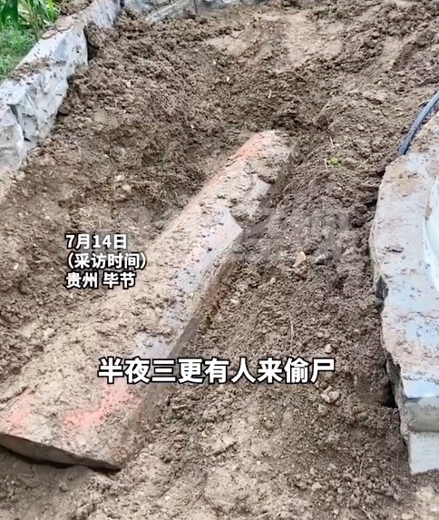
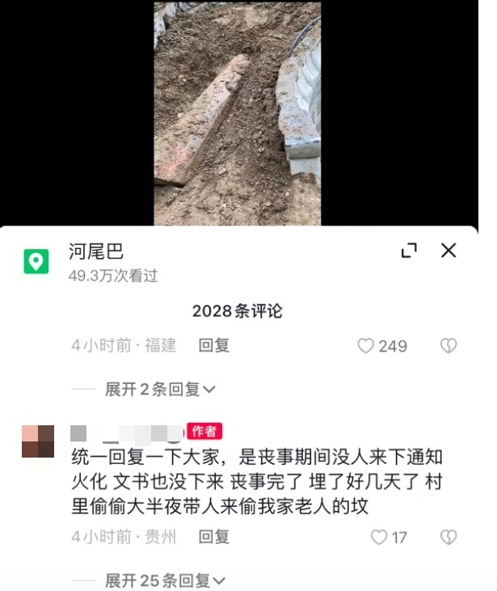

# 90岁老人下葬不久尸体半夜被偷？警方：当地不准棺葬，刨墓对尸体火化

据经视直播报道，7月14号，有网友爆料，在贵州省毕节市黔西县中坪镇凉风村，一位90多岁老人刚下葬不久，尸体就被人偷走。

视频中，女子称：“半夜三更有人来偷尸，把我爷爷这个棺材抬开了，把我爷爷尸体偷走了。”

据当事人账号，她表示：丧事期间没人来下通知火化，文书也没下来。丧事完了，埋了好几天了，村里偷偷大半夜带人来偷我家老人的坟。

7月14号，记者联系了当地派出所，派出所民警表示确有此事，已经出警现场了解。原因是当地正在进行殡葬改革，不允许棺葬，人死后要去火化。

民警称，该老人死了后，家里人不配合火化，工作没有做通，所以当地政府工作人员和殡改工作人员就刨开了坟墓，对老人尸体进行了火化。

**【来源：九派新闻综合经视直播、当事人账号】**

