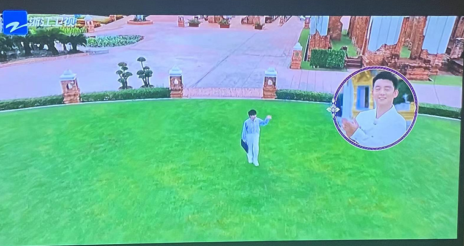

# 《奔跑吧》延期后播出，未见蔡徐坤身影

今（14）日上午，综艺节目《奔跑吧》发文宣布延期两周的节目将在今晚播出。

据悉，这期节目原定于6月30日播出，但《奔跑吧》官微却突然在节目播出当天下午六点发文：“因编排调整，原定今晚播出的《奔跑吧》将延期播出。”巧的是，在节目组宣布延期时，蔡徐坤深陷网络传闻。对于网曝事件，蔡徐坤7月3日回应了之前网传与一女子发生一夜情导致其怀孕并让其打胎的传闻：与C女士有过交往，不存在涉未成年和强制堕胎。

从6月23日节目组发布《奔跑吧》泰国篇预告可得知，原定6月30日播出的节目中蔡徐坤有参与录制。

但在今晚播出的泰国篇节目中，却未见蔡徐坤的身影。对比节目预告片，今晚播出的《奔跑吧》疑似把蔡徐坤P掉了。

6月23日节目预告片

7月14日节目播出片段

6月23日节目预告片

7月14日节目播出片段

C位成了空气？

编辑 苏静

