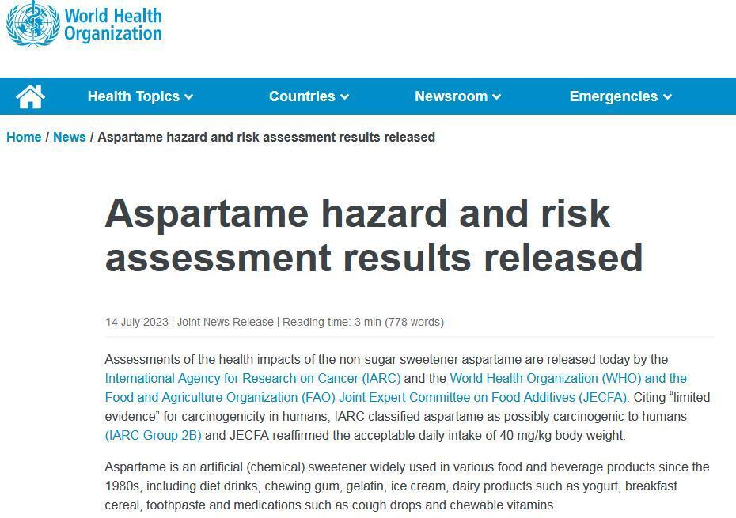

# 世卫组织：阿斯巴甜可能致癌，一天喝9罐汽水会超安全限制

中新经纬7月14日电
据世卫组织官网14日消息，国际癌症研究机构(IARC)、世界卫生组织(WHO)和粮食及农业组织食品添加剂联合专家委员会(JECFA)今天发布了阿斯巴甜对健康影响的评估结果。

IARC引用了对人类致癌的“证据有限”，将阿斯巴甜归类为可能对人类致癌(IARC 2B组)，JECFA则重申了40mg/kg体重的可接受每日摄入量。

_来源：世卫组织官网_

阿斯巴甜是一种人工(化学)甜味剂，自20世纪80年代以来广泛用于各种食品和饮料产品。

“癌症是全球主要的死亡原因之一，每年有六分之一的人死于癌症。”WHO营养与食品安全司司长表示，阿斯巴甜的评估表明，虽然安全性不是常用剂量的主要问题，但已经描述了潜在影响，需要通过更多更好的研究进行调查。

JECFA的结论是，评估的数据表明没有足够的理由改变先前
确定的阿斯巴甜每日可接受摄入量(ADI)0-40毫克/公斤体重。因此，委员会重申，一个人每天的摄入量在这个限度内是安全的。例如，
**假设没有从其他食物来源摄入其他食物，一罐含有200或300毫克阿斯巴甜的无糖软饮料，一个体重70公斤的成年人每天需要消耗9-14罐以上才能超过可接受的每日摄入量。**

评估结果指出，IARC和JECFA对阿斯巴甜影响的评估基于从一系列来源收集的科学数据，包括同行评审论文、政府报告和出于监管目的进行的研究。这些研究已经通过独立专家的审查，两个委员会都已采取措施确保其评估的独立性和可靠性。

与此同时，IARC和WHO将继续监测新证据，并鼓励独立研究小组就阿斯巴甜与消费者健康影响之间的潜在关联开展进一步研究。(中新经纬APP)

