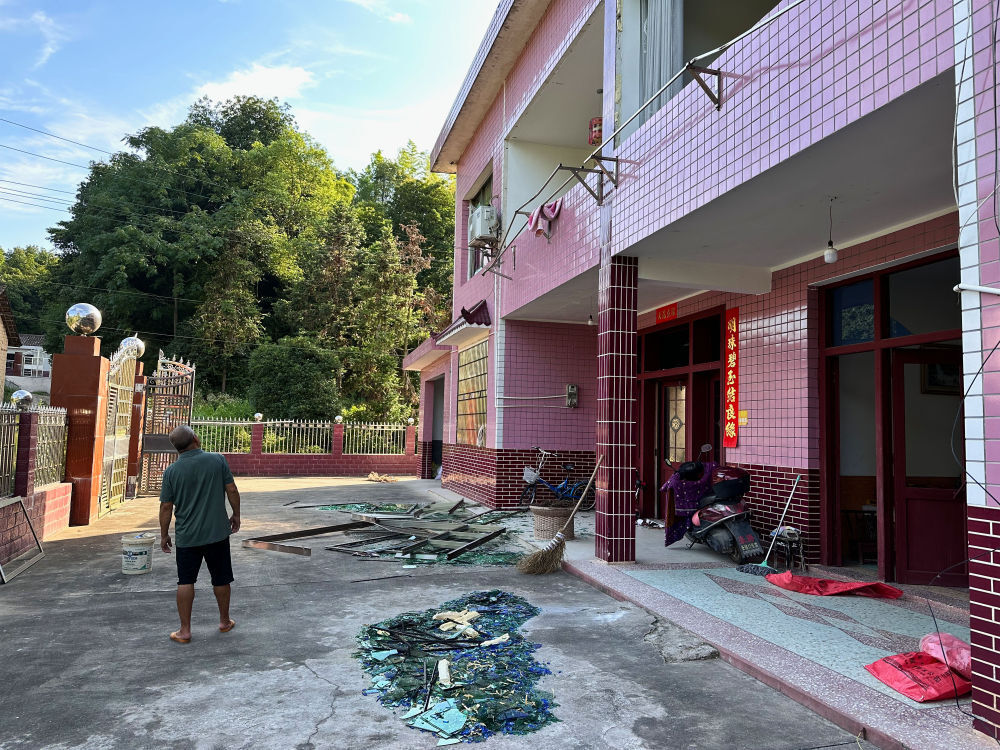

# 养猪场为何发生爆炸？湖南醴陵非法生产烟花爆炸事故调查

7月11日凌晨4时许，湖南省醴陵市板杉镇竹花山村一家养猪场发生一起非法生产烟花爆竹爆炸事故，造成5人遇难，2人失联。据调查人员介绍，涉案养猪场主已被公安机关控制。

养猪场里为何发生烟花爆炸事故？“新华视点”记者赶赴事故现场展开调查。

**“谁也没想到里面居然会生产烟花爆竹”**

近期，板杉镇竹花山村最高气温逼近37摄氏度，气象部门发出高温预警。按照当地部署，烟花爆竹生产企业已陆续进入高温停产期。

11日凌晨4时许，村里一家养猪场传来爆响，打破夜间寂静。“一瞬间，窗户玻璃粉碎，外面火光冲天。”住在距离养猪场百余米的刘姓村民对记者回忆说，“还以为地震了。”

_11日，村民正在清理受损的门窗。（新华社记者 谢奔 摄）_

记者在现场看到，周边数户村民家铝合金大门、窗户都已严重变形，屋门口散落着厚厚的玻璃碎渣，房屋内部一片狼藉，还有村民房屋墙体出现裂痕。

记者发现，发生爆炸事故的养猪场夹在两山之间，地理位置非常隐蔽。周边村民说，没有发现养猪场平日有什么异样。鉴于卫生规定，加上异味较大，外人一般不会接近。“经常在晚上看到有两辆车停在养猪场门口，但只当是有人来打麻将，谁也没想到里面居然会生产烟花爆竹。”一名村民说。

_这是7月11日记者拍摄的事故现场。（新华社记者 谢奔 摄）_

据了解，这家名为“民旺生态养殖场”的养猪场在当地经营多年，法人代表是刘某军的妻子。

经初步调查，今年6月底，刘某军把养猪场内一个仅有60多平方米的猪棚，出租给邻镇村民李某中进行非法烟花爆竹生产。他们从外地购置原料，昼伏夜出，组织工人通宵作业，疑似制作俗称“狗尾草”的小型烟花产品。

一名参与事故处置的应急管理部门干部估计：“引发此次爆炸的炸药量级可能在100公斤以上。”醴陵市公安局有关负责人透露，包括刘某军在内的7名涉案嫌疑人已被控制，李某中在此次事故中遇难。

**暴露多重监管漏洞**

烟花爆竹产业是醴陵的支柱产业之一。数据显示，当地有170余家从事烟花爆竹生产的注册企业，从业人员超10万人。

非法生产是烟花爆竹行业的痛点和风险点。“非法作坊往往在安全管理上有严重缺陷，危险性极大。”一名烟花爆竹行业监管干部表示，有关安全生产规范对企业厂房建设、生产环节物理隔离、原料定量堆放、人员持证上岗等方面有严格要求，比如一次加工药量不能超过3公斤，实施单人单间操作等。但非法作坊的硬件设施、人员素质等都远远达不到要求。

虽然相关部门下了很大力气治理，但非法生产烟花爆竹屡禁不止。据醴陵市公安局统计，今年以来醴陵侦破非法制造、储存爆炸物刑事案件31起，采取刑事强制措施54人；2022年这组数据分别为59起、88人。

违法者为何铤而走险？一名烟花爆竹行业从业者说，相比正规经营，非法生产省去了投资建厂、安全管理、缴税等多方面成本，利润率可能高出3倍以上。记者从公安、司法机关了解到，李某中在2021年曾因非法制造、储存爆炸物获刑，此次事故发生时，他仍处在缓刑执行期间。

多名从业者和监管人士反映，眼下不少烟花爆竹生产企业的库存清空，一些人“押宝”年末行情好，利用夏天淡季“抢生产”。另有监管部门人士告诉记者，养猪场作坊非法生产爆竹的工人每晚工资或可达上千元。

值得关注的是，烟花爆竹在生产、销售的“两头”监管存在安全漏洞。

多名应急管理部门干部表示，虽然监管部门要求原料生产厂家严格核实购方安全生产许可资质，但操作层面不乏有挂证、造假证等方式“钻空子”的情况。在销售层面，非法生产作坊惯用的一个手段，是通过“走后门”进入有证生产厂家完成“变身”，或者直接“山寨”正规厂家的外包装，盗用其安全生产许可编号，流入批发市场。

此次事故还暴露出一些非法生产作坊隐蔽性强、监管难度大的问题。板杉镇派出所民警表示，这家藏匿在养猪场的非法作坊选址隐蔽，只在夜间生产。板杉镇分管安全生产的干部说，此前确实不曾进入养猪场排查。这种人工生产爆竹的方式不使用大型设备，灵活性很强，一旦把原料和产品搬离，监管者很难发现生产痕迹。

另外，一名监管部门干部指出，部分基层单位责任落实不严，有的甚至存在利益牵扯，排查工作流于形式，形成监管盲区，让非法生产有机可乘。

**警惕隐秘角落里的风险，完善基层联防联控**

11日，湖南省应急管理厅召开全省安全生产“打非治违”暨烟花爆竹安全监管工作紧急视频会议。12日，醴陵市启动烟花爆竹“打非清剿”行动，强调对非法生产要“严查、严打、严管”。

湖南浏阳、醴陵，江西上栗、万载，四个县市是全国烟花爆竹产业集聚区，产量占全国85%以上，也是生产烟花爆竹的重点监管区域。

多名公安、应急管理部门干部认为，目前烟花爆竹行业监管出现两极分化：正规生产企业的监管越来越严格、规范，而处在“隐秘的角落”的非法生产活动则越来越隐匿，且出现向非主产区外溢的苗头。

一名从事烟花爆竹行业监管的干部表示，以前非法生产窝点大多位于偏僻地区的废弃民房、厂房，随着打击力度不断加大，这些窝点不断变换场所，流动性也大大提高。“有的在高层电梯民房里生产，有的在货车货厢里流动生产，‘打一枪换一个地方’，及时发现和打击的难度很大。”

“非法生产烟花爆竹活动还呈现小规模、碎片化组织生产的趋势。比如这次的养猪场窝点，不用电、不用机械、不挑场地，技术门槛低，拉几个有经验的当地人就能搞生产。”这名干部对记者说。

受访应急管理部门干部建议，治理和打击非法生产应着重管好“两头”——在原料端，加强对违规销售易制爆危险化学品的打击力度，严格落实原料流向管理；在销售端，加强对经销商经营合规性的督查检查。总之，让非法生产窝点“原料进不来，产品出不去”，斩断其利益链条。

另一方面，应强化落实烟花爆竹主产区跨地区交叉检查、联合执法等监管举措，加快推进统一、标准化管理制度，对区域内原料、产品流动开展“一盘棋”治理。

受访干部还建议，针对非法生产监管，各部门权责关系应进一步明确，可探索建立公安、应急管理、市场监管等部门之间的综合联动机制，强化指挥协调，压实各部门监管责任，通过全链条上下游的持续打击震慑，形成监管合力。

与此同时，还需推动安全监管力量向基层安监站、村组干部、网格员等延伸，建立常态化非法生产排查机制，完善基层联防联控机制，加大突访、暗访力度，谨防干部成为“保护伞”。

来源 新华社 | 作者 席敏 谢奔 刘芳洲

编辑 李拓

流程编辑 刘伟利

