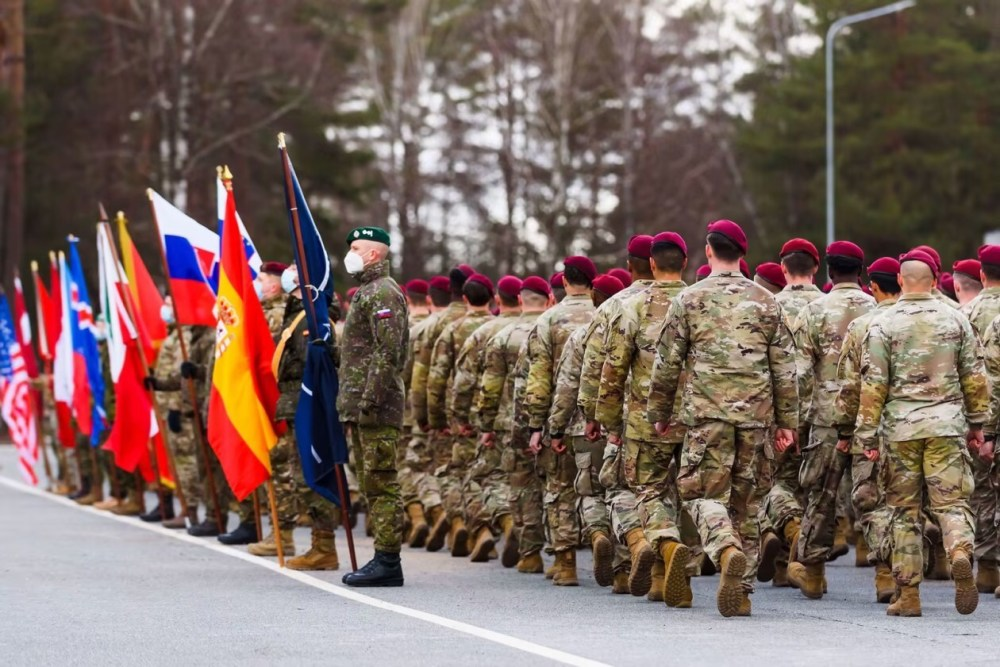

# 北约欧洲盟军最高指挥官：北约处于完全战备状态 人员“已增加700%”

【环球网报道 见习记者
黄泽佳】据美国海军研究学会（USNI）网站当地时间7月13日报道，北约欧洲盟军最高指挥官和美军欧洲司令部司令克里斯托弗·卡沃利11日在立陶宛举行的北约峰会上表示，处于完全战备状态的北约部队人员数量“已增加700%”。

报道称，卡沃利表示，北约正在向位于北极、北大西洋、南欧以及东南欧等地区部署军力，“这是北约集体防御现代化的新蓝图”，这一态势与北约此前在阿富汗等“域外”地区的行动相比有巨大转变。北约军事委员会主席罗伯·鲍尔表示，北约的战备升级工作针对的就是来自俄罗斯的“威胁”，这也是北约自1949年成立以来的首要任务。

_北约快速反应部队
资料图 图源：美国有线电视新闻网_

卡沃利还提到，在过去一年内，北约已有规模达30万士兵的部队达到最高战备等级，加强战备的工作已经完成了70%。报道继续称，根据他的说法，北约未来将重点演练各盟国之间的大规模联合行动，演习应该包含更多把俄罗斯视为对抗力量的“难以驾驭的场景”。

与此同时，罗伯·鲍尔表示，北约部队和后勤的机动性对上述“蓝图”的实施至关重要，目前在欧洲运输装备、人员、弹药、备件、燃料和食品方面并不容易，为此北约需要打造一套新的后勤以及指挥控制体系。

报道具体提及，拉脱维亚总理卡林斯，该国的防务支出将在明年达到国内生产总值（GDP）的3%。爱沙尼亚总理卡拉斯则认为，这超出了北约设定的2%的目标。报道说，目前，已经有11个北约成员国完成了北约对军费开支的要求。卡拉斯还称，北约应该立即着手重建弹药库存和物资预置体系。

报道还称，拉脱维亚总理卡林斯表示，拉脱维亚“重新引入了征兵制”以加强武装部队的实力。除此之外，拉脱维亚还购买了更多的防空和海岸防御系统，并从美国引进了在俄乌冲突中一度大出风头的“海马斯”高机动火箭炮系统。在基础设施方面，拉脱维亚正在建设一个占地25平方公里的训练基地，以容纳未来增派至该国的北约部队。

报道还提及，加拿大总理特鲁多表示，乌克兰武装部队在冲突中展示了训练的价值。他称渥太华在2015年至2022年间通过西方装备和战术培训了3.5万名乌克兰军人，而这种培训未来将在拉脱维亚继续进行。“俄罗斯无法击败一支拥有现代装备、训练有素的军队”，特鲁多说。

北约在立陶宛召开领导人峰会之际，俄罗斯国家杜马（议会下院）主席沃洛金当地时间12日表示，俄罗斯计划在向乌克兰提供装备的西方国家使馆外展示被摧毁的北约装备。“把摧毁的（北约）装备放置在向乌克兰提供武器的国家使馆旁的提议特别有趣。”沃洛金说，他将下令组织这样的展示活动。路透社称，俄罗斯官员一再批评西方国家向乌克兰提供武器，认为此举可能会延长冲突并导致冲突进一步升级。

