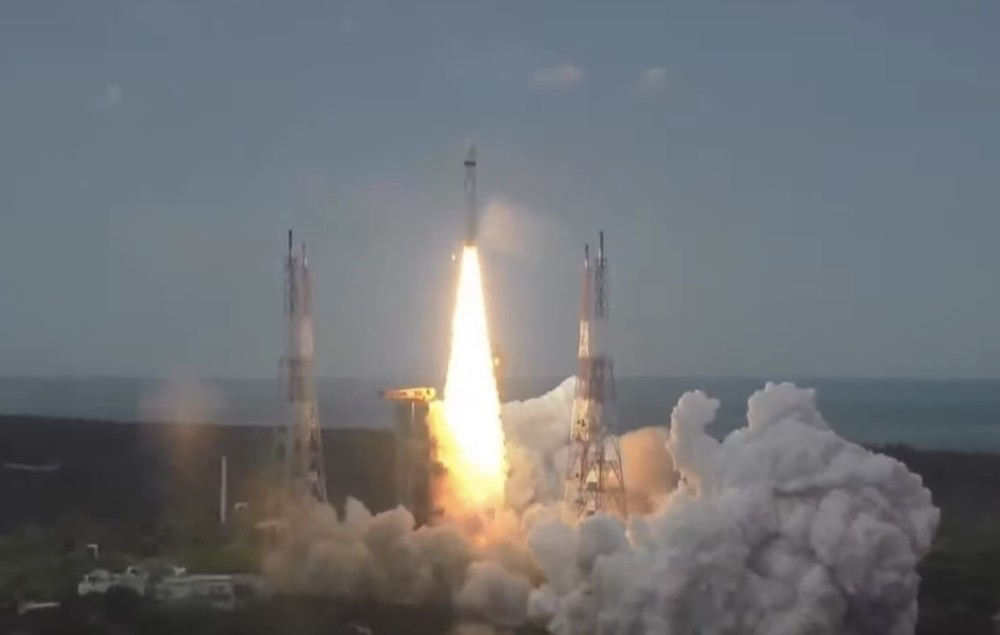

# 印度再把目光投向月球：第三次探月任务“月船3号”发射升空

印度第三次探月任务“月船3号” 计划实现印度首次登月。如果该任务8月着陆成功，印度将成为第四个在月球表面软着陆的国家。

“月船3号”
预算不到7500万美元。这次发射还有一个次要任务：表明印度对私营部门太空竞赛持开放态度。自2020年印度向私人发射开放以来，印度太空初创公司数量增加了一倍多，去年底更是发射了印度首枚私人制造火箭。

_印度第三次探月任务“月船3号”的着陆器和月球车搭乘印度空间研究组织LVM3火箭从印度萨迪什·达万航天中心升空。_

印度把目光投向月球。当地时间7月14日14时35分许，印度第三次探月任务“月船3号”（Chandrayaan
3）的着陆器和月球车搭乘印度空间研究组织（ISRO）LVM3火箭从印度萨迪什·达万航天中心升空，计划实现印度首次登月。

“月船3号”由着陆器“维克拉姆”（Vikram）和月球车（Pragyan）组成，两者携带了科学仪器。如果一切按计划进行，着陆器和月球车将在8月23日左右在月球南极附近软着陆，在月球表面开展14天科学活动。如果着陆成功，印度将成为继美国、前苏联和中国之后第四个在月球表面软着陆的国家。

月球南极拥有永久阴影的陨石坑，这些陨石坑有可能容纳可观测数量的水分子。为确保安全着陆，“月船3号”汲取了2019年“月船2号”软着陆失败的教训，印度空间研究组织对第三次月球任务做了修改。它还携带了从月球上观察地球的有效载荷，研究可居住的类行星特征，并利用这些信息探索未来的系外行星。2米高的“维克拉姆”着陆器携带了4个有效载荷，用于研究月震、月球表面如何允许热量通过、等离子环境，以及更准确地测量地月距离。月球车上的两个载荷将使用X射线和激光研究月球表面的成分。

据《卫报》报道，“月船3号”
预算不到7500万美元。这次发射还有一个次要任务：表明印度对私营部门太空竞赛持开放态度。自2020年印度向私人发射开放以来，印度太空初创公司数量增加了一倍多，去年底更是发射了印度首枚私人制造火箭。新德里马诺哈尔·帕里卡尔国防研究和分析研究所顾问Ajey
Lele表示，此次探月任务的成功将提升印度的全球地位，并为商业航天带来间接利益。

印度的探月任务可以追溯到2008年。印度第一个月球探测任务“月船1号”于2008年10月发射升空，轨道器携带11件科学仪器，分别来自印度、英国和美国等。2018年，“月船1号”上一台来自NASA的矿物学绘图仪收集的数据帮助探测到了月球上水冰的存在。

11年后，印度第二个月球探测任务“月船2号”于2019年7月22日发射，旨在让月球车登陆月球南极。“月船2号”的轨道器成功绕月飞行，但在2019年9月7日，“月船2号”的着陆器在预计软着陆前几分钟坠毁于月球表面，印度首次探测器登月尝试失败。

“月船3号”是印度第三次探月任务，也是印度第二次尝试将探测器送上月球。尽管“月船2号”的着陆器和月球车撞毁了，但据space.com报道，“月船2号”任务并非完全失败，其轨道器至今仍在研究月球。

但登月并非易事。今年4月，日本商业航天企业ispace开发的月球表面探测项目“HAKUTO-R”的着陆器在执行着陆进程后，地面团队无法确认着陆情况。后来根据数据分析的结果，着陆器撞击到月球表面的可能性较大，探月计划未能达成。

1976年，苏联发射了“月球-24”号着陆器，而俄罗斯历史上还没有向月球发射过航天器。中断47年后，俄罗斯“月球-25”号探测器将于2023年8月发射。“月球-25”号的名称延续了上个世纪月球使命的编号，同样计划降落在月球南极地区。

