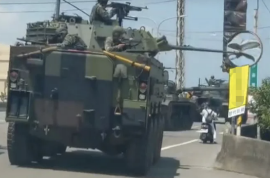

# 台陆军演习出意外，八轮装甲车炮管撞上路旁反光镜，画面曝光！

【环球网报道】据台湾《联合报》13日报道，台陆军第六军团13日上午在桃园市大园区进行演习时，一辆八轮装甲车炮管不慎擦撞路旁反光镜造成损毁。台军方称，将负起赔偿与维修责任，并强化安全管控。

_台陆军八轮装甲车炮管撞上路旁反光镜
图自中时新闻网_

报道称，台军第三作战区近期密集实施“汉光39号”演习实兵操演各项科目预演，13日上午一辆八轮装甲车在桃园市大园区竹围道路上操演时，炮管意外扫到路旁交通设施，被后车拍到流传在网上。

台军官员称，此事发生主因是这辆装甲车在演习过程中炮塔要转向“敌情”出现的方向，但没有注意到道路周边的反光镜，来不及反应，因此发生擦撞。事后单位也做出检讨，会再教育官兵，提高演习过程中的风险意识和警觉。

台湾“中央社”称，台陆军第六军团指挥部13日晚间发布新闻稿称，已通报桃园市警察局大园分局。六军团也说，已主动联系桃园市政府大园区公所确认路段责任，将负起后续赔偿、维修事宜。

_“每次演习都有小插曲，搞笑演习，问题出在哪里？”有岛内网友针对此事评论说。_

_也有网友直呼“丢脸”。_

_还有人称，“我看不是来演习的，是来（捣）乱的！”_

