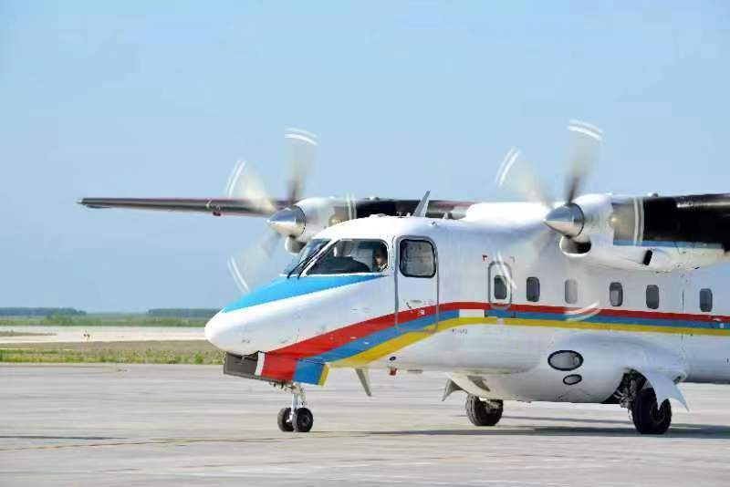
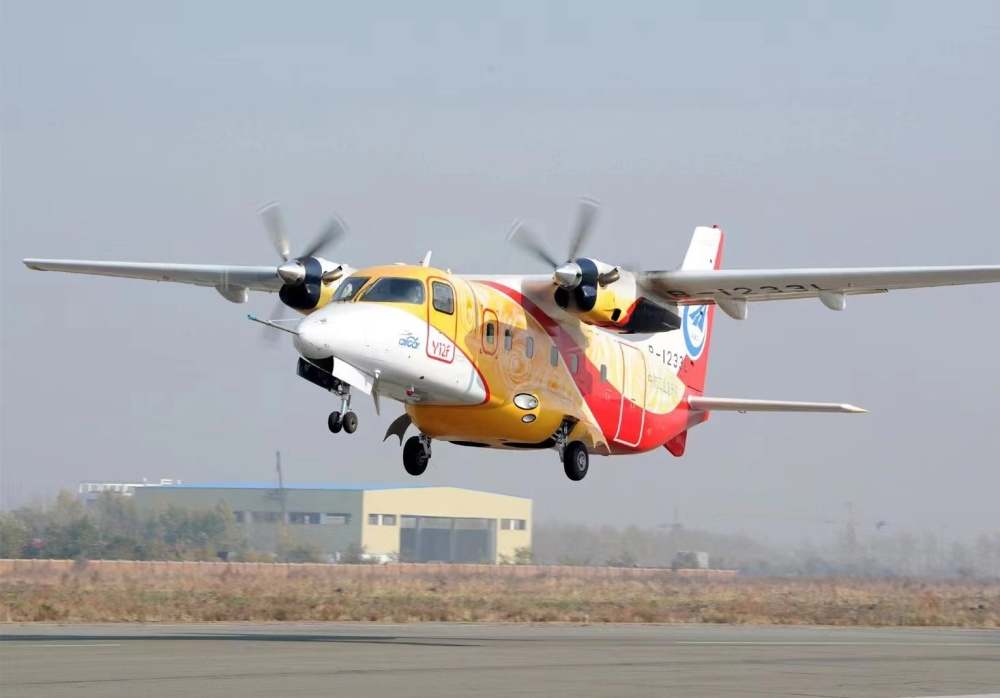
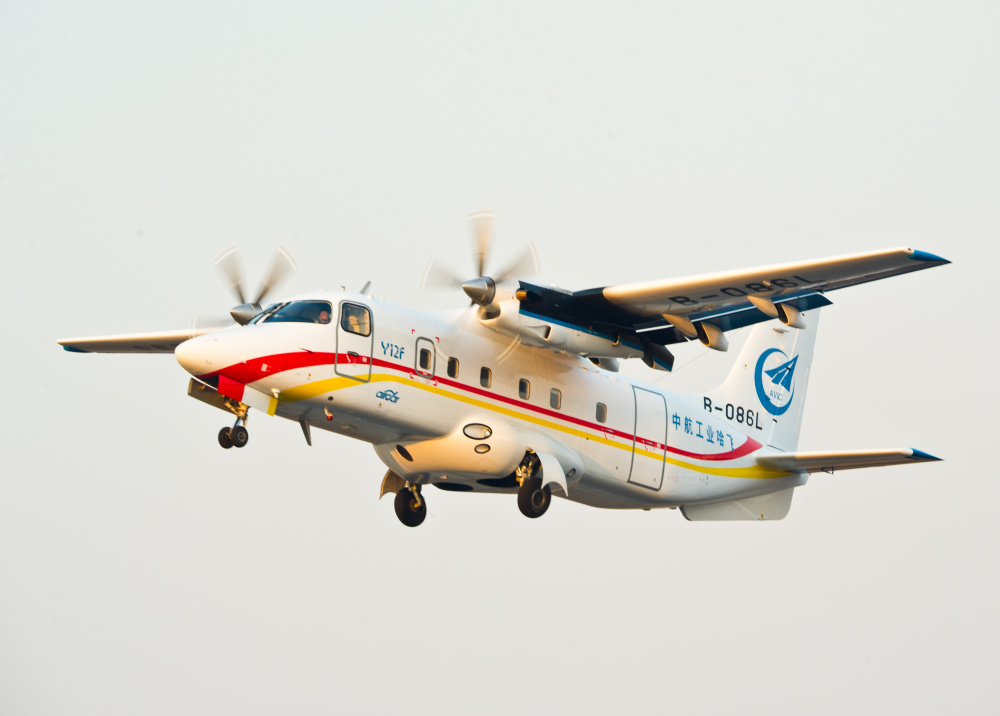
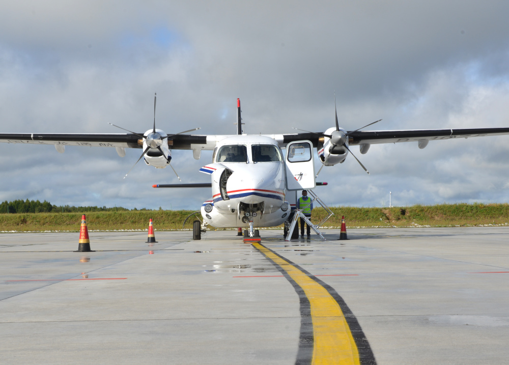

# 国产飞机首次取得欧洲航空安全局型号认可

【环球时报-环球网报道 记者
樊巍】《环球时报》记者7月14日从中国航空工业集团获悉，7月13日，航空工业哈飞研制的双发涡桨通勤类Y12F飞机获得欧盟航空安全局颁发的型号合格证，实现了国产飞机取得欧洲航空安全局型号认可零的突破。

据了解，Y12F于2015年12月10日获得中国民用航空局型号合格证，此次颁证是该机继2016年2月22日获得美国联邦航空局型号认可后，再次获得国外当局颁发的型号认可，对中欧双边适航合作具有重要里程碑意义。

Y12F飞机最大起飞重量8.4吨，最大载客量19人，可广泛应用于客货运输、海洋监测、空投伞降、航空摄影、地质勘探、医疗救护、人工降雨等领域。Y12F获得欧洲航空安全局型号合格证，将有助于其全面进入国际市场，对于其提高国际市场占有率和竞争力具有重要作用。

