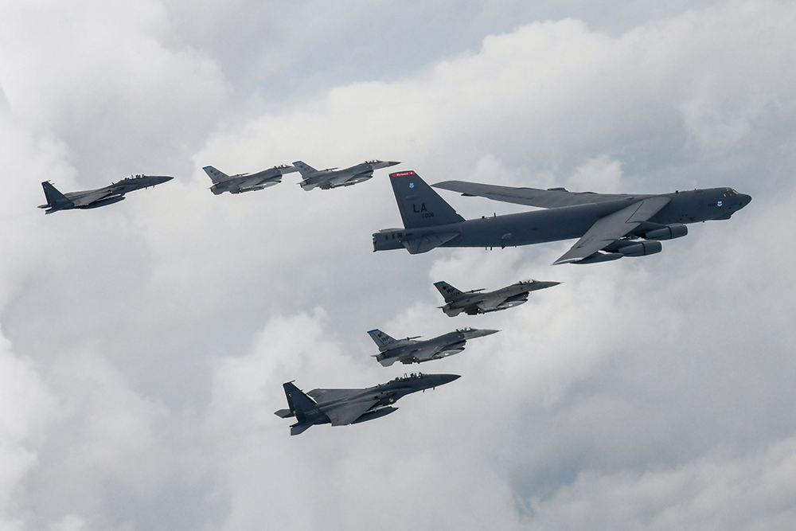

# 朝鲜试射洲际导弹后第二天，美国B-52轰炸机现身朝鲜半岛

在朝鲜试射“火星炮”-18新型洲际导弹后第二天，美国派出B-52H战略轰炸机前往朝鲜半岛参加演习。

_当地时间2023年7月13日，朝鲜成功试射洲际导弹后，韩国和美国空军在朝鲜半岛上空进行联合空中演习。
澎湃影像 图_

据韩联社报道，韩国联合参谋本部13日表示，韩美两国当天实施联合空中演习B-52H战略轰炸机参演。该机和韩国空军的F-15K、美国空军的F-16战斗机在半岛上空操练了联合编队飞行。这是B-52H在上月30日后时隔13天飞临朝鲜半岛。

报道称，B-52H载弹量达到31吨，可携带2000公里射程的空地核导弹，航程6400公里以上，可对目标进行空袭。该机当天造访半岛，被视为意在反制朝鲜12日发射的“火星炮”-18洲际弹道导弹。

据朝中社13日报道，朝鲜12日试射了“火星炮”-18洲际弹道导弹，并称该导弹为战略武装力量的“核心武器系统”。
此次试射证明了新型战略武器系统的能力、可靠性和军事效用性，并验证了朝鲜核战略武装力量的可信度。在此次试射中，导弹第一级设定为标准弹道飞行方式，第二、第三级为高角飞行方式。导弹上升高度为6000余公里，飞行时间为4000余秒，最后准确落入朝鲜东部公海目标水域。

报道还说，按计划，朝鲜战略武装力量即将装备“火星炮-18”型洲际弹道导弹武器系统。

对于朝鲜半岛问题，中国外交部多次进行回应。此前中国外交部发言人毛宁回应表示，半岛局势出现当前的局面，脉络是清楚的，也是中方不愿看到的。防止形势继续下滑的唯一出路，是各方正视半岛和平机制缺失的症结，按照双轨并进的思路，重启有意义的对话，均衡解决各自的合理关切。

