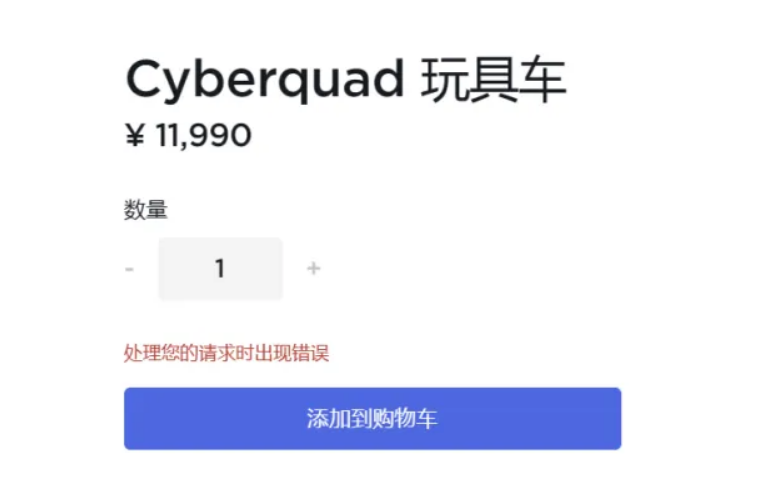
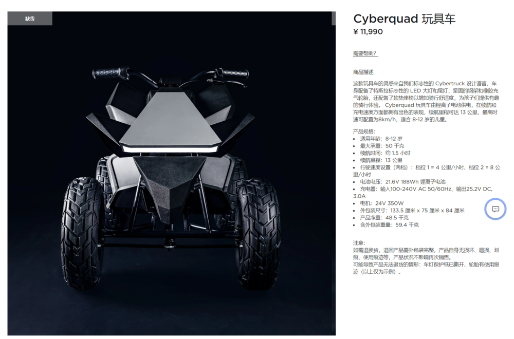
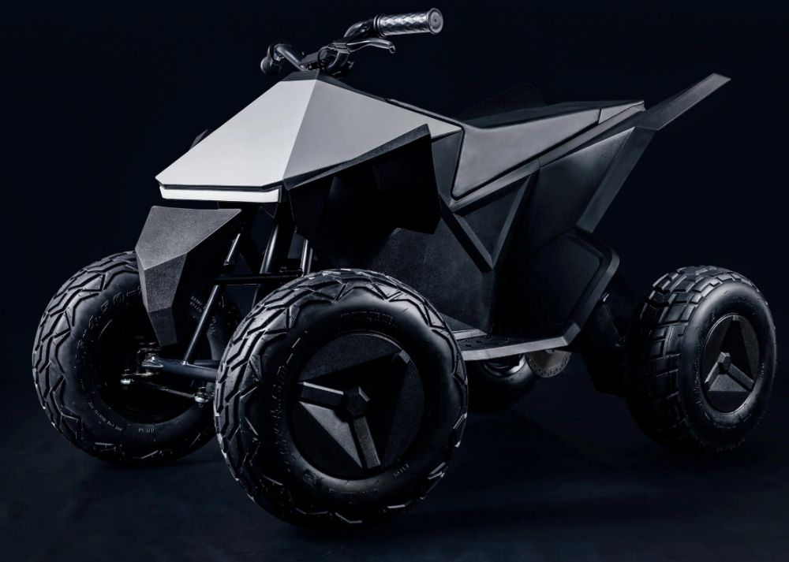

# 特斯拉 Cyberquad 玩具车售罄：官网被挤爆，已无法加购

IT之家 7 月 14 日消息，特斯拉中国官网上架了 Cyberquad 玩具车，今日 10
点正式开售，开售之初由于人数太多，官网一度出现卡顿现象，很多用户无法加入购物车。

截至发稿前， **Cyberquad 玩具车已显示缺货，无法购买。**

IT之家从官网获悉，特斯拉 Cyberquad 玩具车售价 11990 元，适用于 8-12 岁的儿童， **续航里程可达 13 公里，最高时速可配置为
8km/h。**

值得一提的是，特斯拉于 2021 年底在海外上架了这款玩具车， **最高时速 10 英里（约 16.09 公里），最大续航里程为 15 英里（约 24.14
公里）** ，售价 1900 美元（当前约 13604 元人民币）。

商品描述：

这款玩具车的灵感来自我们标志性的 Cybertruck 设计语言，车身配备了特斯拉标志性的 LED
大灯和尾灯，坚固的钢架和橡胶充气轮胎，还配备了软垫座椅以增加骑行舒适度，为孩子们提供有趣的骑行体验。Cyberquad
玩具车由锂离子电池供电，在续航和充电速度方面都拥有出色的表现，续航里程可达 13 公里，最高时速可配置为 8km/h，适合 8-12 岁的儿童。

产品规格：

适用年龄：8-12 岁

最大承重：50 千克

续航时间：约 1.5 小时

续航里程：13 公里

行驶速度设置（两档）：档位 1 = 4 公里 / 小时、档位 2 = 8 公里 / 小时

电池电压：21.6V 188Wh 锂离子电池

充电器：输入 100-240V AC 50/60Hz、输出 25.2V DC, 3.0A

电机：24V 350W

外包装尺寸：133.5 厘米 x 75 厘米 x 84 厘米

产品净重：48.5 千克

含外包装重量：59.4 千克

