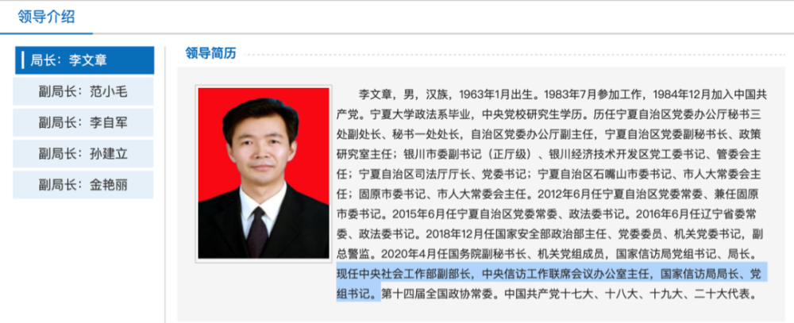
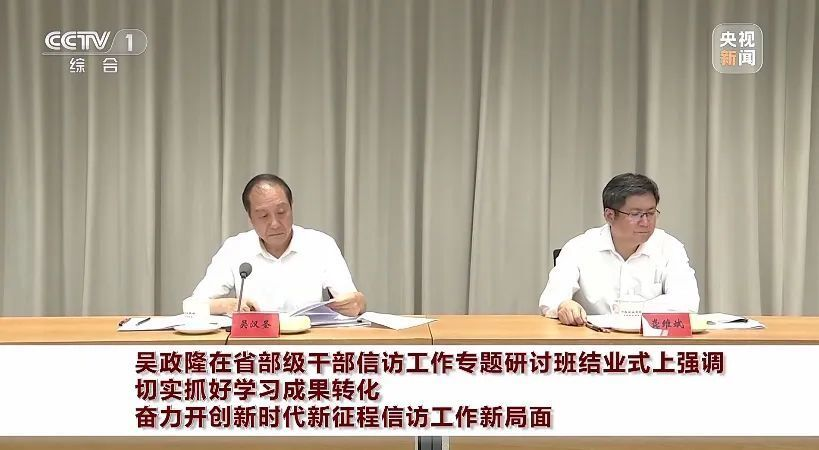
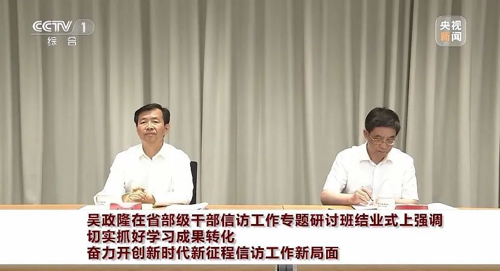

# 目前一正三副已披露！新组建的中央部门，部长、副部长发声，有重要信号

**撰文 | 余晖**

最近这段时间，中央社会工作部备受外界关注。

一方面，中央社会工作部领导层陆续对外披露。

就在7月14日，更新后的国家信访局官网显示， **国家信访局局长李文章，已任中央社会工作部副部长。**

同一天， **此前担任国务院国资委副主任的赵世堂也以中央社会工作部副部长的身份出席活动。**

另一方面，近日，中央组织部、中央党校（国家行政学院）、国家信访局联合举办了“省部级干部信访工作专题研讨班”。在研讨班上，中央社会工作部部长、副部长首次发声。

**部长和三位副部长对外亮相**

目前，中央社会工作部部长，以及三位副部长已公开亮相。

中央社会工作部部长由吴汉圣担任。

吴汉圣出生于1963年4月，今年60岁，山东临朐人，二十届中央委员。

吴汉圣曾在辽宁省、山西省、中央和国家机关工委、中央纪委工作，担任过辽宁省委常委、省委秘书长，山西省委常委、组织部部长，中央和国家机关工委副书记，中央纪委国家监委驻中组部纪检监察组组长等。

2022年，吴汉圣任中央和国家机关工委分管日常工作的副书记，2023年任中央社会工作部部长。

《中国新闻周刊》称，
**吴汉圣兼具部委、地方工作经历，曾在中央和国家机关工委工作多年，也曾主政地市，还担任过协调能力要求较高的省委秘书长一职，也熟悉纪检监察工作。**

**中央社会工作部对外披露的三位副部长，分别是此前已亮相的柳拯，以及李文章、赵世堂。**

李文章，男，汉族，1963年1月出生。1983年7月参加工作，1984年12月加入中国共产党。宁夏大学政法系毕业，中央党校研究生学历。

李文章长期在宁夏任职，历任宁夏自治区司法厅厅长，宁夏自治区石嘴山市委书记，固原市委书记，宁夏自治区党委常委、政法委书记等。

2016年6月，李文章赴辽宁，任辽宁省委常委、政法委书记。2018年12月，李文章担任国家安全部政治部主任、党委委员、机关党委书记，副总警监。

2020年4月任国务院副秘书长、机关党组成员，国家信访局党组书记、局长。

2023年7月4日，人社部网站发布消息，国务院任免国家工作人员，免去李文章的国务院副秘书长职务。

更新后的“国家信访局”官网显示，李文章现任中央社会工作部副部长，中央信访工作联席会议办公室主任，国家信访局局长、党组书记。

根据《党和国家机构改革方案》， **中央社会工作部作为党中央职能部门。**

**中央社会工作部统一领导国家信访局。国家信访局由国务院办公厅管理的国家局调整为国务院直属机构。**

也是在7月14日，另一位中央社会工作部副部长也对外披露。

据中国社会科学院网站消息，7月14日，中国社会科学院社会发展战略研究院、中国志愿服务联合会在京举办“中国式现代化与志愿服务高质量发展”研讨会。
**中央社会工作部副部长赵世堂** ，中国社会科学院秘书长、党组成员赵奇出席会议并致辞。会议由中国社会科学院社会发展战略研究院院长张翼主持。

上述消息显示， **此前担任国务院国资委副主任的赵世堂已任中央社会工作部副部长。**

赵世堂，男，汉族，1967年3月生，研究生学历、经济学博士学位，中共党员。他曾担任过国务院国资委副秘书长、新闻发言人，国务院国资委总会计师、财务监管与运行评价局局长等职，2022年任国务院国资委副主任。

**吴汉圣、李文章讲话**

据国家信访局7月14日消息，近日， **中央组织部、中央党校（国家行政学院）、国家信访局** 联合举办“省部级干部信访工作专题研讨班”。

**本次研讨班是党的二十大胜利闭幕后举办的第一个信访工作研讨班，也是《信访工作条例》颁布实施后举办的第一个信访工作研讨班。**

央视画面显示，吴汉圣、李文章均出席了研讨班结业式。

在学员座谈交流时，中央社会工作部部长吴汉圣提到，要“ **紧密结合实际研究制定贯彻落实的具体措施** ，确保各项部署落到实处”。

他说，要以这次专题研讨班为新的起点，切实担负起新时代新征程信访工作的职责使命和政治责任。

另外，中央社会工作部副部长、国家信访局局长李文章在研讨班作专题解读。

李文章提到，要准确理解把握《信访工作条例》主要内容，牢记为民解难、为党分忧的政治责任，
**深刻认识、准确理解推进信访工作法治化的重要意义、主要内涵，提升信访干部的法治能力和水平，切实维护群众合法权益** 。

**几个细节**

此次研讨班围绕切实加强党对信访工作的全面领导、贯彻落实《信访工作条例》和当前重点工作等开展学习研讨。

有几个细节值得关注。

第一，此次研讨班提出，“要深入学习贯彻习近平总书记关于加强和改进人民信访工作的重要思想， **更好地践行党的群众路线，维护好人民根本利益** ”。

根据机构改革方案，中央社会工作部的职责包括：

负责统筹指导人民信访工作，指导 **人民建议征集** 工作，统筹推进 **党建引领基层治理和基层政权建设**
，统一领导全国性行业协会商会党的工作，协调推动行业协会商会深化改革和转型发展，指导混合所有制企业、非公有制企业和新经济组织、新社会组织、新就业群体党建工作，指导社会工作人才队伍建设等。

从已经公布的中央社会工作部的职责内容可以看出，中央社会工作部有两个主要的关注点及抓手，一个是党建引领基层政权建设和基层治理，另一个是吸纳协调社情民意。

今年4月，“人民论坛网”曾发文解读说，
**在过去，一些基层政府往往选择以“堵访”的方式将矛盾压制下去，或采取应激式的方式回应。一些基层信访部门则困于自身职权和能力的限制，逐渐丧失了社会诉求回应能力，其结果是民众制度化的意见表达渠道的虚化及基层不满情绪和矛盾的积压。**

第二，研讨班提到，要“ **凝聚起信访工作的强大合力** ”。

在此次机构改革前，我国的社会工作相关职责分散在不同党政部门，缺乏集中统一领导和高效统筹协调，社会工作力量没有得到有效整合，难以形成合力并发挥有力作用。

第三，研讨班提到，全面提升信访工作法治化水平；要大力推进信访工作法治化、规范化、专业化建设。

具体的要求是：

要 **制定信访工作路线图** ，全面提升 **信访工作法治化水平**
，切实落实源头治理责任，在信访受理中做到分清性质、明确管辖，转办督办到位，对信访事项依照法律规定和程序按时处理到位，
**对滥用职权、玩忽职守的公职人员坚决问责到位，对扰乱社会秩序的违法犯罪行为及时依法处理到位。**

要加强信访工作队伍能力建设，不断提高运用 **法治思维和法治方式** 开展工作的能力。

2022年4月，中共中央、国务院印发了《信访工作条例》。

《条例》明确，各级机关、单位应当畅通信访渠道，做好信访工作，认真处理信访事项，倾听人民群众建议、意见和要求，接受人民群众监督，为人民群众服务。

《条例》还提到，
**各级机关、单位领导干部应当阅办群众来信和网上信访、定期接待群众来访、定期下访，包案化解群众反映强烈的突出问题。任何组织和个人不得打击报复信访人等。**

**资料 ｜ 国家信访局 澎湃新闻 人民论坛网 中国新闻周刊等**

**【版权声明】本文著作权归政知新媒体独家所有，未经授权，不得转载。**

