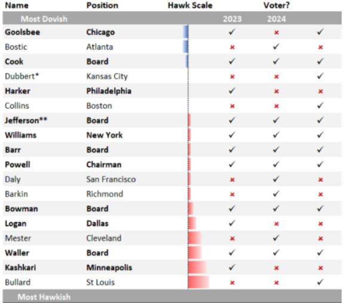

# 美联储“鹰王”宣布辞职 可能会削弱鹰派话语权

**财联社7月14日讯（编辑 赵昊）** 当地时间周四（7月13日），美国圣路易斯联储在官网宣布，詹姆斯·布拉德（James
Bullard）已经辞去了这家地区联储主席和首席执行官的职务。

官方新闻稿称，布拉德定于2023年8月14日离开圣路易斯联储，并于次日出任普渡大学Mitchell E. Daniels,
Jr.商学院院长。在8月14日前，他将以顾问的身份提供服务，以帮助确保联储的平稳过渡。

新闻稿还提到，即日起，布拉德将不会参与FOMC的货币政策决策等职务，并停止所有公开演讲。据了解，布拉德是当前任期最长的地区联储主席，先前他也没有暗示过要离开这家银行的想法。

该行的第一副主席兼首席运营官凯瑟琳·奥尼尔·佩斯（Kathleen O'Neill
Paese）已被任命担任临时主席兼首席执行官，市场预计她将代替布拉德出席两周后的FOMC议息会议。

**布拉德与圣路易斯联储**

据了解，现年62岁的布拉德早于1990年就加入了圣路易斯联储，担任研究部门的经济学家。2008年4月1日，他接替威廉·普尔出任这家地区央行的行长——圣路易斯联储主席。

布拉德在声明中写道，“包括15年的行长生涯，在过去33年里我一直都是圣路易斯联储的一员，我深感荣幸，这也是莫大的殊荣。”2014年，布拉德在一份经济学家影响力榜单上排名第七，力压前一年的诺奖得主罗伯特·希勒以及前美联储主席格林斯潘。

自2021年年中以来，布拉德一直敦促他的美联储同僚们采取更积极的货币紧缩措施，以遏制近40年来最快的通胀增速。当时他就指出，一些人认为“价格压力是暂时的”想法是错误的，并且他还是首批呼吁大幅加息的官员之一。

根据InTouch Capital
Markets上周更新的报表，布拉德被认为是现任18位FOMC委员中最“鹰派”的官员。但需要指出的是，布拉德担任票委一共投过4次反对票，除了去年3月“支持更大幅度加息”的一次，其余都是支持更宽松的货币政策。

**市场观点**

曾与布拉德共事多年的经济学家David
Andolfatto对最新的离职消息感到震惊，他表示，“布拉德不经常投反对票，但只要他提出异议，最终事实都会证明他是对的。他总是处于领先的地位。”

经济学家Derek
Tang指出，布拉德是FOMC中理智的代表，他一度偏鸽派，但最近又转为鹰派，在理论上强烈呼吁解决通胀问题。他的退场可能会削弱鹰派的话语权，让一些鸽派成员占据上风，比如芝加哥联储主席古尔斯比。

美国全国人寿保险公司首席经济学家Kathy
Bostjancic认为，布拉德的离职对2023年利率走势的影响非常的小，仅略微降低了潜在的第二次加息的可能性，因为他并不是今年的轮值票委。

（财联社 赵昊 ）

