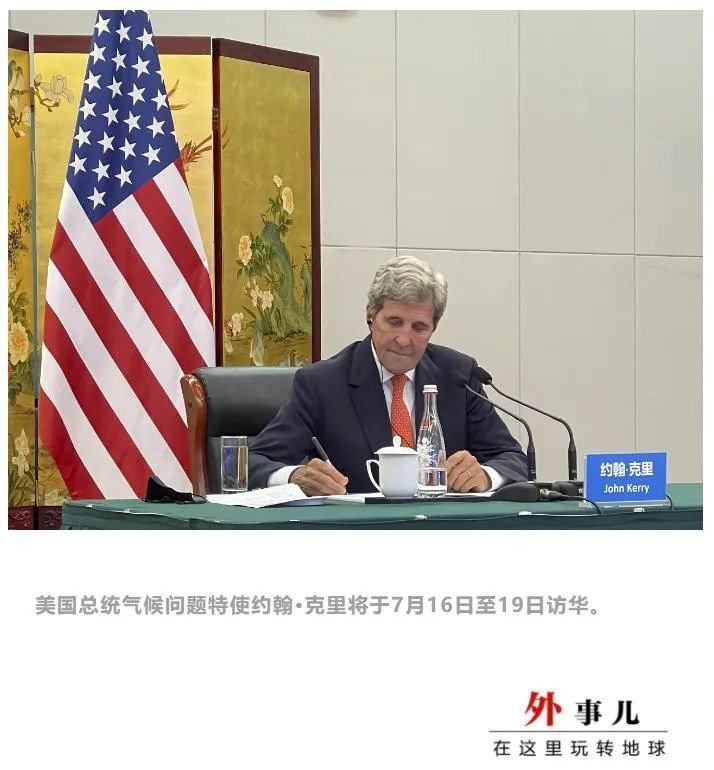

# 美高官相继访华，释放了哪些信号？专家：来访是进步，但不必期待过多

据生态环境部消息，经中美双方商定，美国总统气候问题特使约翰·克里将于7月16日至19日访华，双方将就合作应对气候变化深入交换意见。

上月至今，美国国务卿布林肯和财长耶伦相继访华。对此，中国社会科学院美国所研究员刘卫东在接受新京报记者专访时表示，美国高级官员近期相继来华，一方面是中美高层交流的障碍被淡化，另一方面是为中美元首未来的会晤作铺垫。美国高官来访能够促进交流，但不能给予太高期待。受诸多因素影响，短期内的互访暂时还未能影响中美关系的走向。

**克里此访**

**寻求保持沟通渠道畅通**

**新京报：美国总统气候问题特使约翰·克里将于7月16日至19日访华，约翰·克里此行可能谈及哪些议题？预计可能达成哪些共识？**

**刘卫东：** 克里是继美国国务卿布林肯和财长耶伦后，近期第三位访华的美国高级官员。他此行将落实具体的合作领域——中美气候变化。

从历史上看，中美在气候变化问题上均有合作需求，但未能取得实质性进展，归根结底在于两国对彼此在气候问题上应该承担的责任有不同的认识。

克里此访寻求保持沟通渠道畅通，中美双方以此为契机表明各自立场，并表达相互合作的愿望，但要在气候问题上突破原来存在的障碍依然有难度。

在气候变化问题上，当前中方和美方的原则立场和要求存在差异，对彼此应该承担的责任有不同认识，很难在如此短的时间内就一些原则性问题达成共识。不过，中美双方可能会在某些具体议题上推进合作，例如开展技术分享、进行气候相关的国际援助等。而这背后的想法或许是，能合作先合作，无论规模大小，先呈现好迹象，再慢慢形成正向循环。

**新京报：去年8月，佩洛西不顾中方强烈反对和严正交涉，窜访中国台湾地区，中方随后宣布暂停中美气候变化商谈，此后美气候特使数次表露想要与中国恢复气候谈判的意愿。此次美方确定访华日期，背后有哪些推动因素？**

**刘卫东：** 美方积极又迫切地与中国展开合作的原因在于，气候变化问题是拜登政府的执政重点之一，也是民主党关注的主要议题之一。

在美国，共和党与传统油气资源产业的利益集团关系非常紧密，所以共和党反对在气候变化问题上过多投资。与共和党的想法截然不同，拜登政府一直希望能够在气候变化问题上引领世界，同时参与制定相关规则，故而在气候问题上一直都很积极，不仅积极与中国合作，还让美国重返《巴黎协定》。同时，中国和美国是碳排放的两个大国，美方认为两国存在合作空间，所以美方在姿态上一直表现得非常积极主动。

**需要理性看待**

**美国高官对华做出的表态**

**新京报：美国高官为何选择这一节点密集访华？**

**刘卫东：** 近期美国高官相继来华有多个原因。

首先，一些阻碍中美高层接触的因素暂且消失。布林肯原定于今年2月访华，之后由于中国民用无人飞艇因不可抗力误入美国事件单方面宣布推迟访华至6月。现在此事基本已经成为过去式，美国国内并没继续炒作。

同时，中美双方在高层交流方面的认识存在不同看法。美方一边表示要与中国合理合规竞争，一边又声称要为中美关系设置“护栏”。中美曾建立起100多个对话交流机制，现已基本陷入停滞。美方反复强调希望跟中国恢复高层交往的机制。而中方希望美方正视中方的立场和诉求，展现合作诚意，如若不然，高层交流无法进行。现在，影响中美双方高层交流的障碍暂时被淡化，两国高层开始接触。

此外，美国高官近期相继访华也是为更高级别的外交活动作铺垫。今年9月和11月分别将举行G20峰会和亚太经合组织会议，中美元首可能都会参加。两国官员互访并在一些具体议题上取得一定的谈判进展之后，可为两国首脑会面并达成一定的共识创造条件。

**新京报：布林肯访华之旅结束后，美国总统拜登表示美中关系“正走在正确的道路上”，耶伦离开中国前重申美国不寻求与中国“脱钩”。此次克里访华，中美将就合作应对气候变化深入交换意见，这些都释放了哪些信号？**

**刘卫东：** 需要客观理性看待美国高官对华做出的一些表态。

首先，美国一直以来的表态没有什么变化。例如，不跟中国“脱钩”，不会干涉中国内政等表态是拜登政府上台以来一贯的说法，但拜登政府往往说一套做一套。拜登政府一些表面上的表态比较温和中性，但在具体推进政策时却不是如此，拜登政府表示不跟中国“脱钩”，但实际上一直在推动“脱钩”；拜登政府表示不进行地缘政治竞争，其实一直在中国周边推进新联盟体系的建设。

其次，美国国内的政治气氛不太友好，如果有行政官员在前方围绕一些议题取得进展，国会会在后方拉后腿。诸如布林肯和耶伦回国后，他们在中国的这些表态能否成为美国政府对华政策还很难说。所以，对拜登政府高层官员的表态应该听其言，更加应该观其行。

**来访面谈是一种进步**

**但不必期待过多**

**新京报：美国高官相继访华，是否意味着中美进入了密集外交对话时刻？将对未来一段时间的中美关系走向产生哪些影响？**

**刘卫东：**
不能对此给予太高的期待。近期中美两国的这种互动，是对过去一段时间中美没有高层互访的一个修正，但这种修正没有办法达到特朗普政府之前中美紧密交流的程度，因为中美在互动过程中的底线和基调没有变化。

变化的是两国在接触过程中的姿态。姿态不是一种实质性的东西，容易再次回到原先状态。从目前中美关系的格局来看，仅依靠几次双边互访和人员交往，没有办法改变中美关系的走向。

但美国高官来华访问比不访问、没有交流要强。通过交流，双方高级官员至少能够再次向对方陈述自身立场，也能够听到对方反馈。回国之后，他们也会向国内最高领导人汇报、和精英集团坐下来一起讨论，看看哪些方面能有政策的调整，但这些都是不确定的事情。因此，能够见面交流是一种进步，但不要期待过多。

**新京报：美国明年将迎来大选，按以往经验，竞选双方一贯喜欢炒作对华问题，这是否对当前中美双方寻求对话的态势形成一定干扰？**

**刘卫东：**
美国今年跟中国交往，其实是因为其国内政治受中美关系的影响相对较小。美国去年举行中期选举，明年将迎来大选，所以今年算是一个窗口期，中国议题在美国国内被炒作的可能性相对较小，中美关系相对缓和稳定。

但随着明年大选年的到来，中美两国关系可能再度紧张。两党会把中国问题视为一个攻击点，千方百计给中国扣帽子，让中国充当一些问题的替罪羊。对于当前的一些友好交往，美国国会在背后会通过更多手段，例如进一步发展与中国台湾的关系、对中国人士进行更加严厉的制裁等，阻止中美保持接触的势头。总体而言，我对今后中美关系的发展不是特别乐观。

记者 | 朱月红

编辑 | 白爽

