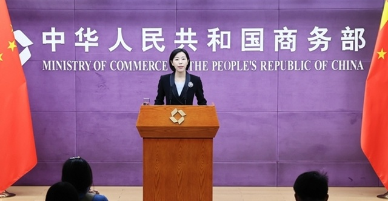

# 英国周末正式加入CPTPP，中国的申请下一个被受理？中方：正积极推动

本周末（15-16日），《全面与进步跨太平洋伙伴关系协定》（CPTPP）将在新西兰奥克兰召开部长级会议，届时预计英国将成为CPTPP正式成员。

英国外交部在近期的声明中表示 **：** “本月晚些时候，英国将开始正式加入CPTPP。”

在13日的商务部例行记者会上，针对“英国将于本周末正式加入CPTPP，请问预计中国的加入申请是否会是下一个被受理的？因为中国是英国之后下一个申请加入CPTPP的国家”相关问题，商务部发言人束珏婷表示：
**“目前，中方正按照加入CPTPP的程序，与各成员进行沟通和磋商。”**

近日，国务院印发了《关于在有条件的自由贸易试验区和自由贸易港试点对接国际高标准推进制度型开放的若干措施》（下称《若干措施》），率先在上海、广东、天津、福建、北京等具备条件的自由贸易试验区和海南自由贸易港，试点对接相关国际高标准经贸规则，稳步扩大制度型开放。

中国商务部部长助理陈春江6月30日称，这是主动对接CPTPP规则的先行先试。

对外经贸大学国际经济贸易学院教授、中国世贸组织研究会研究部主任崔凡在接受第一财经记者采访时表示：“英国这两天将在CPTPP新西兰部长会议上签署加入CPTPP的文件，国际社会开始将关注点转移到了中国的加入问题上。”

“中国的经济体量是目前CPTPP 11国的1.5倍，英国加入后， **中国经济体量仍然大于CPTPP12国的总和。”**
崔凡表示，“这样大的市场，以CPTPP平均将近99%的产品零关税的开放幅度进行开放，这对现有CPTPP成员来说，将大大提高CPTPP的福利效果。这对中国、对CPTPP现有成员以及世界经济的健康发展都具有积极意义。”

**英国周末加入CPTPP**

8日，CPTPP轮值主席国新西兰发表声明称，15-16日在奥克兰开会期间，英国贸易大臣受邀参加签字仪式，届时英国将成为CPTPP正式成员。

在脱欧后，英国积极在欧盟之外寻找新的贸易伙伴。2021年2月1日，英国申请加入CPTPP。

在审议英国加入CPTPP时，CPTPP委员会的行动也较快。2021年6月2日，CPTPP委员会成立英国加入工作组，9月28日就召开第一次工作会议讨论英国的申请事宜；2023年3月，英国获准加入CPTPP。加入CPTPP后，英国将成为第12个CPTPP成员国，且是第一个加入CPTPP的欧洲国家。

据英方数据显示，CPTPP区域内拥有超过5亿人口，在英国加入之后，其经济总量将占到全球国内生产总值（GDP）的15%。加入CPTPP可以使英国经济增长18亿英镑（约合153亿元人民币），英国出口到其他CPTPP成员国99%的商品可以享受免税待遇，譬如奶酪、汽车、巧克力、机械等关键出口产品。

**中国正积极推动加入**

据外媒报道，中国是继英国之后申请加入CPTPP的国家，目前还有厄瓜多尔、哥斯达黎加、乌拉圭和乌克兰等经济体提交了加入CPTPP的申请。

束珏婷在7月6日的例行记者会上表示：“自2021年9月申请加入CPTPP以来，中方积极推进加入进程，并已对CPTPP全部条款进行了全面深入分析、研究和评估，梳理了可能需要采取的改革举措和修改的法律法规。目前，中方正按照加入CPTPP的程序，与各成员进行沟通和磋商。”

陈春江在6月30日的政策例行吹风会上称，中国正积极推动加入CPTPP和《数字经济伙伴关系协定》(DEPA)等高标准经贸协定，相关规则的要求与中国改革开放面临的重点问题契合度较高。

他表示，在有条件的自贸试验区、自由贸易港主动对接开展试点，在规则、规制、管理、标准等方面率先与国际接轨，构建与国际高标准经贸规则相衔接的制度体系和监管模式，将为中国参与国际经贸规则制定积累有利条件。

他透露，为积极推动加入CPTPP，中国已就协定内容进行了充分、全面和深入分析、研究和评估，梳理了可能需要采取的改革举措和修改的法律法规。

崔凡对第一财经记者表示：“在过去一段时间中国与CPTPP的接触中，中国向CPTPP表达了希望加入的真诚意愿；系统梳理介绍了中国在贸易、投资和海关领域的法律法规，以及中国经济和国家治理结构；阐述了中国遵守国际经贸规则和尊重以世界贸易组织为核心的国际贸易体制的历史和事实；回应了中国的贸易伙伴的各种关切。我个人认为，CPTPP成立中国加入工作组的条件已经成熟，中国也已经做好和CPTPP开展实质性谈判的准备。”

崔凡解释道：“除了传统的贸易投资自由化便利化方面的内容，
**CPTPP还包含电子商务、国有企业、劳工、环保等领域的高标准规则。在中国的对外经贸关系中，其他贸易伙伴也经常在这些问题上提出关切。”**

“我个人认为，中国申请加入CPTPP表明中国希望在CPTPP明确、透明、可执行的机制框架下处理这些关切，并且在CPTPP今后的继续谈判中发展完善相应的规则，并最终推动世界贸易组织的改革，推动多边贸易体制的完善。”他说，“因此，我认为中国加入CPTPP对整个世界贸易体制和全球化的发展都将具有积极意义。”

商务部研究院对外贸易研究所所长梁明近期在接受第一财经记者采访时也表示，我国为加入CPTPP“做了大量工作，对CPTPP所有条款进行了深入研究，发布了专门报告。从自身能力来看，我们已完全具备对照、适应或接受CPTPP规则的一些基本条件。”

梁明表示，目前，我们已在一些自贸试验区开展规则的“先行先试”，加入CPTPP的基础工作已经成熟。

