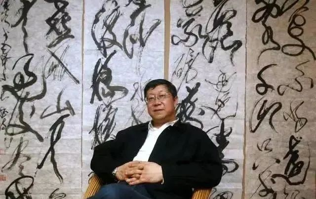
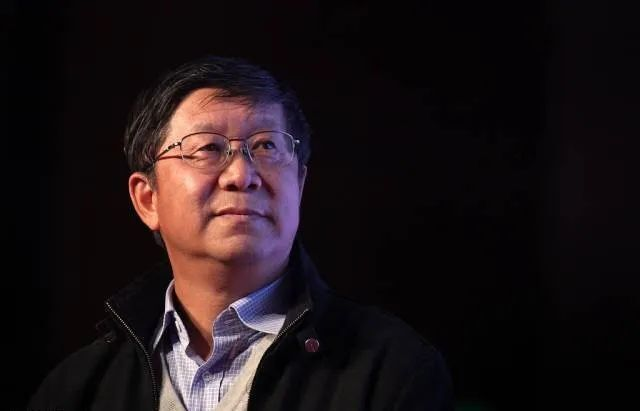
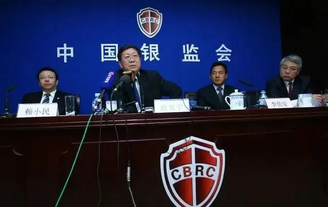
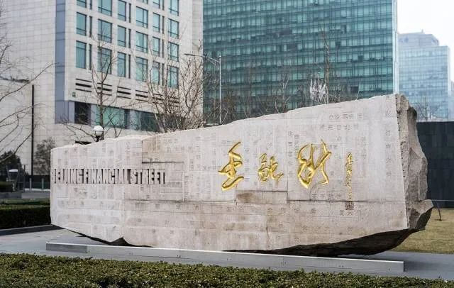
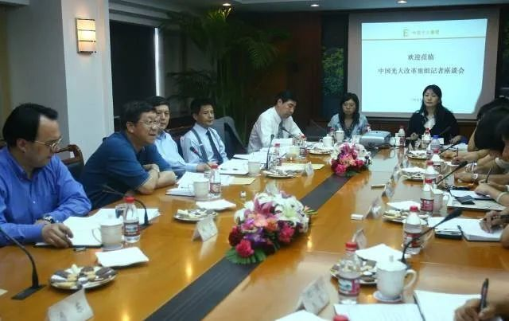
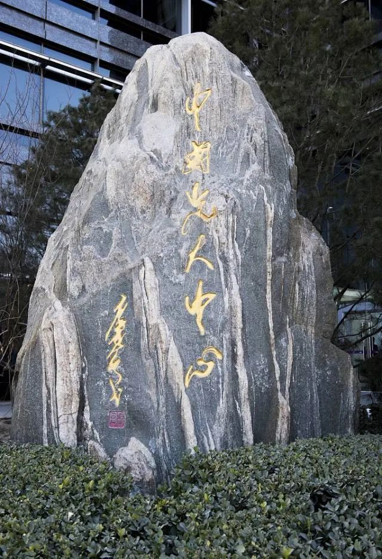
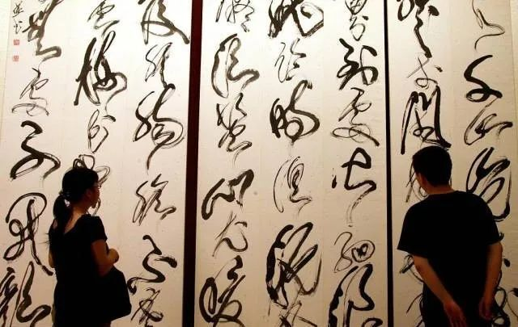

# 退休6年半后失联，原光大集团董事长唐双宁其人其事

_来源：视觉中国_

特约作者 | 金杭 编辑 | 肖望

出品 | 棱镜·腾讯小满工作室

在退休6年半后，原光大集团董事长唐双宁仍未能平安落地。

7月13日，多位市场人士开始转发唐双宁相关履历及作品信息。晚间时分，据《财新》报道，唐双宁于7月12日失联。

唐双宁在2003年原银监会成立之际便出任副主席，后于2007年赴任中国光大集团出任董事长、党委书记。2017年12月12日，唐双宁卸任光大集团董事长。

唐双宁引以为傲的是，在掌舵光大集团十年间，光大集团从资不抵债到起死回生，并迈入世界500强，成为年利润500多亿元的全牌照大型金融控股集团。

在金融领域工作之外，唐双宁还有着诗人、画家、散文作家、书法家等多重身份标签。他酷爱书法，对狂草更是情有独钟，北京“金融街”和光大集团前的“中国光大中心”题字均是出自唐双宁之手。

退休后的唐双宁主要从事文化研究和艺术创作，偶有现身书画展、诗歌朗诵等活动。

2013年时，美国证券交易委员会曾对摩根大通雇佣高干子弟以获取业务便利发起调查，其中就牵涉到唐双宁之子唐晓宁在摩根大通的工作经历。2016年，摩根大通认罚并与美国监管部门达成和解。

此次唐双宁失联，所涉事因尚待有关部门披露更多信息。

（本文首发于2017年12月18日，原标题为《唐双宁和他的“自悟书”》）

双“十二”这天，63岁的唐双宁“退役”了，告别掌舵10年的光大集团。至此，中国第一代银行业监管者悉数退场；银行系统少见的从“监管高层”到“被监管”一把手的案例，也就此划上句号。

爱以白衫、黑布鞋形象示人的唐双宁，自己是这么总结这些年的：“我人生头一个30年像大多数人一样，上小学、中学，赶上文化大革命，在工厂当工人，当过党办秘书，恢复高考后，又考入大学，总之主要是在学习、在工厂工作；第二个30年，主要是在金融的不同领导岗位工作；第三个30年，我希望自己能够在文化艺术方面实现一个‘新我’。……至于能否还活30年，能否找到，顺其自然，尽人事而听天命吧。”

_唐双宁。来源：视觉中国_

老唐爱书，宁可三餐无肉，不可一日无书。尚任银监会副主席时，唐双宁一度推崇《道德经》、《忏悔录》和《矛盾论》，履新光大集团董事长的前几年，除了马恩列毛、诸子百家，还特别爱读史。

时至今日，唐双宁的最爱是这三本：无字书、反面书和自悟书。如此三册包罗万象，但参考其个人经历，如果说银行监管、光大转制是本无字书，金融系统各类大案要案是部反面书，那么唐氏“平衡”哲学也许便是自悟书之精髓。

**唐司长和银行改革无字书**

事到如今，谁也不能否认，中国的银行改革仍然是一部没有历史经验可循的无字书。若想无字书中求真知，只能摸着石头过河。

1999年12月，唐双宁成为中国人民银行银行监管一司司长，一屁股坐上了一座刚刚被粉饰成安全可靠形象的活火山口。

此前几个月间，四大金融资产管理公司相继成立，从四大行与国家开发银行总共剥离了13939亿元不良贷款。更早些时候，中国启用特别国债补充四大行资本金缺口约2700亿元，使1997年底的四大行名义资本充足率达到8%。按国际惯例早已是资不抵债、技术性破产的国有银行，在这两项前所未有的重大利好兑现后，宛若新生，形势似乎一片大好。

剥离不良资产，就能成为好银行？这个问题在如今看来幼稚可笑，但20年前的大多数人都是这么想的。尽管当时人民银行内部已经有了“好银行需要一些先决条件”、“先决条件与不良剥离孰先孰后”的声音。

坐在活火山口的老唐显然是清醒的，但在外部“先决条件”与银行“内部治理”两者间，唐司长选择内部突破。

2000年，唐双宁在一次小范围的内部会议上提出银行监管“四维论”，即管法人、管风险、管内控、提高透明度。次年，他又在京西宾馆召开的国有银行监管会议上正式提出该理论，并进一步系统践行。

2003年银监会成立之际，主席刘明康同唐双宁商量工作，非常认同这一提法。于是，“四维论”便成为银监会的监管理念，延续多年。

然而，银行改革必须“内外兼修”，缺一不可。由于外部“先决条件”的缺失，仅仅三年时间，国有银行这座活火山重新燥动起来，不良率恢复到25%以上。2004年1月，国务院决定动用450亿美元外汇储备为中行和建行补充资本金，开始了“二次注资”这个“输不起的实践”。

2003年银监会成立之初成为副主席、同时兼任银行一部主任的唐双宁，后来形成著名的“三段论”以阐述国有银行改革。

他认为，国有银行改革分为三个阶段，1984年—1994年的国家专业银行改革阶段、1994年—2003年的国有独资商业银行改革阶段，以及2004年以后国家控股的股份制商业银行改革阶段。而第三阶段改革又分为三个步骤：财务重组、公司治理改革，以及资本市场上市。

这三个阶段中，前两个阶段以治标为主，兼顾治本，并为下一阶段的改革奠定基础；第三个阶段在前两个阶段的基础上进行，以治本为主，标本兼治。

当然，标本兼治岂能是一瞬间。上市并不是终点，在唐双宁看来，只是另一个起点。

二次注资两年后，工中建行完成股改并成功上市。在一次评价国有银行改革成果的会议上，唐双宁提出国有银行股改上市后实现了“形似”，但还没有达到“神似”，也就是说在体制机制、管理水平、企业文化建设上还远未到位。后又在此基础上借用三个典故，形成股改“三论”：肌肤心腹论、形似神似论、南橘北枳论。

据说，唐双宁曾对刚到中国任职的深发展董事长纽曼提出“三论”，纽曼沉思数日，感慨良多，后又亲笔给唐双宁回了一封信，谈自己的感想。

_2006年12月，时任银监会副主席的唐双宁公布《商业银行金融创新指引》_

总的说来，1999到2007年，唐双宁负责银行监管的这八年，正处中国银行业改革的关键时刻，也是内外部金融基础设施搭建的重要年份。质疑声有之，比如国有银行“贱卖论”；大案要案不少，如金德琴、王雪冰、张恩照等个个身居要职。但这些都抹煞不了改革时机的绝妙——如果再晚两年启动改革，2007年中就有征兆的全球金融危机必将拖累整体进程，使改革效果大打折扣。

回眸八年，随着银行改革内忧外患逐一攻坚，唐双宁亦是顺风顺水、如鱼得水。

水为财。金融从业人士无不爱之。2006年，唐双宁曾在某次金融论坛上当众宣读自己所作的一篇散文《金融如水》。开头第一句便写道：“金融如水，老子曰：上善若水。天下莫柔弱于水，而攻坚强者莫之能胜。”大意是：金融如水一样滋润着社会成员，浇灌着经济发展。然而，水能载舟，亦能覆舟。如果金融之水管理不当，发起水来气势汹汹，“攻坚强者莫之能胜”。

**唐董事长的矛盾转化实践**

北京市西城区金融大街甲15号，原中国银监会所在地。门前广场矗立一块石碑，上书“金融街”三个大字正是唐双宁手笔。在一次采访结束后，唐双宁招呼在场所有记者下楼碑前合影。唐双宁应该没有想到，不久以后他将离开银监会，并且成为“被监管者”。

_唐双宁所题金融街_

2007年6月，唐双宁履新光大集团担任董事长。

在当时，作为中国改革开放窗口之一的光大集团已长期资不抵债，濒临破产。社会普遍认为，在光大，“改革是找死，不改革是等死”。光大银行和光大集团“只能保一个”，如此想法也不少见。

唐双宁又一次“好运气”地坐到了火山口。但是，比推进光大改革更难的也许是，从监管者到被监管者的角色转换。

初到光大，唐双宁看望光大集团首任董事长王光英时即席创作一副槛联：“在机关昂首挺胸做公仆，否则没有权威；到企业猫腰低头当主人，不然没有钱赚。”横批：“大致如此”。

唐双宁后来回忆并坦率地表示，开始自己是不愿意到光大的，但既然中央决定了，也只能服从。工作性质发生转化，心态理应也跟着转化。在创作这幅对联时，有一些“调侃”，有一些“知易”，但实际并没有完全适应这个“转化”。随着时间的推进，后来才逐渐地从“知易”到“行易”，最终适应这个“转化”。

唐双宁以自己的这个经历，劝导光大集团内部人士，需要懂得矛盾转化。他认为，矛盾是可以转化的，“矛盾的双方无不依据一定的条件向其相反的方向转化”。“今天坐台上，明天坐台下，这是一种转化；今天说上句，明天说下句，这也是一种转化。再比如谁是谁的人的问题，这个也可以转化，只要公正，不是你的人也会转化成你的人；不公正，是你的人也会转化成不是你的人。”

除了矛盾转化这点，唐双宁对于光大内部人士的“不吐不快”还重点表现在：要求尽量实事求是，要求懂得矛盾依存，懂得矛盾主次，希望大智若愚、心胸豁达，学会等待，顺其自然，知足常乐等等。

2007年的光大什么样？由此，可管窥一二。

_2007年8月13日，唐双宁出席光大银行重组记者座谈会。_

履新之初，唐双宁便称光大是一部“天书”。他将光大的困难和问题归纳为“三多三低”：历史包袱多，集团债务缠身；关联交易多，一套班子管理两个法人企业；银行不良资产多，资本充足率严重不足；同时，银行管理水平低，案件频发；市场份额占比低；员工士气低，市场形象受损。

归纳起来四个字：情况复杂。

不过，唐双宁上任仅50天左右，磨合了四年之久的光大重组方案终于获得国务院批准，与此同时，第一张国家持股的金融控股公司牌照也被收入囊中。而在短短四个月以后，中央汇金公司顺利入主，光大银行随即步入引资上市路。

_2009年8月，上海，唐双宁敲响了开市锣。_

“矛盾转化，难到极处就是易，易到极处也会出现难。”他很少对外谈及光大改革的细节和曲折故事，更愿意将实践得出的思考高度提炼，分享众人。对于大部分没有亲身经历改革“凶险”的人而言，这些理论不免有些“形而上”。

但万变不离其宗。在运动的过程中发生“转化”，这正是唐双宁推进光大改革的重要理念和唯一哲学——第一步总是要走出去的，不走出去只能等死；即使未来会越来越难，也总能一步步走下去。

事实上，“越来越难”的预言，也没有出错。

此后的光大经历了“钱荒”、“乌龙指”，连带唐双宁本人也遭遇到前所未有的舆论影响。老唐的“哲学思想”却是更精进一步：任何事件都要把握好“度”，悟好其中之“道”。那幅“大致如此”的对联中，“到企业猫腰低头当主人，不然没有钱赚。”一语成谶。在金融专业上，老唐主动接触舆论的日子渐行渐远。

**老唐的立体人生**

不过，相似的时间刻度上，另一个唐双宁在艺术领域声名雀起。一手狂草更是让人印象深刻。

如何解释“另一个”？套用他自己的话来说，一个“立体”的唐双宁此时呈现在世人面前。唐双宁说，人的生命有三种存在形式，线性生命就是人的自然寿命，平面生命是专业领域，而立体生命则是全面发展。

早在银监会时，不乏有人对他讲，有个写草书的书法家也叫唐双宁。他便会侧着头，轻轻一笑：“是吗？”几年之后，金融家唐双宁与书法家唐双宁已经合二为一。他的书法，甚至绘画，存在于光大的各个角落。

_中国光大银行总行，唐双宁题字。_

他曾对作者回忆说，自己最早练习书法是从抄大字报开始的，后来书法就成为休息的一种方式，再后来变成业余爱好，最终不能离开。

唐双宁练过各种书法体，对狂草情有独钟，并自创“飞狂草书”。创作题材不限，但更喜欢将历史、毛主席诗词融入作品中。2005年，他曾经满怀欣喜地向作者展示刚刚创作完成的关于红军长征的书法长卷。那一年，唐双宁重走了长征路。

熟悉的人都知道，唐双宁喜欢研究党史，几乎全部党史重要事件的发生地，他都实地考察过，还曾参与《党史》二卷的审稿，对于长征精神更有独到见解。

所以，唐双宁是这样定义书法的：以汉文字为对象，以笔墨纸砚为工具，以书外工夫为基础，用以宣泄情绪、创造美感的艺术。此中的书外工夫，即是读万卷书，行万里路，经万件事，抒万般情，师万人长，拓万丈胸。这便是人的立体生命。

然而，当立体生命与平面生命交叉，唐双宁很乐意谈及由此带来的“收益”。

他曾对外表示，2012年光大银行争取H股上市，要在境外寻找基石投资人。在与台湾富邦集团谈判中，光大希望对方出资一亿三千万美元，但对方坚持只出一亿美元，谈判陷入僵局。期间用餐，对方负责人在他的狂草书法“不到长城非好汉”前驻足良久，欣赏赞叹。

“我当即决定将这幅作品相赠，对方后来表示也将原拟投资一亿美元增加到一亿三千万美元。大家开玩笑说我七个字价值三千万美元，平均每个字430万美元。”唐双宁曾经开玩笑说，“在光大我是既卖身又卖艺，我的书画成了我们最好的公关礼品，节省了大量开支。”

而事实上，十多年前，在北京的琉璃厂，唐双宁手书“治大国如烹小鲜”已价格不菲。

_2006年，唐双宁的“毛泽东长征诗词”草书作品亮相中国美术馆。_

“我人生头一个30年像大多数人一样，上小学、中学，赶上文化大革命，在工厂当工人，当过党办秘书，恢复高考后，又考入大学，总之主要是在学习、在工厂工作；第二个30年，主要是在金融的不同领导岗位工作；第三个30年，我希望自己能够在文化艺术方面实现一个‘新我’。……至于能否还活30年，能否找到，顺其自然，尽人事而听天命吧。”

双“十二”那天，63岁的唐双宁“退役”了。网传，他在朋友圈留言以下这段话：

余从大学算起，进入金融领域凡四十年，今后个人将约法三章：在公开场合，一不对现行金融政策做任何议论；二不对金融形势做任何分析；三不对同时代和下一代金融人物做任何评价。必要时可能对金融历史做些回忆，因为毕竟是这段历史的当事人甚至有许多第一手资料；可能从“人”的角度谈些金融思考，即“人本经济学”，现在几乎都是停留在“物”的角度在议论；可能为金融文化、金融遗产保护、金融文联的工作站站台。今后的主要兴趣将投入到文史哲的研究思考上，投入到中华文化的传播上，投入到文学艺术的爱好上，游走于孔孟老庄、李杜苏辛、二王颠素、青藤八大及异域八极往圣先贤中。

