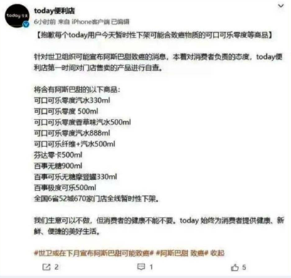
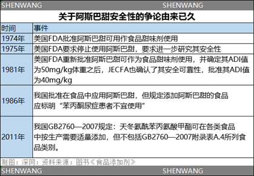

# 阿斯巴甜还能喝吗？可口可乐国内国外搞双标，元气森林能否逆袭

_左图为在中国香港购买的零度可乐_

作者 ｜ 张睿

编辑 ｜ 康晓

出品丨深网·腾讯新闻小满工作室

国际权威组织联合发布的一项结果，让可口可乐、百事可乐、玛氏等涉及使用阿斯巴甜的国际饮料食品公司陷入被动。

7月14日，国际癌症研究机构(IARC)、世界卫生组织(WHO)和粮食及农业组织食品添加剂联合专家委员会(JECFA)发布了阿斯巴甜对健康影响的评估结果。其中，IARC引用了对人类致癌的“证据有限”，将阿斯巴甜归类为可能对人类致癌(2B组)，JECFA则重申了40mg/kg体重的可接受每日摄入量。

阿斯巴甜是最常见的人工甜味剂之一，主要被添加在无糖的饮料中，以替代天然代糖，被广泛用于无糖汽水及一些软饮产品中。

**作为无糖软饮的重要组成成分，阿斯巴甜可能致癌的判定犹如一枚深水炸弹，搅动了国内整个无糖软饮料赛道。**

**在品牌端，元气森林、奈雪的茶等半个月前就发布声明，和阿斯巴甜撇清关系；**

**在零售端，便利店品牌Today宣布要下架包括零度可口可乐在内的九款含阿斯巴甜产品；**

**在上游生产端，莱茵生物，三元生物、保龄宝等天然代糖企业的股价则在半个月前迎来一波大涨。**

相比国内无糖软饮料赛道的喧嚣，可口可乐等国际公司相对沉默。有行业人士对《深网》表示，“阿斯巴甜被定性为可能致癌（2B组），或带来无糖软饮料赛道发展的拐点，利好国内元气森林等采用赤藓糖醇的饮品企业。”

短期内，已被定性的阿斯巴甜不会退出代糖市场，但一味配料能真的改变软饮赛道的市场格局吗？

**“阿斯巴甜不会立刻退出市场”**

在国际权威组织给阿斯巴甜定性之前的半个月里，无糖软饮料赛道已率先迎来了行业巨震。

6月29日，路透社就报道了IARC或将于7月把阿斯巴甜列为“可能对人类致癌的物质”，消息一出，无糖软饮产业链的上中下游都坐不住了。

当晚，元气森林、奈雪的茶就紧急回应，旗下产品不含有阿斯巴甜。

元气森林的官方微博表示，“元气森林配料表干净，全线产品不含阿斯巴甜。”而奈雪的茶则声称，公司全部产品自2022年11月开始使用升级的天然代糖“罗汉果糖”。

**而Today便利店发公告称，将全线暂时性下架含阿斯巴甜的商品。**

**不过据《深网》前期走访发现，除Today外，京客隆、物美、罗森、711等连锁超市部分门店也没有下架零度可乐，零度可乐依然是元气森林无糖气泡水最大的竞争对手。**

**值得注意的是，可口可乐等国际公司在阿斯巴甜的使用上遭遇“双标”质疑。**

有网友爆料，进口的无糖可乐不含阿斯巴甜，而国产的却有。《深网》发现，从中国香港购买的零度可乐，配料表中也没有发现阿斯巴甜。

在上游原材料生产端，国内莱茵生物、保龄宝等一波糖企纷纷表态，旗下产品主要是植物提取，不涉及阿斯巴甜。

保龄宝表示，旗下产品不涉及阿斯巴甜，和可口可乐等公司的合作的产品，不涉及这种化工类产品，基本上都是天然的。莱茵生物在互动平台表示，公司核心产品天然甜味剂主要从甜叶菊、罗汉果提取而来，属于新一代天然、健康、安全的甜味剂。

三元生物则跟投资者普及公司最新研发的优质甜菊糖（莱鲍迪苷M），是通过植物提取和发酵工艺生产的天然高倍甜味剂，安全性更高，甜度提高到蔗糖的350倍。

受此影响，6月30日，保龄宝开盘即一字涨停，莱茵生物收盘涨停，三元生物涨超6%。
**截至今天（7月14日）收盘，保龄宝股价报9.08元，涨幅2.83%；莱茵生物股价报8.31元，涨幅2.09%；三元生物股价报32.43元，涨幅0.4%。**

**无糖软饮上下游产业链都对阿斯巴甜避之不及，阿斯巴甜等人工合成甜味剂会直接被市场抛弃吗？**

**对此，有从事食品添加剂的行业人士对《深网》透露，天然代糖取代阿斯巴甜等人工合成甜味剂需要很长的时间。“关于阿斯巴甜安全性的争论由来已久，与赤藓糖醇、木糖醇、麦芽糖醇等天然代糖相比，阿斯巴甜价格相对便宜，市场体量也更大。”**

据了解，目前市场上阿斯巴甜90元左右一公斤，赤藓糖醇、木糖醇等价格是10元左右一公斤，但由于阿斯巴甜的甜度更高，所以要达到同样的甜度，使用阿斯巴甜综合成本更低。以白砂糖甜度为例，木糖醇甜度是蔗糖的1.2倍，阿斯巴甜是蔗糖的200倍。

据《2021-2027全球与中国阿斯巴甜市场现状及未来发展趋势》，2019年全球阿斯巴甜的销量为2.77万吨，产值达到3.9亿美元；其中，中国销量达到2.13万吨，产值2.79亿美元，预计食品级阿斯巴甜在2026年的市场销售额将增长到4.19亿美元。

**那么，近半个月提货阿斯巴甜产品的食品加工企业是否变少？上述人士透露，“阿斯巴甜不耐高温，6月—8月是提货淡季，目前看不出销量的变化，但阿斯巴甜立马退出市场不现实。况且阿斯巴甜不仅会被用到软饮领域，也会被用在炒货等其他领域。”**

从世界卫生组织等官方表述来看，阿斯巴甜的致癌性不易对人体产生危害。一罐含有200或300毫克阿斯巴甜的无糖软饮料，一个体重70公斤的成年人每天需要消耗9-14罐以上才能超过可接受的每日摄入量。

**虽然阿斯巴甜不会立刻退出市场，但天然代糖慢慢替代合成甜味剂已经成为趋势。**
有数据显示，天然甜味剂在代糖产品中的市场占比已经从2010年的8.16%上升至2020年的29.41%。

**随着健康逐渐成为消费者的第一考量因素，以赤藓糖醇、木糖醇等天然代糖为配料的食品饮料企业或将迎来新的发展周期。**

**国产品牌赶超可乐的良机**

提到零糖软饮，不少用户首先想到就是元气森林于2018年5月推出的无糖气泡水。事实上，从世界范围内看，率先推出零糖软饮概念的是可口可乐和雀巢。

2010年可口可乐和雀巢推出“原叶”茶，主打原叶泡制、0糖、无香精、健康等宣传点，大规模投入营销。受此影响，农夫山泉于第二年（2011年）推出了国内第一款无糖茶——东方树叶。

但彼时的无糖的饮料产品犹如商业黑洞，研发费用不低，却难以打开市场，不赚钱。

作为国内无糖即饮茶品类的先行者，东方树叶虽然为培养消费者习惯这一口味方面付出不少营销费用，但却出现在2016年被网评的
“全国最难喝饮料TOP5”之列。可口可乐和雀巢推出的“原叶”茶也早早的退出了市场。

也是在这一年，一家主打无糖概念的新饮品公司进入了这一被称为“商业黑洞”的赛道。2016年4月，已经靠游戏“开心农民”实现财富自由的唐彬森创办了北京浩繁科技有限公司，后更名为元气森林（北京）食品科技集团有限公司。当年11月，元气森林推出“燃茶”，主打“无糖、解腻、喝燃茶”概念。

但元气森林真正出圈始于2018年5月推出的无糖气泡水。据元气森林气泡水专利说明显示，元气森林先通过测试找到了7-8%蔗糖浓度饮料为最佳口感，但过多摄入蔗糖让人发胖，元气森林最后通过赤藓糖醇+三氯蔗糖的配比来还原蔗糖带来的甜感，这也是元气森林推出0糖、0脂、0卡气泡水的技术支撑。

_来源：视觉中国_

**“希望大家一提到气泡水就想到元气森林，而且是元气森林将赤藓糖醇等概念带入国内饮品行业。”** 唐彬森曾公开表示。

**不过当时消费者对赤藓糖醇这些行业概念并没有感知，反而对价格更为敏感。同是500ML左右的零度无糖可乐，元气森林可乐味的气泡水要比可口可乐贵两块多。**

**在国际癌症研究机构给阿斯巴甜定性之前，部分用户对两块多钱价差的考虑是，这是一笔经济账；当上升为健康问题时，用户的思维或许就发生了转变：“我差那两块钱吗？”**

**从市场体量和营收看，在已有百年历史的可口可乐面前，元气森林等国内饮料企业还是个“婴孩”。**

据可口可乐财报显示，2022年，可口可乐公司营收430.04亿美元，净利润95.71亿美元，可口可乐在亚太地区全年净收入为54.45亿美元，对比元气森林2022年约80亿-90亿元的销售回款，差距依然巨大。

不过，单就中国市场而言，国产软饮品牌无疑迎来赶超可口可乐的一次良机。

